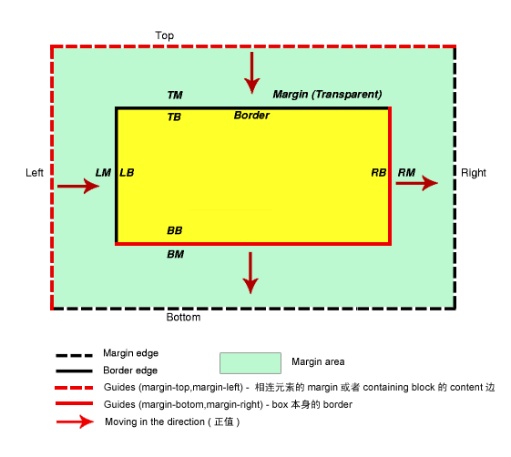
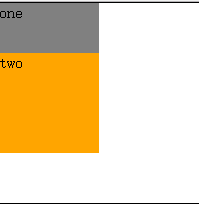
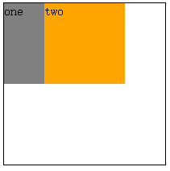
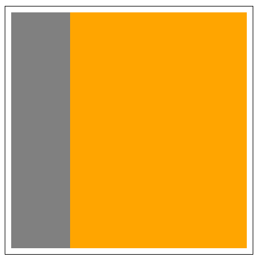

# margin为负值
1. margin负值的原理：
   1. 为了方便理解负值margin，我们引入参考线的定义，参考线就是就是margin移动的基准点，而margin的值就是移动的数值。margin的参考线有两类，一类是top、left，它们以外元素作为参考线，另一类是right、bottom，它们以自身作为参考线。简单点说就是
      1. top负值就是以包含块(Containing block) 内容区域的上边或者上方相连元素 margin 的下边为参考线;
      2. left负值就是以包含块(Containing block) 内容区域的左边或者左方相连元素 margin 的右边为参考线;
      3. right负值就是以元素本身border的右边为参考线；
      4. bottom负值就是以元素本身border的下边为参考线；
   2. 下面这张图很直观地解释了margin的移动，其中红色箭头表示正值时候的移动方向，当margin为负值的时候就反方向移动。
      1. 
      2. 总地来说，就是当margin-top、left为负值的时候与参考线的距离减少，当margin-right、bottom为负值的时候参考线就向左、上面移动。
2. 实际demo
   1. 当设置margin-top为负值的时候       
        ```
        <div class="box">
        <div class="one">one</div>
        <div class="two">two</div>
        </div>
        <style>
        .box {
            width:200px;
            height: 200px;
            border: 1px black solid;
        }
        .box div {
            width:100px;
            height: 100px;
        }
        .one {
            background:gray;
        }
        .two {
            background:orange;
            margin-top:-50px;
        }
        </style>
        ```
       1. 结果如下：  
       2. 当设置class为two的div的margin-top为-50的时候，它的参考线是div.one的下边，整个div.two向上移动使得与参考线的距离减少50px。
   2. 当设置margin-left为负值的时候
        ```
        <div class="box">
        <div class="one">one</div>
        <div class="two">two</div>
        </div>
        <style>
        .box {
            width:200px;
            height: 200px;
            border: 1px black solid;
        }
        .box div {
            width:100px;
            height: 100px;
        }
        .one {
            background:gray;
            float: left;
        }
        .two {
            background:orange;
            margin-left: -50px;
            float: left;
        }
        </style>
        ```
        1. 结果如下：
        2. 设置float:left使得两个div浮动起来，然后设置div.two的margin-left为-50px,div.two的参考线就是div.one的右边，于是div.two左移与参考线距离减少50px。
   3. 当设置margin-right为负值的时候   
        ```
        <div class="box">
        <div class="one">one</div>
        <div class="two">two</div>
        </div>
        <style>
        .box {
            width:200px;
            height: 200px;
            border: 1px black solid;
        }
        .box div {
            width:100px;
            height: 100px;
        }
        .one {
            background:gray;
            float:left;
            margin-right:-50px;
        }
        .two {
            background:orange;
            float:left;
        }
        </style>
        ```

       1. 结果如下：
       2. 仍然让两个div左浮动，设置div.one的margin-right为-50px,这时候的参考线是本身的右边界，margin-right为负值于是参考线向反方向即左方向移动。
       3. 参考线向左移动，即其border向左移动，形成的效果为虽然整体有border，但是实际参与的border已经向左移50px了，这时右边的边框向左挤到其边框旁边
   4. 当设置margin-bottom为负值的时候
        ```
        <div class="box">
        <div class="one">one</div>
        <div class="two">two</div>
        </div>
        <style>
        .box {
            width:200px;
            height: 200px;
            border: 1px black solid;
        }
        .box div {
            width:100px;
            height: 100px;
        }
        .one {
            background:gray;
            margin-bottom:-50px;
        }
        .two {
            background:orange;
        }
        </style>
        ```
       1. 结果如下：
       2. 当设置div.one的margin-bottom为负值的时候，此时的参考线是自身的下边界，bottom为负值于是参考线向反方向即向上方移动。
3. 实际应用
    1. 边框去重
      1. 有的时候我们做Tab选项卡的时候不希望tab元素和父元素都加上边框，因此就可以给tab元素添加一像素的margin。
    2. 左右布局
        1. 当用margin负值之后就可以通过改变margin-top等的值成为负值之后不需要使用float就可以实现左右布局
        ```
        <div class="container">
        <div class="left"></div>
        <div class="right"></div>
        </div>
        <style>
        .container {
        	width:400px;
        	order: 1px solid black;
        	padding:10px
        }
        .left {
        	width: 100px;
        	height:400px;
        	background-color:gray;
        }
        .right {
        	width: 300px;
        	height:400px;
        	margin:-400px 0 0 100px;
        	background-color:orange;
        }
        </style>
        ```
        1. 结果如下：

