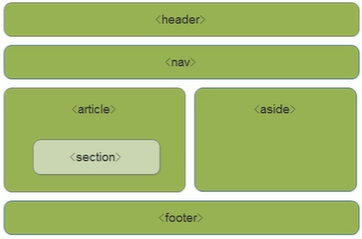
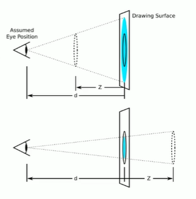

# 1.HTML5新特性
1. 新特性都有兼容性问题，基本都是IE9+以上版本的浏览器才支持。
2. HTML5新增语义化标签
   1. <header>头部标签
   2. <nav>导航标签
   3. <article>内容标签
   4. <section>定义文档某个区域
   5. <aside>侧边栏标签
   6. <footer>尾部标签
   7. 
   8. 注意
      1. 这种语义化标签主要针对搜索引擎的，可以使用多次
      2. 在IE9中需要把这些元素转换成块级元素：display:block
      3. 移动端用的多，没兼容性问题
3. 视频标签、音频标签
   1. 在页面中插入视频音频，而不用浏览器插件和flash
   2. 视频标签
      1. 只支持三种格式，mp4，webm，ogg。不同浏览器支持情况不同，但全都支持mp4
      2. <video src=""></video>但是通常不这么用，会有兼容性问题
      3. 多放几个源文件
         ```
            可以设置高度宽度
            <video width="" height="" controls>
            <source src="" type="video/mp4">
            <source src="" type="video/ogg">
            你的浏览器不支持video标签
            </video>
         ```
      4. 常见属性
         1. autoplay：自动播放
         2. control：视频播放控件,播放暂停等控件 
         3. muted：静音播放，用于有的浏览器禁用自动播放，这时加上这个属性就可以播放了
         4. loop：播放循环
         5. preload：auto（加载）none（不加载）预先加载视频，如果有autoplay就忽略该属性
         6. poster：加载视频等待时显示的图片，视频加载完成后就切换回视频
   3. 音频标签
      1. 三种格式：mp3，wav，ogg，都支持mp3
      2. <audio src="" controls></audio>
      3. 多放几个源文件
         ```
            可以设置高度宽度
            <audio width="" height="" controls>
            <source src="mp3" type="audio/mpeg">
            <source src="ogg" type="audio/ogg">
            你的浏览器不支持video标签
            </audio>
         ```
      4. 属性和视频类似
4. 新增input表单
   1. 新增的input类型，限制输入类型,输入类型错误报错
      1. Email
      2. url
      3. date
      4. time
      5. month
      6. week
      7. number
      8. tel
      9. search
      10. color
      11. 验证的时候（输入类型错误报错）必须添加表单域<form></form>
   2. 新增的表单属性 
      1. input属性
         1. required：表单拥有该属性表示内容不能为空
         2. placeholder，通过样式修改伪元素：：placeholder
         3. autofocus：自动获得焦点
         4. multiple：多选文件提交
         5. pattern：进行验证，正则表达式
      2. form属性
         1. autocomplete：off/on。以前输入过的值自动显示在表单中，前提必须放在表单中且有name属性（给input加一个name属性）同时提交成功。通常用off关闭，防止在别人电脑上被记录信息
# 2.css3新特性
1. 有兼容性问题，IE9+才支持，移动端优于pc端。
2. 新增选择器
   1. 属性选择器：根据元素的特定属性选择元素
      1. 选择属性等于特定值的元素 .left[shuxing=""]{}
      2. 匹配具有特定属性值以什么开头的元素 .left[shuxing^="属性值开头的一部分"]{}
      3. 匹配具有特定属性值以什么结尾的元素 .left[shuxing$="属性值结尾的一部分"]{}
      4. 匹配具有特定属性值并且属性值含有某块的元素 .left[shuxing*="属性值含有某些字母"]{}
   2. 结构伪类选择器
      1. ：first-child
      2. ：last-child
      3. ：nth-child(n) even、odd，n从0开始计算,例如-n+5表示前五个
      4. ：first-of-type
      5. ：last-of-type
      6. : nth-of-type(n)
   3. 伪元素选择器，通过css插入元素
      1. 创建一个行盒，文档流中找不到，必须有content属性
      2. ::before
      3. ::after
   4. 盒子模型
      1. border-box：box-sizing
   5. 其他特性
      1. filter：滤镜，将模糊或者颜色偏移等效果应用于元素
         1. filter：函数（）；  例filter：blur（5px）；  blur指模糊处理数值越大越模糊
      2. calc：声明css属性值时执行一些计算
         1. width：calc（100%-80px）
         2. 括号里可以通过加减乘除计算
3. 新增属性过渡
   1. 元素从一种样式 变成另一种样式时添加效果
   2. transition：要过渡的属性 花费时间 运动曲线 何时开始；
      1. 属性：想要变化的css属性，宽度高度，背景颜色都行，all表示所有属性
      2. 花费时间：单位秒，必须写单位
      3. 运动曲线：默认是ease（可省略）：逐渐慢下来。linear：匀速。ease-in：加速。ease-out：减速。ease-in-out：先加速后减速。
      4. 何时开始：单位是秒，必须写单位，可以设置延迟触发事件，默认0s
   3. 谁变化给谁加过渡属性 
      1. 如果想要多个属性都加上过渡效果，则在transition中用逗号隔开
      2. 可以直接用all表示所有属性  
4. 2D转换
   1. 转换：实现元素的位移、旋转、缩放等效果。可以理解为变形。
   2. translate：移动
      1. transform：translate（x，y）或者transform：translateX（n）；
      2. x，y分别表示在两轴上移动的位置
      3. 最大的优点：不会影响其他元素的位置
      4. 百分比单位是相对于自身元素，可以利用这个垂直居中，先绝对定位top、left为0，然后设置transform：translate（-50%，-50%）
      5. 对行盒没效果
   3. rotate：旋转  
      1. transform：rotate（度数）
      2. 单位为deg，顺时针为正，逆时针为负
      3. 默认旋转中心点是元素的中心点，可以通过transform-origin：x y；
         1. x和y通过空格隔开
         2. x y默认转换中心点为50% 50%
         3. 可以设置为像素单位，或botto、top、center等
   4. scale：缩放
      1. transform：scale（x，y）；
      2. 没有单位，倍数的意思，1表示不变，2表示两倍。
      3. 等比例缩放可以直接scale（2）；
      4. 和直接设置宽高改变缩放的优势
         1. 直接设置宽高，宽度左右延申，高度向下延申，就是块盒的特点，会把下面的内容挤走。
         2. scale可以设置中心点，并且不影响其他盒子
         3. scale放大时也会让阴影shadow变大
   5. 2D转换综合写法
      1. transform：translate() rotate() scale() 中间空格隔开
      2. 其顺序会影响结果，按顺序依次行动，旋转之后其坐标轴方向改变，例如旋转180°之后坐标轴变为x轴向左y轴向上
      3. 当有位移和其他的时候建议先写位移，坐标轴方向不会改变。
5. 动画
   1. 动画animation  可以通过多个节点精确控制动画，实现复杂的效果，相比过渡，动画可以实现更多变化，更多控制连续自动播放等效果。
   2. 基本使用
      1. 先定义动画
         1. 用keyframes（关键帧）定义动画（类似定义类选择器）
               ```
               @keyframes 动画名称{
                  0%{
                     width:100px;
                  }
                  100%{
                     width:200px;
                  }
               }
               ```
         2. 动画序列
            1. 0%表示动画开始，100%表示动画完成，百分比要是整数，这样的规则就是动画序列
            2. 在@keyframes中规定某项css样式就能创建由当前样式逐渐改变为新样式的动画效果。
            3. 动画是使元素从一种样式逐渐变为另一种样式的效果，可以改变任意多的样式和任意多的次数。
            4. 用百分比规定变化发生的时间，或用from和to，等同于0%和100%
            5. 写的位置例如transform：translate（x，y）x、y的位置是相对于起始位置，不是相对于上一个位置
      2. 元素再调用动画
         1. animation-name：动画名称。必写
         2. animation-duration：持续时间。必写，单位s或ms
      3. 常见属性
         1. animation：简写属性，顺序为动画名称、持续时间、何时开始、播放次数、是否反方向、动画起始或结束的状态。空格隔开
         2. animation-timing-function：规定动画速度曲线，同上过渡的ease等
            1. 补充一个属性值steps，指定了时间函数中的间隔数量（步长），例animation-timing-function：steps（10），分为十步来完成动画，每一次变化就是一步，不是以前的连续的效果，是十次突变的效果   
         3. animation-delay：何时开始
         4. animation-iteration-count：动画播放次数，默认1，还有infinite
         5. animation-direction：是否逆向播放。normal、alternate（反方向）走回来而不是直接跳回去。
         6. animation-play-state：不包含在简写属性中。规定动画是否正在运行或暂停。默认running，还有paused
         7. animation-fill-mode：规定动画结束后的状态，forwards（保持）、backwords（返回）
6. 3D转换
   1. 三维坐标系，多了一个z轴
      1. x轴：水平向右
      2. y轴：垂直向下
      3. z轴：垂直屏幕向外
   2. 3D移动
      1. 多了一个z轴上可以移动的方向
      2. transform：translateX（），transform：translateY（），transform：translateZ（一般都是用px为单位），translform：translate3d（x，y，z）这里xyz没有不能省略，必须用0代替
   3. 透视
      1. perspective：300px；
      2. 效果为模拟人类的视觉位置，可以认为安排一只眼睛去看。透视也称为视距，即人眼到屏幕的距离。距离视觉点（即人感觉到物体在的位置）越近的在电脑平面成像越大，越远成像越小。通过改变大小来模拟视距的远近。单位为像素。
      3. 透视写在被观察元素的父盒子上
         1. 
         2. d就是视距，通过透视设置
         3. z就是z轴，物体距离屏幕的距离，通过translateZ设置
   4. 3D旋转
      1. transform：rotateX（），transform：rotateY（），transform：rotateZ（），transform：rotate3d（x，y，z，deg）自定义轴
      2. 旋转是有方向的，有正负值，具体方向判别可以通过2d的来找角度，2d时观察的是z轴的负方向，即从外向里，顺时针为正逆时针为负，当观察x轴方向时是从x轴的负方向即从右向左，顺时针为正逆时针为负，y轴同理。
      3. 旋转的时候元素有一个中心点，然后旋转还有一个方向（比如x轴或者y轴），通过向量就可以表示出旋转的矢量线段了。
   5. 3D转换（呈现）
      1. 3d呈现transform-style
         1. 控制子元素是否开启三位立体环境，如果不加那么里面的子元素的3d效果会消失。
         2. 默认值flat，不开启
         3. preserve-3d，开启
         4. 代码写给父级，但是影响的是子盒子
7. 浏览器私有前缀
   1. 私有前缀是为了兼容老版本的写法，比较新的版本无需添加
   2. -moz-：firefox火狐浏览器
   3. -ms-：ie浏览器
   4. -webkit-：safari、chrome私有属性
   5. -o-：opera私有属性
   6. 例-moz-border-radios：10px； 