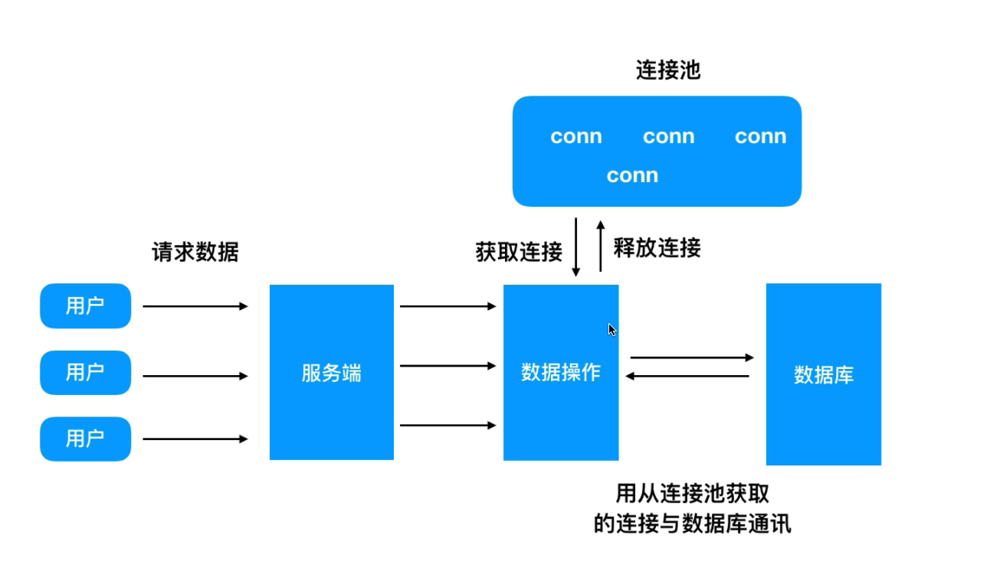

1. MySQL介绍
    1. MySQL是一个数据库管理系统,数据库是存储、管理数据的仓库
    2. MySQL环境安装配置
       1. Windows安装及配置
          1. 教程https://blog.csdn.net/qq_37350706/article/details/81707862
2. MySQL安装
   1. 密码：  5u);*w_CIgho
3. MySQL设计
   1. 如何创建一个数据库
      1. 右键localData，选择新建数据库，字符集选择utf8，排序规则选择utf8_general_ci(不区分大小写)
      2. 新建表，第一个字段起名为id，类型为int，并且把它设置为主键，表示唯一标识。
         1. 正常一个表只有一个主键，长度设置为128，因为是主键，所以不能是null.
         2. 默认选择自动递增，表示如果新增了一个，那么它的id自动增加1，不需要我们设置id
      3. 第二个字段起名为name，类型为varchar，长度128
      4. 第二个字段起名为city，类型为varchar，长度128
      5. 第二个字段起名为sex，类型为tinyint，长度2
4. mysql常用数据库操作语句
   1. 增加表格数据
      1. INSERT INTO table_name(field1,field2,...fieldN) VALUES (value1,value2,...valueN)
   2. 删除表格数据
      1. DELETE FROM table_name [WHERE Clause]
   3. 修改表格数据
      1. UPDATE table_name SET field1=new-value1, filed2=new-value2 [WHERE Clause]
      2. 例：update user set name='小天’ where id = 5
   4. 查询表格数据
      1. SELECT column_name,column_name FROM table_name [WHERE Clause]
   5. 排序
      1. SELECT field1,field2,...fieldN FROM table_name1,table_name2... ORDER BY field1 [ASC [DESC][默认 ASC]], [ field2...] [ASC [DESC][默认 ASC]]
      2. 默认asc升序排序，desc降序排序
   6. 模糊查询
      1. SELECT field1,field2,...fieldN FROM table_name WHERE field1 LIKE condition1
      2. 例查询名字带小的名字：select * from user where name like '%小%' 
5. Node.js链接MySQL数据库
   1. MySQL模块安装
      1. 先在目标文件目录下npm init -y 初始化一下
      2. 然后安装npm install mysql --save
   2. 链接数据库
      1. 新建index.js
      2. 引入const mysql = require('mysql')
      3. 创建连接
         ```
         const conn = mysql.createConnection({
            host:'localhost',        //链接数据库的地址
            user:'root',             //用户
            password:'123',          //密码
            port:'3306',             //端口
            database:'user_test'     //链接的数据库
         })
         ```
      4. 建立链接
         ```
         conn.connect();
         ```
      5. 之后就可以执行sql语句了
         ```
         let sql = 'select * from user' 
         conn.query(sql, (err, res) =>{
            if(err) throw
            console.log(res)
         })
         ```
      6. 断开链接
         ```
         conn.end()
         ```
6. 深度讲解MySQL连接池
   1. MySQL连接池与普通链接的区别以及它的使用方式
      1. 
      2. 频繁的创建、关闭链接会减低系统的性能，提高系统的开销
      3. 正常的方式：
         1. 用户  =请求数据=>  服务端  =程序=>  数据操作  =创建链接与数据库通信=>  数据库
      4. 连接池可以有效的管理链接，达到链接复用的效果
      5. 它会把创建的链接都放入连接池中，当我们的数据操作从连接池中获取链接时，间接和数据库进行通信，用完之后释放连接，把它再次放入连接池中。形成复用，提高性能
         ```
         const mysql = require('mysql')
         //创建连接池
         const pool = mysql.createPool({
            connectionLimit : 10 ,   //同时创建链接的最大链接数
            host:'localhost',        //链接数据库的地址
            user:'root',             //用户
            password:'123',          //密码
            port:'3306',             //端口
            database:'user_test'     //链接的数据库
         })
         //获取链接
         pool.getConnection((err, conn) =>{
            if (err) throw err
            //执行sql语句
            let sql = 'select * from user where id = ?' 
            conn.query(sql, [4], (err, res) =>{
               //不管是否抛出错误，都需要把链接释放出去，否则会占用链接
               conn.release()
               if(err) throw err 
               console.log(res)
            })
         })
         
         ```
7. 结合数据库改造用户列表接口(增)
   1. 改造接口，通过sql语句操作数据库增加用户
      ```
      const mysql = require('mysql')
      
      //创建连接池
      const pool = mysql.createPool({
         connectionLimit : 10 ,   //同时创建链接的最大链接数
         host:'localhost',        //链接数据库的地址
         user:'root',             //用户
         password:'123',          //密码
         port:'3306',             //端口
         database:'user_test'     //链接的数据库
      })
      
      function query(sql,params){
         return new Promise((resolve,reject) =>{
            //获取链接
            pool.getConnection((err, conn) =>{
               if (err) {
                  reject(err)
                  return
               }
               //执行sql语句
               conn.query(sql, params, (err, res) =>{
                  //不管是否抛出错误，都需要把链接释放出去，否则会占用链接
                  conn.release()
                  if(err) {
                     reject(err)
                     return
                  }
                  resolve(res)
               })
            })
         })
      }

      module.exports = query
      
      然后直接在之前的写的接口user.js中写入数据库，例：
      async addUser(userObj){
         console.log(userObj);
         let {name, city, sex} = userObj
         let sql = 'insert into user (name, city, sex) value (?,?,?)'
         let resultData = await query(sql, [name, city, sex])
         return resultData
      },
      这样一来返回的结果就是期约了，接收结果时需要.then()方法来接收
      安装MySQL npm install mysql --save 
      
      ```
8. 结合数据库改造用户列表接口(删改)
9. 结合数据库改造用户列表接口(动态查询)