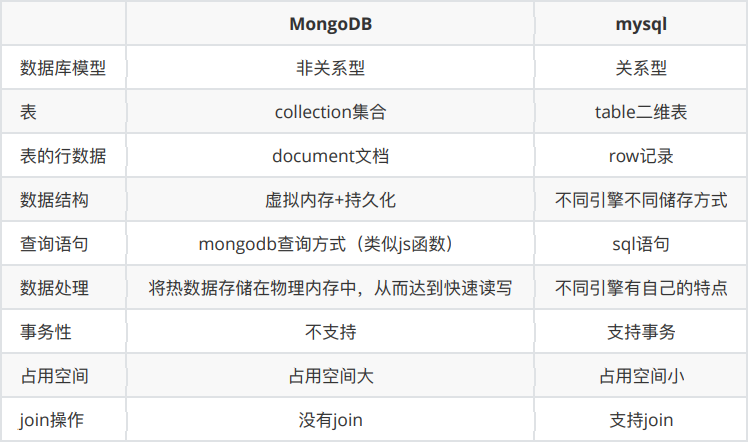
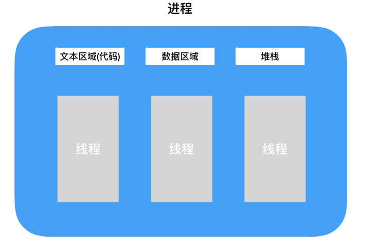
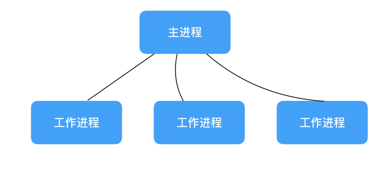
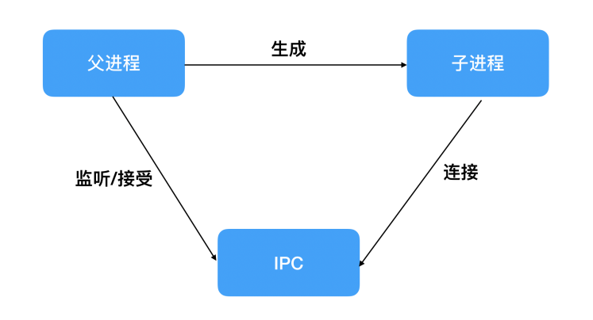

1. 分布式文件存储数据库MongoDB
   1. MongoDB也是数据库，和mysql的区别如图 
   2. MongoDB是用c++语言编写的非关系型数据库
   3. net start mongodb 开启服务
   4. net stop mongodb 关闭服务
2. 第三方包mongoose的使用
   1. 安装 npm install mongoose
   2. 使用
      ```
      const mongoose = require('mongoose')

      mongoose.connect('mongodb://localhost/user_test').then(res =>{     // 链接数据库，其中参数分别为mongodb协议、主机名和需要链接的数据库。返回值是promise
        console.log('链接成功')
      }).catch(err =>{
        console.log('链接失败')
      })
      ```
3. MongoDB常用数据库操作
   1. 创建集合、文档
      1. MongoDB不需要显示的创建数据库，如果数据库不存在，会自动创建
      2. 集合相当于一个表，文档相当于表中的数据
         1. 创建集合
            ```
            const schema = new mongoose.Schema(options)  // 创建集合结构（规则）， options集合的结构（规则）
            const Model = mongoose.model(modelName, schema) // modelName集合名称，也就是表名称，schema集合结构
            ```
         2. 创建文档
            ```
            第一种方式
            const doc = new Model(options) // options符合集合规则的文档数据，以对象形式
            doc.save() // 将文档插入到数据库中
            第二种方式
            Model.create(options, (err, doc)) // options符合集合规则的文档数据，以对象形式，err为报错信息，doc是插入的文档
            ```
   2. 导入文件数据到数据库
      1. 数据库导入数据
         1. mongoimport -d 数据库名称 -c 集合名称 --file 导入的数据文件路径
         2. 使用mongoimport命令需要在环境变量添加mongoDB bin 文件夹的路径，并且保证bin文件夹下有mongoimport.exe程序
         3. mongoimport -d user -c users --file ./user.json
   3. 查询文档
      1. 查询文档
        ```
        Model.find({name:'wang', sex:2})  根据调价查询文档，条件为空则查询所有文档  返回数组
        Model.findOne()   默认返回当前集合中的第一条文档  返回对象
        ```
      2. 区间查询
        ```
        {key: {$gt:value, $lt:value}}  gt大于， lt小于，gte大于等于， lte小于等于
        Model.find({age:{$gt:18, $lt:35}}).then(res =>{
          consoel.log(res)
        })
        ```
      3. 模糊查询
        ```
        {key:正则表达式}
        Model.find({city:/上/}).then(res =>{
          consoel.log(res)
        })
        ```
      4. 选择要查询的字段
        ```
        Model.find().select(arg)  arg为要操作的字段 字段前加-表示不查询该字段
        Model.find().select("name city -_id").then()
        ```
      5. 排序
        ```
        Model.find().sort(arg)  arg为要操作的字段 字段前加-表示降序排列
        Model.find().sort("age").then()
        ```
      6. 跳过多少条数据、限制查询数量
        ```
        Model.find().skip(num).limit(num)  skip表示跳过多少条数据，limit限制查询数量
        ```
   4. 更新文档
      1. 更新单个文档
        ```
        更新指定条件文档，如果查询多个文档，则更新第一个匹配文档  返回值为该文档
        Model.findOneAndUpdate(条件，更新的值)
        Model.findOneAndUpdate({name:'2'},{city:'深圳'}).then()
        更新指定条件文档，如果查询多个文档，则更新第一个匹配文档   返回值为ok的对象
        Model.updateOne(条件，更新的值)
        Model.updateOne({name:'2'},{city:'深圳'}).then()

        全局配置
        mongoose.set('useFindAndModify', false)
        ```
      2. 更新多个文档
        ```
        Model.updateMany(条件，更新的值)   如果条件为空，则会更新全部文档
        Model.updateMany({name:'xx'},{city:'深圳'}).then()
        ```
   5. 删除文档
      1. 删除单个文档
        ```
        删除指定条件文档，如果查询多个文档，则删除第一个匹配文档  返回值为该文档
        Model.findOneAndDelete(条件)
        Model.findOneAndDelete({name:'2'}).then()
        删除指定条件文档，如果查询多个文档，则删除第一个匹配文档   返回值为ok的对象
        Model.deleteOne(条件)
        Model.deleteOne({name:'2'}).then()

        ```
      2. 删除多个文档
        ```
        Model.deleteMany(条件)   如果条件为空，则会删除全部文档
        Model.deleteMany({name:'xx'}).then()
        ```
4. mongoDB字段验证
   1. required  验证字段是否为必须输入，值为Boolean
      ```
      const schema = mongoose.Schema
      const userSchema = new schema({
        name: {
          type: String,
          required:true
        },
        name: {
          type: String,
          required:[true, '该字段为必选字段'] // 如果写成数组形式，后面的内容为报错信息，在error.errors.message中。后面的都可以这样自定义报错信息
        },
        city: String,
      })
      ```
   2. minlength，maxlength 验证字符的值的最小长度和最大长度
   3. trim 去除字符串首位空格，值为Boolean
   4. min，max  验证最小最大数字
   5. default 默认值
   6. enum 规定输入的值必须是哪一些
      ```
      name: {
        type: String,
        enum:['wang', 'wen', 'tao']
      },
      name: {
        type: String,
        enum:{
          values:['wang', 'wen', 'tao'],       // 如果写成对象形式，message中的内容为报错信息
          message:'该值不在设定的范围内'   
        }
      },
      ```
   7. validate 根据自定义条件验证，通过validate函数处理输入值，message为自定义错误信息
      ```
      name: {
        type: String,
        validate:{
          validator: v =>{
            // todo 返回Boolean值验证输入值是否有效
          },
          message:'报错信息'
        }
      },
      ```
   8. 通过catch获取errors对象，遍历对象从中获取对应字段自定义报错信息
      ```
      model.create().then().catch(error =>{
        获取错误信息对象
        const errs = error.errors
        循环错误信息对象
        for(let i in errs){
          console.log(errs[i].message)
        }
      })
      ```
5. node进程和线程
   1. 进程
      1. 进程是正在运行的程序的实例，我们启动一个服务，运行一个实例，就是开启一个服务进程。
      2. 进程是线程的容器
      3. 进程包括文本区域、数据区域和堆栈
   2. 线程
      1. 线程是操作系统能进行运算调度的最小单位
      2. 他被包含在进程之中，是进程中的实际运作单位
      3. 一个进程可以由一个或者多个线程组成，每条线程并行执行不同的任务
   3. 进程和线程的关系
      1. 
6. node中process进程模块
   1. process.env  返回包含用户环境的对象，可设置环境变量，例如Process.env.NODE_ENV = 'dev'，表示设置了NODE_ENV环境变量 = 'dev'
      1. 多数用来区分开发环境和生产环境，判断NODE_ENV环境变量的值来做区分
      ```
      Windows上设置环境变量用set
      packagee.json文件夹脚本命令
      "scripts": {
        "dev": "set NODE_ENV = development && node index.js"
      },
      
      mac上设置环境变量使用export
      "scripts": {
        "dev": "export NODE_ENV = development && node index.js"
      },
      
      安装cross-env兼容这两个平台，不做set和export的区分   npm i cross-env --save-dev
      cross-env NODE_ENV = development node index.js
      ```
   2. process.pid  返回进程的pid
   3. process.platform  返回当前进程的操作系统平台
   4. process.title  获取或指定进程的名称
   5. process.on('uncaughtException', cb(err))  捕获异常信息,回调函数中的err表示未捕获的异常
   6. process.on('exit', cb(code))  监听进程退出,回调函数中的code表示退出码
   7. process.cwd()  返回当前进程的工作目录
   8. process.uptime()  返回当前进程运行时间秒长
7. 多进程-child_process模块
   1. 创建子进程一共四种方式
      1. child_process.spawn(command[, args] [, options])  启动一个子进程执行命令,返回结果就是一个子进程对象
         1. command: 要运行的命令
         2. args: 字符串参数的列表 
         3. options: 相关配置
            ```
            const http = require('http')
            const { spawn } = require('node:child_process');
            // 监听localhost:3000/computed访问，如果访问就启动 node work.js 线程
            const server = http.createServer((req,res) =>{
              if(req.url == '/computed'){
                const work = spawn('node', ['work.js']);
                work.stdout.on('data', (data)=>{                 // 通过流的方式监听子线程的结果
                  console.log(`stdout: ${data}`)
                })
              }else{
                res.end('ok')
              }
            })
            server.listen(3000, () =>{
              console.log('listen success')
            })
            ```
      2. child_process.exec(command[, options],callback)  启动一个子进程执行命令，与spawn不同的地方是有一个回调函数获取子进程状况
         1. command: 要运行的命令
         2. options: 相关配置
         3. callback: 回调函数
            ```
            exec('node work.js', (err, stdout, stderr)=>{
              if(err) throw err
              console.log(stdout)
            })
            ```
      3. child_process.execFile()  启动一个子进程来执行可执行文件
         1. 默认情况下不会衍生shell。相反，指定的可执行文件file会作为新进程直接的衍生，使其比child_process.exec稍微更高效
         2. 参数
            1. file 要运行的可执行文件的名称或者路径
            2. arg 字符串参数的列表 
            3. options: 相关配置
            4. callback: 回调函数
            ```
            execFile('node', ['work.js'], (err, stdout, stderr)=>{
              if(err) throw err
              console.log(stdout)
            })
            ```
      4. child_process.fork(modulePath[, args] [, options])  衍生一个新的node进程，并调用一个指定的模块。返回结果就是一个子进程对象
         1. modulePath  要在子进程中运行的模块
         2. arg 字符串参数的列表 
         3. options: 相关配置
            ```
            fork('work.js')
            ```
         4. 这时打印结果不需要通过流的方式来获取，直接会打印出来
8. cluster模块
   1. cluster创建子进程
      1. node实例运行在单个线程中，为了充分利用多核系统，有时需要启用一组node.js进程去处理负载任务
      2. cluster模块可以创建共享服务器端口的子进程
      3. cluster模块支持两种分发链接的方法
         1. 主进程监听端口，接收到新连接之后在将链接循环分发给工作进程，在分发的过程中使用了一些内置技巧防止工作进程任务过载
         2. 主进程创建监听socket后发送给感兴趣的工作进程，由工作进程负责直接接受链接
        ```
        const cluster = require('cluster');
        const http = require('http');

        const numCPUs = require('os').cpus().length;       // 获取cpu内核个数，一般有多少cpu就创建多少工作进程
        if (cluster.isPrimary) {                           // 判断当前进程是主进程还是工作进程
          console.log(`主进程 ${process.pid} 正在运行`);
          // 衍生工作进程
          for (let i = 0; i < numCPUs; i++) {
            cluster.fork();                                // 创建工作进程
          }
          cluster.on('exit', (worker, code, signal) => {   // 监听进程退出
            console.log(`工作进程 ${worker.process.pid} 已经推出`);
          });
        } else {
          // 工作进程可以共享任何 TCP 连接，也就是创建的服务
          // 在本示例中，其是 HTTP 服务器
          http.createServer((req, res) => {
            res.writeHead(200);
            res.end('hello world\n');
          }).listen(8000);
          // 并不是每个进程都创建监听8000端口，主进程内部会创建TCP服务器，这个才是用来监听端口的，而不是工作进程创建的
          console.log(`工作进程 ${process.pid} 已启用`);
        }
        ```
   2. cluster主从模型
      1. 
      2. 有一个主进程管理整个程序，把请求任务分发给下面的工作进程进行处理
9. 进程间通信
   1. 子进程通过send方法将结果发送给主进程，主进程通过message监听到信息后处理并退出
      ```
      主进程index.js
      const http = require('http')
      const { spawn } = require('node:child_process');
      // 监听localhost:3000/computed访问，如果访问就启动 node work.js 线程
      const server = http.createServer((req,res) =>{
        if(req.url == '/computed'){
          const work = fork('work.js')
          work.send('发送信息给子进程')

          // 接受子进程发送的消息
          process.on('message', (data) =>{
            console.log('父进程收到子进程的消息',data)
          })
        }else{
          res.end('ok')
        }
      })
      server.listen(3000, () =>{
        console.log('listen success')
      })
      
      ```
      ```
      子进程work.js
      process.on('message', (data) =>{
        console.log('子进程收到的消息',data)           // 接受父进程发送的消息
      })
      process.send('{foo:'bar'}')   // 发送消息给父进程
      ```
   2. 进程间通信原理
      1. IPC的全称是 inter-Process Communication，即进程间通信，它的目的是为了让不同的进程能够互相访问资源并进行协调工作
      2. 创建IPC管道的步骤图
         1. 
         2. 父进程在实际创建子进程之前，会创建IPC通道并监听它，然后才真正的创建子进程。
         3. 此过程中会通过环境变量(NODE_CHANNEL_FD)告诉子进程这个IPC通道的文件描述符
         4. 子进程在启动的过程中，根据文件描述符链接这个IPC通道，从而完成父子进程之间的链接