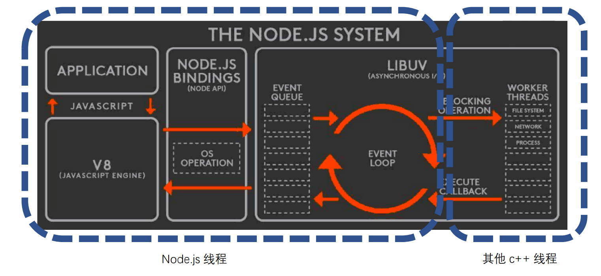

1. 概念
   1. 定义
      1. Node.js是一个基于Chrome V8引擎的JavaScript运行环境
      2. Node.js使用了一个事件驱动、非阻塞式I/O的模型，使其轻量又高效
   2. 在Node.js里面运行JavaScript和在Chrome里面运行JavaScript有什么不同
      1. chrome浏览器用的是同样的JavaScript引擎和模型
         1. 其实在这两个地方写JS几乎没什么不一样
      2. Node.js没有浏览器API，即document、window等
         1. 添加了许多Node.js的API
   3. 对于开发者，Node.js：
      1. 在chrome里写JavaScript控制浏览器
      2. Node.js让你用类似的方式，控制整个计算机
   4. 使用场所
      1. web服务
         1. 首屏速度优化和SEO（搜索引擎优化）都需要一个服务端渲染
         2. 服务端渲染+前后端同构
      2. 构建工作流
         1. 构建工具不会永远不出问题、永远满足需求
         2. 使用node做JS的构建工具是最保险的选择
      3. 可扩展性
         1. 大型应用需要给使用者自定义模块的能力
         2. 使用node做复杂本地应用
            1. 可以利用JS的灵活性提供外部扩展
            2. JS的庞大开发者基数让他们的灵活性得到利用
   5. 项目
      1. 列表页
         1. 打通前后台
         2. 服务端渲染
      2. 详情页
         1. 网页路由
         2. 异步加载
      3. 播放页
         1. API服务器
2. 技术预研
   1. 分析要做的需求，找出技术难点
   2. 针对每个技术难点进行攻克
   3. BFF层（Backend for Frontend）
      1. 浏览器和后台服务器中间的中间渲染层，这个中间渲染层负责组装后台返回的各种微服务返回的数据，并且组装成前端需要的数据，再返回到浏览器
      2. 对用户侧提供HTTP服务
      3. 使用后端RPC服务
3. 搭建环境
   1. 有时会出现找不到的错误，因为windows找node时会根据环境变量找
      1. 这个环境变量记载着所有可能在终端运行的程序的安装地址
      2. 右击我的电脑 => 属性 => 高级系统设置 => 环境变量 => 点击系统变量中的path(理论上安装node之后就会在系统变量中写入node的安装目录) => 如果成功的话这时应该可以看到node的安装地址，没有的话写上去就好了
4. 石头剪刀布游戏
   1. 运行方式
   2. Node.js全局变量
      1. node的全局变量和chrome的全局变量不同，但是大部分是类似的
         1. 比如Date,Math,setTimeout,setInterval
         2. 有一个是例外的，浏览器渲染的下一帧：requestAnimationFrame,因为没有浏览器环境，所以这个全局变量是不存在的。
         3. 为了弥补这个函数node又提供了setImmediate函数
      2. node特有的环境变量
         1. __filename：当前脚本运行所在的文件位置
         2. __dirname：当前脚本运行时所在的目录位置
         3. process：记载了运行这个node程序他的进程信息
            1. 比如node版本号、运行环境等
            2. argv:取到我们输入的nodejs命令
   3. 输入 node index.js rock 命令，输入石头剪刀布
      ```
      var playerAction = process.argv[process.argv.length - 1]
      ```
      1. process.argv可以取到命令中的rock，然后添加一些判断就好了
5. CommonJS规范
   1. 前端如何加载JS
      1. 通过script标签加载，如果有src属性就会从远端下载脚本，并且执行。如果没有src就会直接执行
         1. 脚本变多时，需要手动管理加载顺序
         2. 不同脚本之间的逻辑调用，需要通过全局变量的方式
         3. js运行环境没有html怎么办（node就没有）
   2. CommonJS模块规范
      1. JS社区发起，在node上应用并得到推广
      2. 后续也影响到了浏览器端的JS
      3. 引入
         1. require('文件')
         2. 其实这个require是有输出的，是目标文件导出的对象，默认为空对象
      4. 导出
         1. exports.属性 = 内容
            1. 这样我们就把内容通过一个属性完成导出
         2. 其实我们这里导出的exports和后面的require进去的是同一个引用，表示同一个堆
         3. 如果我们希望导出的不是一个对象，可以使用module.exports = function(){}
            1. 这样require的变量直接就是函数了
            2. 但是之前的exports.属性 = 内容全都消失了，只导出一个函数覆盖之前所有的导出
            3. 因为这时我们require的变量已经不是exports对象了，而是module.exports变量
6. 模块：npm 
   1. npm：node.js的包管理工具
      1. 包：别人写的node.js模块
   2. 使用
      1. 使用npm之前，我们需要保证这个目录本身就是一个npm包，必须npm init初始化一下
         1. 执行完目录后会生成一个package.json文件夹
            1. dependencies：新创建的npm包所依赖的包
               1. 我们创建新项目时只需要保留package.json，使用npm install 就会自动下载dependencies所有依赖的包
            2. 
         2. package.json就是表达这个目录是一个npm包，只要他是一个npm包，那就可以装其他的npm包
         3. 之后就可以使用npm install 命令装别人的包
            1. 使用npm uninstall 卸载已经安装的包
         4. 下载之后就装到了node_modules目录下了
   3. 淘宝npm镜像
      1. 把外网的npm放到国内的服务器，这样的话下载包会便的更快
7. node.js内置模块
   1. EventEmitter（process就是其一个实例，继承了EventEmitter）
      1. 观察者模式(底层向上面抛出事件，比如输入的命令等)
         1. addEventListrner
         2. removeEventListener
            ```
            每三秒打印一次yeah
            const EventEmitter = require('events').EventEmitter
            class Geek extends EventEmitter{
              constructor(){
                super()
                setInterval(() =>{
                  this.emit('newlesson', {price: 100})
                },3000)
              }
            }
            const geek = new Geek
            geek.addListener('newlesson', ()=>{
              console.log('yeah!')
            })
            ```
            1. 我们可以把这个geek实例封装到一个模块中，外面就可以获取这个实例
            2. 可以把一些底层逻辑进行封装，放到另外一个模块，然后外面的业务代码拿到这个模块通过事件监听器就可以知道子模块内部进行的变化
            3. 观察者模式可以解决两个对象之间通信的问题，不仅可以使用直接的函数调用
      2. 调用 vs 观察者模式抛事件
         1. 关键在于"不知道被通知者存在"
         2. 以及"没有人听还能继续下去"
8. 异步：非阻塞I/O
   1. I/O即Input/Ouput，一个系统的输入输出
      1. 阻塞I/O和非阻塞I/O的区别就在于系统接受输入再到输出的期间，能不能接受其他输入
      2. 
         1. 整个架构图按照线程的维度分为两部分
         2. 左边的应用程序、v8、LIBUV的一半都是在一个node线程中完成的，除非在应用程序中开启别的线程
            1. node里面所有操作都是非阻塞的，他会把大量的计算能力分发到其他c++线程去计算
            2. 等到c++线程计算完成，再把结果回调到Node线程中，然后再返回给应用程序
   2. node.js的非阻塞I/O ：
      1. 左边的node线程通过调度其他c++线程的方式来实现整个线程的非阻塞式I/O
9. 异步编程callback
   1. node大量的非阻塞I/O的程序运行结果可以通过回调函数获取
   2. 回调函数格式规范
      1. error-first callback 也可以叫 Node-style callback
         1. 第一个参数是error，后面的参数才是结果
        ```
        interview(function(res){
          if(res instalceof Error){
            return console.log('cry')
          }
          console.log('smile')
        })

        function interview(callback){
          setTimeout(()=>{
            if(Math.random() < 0.1){
              callback(null, 'success')
            }else{
              callback(new Error('fail'))
            }
          })
        }
        ```
      2. node的事件循环每次都是一个全新的调用栈，如果在settimeout里面抛出错误，那么就会被抛到全局
         1. 所以不可以直接抛出错误，需要通过callback 的第一个参数抛出
   3. 异步流程控制
      1. 回调地狱
10. HTTP服务器
    1. HTTP是应用层网络协议
    2. HTTP服务
       1. 一个网页请求，包含两次HTTP包交换
          1. 浏览器向HTTP服务器发送请求HTTP包
          2. HTTP服务器向浏览器返回HTTP包
       2. HTTP服务作用
          1. 解析进来的HTTP请求报文
          2. 返回对应的HTTP返回报文
11. 实现一个简单的HTTP服务器
    ```
    const http = require('http')
    http.createServer(function(req,res){
      if(req.url == '/favicon.ico){
        res.writeHead(200)
        res.end()
        return 
      }
      res.writeHead(200)
      fs.createReadStream(__dirname + '/index.html').pipe(res)  // 把当前文件夹下的html文件读出来，并且直接作为返回值返回
      // res.end('hello')
    }).listen(3000)
    ```
    1. 首先引入node的http内置模块，提供了创建服务监听端口的能力
    2. http.createServer创建一个能够进行HTTP服务的实例
       1. 调用其listen方法就可以监听本机的3000端口，让这个端口提供HTTP服务
       2. createServer接受两个参数，请求参数和响应参数
       3. 分别对应这一次网络服务它的请求HTTP包，以及返回HTTP包的一个管理逻辑对象
12. 实现网页版石头剪刀布
    ```
    const querystring = require('querystring')
    const http = require('http')
    const url = require('url')
    const fs = require('fs')
    const game = require('./game')

    http.createServer(function(req,res){
      const parseUrl = url.parse(req.url)
      if(parseUrl.pathname == '/favicon.ico){
        res.writeHead(200)
        res.end()
        return 
      }

      if(parseUrl.pathname = '/game'){
        const query = querystring.parse(parseUrl.query)     // 解析url中？后面的查询参数
        const playAction = query.action                     // 取到action属性
        const gameResult = game(playAction)
        res.writeHead(200)
        if(gameResult == 0){
          res.end('平局')
        }else if(gameResult == 1){
          res.end('你赢了')
        }else{
          res.end('你输了')
        }
      }

      if(parseUrl.pathname = '/'){
        res.writeHead(200)
        fs.createReadStream(__dirname + '/index.html').pipe(res)
      }
    }).listen(3000)
    ```
    1. 通过引入的url模块，调用其url.parse方法解析req.url