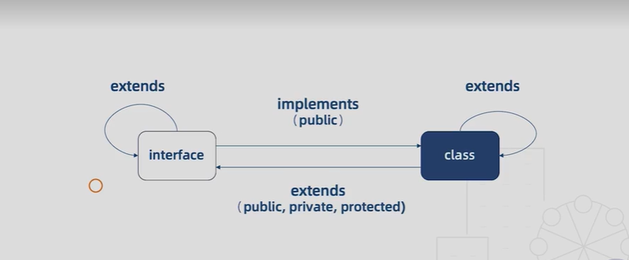

1. 类和接口的关系
   1. 类类型接口
      1. 一个接口可以约束类成员拥有哪些属性以及它的类型
          ```
          interface Human {
            // new (name: string): void;  不可以约束构造函数
            name: string;
            eat(): void;
          }
          class Asian implements Human{
            constructor(name: string){
              this.name = name
            }
            name: string 
            // private name: string 
            eat() {}
          }
          ```
         1. 类实现接口的时候必须实现接口中声明的所有属性，可以继续添加别的属性，但是不能少
         2. 接口只能约束类的公有成员，如果我们把name设置为私有成员，这是不可以的
         3. 接口不能约束类的构造函数
   2. 接口的继承
          ```
          interface Man{
            run(): void
          }
          interface Child extends Human, Man{}
          let child: Child = {
            name: '',
            eat(){},
            run(){},
          } 

          class Auto {
            state = 1,
            private state2 = 0
          }
          interface AutoInterface extends Auto{
            // 这时AutoInterface接口中隐含了state属性
            // 接口在抽离类的时候，不仅抽离public成员，还抽离了private成员和protected成员
          }
          class C implements AutoInterface{
            state = 1,
            state2 = 0,
          }
          class Bus extends Auto implements AutoInterface{
            // Auto的子类Bus也可以实现AutoInterface接口
            // 在这里我们就不必实现state属性了，因为它是Auto的子类
          }
          ```
      1. 接口可以像类一样继承，如果要继承多个接口用逗号隔开
         1. 接口的继承可以抽离出常用的接口，也可以将多个接口合并为一个接口
      2. 接口可以继承类
         1. 相当于接口把类的成员都抽象出来，只有类的成员结构，而没有具体的实现
         2. 接口在抽离类的时候，不仅抽离public成员，还抽离了private成员和protected成员 
   3. 接口和类的关系图 
2. 泛型
   1. 概念
      1. 实现一个打印函数，接受一个字符串然后打印出来。并且我们希望它可以接受字符串数组
        ```
        函数重载
        function log(value: string): string;
        function log(value: string[]): string[];
        function log(value: any){
          console.log(value)
          return value
        }
        联合类型
        function log(value: string | string[]): string | string[]{
          console.log(value)
          return value
        }
        any类型 ：丢失类型信息，忽略了输入类型和返回类型必须一致
        function log(value: any){
          console.log(value)
          return value
        }
        ```
      2. 定义：不预先确定的数据类型，具体的类型在使用的时候才能确定
   2. 泛型函数
        ```
        泛型定义函数
        function log<T>(value: T): T{
          console.log(value)
          return value
        }
        // 调用
        log<string[]>(['a', 'b'])
        利用TS类型推断，省略类型的参数，直接传入数组
        log(['a', 'b'])

        泛型定义函数类型
        type Log = <T>(value: T) => T
        let myLog: Log = log
        ```
      1. 类型T不需要预先的指定，相当于any类型，并且可以保证类型输入、参数、返回值是一致的
         1. 分别有两种调用方式，直接调用和省略类型
      2. 我们还可以定义函数类型
         1. 声明myLog函数指定Log类型，具体实现指定为log函数，完成泛型函数实现
   3. 泛型接口
        ```
        function log<T>(value: T): T{
          console.log(value)
          return value
        }
        interface Log {
          <T>(value: T): T
        }
        约束所有的成员
        interface Log<T> {
          (value: T): T
        }
        let myLog: Log<number> = log
        myLog(1)  // 这时myLog的参数只能是number
        ```
      1. 这样的定义方式和类型别名定义是等价的
      2. 这里泛型仅仅约束了泛型函数，也可以约束其他成员
         1. 即把<T>直接放到Log接口后面，可以约束所有的成员
         2. 需要注意的是泛型变量约束整个接口，在实现的时候我们必须指定一个类型
         3. 如果在实现的时候不指定类型，就必须设置默认类型 
            ```
            interface Log<T = string> { (value: T): T }
            let myLog: Log = log
            myLog('1')
            ```
   4. 泛型类
      ```
      class Log<T>{
        run (value: T){
          console.log(value)
          return value
        }
      }
      let log1 = new Log<number>()
      log1.run(1)

      let log2 = new Log()
      log2.run({a: 1})
      ```
      1. 注意泛型类不能约束静态成员static
      2. 这里指不指定类型参数都可以，如果不指定就是可以任意值
   5. 泛型约束
      ```
      interface Length{
        length: number
      }
      function log<T extends Length >(value: T): T{
        console.log(value, value.length)
        return value
      }
      log([1])
      log('123')
      ```
      1. T继承了length接口，表示T收到一定约束，不再是任意类型都可以传了，输入的参数必须有length属性，所以value.length不会报错了
   6. 泛型的好处
      1. 函数和类可以轻松的支持多种类型，增强程序的扩展性
      2. 不必写多条函数重载，冗长的联合声明类型，增强代码的可读性
      3. 灵活控制类型之间的约束
3. 类型检查机制
   1. 概念
      1. 定义：Typescript编译器在做类型检查时，所秉承的一些原则，以及表现出来的一些行为
      2. 作用：辅助开发，提高开发效率
   2. 类型推断
      1. 定义：不需要指定变量的类型(函数的返回值类型)，Typescript可以根据某些规则自动的为其推断出一个类型
      2. 基础类型推断
         1. 初始化变量时：
            1. let a 这时没有指定类型，TS自动为我们判断为any类型
            2. let b = [] 推断为any []类型
            3. let c = (x = 1) =>{x + 1}  x被推断为number类型,返回值类型c被推断为number类型
      3. 最佳通用类型推断
         1. 如果要通过多个类型推断出一个类型的时候，TS会推断出一个兼容当前所有类型的通用类型
         2. let b = [1, null] 推断为(number | null)[]类型
      4. 上下文类型推断
         1. 通常发生在事件处理中，TS根据左边的事件绑定推断右侧事件类型
         2. window.onkeydown = (event) => {} 
            1. event被推断为KeyboardEvent
      5. 类型断言
         1. 自己写出类型而不需要TS进行类型推断
            ```
            interface Foo{
              bar: number
            }
            let foo = {} as Foo
            foo.bar = 1

            let foo: Foo = {

            }
            ```
            1. 但是也不能乱用，比如上面我们并不需要foo.bar属性，但是我们还是使用接口Foo，这时虽然也不会报错，但是遗漏了bar属性
            2. 这时应该使用下面的方式，直接把这个对象指定为上面的Foo类型，这时遗忘bar属性会有提示报错
         2. 类型断言可以增加代码的灵活性，在改造一些旧代码很有效，但是注意避免乱用，需要对上下文环境有充足的预判。没有任何根据的类型断言会带来安全隐患
   3. 类型兼容性
      1. 概念
         1. 定义：当一个类型Y可以被赋值给另一个类型X的时候，我们就可以说类型X兼容类型Y
         2. X兼容Y：X(目标类型) = Y(源类型)
      2. 例
          ```
          设置"strictNullChecks":false ，这时字符串可以被赋值null，这时可以说字符型是可以兼容null类型的，null是字符型的子类型
          let s: string = 'a'
          s = null

          接口兼容性
          interface X{
            a: any;
            b: any;
          }
          interface Y{
            a: any;
            b: any;
            c: any;
          }
          let x: X = {a: 1, b: 2}
          let y: Y = {a: 1, b: 2, c: 3}
          x = y  可以,只要Y接口具备X接口的所有属性，即使有额外的属性，也可以被认为是X类型。 源类型必须具备目标类型的必要属性
          // y = x  不可以

          函数兼容性
          type Handler = (a: number, b: number) => void
          function hof(handler: Handler){
            return handler
          }
          let handler1 = (a: number) =>{}
          hof(handler1) 这时是没问题的
          当我们给高阶函数hof传入函数的时候，就会判断传入的函数是否和Handler兼容，这时Handler就是目标类型
          如果想要满足兼容性需要满足三个条件
          1. 参数个数：目标函数的参数个数一定要多于源函数的参数个数
            let a = (p1: number, p2: number) =>{}
            let b = (p1?: number, p2?: number) =>{}
            let c = (...args: number[]) =>{}
             1. 固定参数是可以兼容可选参数和剩余参数的， a = b ; a = c 这两个都不报错
             2. 可选参数是不兼容固定参数和剩余参数的， b = a ; b = c 全都报错，如果想要运行可以关闭"strictFunctionTypes":false
             3. 剩余参数是可以兼容可选参数和固定参数 c = a ; c = b
          2. 参数类型：
            let handler3 = (a: string) =>{}
            hof(handler3) 报错
            interface Point3D{
              a: number;
              b: number;
              c: number;
            }
            interface Point2D{
              a: number;
              b: number;
            }
            let p3d = (point: Point3D)=>{}
            let p2d = (point: Point2D)=>{}
            p3d = p2d 可以
            p2d = p3d 不可以
             1. 两个函数类型分别是字符串和数字，不兼容
             2. 如果参数是接口，那么接口成员多的兼容接口成员少的，但是和接口之间兼容的关系相反
                1. 这里作为参数的接口，可以把里面的成员想象成参数，自然就是参数多的兼容参数少了
                2. 如果想要p2d兼容p3d，那么必须关闭"strictFunctionTypes":false
             3. 函数的参数相互赋值的情况被叫做函数参数的双向协变，允许把精确的类型赋值给不太精确的类型
          3. 返回值类型
            let f = () =>{{name: 'Alice'}}
            let g = () =>{{name: 'Alice', location:'beijing'}}
            f = g 可以
            g = f 不可以
             1. 目标函数返回类型必须和源函数返回类型相同，或者为其子集
             2. 即成员少的兼容成员多的
          4. 函数重载
            function overload(a: number, b:number): number;
            function overload(a: string, b:string): string;
            function overload(a: any, b:any): any;
             1. 列表中的函数就是目标函数(前两行)，具体的实现就是源函数(第三行)
             2. 目标函数的参数要多于源函数的参数，返回值类型也需要符合要求
          5. 枚举类型
            enum Fruit {Apple, Banana}
            enum Color {Red, Yellow}
            let fruit: Fruit.Apple = 1
            let no: number = Fruit.Apple
            let color: Color.Red = Fruit.Apple   不兼容
             1. 枚举和number是完全相互兼容的
             2. 枚举之间是不兼容的
          6. 类
            class A {
              constructor(p: number, q: number){}
              id: number = 1
            }
            class B {
              static s = 1
              constructor(p: number){}
              id: number = 2
              // private name: string = ''
            }
            let aa = new A(1, 2)
            let bb = new B(1)
            aa = bb 可以
            bb = aa 可以
             1. 比较两个类成员时，静态成员和构造函数是不参与比较的
             2. 如果两个类有相同的实例成员，那么他们的实例就完全相互兼容
             3. 这里连个类完全互相兼容，因为他们之间都有实例属性id，constructor和static是不做比较的
             4. 如果类中含有private私有成员，只有父类和子类是相互兼容的
          7. 泛型
            interface Empty<T>{
              value: T
            }
            let obj1: Empty<number> = {}
            let obj2: Empty<string> = {}
            obj1 = obj2
             1. 只有类型参数T被接口成员使用的时候，才会影响泛型的兼容性
                1. 当没有value: T的时候，可以相互赋值，但是一旦写了value: T就不兼容了
            let Log1 = <T>(x: T): T =>{
              console.log('x')
              return x
            }
            let Log2 = <U>(y: U): U =>{
              console.log('y')
              return y
            }
            Log1 = Log2
             1. 泛型函数之间如果类型相同，但是没有指定类型参数，他们之间也是相互兼容的
          ```
         1. 兼容性：范围大的兼容范围小的
            1. 对于接口：限制少的范围大
            2. 对于函数：参数多的范围大
            3. 口诀
               1. 结构之间兼容：成员少的兼容成员多的
               2. 函数之间兼容：参数多的兼容参数少的
         2. 接口
            1. 成员少的可以兼容成员多的
         3. 函数
            1. 个数 
               1. 多的可以兼容少的 
            2. 参数类型 
               1. 多的可以兼容少的
            3. 函数返回值 
               1. 少的可以兼容多的
            4. 函数重载  
               1. 目标函数参数个数多于或者等于源函数参数个数
         4. 枚举
            1. 数字和枚举可以相互兼容，枚举与枚举间不兼容
         5. 类
            1. 类的构造函数和静态成员不参与比较，当类中有私有成员时，两个类不兼容，类与子类可以
         6. 泛型
            1. 泛型接口 
               1. 在两个泛型参数只有类型不相同时，只有在泛型参数使用时才影响
            2. 泛型函数
               1. 泛型函数之间如果类型相同，但是没有指定类型参数，他们之间也是相互兼容的
   4. 类型保护
      ```
      enum Type {Strong, Week}
      class Java{
        helloJava(){
          console.log('hello Java')
        }
        java: any
      }
      class JavaScript{
        helloJavaScript(){
          console.log('hello JavaScript')
        }
        javascript: any
      }
      // 类型保护函数
      function isJava(lang: Java | JavaScript): lang is Java{ //类型类词
        return (lang as Java).helloJava !== undefined
      }
      function getLanguage(type: Type, x:string | number){
        let lang = type === Type.Strong ? new Java() : new JavaScript()
        // if((lang as Java)lang.helloJava){
        //   (lang as Java)lang.helloJava()
        // }else{
        //   (lang as JavaScript)lang.helloJavaScript()
        // }

        // instanceof
        // if(lang instanceof Java){
        //   lang.helloJava()
        // }else{
        //   lang.helloJavaScript()
        // }

        // in
        // if('java' in lang){
        //   lang.helloJava()
        // }else{
        //   lang.helloJavaScript()
        // }

        // typeof
        // if(typeof x === 'string'){
        //   x.length
        // }else{
        //   x.toFixed(2)
        // }

        if(isJava(lang)){
          lang.helloJava()
        }else{
          lang.helloJavaScript()
        }

        return lang
      }
      getLanguage(Type.Strong)
      ```
      1. 因为lang此时创建的是两个类的联合类型，不能具体判断是哪一种类型，此时会报错
         1. 如果想要直接判断实现执行lang中的方法，需要加上类型断言
         2. 因为我们不知道程序运行时到底会传入什么样的参数，所以必须要在每一处都加上类型断言，可读性很差
      2. 此时可以使用类型保护机制，提前对类型做出预判
         1. TypeScript能够在特定的区块中保证变量属于某种确定的类型
         2. 可以在此区块中放心的引用此类型的属性，或者调用此类型的方法
      3. 使用instanceof创建
         1. 可以判断某个实例是否属于某个类
      4. 使用in关键字
         1. 判断某个属性是否属于某个对象
      5. typeof
         1. 判断基本类型
      6. 创建类型保护函数判断对象的类型
         1. 如上示例