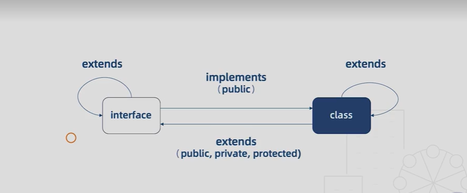

1. 类和接口的关系
   1. 类类型接口
      1. 一个接口可以约束类成员拥有哪些属性以及它的类型
          ```
          interface Human {
            // new (name: string): void;  不可以约束构造函数
            name: string;
            eat(): void;
          }
          class Asian implements Human{
            constructor(name: string){
              this.name = name
            }
            private name: string 
            // private name: string 
            eat() {}
          }
          ```
         1. 类实现接口的时候必须实现接口中声明的所有属性，可以继续添加别的属性，但是不能少
         2. 接口只能约束类的公有成员，如果我们把name设置为私有成员，这是不可以的
         3. 接口不能约束类的构造函数
   2. 接口的继承
          ```
          interface Man{
            run(): void
          }
          interface Child extends Human, Man{}
          let child: Child = {
            name: '',
            eat(){},
            run(){},
          } 

          class Auto {
            state = 1,
            private state2 = 0
          }
          interface AutoInterface extends Auto{
            // 这时AutoInterface接口中隐含了state属性
            // 接口在抽离类的时候，不仅抽离public成员，还抽离了private成员和protected成员
          }
          class C implements AutoInterface{
            state = 1,
            state2 = 0,
          }
          class Bus extends Auto implements AutoInterface{
            // Auto的子类Bus也可以实现AutoInterface接口
            // 在这里我们就不必实现state属性了，因为它是Auto的子类
          }
          ```
      1. 接口可以像类一样继承，如果要继承多个接口用逗号隔开
         1. 接口的继承可以抽离出常用的接口，也可以将多个接口合并为一个接口
      2. 接口可以继承类
         1. 相当于接口把类的成员都抽象出来，只有类的成员结构，而没有具体的实现
         2. 接口在抽离类的时候，不仅抽离public成员，还抽离了private成员和protected成员
   3. 接口和类的关系图 
2. 