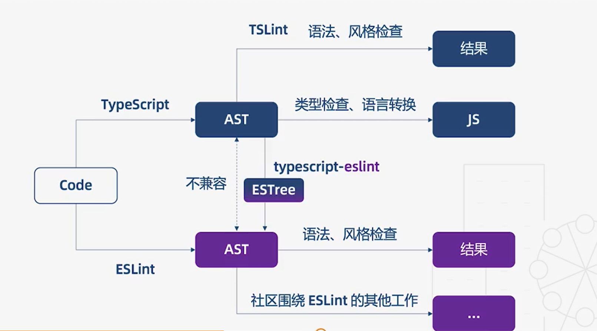

1. 配置tsconfig.json
   1. 文件选项
      ```
      {
        'files': [
          'src/a.ts'
        ],
        'include':[
          'src'
        ],
        'exclude':[
          'src/lib'
        ],
        'compileOnSave': true,
        'extends':'./tsconfig.base'
      }
      ```
      1. files表示编译器需要编译的单个文件的列表
         1. 如果上面只写了一个文件src/a.ts，那么就只会编译这个ts文件
      2. include表示编译器需要编译的文件或者目录
         1. 上面写了src文件，就表示src文件下下面所有ts文件都会被编译
         2. 支持通配符，'src/*'表示只会编译src文件夹下面的一级目录文件
      3. exclude表示编译器需要排除的文件或者文件夹
      4. compileOnSave表示保存文件时自动编译
         1. 但是vscode目前并不支持
      5. 配置文件之间是可以继承的，我们可以把基础类型配置抽离出来，方便复用
         1. 新建 tsconfig.base.json 保存公共配置
         2. 通过extends引入tsconfig.base.json中的公共配置
   2. 编译选项
      ```
      {
        'compilerOptions': [
          'incremental': true,               // 增量编译，ts在第一次编译后可以生成一个存储编译器的文件，然后二次编译时根据这个文件做增量编译
          'tsBuildInfoFile': './buildFile',  // 增量编译文件的存储位置
          'diagnostics': true,               // 打印诊断信息

          'target': 'es5',                   // 目标语言的版本
          'module': 'commonjs',              // 生成代码的模块标准
          'outFile': './app.js',             // 将多个相互依赖的文件生成一个文件，可以用在AMD模块中

          'lib': ['es2019.array'],           // TS需要引用的类库，即声明文件，es5默认'dom'，'es5'，'scripthost'

          'allowJs': true,                   // 允许编译js文件（js、jsx）
          'checkJs': true,                   // 允许在js文件中报错，通常与allowJs连用
          'outDir': './out',                 // 指定输出目录，因为上面两个选项打开后，编译过的文件会覆盖源文件，会报错，所以需要指定另一个输出目录
          'rootDir': './',                   // 指定输入文件目录（用于输出）如果指定了输入目录，那么./out文件夹中就不会有输入文件目录src了， 默认当前目录，也就是./，这时会有src文件夹。 如果指定了'rootDir': './src', ./out文件夹中就不会有src文件夹

          'declaration': true,               // 生成声明文件,  .d.ts文件
          'declarationDir': './d',           // 声明文件的路径
          'emitDeclarationOnly': true,       // 只生成声明文件，不生成js文件
          'sourceMap': true,                 // 生成目标文件的 sourceMap    .js.map文件
          'inlineSourceMap': true,           // 生成目标文件的 inline sourceMap
          'declarationMap': true,            // 生成声明文件的 sourceMap    .d.ts.map文件
          'typeRoots': [],                   // 声明文件目录，默认node_modules/@types
          'types': [],                       // 声明文件包，如果指定了一个包，那么只会加载这个包的声明文件

          'removeComments': true,            // 删除注释

          'noEmit': true,                    // 不输出文件
          'noEmitOnError': true,             // 发生错误时不输出文件

          'noEmitHelpers': true,             // 不生成helper函数，需要额外安装ts-helpers，例：如果使用类的继承extends，会默认使用其他工具库函数（helper），会使我们编译后的文件变大了。但是还出现了问题：extends是未定义的。这时需要使用下面的配置选项
          'importHelpers': true,             // 通过tslib（ts内置库）引入helper函数，文件必须是模块。extends就包含在内置tslib中，减少代码体积

          'downlevelIteration': true,        // 降级遍历器的实现（es3、5）

          'strict': true,                     // 开启所有严格的类型检查,如果设置为true，那么下面的所有选项也都是true
          'alwaysStrict': false,              // 在代码中注入 use strict
          'noImpliciaAny': false,             // 不允许隐式的any类型，即函数参数必须有类型注解
          'strictNullChecks': false,          // 不允许把null、undefined赋值给其他值
          'strictFunctionTypes': false,       // 不允许函数参数双向协变
          'strictPropertyInitialization': false,      //  类的实例属性必须初始化
          'strictBindCallApply': false,       // 严格的bind、call、aply检查
          'noImplicitThis': false,            // 不允许 this 有隐式的any类型，因为this是动态绑定的

          函数相关的选项，只会提供错误，不会阻碍编译
          'noUnusedLocals': true,             // 检查只声明未使用的局部变量
          'noUnusedParameters': true,         // 检查未使用的函数参数
          'noFallthroughCasesInSwitch': true, // 防止Switch语句贯穿，即某条语句没有break下面的语句全都会执行
          'noImplicitReturns': true,          // 每个分支都要有返回值
          
          'esModuleInterop': true,            // 允许 export = 导出，由import from导入
          'allowUmdGlobalAccess': true,       // 允许在模块中访问umd全局变量
          'moduleResolution': 'node',         // 模块解析策略，默认为node，还有classic策略
          'baseUrl': './',                    // 解析非相对模块的基地址
          'paths': {                          // 路径映射，相对于baseUrl
            'jquery': ['node_modules/jquery/dist/jquery.slim.min.js]
          },                                  // 比如不想使用jQuery的默认版本，可以在这里选择我们想要的版本的路径，路径是相对于baseUrl的
          'rootDirs': ['src', 'out'],         // 将多个目录放在一个虚拟目录下，用于运行时，不如我们把类库放到输出目录./out文件夹下面，但是我们使用的文件夹是在src文件夹下面，这个文件经过编译之后也会放到./out文件夹下，这时我们想引用输出目录./out文件夹中的类库，就需要使用这个虚拟目录，'rootDirs': ['src', 'out'] ，即./out文件夹和src文件夹是同一个目录

          'listEmittedFiles': true,           // 打印输出的文件
          'listFiles': true,                  // 打印编译的文件（包括引用的声明文件）
        ],
      }
      ```
   3. 工程引用
      1. 有时候我们需要在代码仓库中存放多个需要单独构建的工程，比如客户端和服务端的文件全放到同一个文件夹下
      2. 工程引用为我们提供了一种新的构建模式，build模式，可以单独构建一个工程，相关依赖也会被自动构建
         1. 构建server工程 tsc -b src/server --verbose
         2. 构建client工程 tsc -b src/client --verbose
         3. 构建测试用例 tsc -b test --verbose
2. 编译工具
   1. ts-loader
      1. ts-loader的配置项
        ```
        loader: 'ts-loader',
        options:{
          transpileOnly:false
        }
        ``` 
         1. transpileOnly：当这个配置项开启之后，会告诉编译器只做语言转换不做类型检查
            1. 因为实际项目中，项目大构建时间长，因为语言转换和类型检查花费很多时间
            2. 缺点是编译时不做类型检查
            3. 如果想要开启这个配置项并且做类型检查，需要借助插件，他会把类型检查放到独立的进程中进行
            4. 安装：npm i fork-ts-checker-webpack-plugin -D
            5. 在配置文件webpack.base.config.js中引入 const ForkTsCheckerWebpackPlugin = require('fork-ts-checker-webpack-plugin')
            6. 使用
              ```
              plugins: [
                new HtmlWebpackPlugin({
                  template: './src/tpl/index.html'
                }),
                new ForkTsCheckerWebpackPlugin()
              ]
              ```
       2. awesome-typescript-loader
          1. 官方提供的另一种loader
          2. 与ts-loader区别
             1. 更适合Babel集成，使用Babel的转义和缓存
             2. 不需要安装额外插件，就可以把类型检查放到独立的进程中进行
             3. 类型检查有遗漏
          3. 安装 npm i awesome-typescript-loader -D
          4. 使用：loader: 'awesome-typescript-loader'
          5. 引入插件：const {checkerPlugin} = require('awesome-typescript-loader')
             1. new checkerPlugin()
   2. Babel
      1. 使用ts为什么还要使用Babel
         1. 都可以把代码编译为es3、es5、es6
         2. TS有类型检查
         3. babel社区插件丰富
      2. babel7之前不支持TS，使用方式：
         1. TS => tsc(ts-loader/awesome-typescript-loader) => JS => Babel => JS
      3. babel7之后使用方式：
         1. TS => Babel => JS
         2. TS =>(tsc(type checking))=> JS
      4. 完全使用babel
        ```
        package.json
        "devDependencies": {
          "@babel/preset-typescript": "^7.3.3",                    //用来编译TS文件
          "@babel/plugin-proposal-class-properties": "^7.4.4",     //插件，方便编写TS
          "@babel/plugin-proposal-object-rest-spread": "^7.4.4",   //支持剩余和扩展操作符
        }
        "scripts": {
          "build": "babel src --out-dir dist --extensions \".ts,.tsx\"",   // babel不能识别.ts,.tsx这两种文件
          "type-check": "tsc --watch",                                     // 添加的TS类型检查脚本，开启TS的监控模式
          "test": "jest"
        },
        ```
         1. babel的配置文件,引入两个插件和presets
            ```
            .babelrc
            {
              "presets": [
                "@babel/env",
                "@babel/preset-typescript"
              ],
              "plugins": [
                "@babel/proposal-class-properties",
                "@babel/proposal-object-rest-spread"
              ]
            }
            ```
         2. Babel是不能进行类型检查的，如果想要使用Babel7之后完全Babel的模式，必须要安装TS
            1. npm i typescript -D
            2. tsc --init 新建配置文件tsconfig.json
            3. 在tsconfig.json文件中开启 "noEmit":true 配置选项 ，表示TS不会输出任何文件，只会做类型检查
            4. 然后在package.json文件夹中添加一个类型检查脚本 "type-check": "tsc --watch",
            5. 执行类型检查脚本需要独占一个终端
               1. npm run type-check
               2. 这时就会实时监控编码中的类型错误
         3. 这样就把Babel和TS结合到一起了，Babel只做语言转换，TS只做类型检查
      5. Babel中使用TS需要注意的事项
         1. 四种语法在Babel中是无法编译的
            1. 命名空间 namespace
            2. 类型断言 使用as不要使用<>
            3. 常量枚举 const enum E { A }
            4. 默认导出 export = a 
         2. 建议
            1. 如果没使用过Babel，首选TS自身的编译器（可配合ts-loader使用）
            2. 如果项目中已经使用了Babel，安装@babel/perset-typesceipt（可配合tsc做类型检查）
            3. 两种编译工具不要混用
3. 代码检查工具TSLint到ESLint
   1. Typescript主要有两种代码检查工具TSLint和ESLint，但是ts官方转向了ESLint
      1. TSLint执行规则的方式存在一些架构问题，从而影响了性能，而修复这些问题会破坏现有的规则
      2. ESLint的性能更好，并且社区用户通常由拥有ESLint的规则配置（比如针对React和Vue的规则），而不会拥有TSLint的规则配置
   2. 使用TS为什么还需要ESLint
      1. TS主要做类型检查和语言转换，通常也会对一些语法错误进行检查
      2. ESLint除了检查语法，还会对代码风格进行统一
      3. 但是如果使用ESLint检查TS的语法会存在一些问题
         1. 
         2. 他们在进行各自的工作前都会把代码转为AST抽象语法树，但是这两种语法树是不兼容的，缺点就是不能重用
            1. 但是TSLint完全是基于TS的AST工作的，没这样的问题
            2. 解决兼容性问题 typescript-eslint ，为ESLint提供了解析ts代码的编译器，可以把TS的语法树转换为ESLint期望的语法树ESTree
   3. 在TS中使用ESLint
      ```
      package.json
      "devDependencies": {
        "eslint": "^5.16.0",
        "@typescript-eslint/eslint-plugin": "^1.10.2",  // 使ESLint识别TS的特殊语法
        "@typescript-eslint/parser": "^1.10.2",         // 为ESLint提供解析器
      },
      "scripts": {
        "start": "webpack-dev-server --mode=development --config ./build/webpack.config.js",
        "build": "webpack --mode=production --config ./build/webpack.config.js",
        "lint": "eslint src --ext .js,.ts",             // 自动检查js和ts文件
        "test": "jest"
      },

      .eslintrc  // ESlint的配置
      "parser": "@typescript-eslint/parser",            // 解析器
      "plugins": ["@typescript-eslint"],                // 插件
      "parserOptions": {
          "project": "./tsconfig.json"                  // 有一些规则是需要使用类型信息的，我们可以利用tsconfig.json中的类型信息
      },
      "extends": [
        "plugin:@typescript-eslint/recommended"         // 配置具体的规则，这里使用官方推荐的recommended规则
      ],
      "rules": {
        "@typescript-eslint/no-inferrable-types": "off" // ESlint希望我们默认不指定变量的类型，利用TS的类型推断，这里关闭这个规则
      }
      ```
      1. 执行 npm run lint
      2. 除了使用脚本做代码检查，还可以安装eslint的插件辅助开发
         1. 在vscode的插件库里面安装ESLint，点击设置按钮，选择扩展设置，然后点击在setting.json中配置
            ```
            "eslint.autoFixOnSave": true,    // 保存文件时会自动为我们进行修复
            "eslint.validata": [             // 指定eslint检测的语言
              "javascript",
              "javascriptreact",
              {
                "language": "typescript",
                "autoFix": true
              },
              {
                "language": "html",
                "autoFix": true
              },
              {
                "language": "vue",
                "autoFix": true
              },
            ],    
            ```
   4. babel-eslint 和 typescript-eslint
      1. babel-eslint：支持typescript没有额外的语法检查，抛弃typescript，不支持类型检查
      2. typescript-eslint：基于typescript的AST，支持创建基于类型信息的规则（tsconfig.json）
   5. 建议：两者底层机制不一样，不要一起使用
      1. Babel的体系建议使用bebel-eslint，否则可以使用typescript-eslint
4. Jest单元测试
   1. jest是Facebook推出的单元测试工具，有ts-jest和babel-jest（不能对测试代码进行类型检查）
   2. ts-jest使用
      ```
      安装两个jest包
      "devDependencies": {
        "jest": "^24.8.0",
        "ts-jest": "^24.0.2",
      },
      jest的测试脚本
      "scripts": {
        "start": "webpack-dev-server --mode=development --config ./build/webpack.config.js",
        "build": "webpack --mode=production --config ./build/webpack.config.js",
        "lint": "eslint src --ext .js,.ts",
        "test": "jest"
      },
      ```
      1. 命令 npx ts-jest config:init 生成jest测试文件jest,config.js
        ```
        module.exports = {
          preset: 'ts-jest',         // 指定perset是ts-jest
          testEnvironment: 'node',   // 测试环境是node
        };
        ```
      2. 编写测试用例
         1. 根目录新建test文件夹，在里面新建math.test.ts文件夹
            ```
            const math = require('../src/math')  // 导入编写的两个函数
            test('add: 1 + 1 = 2', () =>{
              expect(math.add(1, 1)).toBe(2);    // 使用断言 测试add函数
            })    
            test('sub: 1 - 2 = -1', () =>{
              expect(math.sub(1, 2)).toBe(-1);    // 使用断言 测试sub函数
            })           
            ```
         2. 执行测试脚本 npm run test
      3. 使用ts-jest的好处：能够在测试用例中进行类型检查
   3. babel-jest使用
      1. 安装jest和babel-jest ，并且指定声明文件
         1. npm i -D jest babel-jest @types/jest
      2. 安装node声明文件
         1. npm i @types/node -D
      3. 配置和上面一样，执行npm run test
      4. 缺点是不会进行类型检查
         1. 需要在一个新的终端启动类型检查脚本 npm run type-check