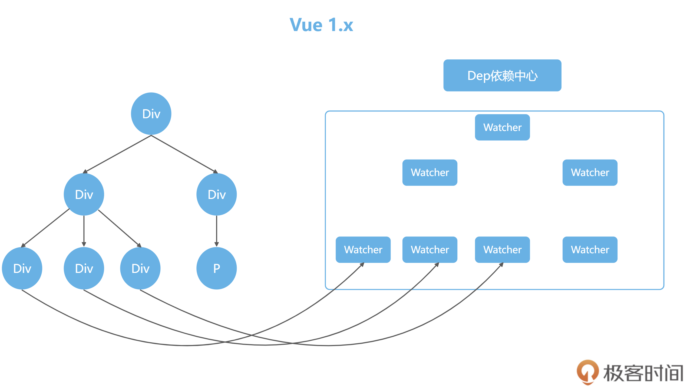
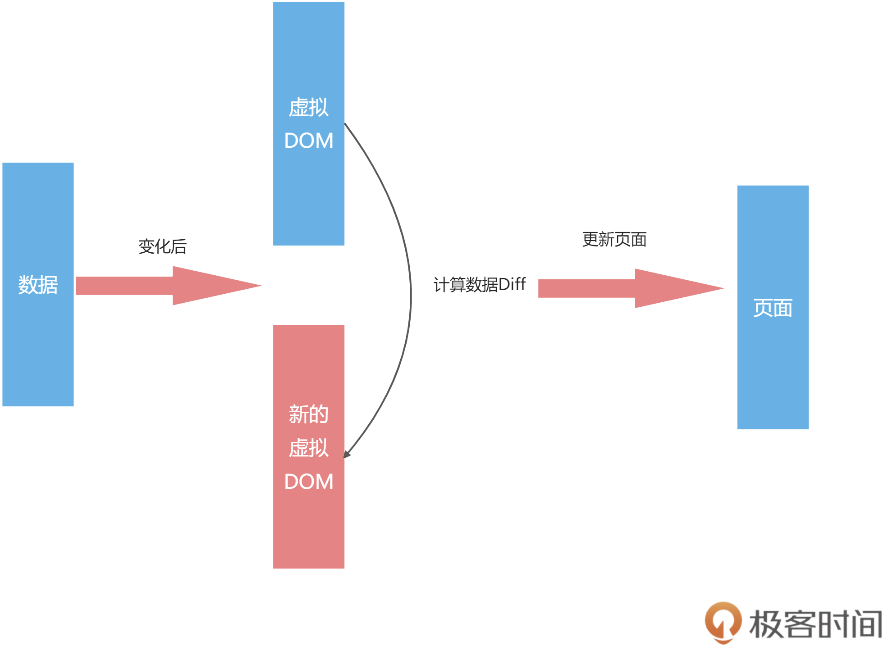
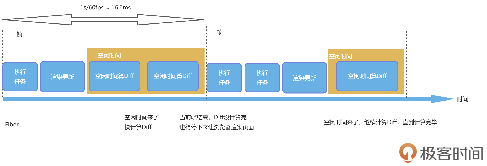
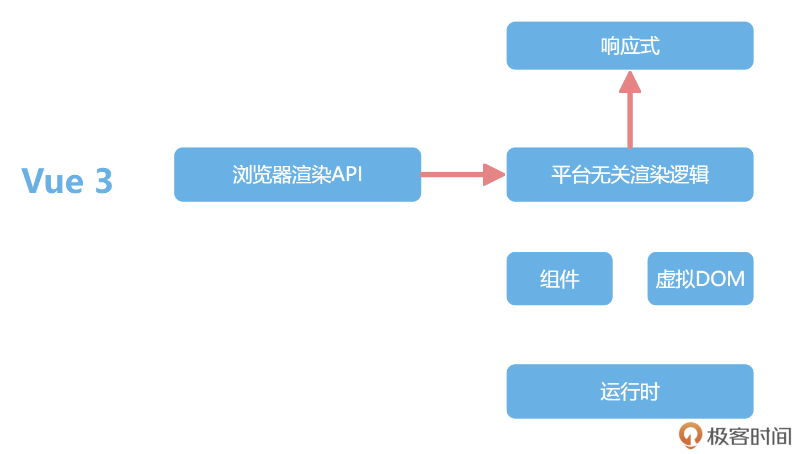
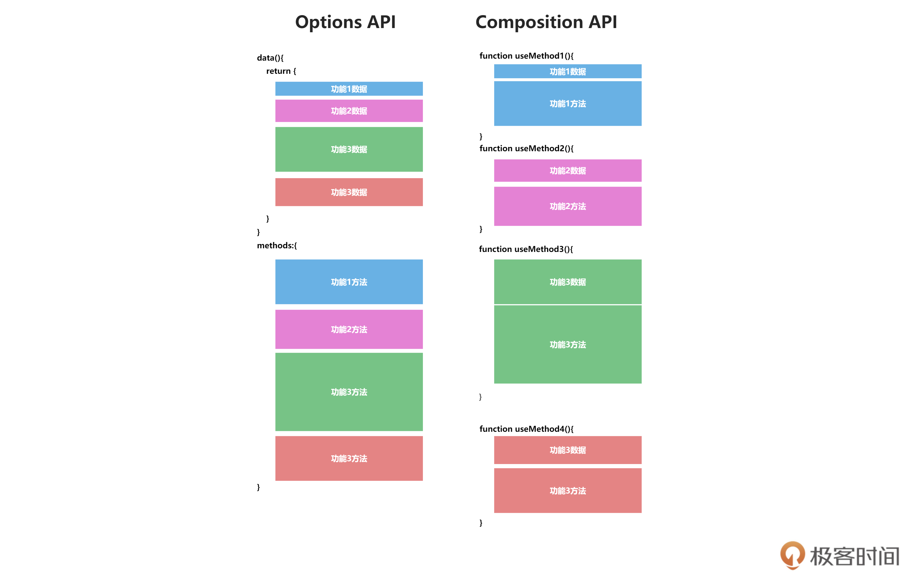
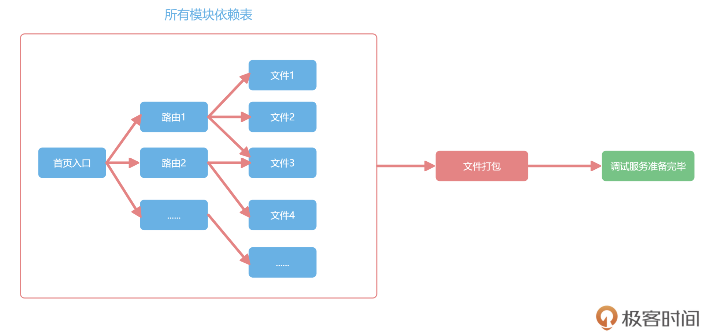
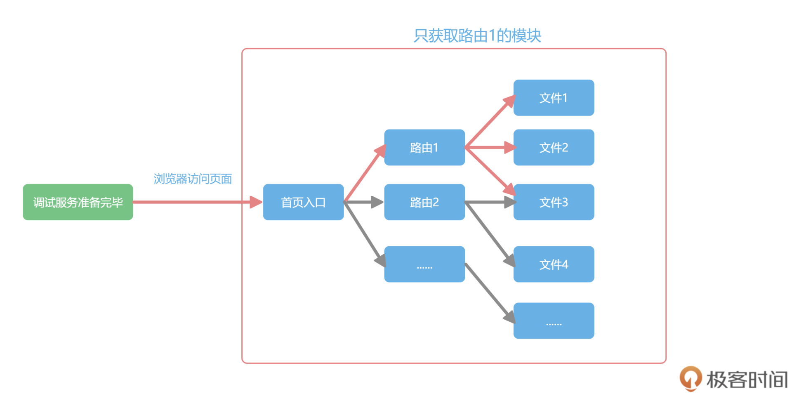

1. 宏观视角：从前端框架发展史聊聊为什么要学Vue 3？
   1. 石器时代
      1. 前端的发展历史
         1. 1990 年，第一个 Web 浏览器诞生了。这是前端这个技术的起点，代表这一年它出生了。后面的时间里，前端圈有很多里程碑事件。
         2. 1994 年，网景公司发布第一个商业浏览器 Navigator。
         3. 1995 年，网景工程师 Brendan Eich 用 10 天时间设计了 JavaScript，同年微软发布了 IE 浏览器，进而掀起了浏览器大战。
         4. 2002 年，IE 在浏览器大战中赢得胜利，IE6 占有率超过 96% 。
      2. 而前端的发展历史，又非常直观地显示在你看到的前端网页的演变历史中
         1. 整个 90 年代，受限于网速，网页都是静态页，显示非常单一，前端的工作大部分都只是让美工来切切图和写写 HTML+CSS
         2. 也因此，在 90 年代，前端还处在一种萌发期的状态，前端工程师这一工种也没有明确出现。
      3. 再后来，后端越来越复杂，开始分层
         1. 就像在小公司里，大家啥都干，但公司规模大了之后，就要分部门，职责明确
         2. 代码也从揉在一起发展到 Model，View 和 Controller，分别负责不同的功能。
         3. 这就是后端 MVC 模式的盛行，让我们可以在模板里写上要展现的数据。以前的代码都是所有内容写在一起，现在就会用 Model 负责数据。
      4. 后端渲染页面之前，会把数据库的数据显示在前端
         1. 这个时候，除了写前端代码必备的 HTML、CSS 和简单的 JavaScript 动效，我们也开始用到了 JSP 和 Smarty，我们会写出如下这种代码：
            ```
            <body>
            它的名字叫{$name}
            </body>
            ```
         2. 上述代码写出来的页面，就可以直接显示后端数据库里的数据了，这也就是所谓的动态网页
         3. 动态页面使得前端本身的丰富程度大大提升。这一下子迎来了整个互联网开发的繁荣时期
         4. 但这种模式下的任何数据更新，都需要刷新整个页面，并且在带宽不足的年代，这样做会耗费不少加载网页的时间。
      5. 所以这个时代的网页主要还是以显示数据和简单的特效为主
         1. 比如当时众多的门户网站，也都没有太多的用户交互，主要就是显示后端存储的新闻
      6. 直到 2004 年，Google 发布了 Gmail，用户可以在不刷新页面的情况下进行复杂的交互
         1. 之后，Ajax 逐渐成为网页开发的技术标准，也不断地被应用于各种网站
         2. Ajax 这个技术让我们可以异步的获取数据并且刷新页面，从此前端不再受限于后端的模板，这也宣告了 Web2.0 时代正式到来
   2. 铁器时代
      1. 在 Gmail 诞生后，虽然依然有浏览器的混战和兼容性问题，比如绑定事件不同的浏览器就要写不同的代码，但大家意识到前端也可以做出复杂应用
         1. 而 jQuery 的出现迅速风靡全球，一个 $ 走天下，学会 jQuery 就等同于学会了前端
         2. 算是前端车同轴的时代。在这之后，前端的具体开发不再被 JavaScript 的兼容性问题所困扰。
      2. 那个时候 jQuery+Bootstrap 一把梭，成为了前端开发领域的主流技术
         1. 前端代码内嵌在后端的项目中，写完直接发布，通篇都是如下的代码：
            ```
            $('#alert-btn').on('click',function(){
              $('#app .input').val('hi')
            })
            ```
         2. 那个时候写代码，就是找到某个元素，进行 DOM 操作
         3. 特别像铁器时代的拼刺刀，随着前端项目规模的逐渐提升
         4. 前端也需要规模化的时候，在 2009 年 AngularJS 和 Node.js 的诞生，也宣告前端工业革命的到来
   3. 工业时代
      1. AngularJS 的诞生，引领了前端 MVVM 模式的潮流；Node.js 的诞生，让前端有了入侵后端的能力，也加速了前端工程化的诞生
         1. 现在前端三大框架 Angular、React、Vue 的发展主线，也就是从这里开始的。
      2. 所谓 MVVM，就是在前端的场景下，把 Controller 变成了 View-Model 层
         1. 作为 Model 和 View 的桥梁，Model 数据层和 View 视图层交给 View-Model 来同步
         2. 第二讲我们会通过一个清单应用让你熟悉 MVVM 开发模式和传统 jQuery 的开发模式的区别
      3. 前端三大框架
         1. 在前端 MVVM 模式下，不同框架的目标都是一致的，就是利用数据驱动页面，但是怎么处理数据的变化，各个框架走出了不同的路线
         2. 这些框架要回答的核心问题就是，数据发生变化后，我们怎么去通知页面更新。各大框架在这个步骤上，各显神通：
            1. Angular 1 就是最老套的脏检查
               1. 所谓的脏检查，指的是 Angular 1 在对数据变化的检查上，遵循每次用户交互时都检查一次数据是否变化，有变化就去更新 DOM 这一方法
               2. 这个方法看似简单粗暴，但算是数据驱动页面早期的实现，所以一经推出，就迅速占领了 MVVM 市场。
               3. 后面 Angular 团队自断双臂，完全抛弃 Angular 1，搞了一个全新的框架还叫 Angular
                  1. 引入了 TypeScript、RxJS 等新内容，虽然这些设计很优秀，但是不支持向前兼容，抛弃了老用户
            2. 而 Vue 1 的解决方案，就是使用响应式
               1. 初始化的时候，Watcher 监听了数据的每个属性，这样数据发生变化的时候，我们就能精确地知道数据的哪个 key 变了
                  1. 去针对性修改对应的 DOM 即可，这一过程可以按如下方式解构：
                  2. 在上图中，左边是实际的网页内容，我们在网页中使用{{}}渲染一个变量，Vue 1 就会在内容里保存一个监听器监控这个变量
                  3. 我们称之为 Watcher，数据有变化，watcher 会收到通知去更新网页。
               2. 通俗来说，如果把网页数据看成你管理的员工，普通数据就是那种每次你都需要找到他，告诉他要怎么做的人
                  1. 响应式数据就是他本身有任何变化，都会主动给你发日报告诉你的积极员工
            3. Facebook 的 React 团队提出设计了 React 框架
               1. 在页面初始化的时候，在浏览器 DOM 之上，搞了一个叫虚拟 DOM 的东西，也就是用一个 JavaScript 对象来描述整个 DOM 树
                  1. 我们可以很方便的通过虚拟 DOM 计算出变化的数据，去进行精确的修改。
               2. 我们先看 React 中的一段代码：
                  ```
                  <div id = "app">
                      <p class = "item">Item1</p>
                      <div class = "item">Item2</div>
                  </div>
                  ```
                  1. 在 React 中，这样一段 HTML 会被映射成一个 JavaScript 的对象进行描述
                  2. 这个对象就像数据和实际 DOM 的一个缓存层，通过管理这个对象的变化，来减少对实际 DOM 的操作。
                  3. 这种形式不仅让性能有个很好的保障，我们还多了一个用 JSON 来描述网页的工具，并且让虚拟 DOM 这个技术脱离了 Web 的限制
                  4. 虚拟 DOM 在运行的时候就是这么一个对象：
                  ```
                  {
                    tag: "div",
                    attrs: {
                      id: "app"
                    },
                    children: [
                      {
                        tag: "p",
                        attrs: { className: "item" },
                        children: ["Item1"]
                      },
                      {
                        tag: "div",
                        attrs: { className: "item" },
                        children: ["Item2"]
                      }
                    ]
                  }
                  ```
                  1. 这个对象完整地描述了 DOM 的树形结构，这样数据有变化的时候，我们生成一份新的虚拟 DOM 数据，然后再对之前的虚拟 DOM 进行计算，算出需要修改的 DOM，再去页面进行操作。
                  2. 浏览器操作 DOM 一直都是性能杀手，而虚拟 DOM 的 Diff 的逻辑，又能够确保尽可能少的操作 DOM，这也是虚拟 DOM 驱动的框架性能一直比较优秀的原因之一。
                  3. 
      4. Vue 与 React 框架的对比
         1. 通过上面对前端三大框架的介绍，我们不难发现 Vue 和 React 在数据发生变化后，在通知页面更新的方式上有明显的不同
            1. 在 Vue 框架下，如果数据变了，那框架会主动告诉你修改了哪些数据
            2. 而 React 的数据变化后，我们只能通过新老数据的计算 Diff 来得知数据的变化。
         2. 这两个解决方案都解决了数据变化后，如何通知页面更新的问题，并且迅速地获得了很高的占有率，但是他们都碰到了性能的瓶颈：
            1. 对于 Vue 来说，它的一个核心就是“响应式”，也就是数据变化后，会主动通知我们
               1. 响应式数据新建 Watcher 监听，本身就比较损耗性能，项目大了之后每个数据都有一个 watcher 会影响性能。
            2. 对于 React 的虚拟 DOM 的 Diff 计算逻辑来说
               1. 如果虚拟 DOM 树过于庞大，使得计算时间大于 16.6ms，那么就可能会造成性能的卡顿。
         3. 为了解决这种性能瓶颈， Vue 和 React 走了不同的道路
            1. React 为了突破性能瓶颈，借鉴了操作系统时间分片的概念，引入了 Fiber 架构
               1. 通俗来说，就是把整个虚拟 DOM 树微观化，变成链表，然后我们利用浏览器的空闲时间计算 Diff
               2. 一旦浏览器有需求，我们可以把没计算完的任务放在一旁，把主进程控制权还给浏览器，等待浏览器下次空闲。
               3. 这种架构虽然没有减少运算量，但是巧妙地利用空闲实现计算，解决了卡顿的问题
               4. 图解：
                  1. 在上图中，左侧是一个树形结构，树形结构的 Diff 很难中断；右侧是把树形结构改造成了链表
                  2. 遍历严格地按照子元素 -> 兄弟元素 -> 父元素的逻辑，随时可以中断和恢复 Diff 的计算过程。
               5. 为了方便你对计算 Diff 的理解，我们来看下面这张图：
                  1. 这个图里两个虚线之间是浏览器的一帧，高性能的动画要求是 60fps，也就是 1 秒要渲染 60 次
                  2. 每一帧的时间就是 16.6 毫秒，在这 16.6 毫秒里，浏览器自己的渲染更新任务执行后，会有一部分的空闲时间，这段时间我们就用来计算 Diff
                  3. 等到下一帧任务来了，我们就把控制权还给浏览器，让它继续去更新和渲染，等待空闲时间再继续计算，这样就不会导致卡顿
            2. Vue 1 的问题在于响应式数据过多，这样会带来内存占用过多的问题。
               1. 所以 Vue 2 大胆引入虚拟 DOM 来解决响应式数据过多的问题
               2. 这个解决方案使用虚拟 DOM 解决了响应式数据过多的内存占用问题，又良好地规避了 React 中虚拟 DOM 的问题,还通过虚拟 DOM 给 Vue 带来了跨端的能力。
               3. 响应式数据是主动推送变化，虚拟 DOM 是被动计算数据的 Diff，一个推一个拉，它们看起来是两个方向的技术，但被 Vue 2 很好地融合在一起，采用的方式就是组件级别的划分。
               4. 对于 Vue 2 来说，组件之间的变化，可以通过响应式来通知更新。组件内部的数据变化，则通过虚拟 DOM 去更新页面。
               5. 这样就把响应式的监听器，控制在了组件级别，而虚拟 DOM 的量级，也控制在了组件的大小。
               6. 下图左边就是一个个的组件，组件内部是没有 Watcher 监听器的，而是通过虚拟 DOM 来更新，每个组件对应一个监听器，大大减小了监听器的数量  
         4. 除了响应式和虚拟 DOM 这个维度，Vue 和 React 还有一些理念和路线的不同，在模板的书写上，也走出了 template 和 JSX 两个路线
            1. 
            2. React 的世界里只有 JSX，最终 JSX 都会在 Compiler 那一层，也就是工程化那里编译成 JS 来执行
               1. 所以 React 最终拥有了全部 JS 的动态性，这也导致了 React 的 API 一直很少，只有 state、hooks、Component 几个概念
               2. 主要都是 JavaScript 本身的语法和特性。
            3. 而 Vue 的世界默认是 template，也就是语法是限定死的，比如 v-if 和 v-for 等语法
               1. 有了这些写法的规矩后，我们可以在上线前做很多优化。
               2. Vue 3 很优秀的一个点，就是在虚拟 DOM 的静态标记上做到了极致，让静态的部分越过虚拟 DOM 的计算，真正做到了按需更新，很好的提高了性能。
            4. 在模板的书写上，除了 Vue 和 React 走出的 template 和 JSX 两个路线，还出现了 Svelte 这种框架
               1. 没有虚拟 DOM 的库，直接把模板编译成原生 DOM，几乎没有 Runtime，所有的逻辑都在 Compiler 层优化，算是另外一个极致
2. 02 | 上手：一个清单应用帮你入门Vue.js
   1. Vue 2 的核心模块和历史遗留问题
      1. Vue 2 是一个响应式驱动的、内置虚拟 DOM、组件化、用在浏览器开发，并且有一个运行时把这些模块很好地管理起来的框架
      2. Vue 2 常见的缺陷
         1. 首先从开发维护的角度看，Vue 2 是使用 Flow.js 来做类型校验
            1. 但现在 Flow.js 已经停止维护了，整个社区都在全面使用 TypeScript 来构建基础库，Vue 团队也不例外
         2. 然后从社区的二次开发难度来说，Vue 2 内部运行时，是直接执行浏览器 API 的
            1. 但这样就会在 Vue 2 的跨端方案中带来问题，要么直接进入 Vue 源码中，和 Vue 一起维护，比如 Vue 2 中你就能见到 Weex 的文件夹
            2. 要么是要直接改为复制一份全部 Vue 的代码，把浏览器 API 换成客户端或者小程序的
               1. 比如 mpvue 就是这么做的，但是 Vue 后续的更新就很难享受到。
         3. 最后从我们普通开发者的角度来说，Vue 2 响应式并不是真正意义上的代理，而是基于 Object.defineProperty() 实现的
            1. 对于 Object.defineProperty() 这个 API 的细节，我们在后面讲源码时会讲到
            2. 现在你只需要知道这个 API 并不是代理，而是对某个属性进行拦截，所以有很多缺陷
               1. 比如：删除数据就无法监听，需要 $delete 等 API 辅助才能监听到
         4. 并且，Option API 在组织代码较多组件的时候不易维护
            1. 对于 Option API 来说，所有的 methods、computed 都在一个对象里配置，这对小应用来说还好
            2. 但代码超过 300 行的时候，新增或者修改一个功能，就需要不停地在 data，methods 里跳转写代码
   2. 从七个方面了解 Vue 3 新特性
      1. Vue 3 就是继承了 Vue 2 具有的响应式、虚拟 DOM，组件化等所有优秀的特点
         1. 并且全部重新设计，解决了这些历史包袱的新框架，是一个拥抱未来的前端框架。
         2. 接下来我们就来具体看看 Vue 3 新特性，我将分成 7 个具体方面向你展开介绍
         3. 其中，响应式系统、Composition API 组合语法、新的组件和 Vite 是你需要重视的
         4. 自定义渲染器这方面的知识，你想用 Vue 开发跨端应用时会用到
         5. 如果你想对 Vue 源码作出贡献，RFC 机制你也需要好好研究，并且得对 TypeScript 重构有很好的经验
      2. RFC 机制
         1. Vue 3 的第一个新特性和代码无关，而是 Vue 团队开发的工作方式
            1. 关于 Vue 的新语法或者新功能的讨论，都会先在 GitHub 上公开征求意见，邀请社区所有的人一起讨论
            2. Vue 3 正在讨论中的新需求，任何人都可以围观、参与讨论和尝试实现。
            3. 这个改变让 Vue 社区更加有活力，不管是课程后面会提到的<script setup>，还是 Vue 3 引入的 ref API
            4. 都可以在这个项目中看到每个需求从诞生到最终被 Vue 采纳的来龙去脉，这能帮助我们更好地了解 Vue 的发展
         2. Vue 很长一段时间都是尤雨溪一个人维护，感慨尤雨溪战斗力的同时，社区也有很多人对 Vue 的稳定性提出质疑
            1. 后来尤雨溪吸纳了社区的人，并成立了 Core Team。
            2. Vue 3 在此基础之上更进一步，全面拥抱社区，任何对 Vue 感兴趣的人都可以参与新特性的讨论
            3. RFC 的引入，让 Vue 生态更加开放，在开发方式的新特性之外，我们搞技术的还是要回归代码
            4. 下面我来说说 Vue 3 在代码层面所做的具体优化
      3. 响应式系统
         1. Vue 2 的响应式机制是基于 Object.defineProperty() 这个 API 实现的
         2. 此外，Vue 还使用了 Proxy，这两者看起来都像是对数据的读写进行拦截
         3. 但是 defineProperty 是拦截具体某个属性，Proxy 才是真正的“代理”。
         4. 怎么理解这两者的区别呢？
            1. 我们首先看 defineProperty 这个 API，defineProperty 的使用，要明确地写在代码里，下面是示例代码：
               ```
               Object.defineProperty(obj, 'title', {
                 get() {},
                 set() {},
               })
               ```
            2. 当项目里“读取 obj.title”和“修改 obj.title”的时候被 defineProperty 拦截
            3. 但 defineProperty 对不存在的属性无法拦截，所以 Vue 2 中所有数据必须要在 data 里声明
            4. 而且，如果 title 是一个数组的时候，对数组的操作，并不会改变 obj.title 的指向
               1. 虽然我们可以通过拦截.push 等操作实现部分功能，但是对数组的长度的修改等操作还是无法实现拦截
               2. 所以还需要额外的 $set 等 API
         5. 而 Proxy 这个 API 就是真正的代理了，我们先看它的用法：
             ```
             new Proxy(obj, {
               get() { },
               set() { },
             })
             ```
            1. 需要注意的是，虽然 Proxy 拦截 obj 这个数据，但 obj 具体是什么属性，Proxy 则不关心，统一都拦截了
            2. 而且 Proxy 还可以监听更多的数据格式，比如 Set、Map，这是 Vue 2 做不到的
            3. 当然，Proxy 存在一些兼容性问题，这也是为什么 Vue 3 不兼容 IE11 以下的浏览器的原因，还好现在 IE 用的人不多了
         6. 更重要的是，我觉得 Proxy 代表一种方向，就是框架会越来越多的拥抱浏览器的新特性
            1. 在 Proxy 普及之前，我们是没有办法完整的监听一个 JavaScript 对象的变化，只能使用 Object.defineProperty() 去实现一部分功能
            2. 前端框架利用浏览器的新特性来完善自己，才会让前端这个生态更繁荣，抛弃旧的浏览器是早晚的事
            3. 这里你掌握 Proxy 的优势就可以了，具体的使用我们后面会自己手写一个，帮助你深入理解
      4. 自定义渲染器
         1. Vue 2 内部所有的模块都是揉在一起的，这样做会导致不好扩展的问题
            1. Vue 3 是怎么解决这个问题的呢？那就是拆包，使用最近流行的 monorepo 管理方式
            2. 响应式、编译和运行时全部独立了，变成下图所示的模样：
            3. 我们能看到，在 Vue 3 的组织架构中，响应式独立了出来
            4. 而 Vue 2 的响应式只服务于 Vue，Vue 3 的响应式就和 Vue 解耦了，你甚至可以在 Node.js 和 React 中使用响应式
         2. 渲染的逻辑也拆成了平台无关渲染逻辑和浏览器渲染 API 两部分
            1. 在这个架构下，Node 的一些库，甚至 React 都可以依赖响应式
            2. 在任何时候，如果你希望数据被修改了之后能通知你，你都可以单独依赖 Vue 3 的响应式。
            3. 那么，在你想使用 Vue 3 开发小程序、开发 canvas 小游戏以及开发客户端的时候，就不用全部 fork Vue 的代码，只需要实现平台的渲染逻辑就可以
            4. 
         3. Vue 3 响应式、编译和运行时几部分组合在一起就是运行在浏览器端的 Vue 3，每个模块又都可以独立扩展出新的功能
      5. 全部模块使用 TypeScript 重构
         1. 类型系统带来了更方便的提示，并且让我们的代码能够更健壮。
      6. Composition API 组合语法
         1. Composition API 是 Vue 3 中我最喜欢的一个特性，我们也叫它组合 API
         2. 先举个 Vue 2 中的简单例子，一个累加器，并且还有一个计算属性显示累加器乘以 2 的结果
            ```
            <div id="app">
              <h1 @click="add">{{count}} * 2 = {{double}}</h1>
            </div>
            <script src="https://unpkg.com/vue@next"></script>
            <script>
            let App = {
              data(){
                return {
                  count:1
                }
              },
              methods:{
                add(){
                  this.count++
                }
              },
              computed:{
                double(){
                  return this.count*2
                }
              }
            }
            Vue.createApp(App).mount('#app')
            </script>
            ```
         3. 在 Vue 3 中，除了上面这种这个写法，我们还可以采用下方的写法，新增一个 setup 配置：
            ```
            <div id="app">
              <h1 @click="add">{{state.count}} * 2 = {{double}}</h1>
            </div>
            <script src="https://unpkg.com/vue@next"></script>
            <script>
            const {reactive,computed} = Vue
            let App = {
              setup(){
                const state = reactive({
                  count:1
                })
                function add(){
                  state.count++
                }
                const double = computed(()=>state.count*2)
                return {state,add,double}
              }
            }
            Vue.createApp(App).mount('#app')
            </script>
            ```
         4. 使用 Composition API 后，代码看起来很烦琐，没有 Vue 2 中 Options API 的写法简单好懂，但 Options API 的写法也有几个很严重的问题：
            1. 由于所有数据都挂载在 this 之上，因而 Options API 的写法对 TypeScript 的类型推导很不友好，并且这样也不好做 Tree-shaking 清理代码
            2. 新增功能基本都得修改 data、method 等配置，并且代码上 300 行之后，会经常上下反复横跳，开发很痛苦
            3. 代码不好复用，Vue 2 的组件很难抽离通用逻辑，只能使用 mixin，还会带来命名冲突的问题。
         5. 我们使用 Composition API 后，虽然看起来烦琐了一些，但是带来了诸多好处：
            1. 所有 API 都是 import 引入的（现在我们的例子还没有工程化，后续会加入）  
               1. 用到的功能都 import 进来，对 Tree-shaking 很友好，我的例子里没用到功能，打包的时候会被清理掉，减小包的大小。
            2. 不再上下反复横跳，我们可以把一个功能模块的 methods、data 都放在一起书写，维护更轻松
            3. 代码方便复用，可以把一个功能所有的 methods、data 封装在一个独立的函数里，复用代码非常容易
            4. Composotion API 新增的 return 等语句，在实际项目中使用 <script setup> 特性可以清除， 我们后续项目中都会用到这样的操作。
         6. Composition API 对我们开发 Vue 项目起到了巨大的帮助
            1. 下面这个示例图很好地说明了问题：
            2. 每一个功能模块的代码颜色一样，左边是 Options API，一个功能的代码零散的分布在 data，methods 等配置内，维护起来很麻烦
            3. 而右边的 Compositon API 就不一样了，每个功能模块都在一起维护
            4. 其实还可以更进一步，如果每个颜色块代码，我们都拆分出去一个函数，我们就会写出类似上面右侧风格的代码，每个数据来源都清晰可见，而且每个功能函数都可以在各个地方复用
         7. 新的组件
            1. Vue 3 还内置了 Fragment、Teleport 和 Suspense 三个新组件
            2.  Fragment: Vue 3 组件不再要求有一个唯一的根节点，清除了很多无用的占位 div
            3.  Teleport: 允许组件渲染在别的元素内，主要开发弹窗组件的时候特别有用
            4.  Suspense: 异步组件，更方便开发有异步请求的组件
      7. 新一代工程化工具 Vite
         1. Vite 不在 Vue 3 的代码包内，和 Vue 也不是强绑定，Vite 的竞品是 Webpack，而且按照现在的趋势看，使用率超过 Webpack 也是早晚的事
         2. Vite 主要提升的是开发的体验，Webpack 等工程化工具的原理，就是根据你的 import 依赖逻辑，形成一个依赖图，然后调用对应的处理工具，把整个项目打包后，放在内存里再启动调试
         3. 由于要预打包，所以复杂项目的开发，启动调试环境需要 3 分钟都很常见，Vite 就是为了解决这个时间资源的消耗问题出现的
         4. 你可能不知道，现代浏览器已经默认支持了 ES6 的 import 语法，Vite 就是基于这个原理来实现的
         5. 具体来说，在调试环境下，我们不需要全部预打包，只是把你首页依赖的文件，依次通过网络请求去获取，整个开发体验得到巨大提升，做到了复杂项目的秒级调试和热更新。
         6. 下图展示了 Webpack 的工作原理，Webpack 要把所有路由的依赖打包后，才能开始调试。
            1. 
         7. 而下图所示的是 Vite 的工作原理，一开始就可以准备联调，然后根据首页的依赖模块，再去按需加载，这样启动调试所需要的资源会大大减少
            1. 
   3. 总结：