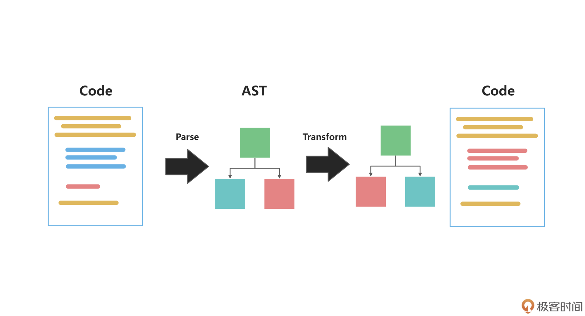
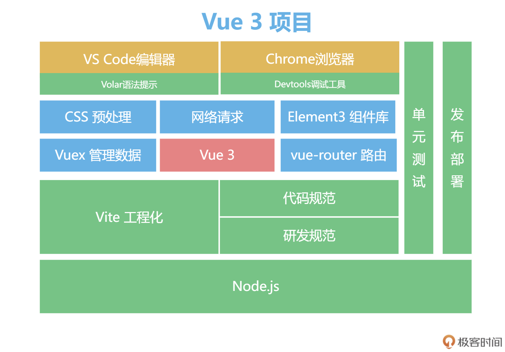

1. 04 | 升级：Vue 2项目如何升级到Vue 3
   1. 应不应该从 Vue 2 升级到 Vue 3
      1. Vue 3 的 Composition API 带来的代码组织方式更利于封装代码，维护起来也不会上下横跳
      2. Vite 则带来了更丝滑的调试体验，一步步跟着专栏完成你的第一个 Vue 3 项目，你会感受到 Vue 3 的魅力
      3. Vue 3 也不是没有问题，由于新的响应式系统用了 Proxy，会存在兼容性问题
         1. Vue 团队也已经放弃 Vue 3 对 IE11 浏览器的支持。
      4. Vue 2.7 会移植 Vue 3 的一些新特性，让你在 Vue 2 的生态中，也能享受 Vue 3 的部分新特性。
      5. 在 Vue 3 发布之前，Vue 2 项目中就可以基于 @vue/composition-api 插件，使用 Composition API 语法，Vue 2 会直接内置这个插件，在 Vue 2 中默认也可以用 Compositon 来组合代码。
      6. Vite 中也正式支持了 Vue 2
      7. 综上所述，我们用下图来回答这一讲开头的问题，要不要使用 Vue 3，还是要“因地制宜”，在不同的场景下，我们选择合适的方式即可。
      8. 
   2. Vue 3 不兼容的那些写法
      1. 首先，我们来看一下 Vue 2 和 Vue 3 在项目在启动上的不同之处
         1. 在 Vue 2 中，我们使用 new Vue() 来新建应用，有一些全局的配置我们会直接挂在 Vue 上
         2. 比如我们通过 Vue.use 来使用插件，通过 Vue.component 来注册全局组件，如下面代码所示：
            ```
            Vue.component('el-counter', {
              data(){
                return {count: 1}
              },
              template: '<button @click="count++">Clicked {{ count }} times.</button>'
            })

            let VueRouter = require('vue-router')
            Vue.use(VueRouter)
            ```
            1. 在上面的代码里，我们注册了一个 el-counter 组件，这个组件是全局可用的，它直接渲染一个按钮，并且在点击按钮的时候，按钮内的数字会累加
            2. 然后我们需要注册路由插件，这也是 Vue 2 中我们使用 vue-router 的方式
            3. 这种形式虽然很直接，但是由于全局的 Vue 只有一个，所以当我们在一个页面的多个应用中独立使用 Vue 就会非常困难。
         3. 看下面这段代码，我们在 Vue 上先注册了一个组件 el-counter，然后创建了两个 Vue 的实例。
            ```
            Vue.component('el-counter',...)

            new Vue({el:'#app1'})
            new Vue({el:'#app2'})
            ```
            1. 这两个实例都自动都拥有了 el-couter 这个组件，但这样做很容易造成混淆
         4. 为了解决这个问题，Vue 3 引入一个新的 API ，createApp，来解决这个问题，也就是新增了 App 的概念
            1. 全局的组件、插件都独立地注册在这个 App 内部，很好的解决了上面提到的两个实例容易造成混淆的问题
            2. 下面的代码是使用 createApp 的简单示例：
                ```
                const { createApp } = Vue
                const app = createApp({})
                app.component(...)
                app.use(...)
                app.mount('#app1')

                const app2 = createApp({})
                app2.mount('#app2')
                ```
            3. createApp 还移除了很多我们常见的写法，比如在 createApp 中，就不再支持 filter、$on、$off、$set、$delete 等 API
      2. 在 Vue 3 中，v-model 的用法也有更改
         1. 在后面讲到组件化，也就是我们需要深度使用 v-model 的时候，我会再细讲
         2. 其实 Vue 3 还有很多小细节的更新，比如 slot 和 slot-scope 两者实现了合并，而 directive 注册指令的 API 等也有变化
   3. Vue 3 生态现状介绍
      1. 在 Vue 生态中，现在所有官方库的工具都全面支持 Vue 3 了，但仍然有一些生态库还处于候选或者刚发布的状态
         1. 所以，升级 Vue 3 的过程中，除了 Vue 3 本身的语法变化，生态也要注意选择
         2. 有一些周边的生态库可能还存在不稳定的情况，开发项目的时候我们时刻关注项目的 GitHub 即可
      2. Vue-cli4 已经提供内置选项，你当然可以选择它支持的 Vue 2。如果你对 Vite 不放心的话，Vue-cli4 也全面支持 Vue 3，这还是很贴心的
      3. vue-router 是复杂项目必不可少的路由库，它也包含一些写法上的变化，比如从 new Router 变成 createRouter
         1. 使用方式上，也全面拥抱 Composition API 风格，提供了 useRouter 和 useRoute 等方法
      4. Vuex 4.0 也支持 Vue 3，不过变化不大
         1. 有趣的是 Vue 官方成员还发布了一个 Pinia，Pinia 的 API 非常接近 Vuex5 的设计
         2. 并且对 Composition API 特别友好，更优雅一些。在课程后续的项目里，我们会使用更成熟的 Vuex4
      5. 其他生态诸如 Nuxt、组件库 Ant-design-vue、Element 等等，都有 Vue 3 的版本发布
   4. 使用自动化升级工具进行 Vue 的升级
      1. 小项目不用多说，从 Vue 2 升级到 Vue 3 之后，对于语法的改变之处，我们挨个替换写法就可以
      2. 对于复杂项目，我们需要借助几个自动化工具来帮我们过渡
         1. 首先是在 Vue 3 的项目里，有一个 @vue/compat 的库
         2. 这是一个 Vue 3 的构建版本，提供了兼容 Vue 2 的行为
         3. 这个版本默认运行在 Vue 2 下，它的大部分 API 和 Vue 2 保持了一致
         4. 当使用那些在 Vue 3 中发生变化或者废弃的特性时，这个版本会提出警告，从而避免兼容性问题的发生，帮助你很好地迁移项目
         5. 并且通过升级的提示信息，@vue/compat 还可以很好地帮助你学习版本之间的差异
      3. 在下面的代码中，首先我们把项目依赖的 Vue 版本换成 Vue 3，并且引入了 @vue/compat 
          ```
          "dependencies": {
          -  "vue": "^2.6.12",
          +  "vue": "^3.2.19",
          +  "@vue/compat": "^3.2.19"
            ...
          },
          "devDependencies": {
          -  "vue-template-compiler": "^2.6.12"
          +  "@vue/compiler-sfc": "^3.2.19"
          }
          ```
      4. 然后给 vue 设置别名 @vue/compat，也就是以 compat 作为入口，代码如下：
          ```
          // vue.config.js
          module.exports = {
            chainWebpack: config => {
              config.resolve.alias.set('vue', '@vue/compat')
              ......
            }
          }
          ```
      5. 这时你就会在控制台看到很多警告，以及很多优化的建议。我们参照建议，挨个去做优化就可以了。
      6. 在 @vue/compat 提供了很多建议后，我们自己还是要慢慢做修改。但从另一个角度看，“偷懒”是优秀程序员的标志，社区就有能够做自动化替换的工具，比较好用的就是“阿里妈妈”出品的 gogocode
      7. 自动化替换工具的原理很简单，和 Vue 的 Compiler 优化的原理是一样的，也就是利用编译原理做代码替换
      8. 如下图所示，我们利用 babel 分析左边 Vue 2 的源码，解析成 AST，然后根据 Vue 3 的写法对 AST 进行转换，最后生成新的 Vue 3 代码
      9. 
      10. 对于替换过程的中间编译成的 AST，你可以理解为用 JavaScript 的对象去描述这段代码，这和虚拟 DOM 的理念有一些相似，我们基于这个对象去做优化，最终映射生成新的 Vue 3 代码。
      11. 关于 AST 的细节，在课程后面的 Vue 3 生态源码篇中，我会带你手写一个迷你版的 Vue 3 Compiler，那时你会对 AST 和它背后的编译原理有一个更深的认识。
2. 05 | 项目启动：搭建Vue 3工程化项目第一步
   1. 环境准备
      1. 对于 Vue 2，官方推荐用 Vue-cli 创建项目；而对于 Vue 3，我建议你使用 Vite 创建项目，因为 vite 能够提供更好更快的调试体验
      2. 在命令行窗口里，我们对 vuejs 目录执行下面的命令，这样就可以创建一个 Vite 的初始化项目。
         1. npm init @vitejs/app
      3. 我们看一下 geek-admin 下面的文件目录，这个目录就是我们项目启动的骨架了
         1. 目录中的 index.html 是项目的入口
         2. package.json 是管理项目依赖和配置的文件
         3. public 目录放置静态资源，比如 logo 等图片
         4. vite.config.js 就是和 Vite 相关所有工程化的配置
         5. src 就是工作的重点，我们大部分的代码都会在 src 目录下管理和书写，后面我们也会在 src 目录下细化项目规范
      4. 在这之后，我们在 geek-admin 文件夹内执行 npm install 命令，来进行依赖的安装
         1. 然后执行 npm run dev 命令来启动项目，看到如下信息就算是启动成功了
      5. 完成了项目的初始化之后，下一步我们会细化 src 目录，搭建源码的骨架架构
         1. 现在，项目的架构是下图所示的这个样子
            1. 
            2. 这样我们的项目就拥有了工程化的雏形
         2. 我们所有工程化体系都是基于 Node.js 生态
         3. 我们使用 VS Code+Volar 编辑器 + 语法提示工具作为上层开发工具
         4. 使用 Vite 作为工程化工具；使用 Chrome 进行调试，这些都是 Vue 3 工程化体系的必备工具
      6. 我们开发的项目是多页面的，所以 vue-router 和 Vuex 也成为了必选项
         1. Vue 负责核心，Vuex 负责管理数据，vue-router 负责管理路由
         2. 我们在 geek-admin 目录中使用下面这段代码安装 Vuex 和 vue-router
         3. npm install vue-router@next vuex@next
      7. 框架搭建完毕后，我们如何在项目的 src 目录下面组织我们的路由和其他代码呢？
         1. 我们需要制定一些基本的规范，最常见的规范就是使用文件夹来做区分
   2. 规范
      1. 我们先对几个文件夹的分层进行规定，便于管理，下面是 src 目录的组织结构。
          ```
          ├── src
          │   ├── api            数据请求
          │   ├── assets         静态资源
          │   ├── components     组件
          │   ├── pages          页面
          │   ├── router         路由配置
          │   ├── store          vuex数据
          │   └── utils          工具函数
          ```
      2. 我们的页面需要引入路由系统，我们进入到 router 文件夹中，新建 index.js，写入下面的代码：
          ```
          import {
            createRouter,
            createWebHashHistory,
          } from 'vue-router'
          import Home from '../pages/home.vue'
          import About from '../pages/about.vue'
          
          const routes = [
            {
              path: '/',
              name: 'Home',
              component: Home
            },
            {
              path: '/about',
              name: 'About',
              component: About
            }
          ]
          
          const router = createRouter({
            history: createWebHashHistory(),
            routes
          })
          
          export default router
          ```
         1. 上面的代码中，我们首先引入了 createRouter 和 createWebHashHistory 两个函数。
            1. createRouter 用来新建路由实例
            2. createWebHashHistory 用来配置我们内部使用 hash 模式的路由，也就是 url 上会通过 # 来区分
         2. 之后在上面的代码里，我们引入两个组件 about 和 home，根据不同的访问地址/ 和/home 去渲染不同的组件，最后返回 router 即可
      3. App.vue 中，我们删掉 template 之前的代码，加入如下内容：
          ```
          <template>
            <div>
              <router-link to="/">首页</router-link> | 
              <router-link to="/about">关于</router-link>
            </div>
            <router-view></router-view>
          </template>
          ```
         1. 代码中的 router-link 和 router-view 就是由 vue-router 注册的全局组件，router-link 负责跳转不同的页面，相当于 Vue 世界中的超链接 a 标签
         2. router-view 负责渲染路由匹配的组件，我们可以通过把 router-view 放在不同的地方，实现复杂项目的页面布局
      4. 当然这样还不够，我们在实际项目开发中还会有各种工具的集成，比如写 CSS 代码时，我们需要预处理工具 stylus 或者 sass；组件库开发中，我们需要 Element3 作为组件库；网络请求后端数据的时候，我们需要 Axios
         1. 对于团队维护的项目，工具集成完毕后，还要有严格的代码规范。我们需要 Eslint 和 Prettier 来规范代码的格式，Eslint 和 Prettier 可以规范项目中 JavaScript 代码的可读性和一致性。
         2. 代码的管理还需要使用 Git，我们默认使用 GitHub 来托管我们的代码。此外，我们还会使用 commitizen 来规范 Git 的日志信息。
         3. 对于我们项目的基础组件，我们还会提供单元测试来确保代码质量和可维护性，最后我们还会配置 GitHub Action 来实现自动化的部署。
      5. 最后这个项目的架构大概是下面这样，这就是一个足以应对复杂项目开发的架构了：
         1. 
      6. 项目雏形搭建完毕后，后面用到哪一块就会把哪一块加上，也就是用一个循序渐进的方式学习。比如我们下一讲完成一个独立功能的时候，才会把 Git 规范加上。至此，项目搭建完毕，在下一讲中，我们开启下一步，也就是页面的主体代码编写。