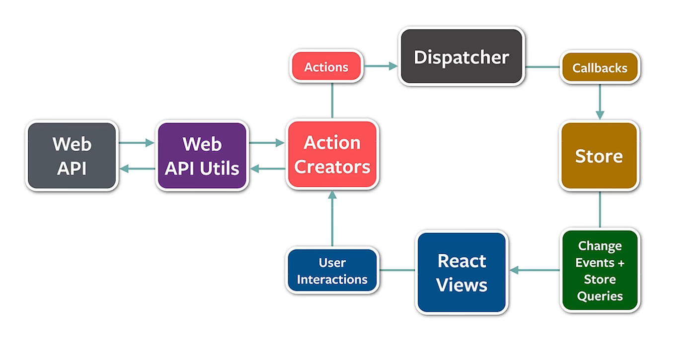

## React基础
1. react出现的历史背景和特性介绍
   1. 始终整体刷新页面，无需关心细节
      1. 一个新概念
         1. 组件
      2. 四个必须api
         1. 
      3. 单向数据流
         1. 
         2. React Views(用户ui) 上发生了操作，会产生一个action，会通过dispatch分发出去，然后由store进行处理，根据action更新自己
         3. 由于view是绑定在store上面的，所以store发生变化view也会进行更新
      4. 完善的错误提示
      5. 