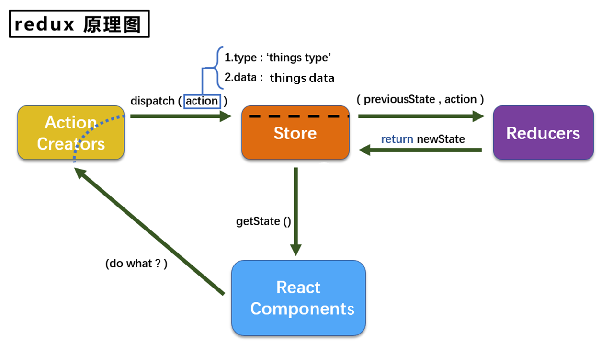

# 第六章React 组件库
1. 流行的开源React UI组件库
   1. material-ui组件库(国外)
   2. ant-design(蚂蚁金服)
      1. import {Button} from 'antd'
      2. import 'antd/dist/antd.css'
         1. 按需引入样式，此时需要对create-app-app默认配置进行修改
            1. 正常情况下需要npm eject，打开webpack的配置在里面进行修改，但是容易改坏
            2. 所以需要按照文档的方式修改
               1. https://3x.ant.design/docs/react/use-with-create-react-app-cn#%E9%AB%98%E7%BA%A7%E9%85%8D%E7%BD%AE
      3. 自定义主题
         1. https://3x.ant.design/docs/react/use-with-create-react-app-cn#%E9%AB%98%E7%BA%A7%E9%85%8D%E7%BD%AE


# 第七章Redux 
1. Redux介绍
   1. 用途
      1. redux是一个专门用于做状态管理的JS库，不是react插件库
      2. 它可以使用在react、vue、angular中，但基本与react使用，vue有vuex
      3. 作用：集中式管理react应用中的多个组件共享状态
   2. 什么情况下使用
      1. 某个组件的状态需要让其他组件可以随时拿到。共享
      2. 一个组件需要改变另一个组件的状态。通信
      3. 能不用就不用，如果不使用比较吃力就用
   3. redux工作流程
      1. 
   4. 三个核心概念
      1. action
         1. 动作的对象(同步)
            1. 包含两个属性
            2. type：标识属性，值为字符串，唯一，必要属性
            3. data：数据属性，值类型任意，可选属性
            4. 例子：{type:'ADD',data:{name:wang}}
         2. 函数(异步)
            1. 
      2. reducer
         1. 用于初始化状态，加工状态
         2. 加工时，根据旧的state和action，产生新的state的纯函数
      3. store
         1. 将state、action、reducer联系在一起的对象
         2. 如何得到此对象
            1. import {createStore} from 'redux'
            2. import reducer from './reducers'
            3. const store = createStore(reducer)
         3. 此对象的功能
            1. getState()：得到state
            2. dispatch(action)：分发action，触发reducer调用，产生新的state
            3. subscribe(listener)：注册监听，当产生了新的state时自动调用
   5. redex核心API 
      1. redux状态更新不会引起页面的更新，只是维护状态。这时需要手动更新，但是不能自己调用render，需要调用setState({})
         1. 即在组件中componentDidMount(){store.subscribe(()=>{this.setState({})})}
         2. 更好的方式是在index.js中直接store.subscribe(ReactDOM.render( <App />,document.getElementById('root'));})
      2. store.getState()  得到store状态
      3. store.dispatch({type:'increment',data:value})  store分发，引起reducer函数调用更新
      4. store.subscribe(()=>{})  只要store状态发生改变，就会调用
   6. 使用redux编写应用
      1. 安装：npm install redux
      2. store.js
          ```
          //安装中间件，npm install redux-thunk，用来通知store不用帮我们分发action中返回的函数，只需要帮助我们执行一下就行了，里面会自动dispatch
          import thunk from 'redux-thunk'

          import {createStore,applyMiddleware} from 'redux'
          import countReducer from './count_reducers.js'
          export default createStore(countReducer,applyMiddleware(thunk))
          ```
      3. count_reducers.js
          ```
          //初始化的时候 初始化一个状态，如果下面接受的第一个参数为undefined，就使用它
          const initState = 0
          //函数接受两个参数，之前的状态preState和动作对象action
          export default function countReducer(preState = initState,action){
            const {type,data} = action
            switch (type){
              //注意：这里是会对return的preState和之前的preState相比较，如果值是相同的，就不会进行页面的更新。
              //问题在于如果preState是一个数组对象之类的，由于他们的值是地址，如果直接操作比如arr.unshift(),
              但是虽然数组进行改变最终地址没有改变,是不会发生页面的更新的
              case 'increament':
                return preState + data
              case 'decreament':
                return preState - data
              default:
                return preState
            }
          }
          ```
      4. count_action.js
          ```
          //函数接受一个参数data
          //同步action返回值为obj
          export const createIncrementAction = data=>({type:'increment',data})
          export const createDecrementAction = data=>({type:'decrement',data})
          //异步action返回值为function
          export const createIncrementAsyncAction = (data,time)=>{
            //这里接到的参数就是store.dispatch，因为这个函数是后面store调用的
            return (dispatch) =>{
              setTimeout(()=>{
                dispatch(createIncrementAction(data))
              },time)
            }
          }
          ```
2. react-redux 
   1. 安装
      1. npm install react-redux
   2. 两个概念
      1. ui组件：不能使用任何redux的api，只负责页面的呈现，交互等
      2. 容器组件：负责和redux通信，将结果交给ui组件
   3. 如何创建一个容器组件--react-redux的connect函数
      1. connect(mapStateToProps,mapDispatchToProps)(ui组件)
      2. mapStateToProps：映射状态，返回值是对象
      3. mapDispatchToProps：映射操作对象的方法，返回值是对象
   4. 容器组件中的store是靠props传进去的，而不是容器组件中直接引入。因为容器组件接收到store，会自动监测redux里面的状态改变
   5. 使用
      ```
      //引入ui组件
      import CountUI from './components/Count'
      //引入connect用于链接上面两
      import {connect} from 'react-redux'
      import {createIncreamentAction} from './redux/count_action.js'
      
      //mapStateToProps函数的返回值对象作为props传递给ui组件,但是这里面的对象只能存储状态，也就是值
      并且这里直接已经把store.getState()的state取到了，作为参数给mapStateToProps函数使用
      const mapStateToProps = state=> ({count:state})

      //mapDispatchToProps函数的返回值对象作为props传递给ui组件，但是这里面的对象只能操作状态的方法，也就是函数
      并且这里直接已经把store.dispatch()的dispatch取到了，作为参数给mapDispatchToProps函数使用
      const mapDispatchToProps = dispatch=>(
        {
          jia:(number)=>{
            //通知redux执行加法
            dispatch(createIncreamentAction(number))
          }
        }
      )
      //创建容器组件
      export default connect(mapStateToProps,mapDispatchToProps)(CountUI)
      简写，即第二个函数写成对象，他会自动把函数的参数传给action，然后自动dispatch这个action
      export default connect(mapStateToProps,{
        jia:createIncreamentAction
      })(CountUI)
      //
      ```
   6. 在app.js中渲染容器组件
      ```
      Count组件就是我们在上面创建的组件
      import store from './redux/store'
      export default class App extends Component  {
        render() {
          return (
            <div >
              //通过属性引入redux的store
              <Count store={store}/>
            </div>
          )
        }
      }
      
      ```
   7. 优化
      1. 不需要在index.js文件中store.subscribe()了，react-redux的容器组件会自动进行检测store改变
      2. 直接在index.js文件中通过redux提供的api传入store，不需要通过组件属性的传递方式传递store
        ```
        import store from './redux/store'
        import {Provider} from 'react-redux'
        ReactDOM.render(
          <Provider store={store}>
            <App />
          </Provider>,
          document.getElementById('root')
        );  
        ```
      3. 整合UI组件和容器组件
         1. CountUI组件直接写到一起,container组件
            ```
            CountUI组件定义
            class CountUI extends Component{}
            export default connect(state=> ({count:state}),{
              jia:createIncreamentAction
            })(CountUI)
            ```
      4. 多个组件使用redux管理状态
         1. store.js中的第一个参数就不能直接传reducer了，必须要传入一个数组
            ```
            import thunk from 'redux-thunk'
            import {createStore,applyMiddleware,combineReducers} from 'redux'
            import countReducer from './count_reducers.js'
            import personReducer from './person_reducers.js'

            const allReducers = combineReducers({
              count : countReducer,
              person : personReducer
            })
            export default createStore(allReducers,applyMiddleware(thunk))


            //之后store.getState()获取的就是数组了
            ```
         2. 这时候容器获取state就需要改变了，因为不再是一个值而变成数组
            ```
            export default connect(state=> ({count:state.count,person:state.person}),{
              jia:createIncreamentAction
            })(CountUI)
            ```