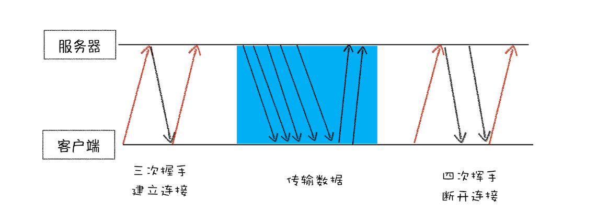
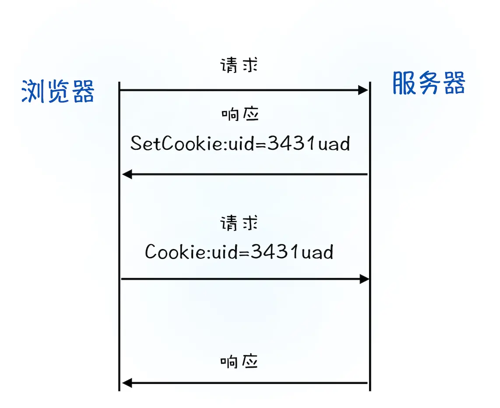

1. 浏览器缓存机制
   1. https://zhuanlan.zhihu.com/p/93357692
   2. https://developer.mozilla.org/zh-CN/docs/Web/HTTP/Caching_FAQ
2. localStorage、sessionStorage 和 Cookie 区别及用法
   1. localStorage: localStorage 的生命周期是永久的，关闭页面或浏览器之后 localStorage 中的数据也不会消失。localStorage 除非主动删除数据，否则数据永远不会消失
   2. sessionStorage: sessionStorage 的生命周期是仅在当前会话下有效。sessionStorage 引入了一个“浏览器窗口”的概念，sessionStorage 是在同源的窗口中始终存在的数据。只要这个浏览器窗口没有关闭，即使刷新页面或者进入同源另一个页面，数据依然存在。但是 sessionStorage 在关闭了浏览器窗口后就会被销毁。同时独立的打开同一个窗口同一个页面，sessionStorage 也是不一样的
   3. cookie: cookie生命期为只在设置的cookie过期时间之前一直有效，即使窗口或浏览器关闭。 存放数据大小为4K左右, 有个数限制（各浏览器不同），一般不能超过20个。缺点是不能储存大数据且不易读取
   
# 浏览器工作原理与实践
## 宏观视角下的浏览器
1. Chrome架构：仅仅打开了1个页面，为什么有4个进程？
   1. Chrome 打开一个页面需要启动多少进程
      1. Chrome 任务管理器也是用来展示运行中 Chrome 使用的进程信息的。
      2. Chrome 启动了 4 个进程：
   2. 概念
      1. 并行处理
         1. 计算机中的并行处理就是同一时刻处理多个任务，使用并行处理能大大提升性能。
      2. 进程和线程 
         1. 多线程可以并行处理任务，但是线程是不能单独存在的，它是由进程来启动和管理的。
         2. 一个进程就是一个程序的运行实例。
            1. 启动一个程序的时候，操作系统会为该程序创建一块内存，用来存放代码、运行中的数据和一个执行任务的主线程，我们把这样的一个运行环境叫进程。
            2. 线程是依附于进程的，而进程中使用多线程并行处理能提升运算效率
         3. 进程和线程之间的关系有以下 4 个特点。
            1. 进程中的任意一线程执行出错，都会导致整个进程的崩溃。
            2. 线程之间共享进程中的数据。
            3. 当一个进程关闭之后，操作系统会回收进程所占用的内存。
               1. 当一个进程退出时，操作系统会回收该进程所申请的所有资源；即使其中任意线程因为操作不当导致内存泄漏，当进程退出时，这些内存也会被正确回收。
               2. 比如之前的 IE 浏览器，支持很多插件，而这些插件很容易导致内存泄漏，这意味着只要浏览器开着，内存占用就有可能会越来越多，但是当关闭浏览器进程时，这些内存就都会被系统回收掉。
            4. 进程之间的内容相互隔离。
      3. 单进程浏览器时代 
         1. 单进程浏览器是指浏览器的所有功能模块都是运行在同一个进程里，这些模块包含了网络、插件、JavaScript 运行环境、渲染引擎和页面等。
         2. 如此多的功能模块运行在一个进程里，是导致单进程浏览器不稳定、不流畅和不安全的一个主要因素
            1. 不稳定
               1. 早期浏览器需要借助于插件来实现诸如 Web 视频、Web 游戏等各种强大的功能，但是插件是最容易出问题的模块，并且还运行在浏览器进程之中，所以一个插件的意外崩溃会引起整个浏览器的崩溃
               2. 除了插件之外，渲染引擎模块也是不稳定的，通常一些复杂的 JavaScript 代码就有可能引起渲染引擎模块的崩溃。和插件一样，渲染引擎的崩溃也会导致整个浏览器的崩溃。
            2. 不流畅
               1. 从上面的“单进程浏览器架构示意图”可以看出，所有页面的渲染模块、JavaScript 执行环境以及插件都是运行在同一个线程中的，这就意味着同一时刻只能有一个模块可以执行
               2. 如果有一个无限循环的脚本，当其执行时，它会独占整个线程，这样导致其他运行在该线程中的模块就没有机会被执行。
               3. 因为浏览器中所有的页面都运行在该线程中，所以这些页面都没有机会去执行任务，这样就会导致整个浏览器失去响应，变卡顿。
               4. 页面的内存泄漏也是单进程变慢的一个重要原因。
                  1. 通常浏览器的内核都是非常复杂的，运行一个复杂点的页面再关闭页面，会存在内存不能完全回收的情况，这样导致的问题是使用时间越长，内存占用越高，浏览器会变得越慢。
            3. 不安全
               1. 这里依然可以从插件和页面脚本两个方面来解释该原因。
               2. 插件可以使用 C/C++ 等代码编写，通过插件可以获取到操作系统的任意资源，当你在页面运行一个插件时也就意味着这个插件能完全操作你的电脑。如果是个恶意插件，那么它就可以释放病毒、窃取你的账号密码，引发安全性问题。
               3. 至于页面脚本，它可以通过浏览器的漏洞来获取系统权限，这些脚本获取系统权限之后也可以对你的电脑做一些恶意的事情，同样也会引发安全问题。
      4. 多进程浏览器时代
         1. 早期多进程架构 
            1. Chrome 的页面是运行在单独的渲染进程中的，同时页面里的插件也是运行在单独的插件进程之中，而进程之间是通过 IPC 机制进行通信（如图中虚线部分）
            2. 解决不稳定
               1. 由于进程是相互隔离的，所以当一个页面或者插件崩溃时，影响到的仅仅是当前的页面进程或者插件进程，并不会影响到浏览器和其他页面，这就完美地解决了页面或者插件的崩溃会导致整个浏览器崩溃，也就是不稳定的问题。
            3. 不流畅的问题
               1. JavaScript 也是运行在渲染进程中的，所以即使 JavaScript 阻塞了渲染进程，影响到的也只是当前的渲染页面，而并不会影响浏览器和其他页面，因为其他页面的脚本是运行在它们自己的渲染进程中的。
               2. 对于内存泄漏的解决方法那就更简单了，因为当关闭一个页面时，整个渲染进程也会被关闭，之后该进程所占用的内存都会被系统回收，这样就轻松解决了浏览器页面的内存泄漏问题。
            4. 安全问题
               1. 采用多进程架构的额外好处是可以使用安全沙箱，你可以把沙箱看成是操作系统给进程上了一把锁，沙箱里面的程序可以运行，但是不能在你的硬盘上写入任何数据，也不能在敏感位置读取任何数据，例如你的文档和桌面。
               2. Chrome 把插件进程和渲染进程锁在沙箱里面，这样即使在渲染进程或者插件进程里面执行了恶意程序，恶意程序也无法突破沙箱去获取系统权限。
         2. 目前多进程架构 
            1. 最新的 Chrome 浏览器包括：1 个浏览器（Browser）主进程、1 个 GPU 进程、1 个网络（NetWork）进程、多个渲染进程和多个插件进程。
            2. 浏览器进程
               1. 主要负责界面显示、用户交互、子进程管理，同时提供存储等功能。
            3. 渲染进程。
               1. 核心任务是将 HTML、CSS 和 JavaScript 转换为用户可以与之交互的网页，排版引擎 Blink 和 JavaScript 引擎 V8 都是运行在该进程中，默认情况下，Chrome 会为每个 Tab 标签创建一个渲染进程。出于安全考虑，渲染进程都是运行在沙箱模式下。
            4. GPU 进程。
               1. 其实，Chrome 刚开始发布的时候是没有 GPU 进程的。而 GPU 的使用初衷是为了实现 3D CSS 的效果，只是随后网页、Chrome 的 UI 界面都选择采用 GPU 来绘制，这使得 GPU 成为浏览器普遍的需求。最后，Chrome 在其多进程架构上也引入了 GPU 进程。
            5. 网络进程。
               1. 主要负责页面的网络资源加载，之前是作为一个模块运行在浏览器进程里面的，直至最近才独立出来，成为一个单独的进程。
            6. 插件进程。
               1. 主要是负责插件的运行，因插件易崩溃，所以需要通过插件进程来隔离，以保证插件进程崩溃不会对浏览器和页面造成影响。
         3. 讲到这里，现在你应该就可以回答文章开头提到的问题了：仅仅打开了 1 个页面，为什么有 4 个进程？因为打开 1 个页面至少需要 1 个网络进程、1 个浏览器进程、1 个 GPU 进程以及 1 个渲染进程，共 4 个；如果打开的页面有运行插件的话，还需要再加上 1 个插件进程。
            1. 虽然多进程模型提升了浏览器的稳定性、流畅性和安全性，但同样不可避免地带来了一些问题：
               1. 更高的资源占用
                  1. 因为每个进程都会包含公共基础结构的副本（如 JavaScript 运行环境），这就意味着浏览器会消耗更多的内存资源。
               2. 更复杂的体系架构。
                  1. 浏览器各模块之间耦合性高、扩展性差等问题，会导致现在的架构已经很难适应新的需求了。
         4. 未来面向服务的架构（Services Oriented Architecture，简称 SOA）
            1. Chrome 整体架构会朝向现代操作系统所采用的“面向服务的架构” 方向发展
            2. 原来的各种模块会被重构成独立的服务（Service），每个服务（Service）都可以在独立的进程中运行，访问服务（Service）必须使用定义好的接口，通过 IPC 来通信
            3. 从而构建一个更内聚、松耦合、易于维护和扩展的系统，更好实现 Chrome 简单、稳定、高速、安全的目标。
            4. Chrome 最终要把 UI、数据库、文件、设备、网络等模块重构为基础服务，类似操作系统底层服务
            5. 如果你认为 Chrome 是“便携式操作系统”，那么 Chrome 基础服务便可以被视为该操作系统的“基础”系统服务层。
            6. 同时 Chrome 还提供灵活的弹性架构，在强大性能设备上会以多进程的方式运行基础服务，但是如果在资源受限的设备上（如下图），Chrome 会将很多服务整合到一个进程中，从而节省内存占用。
      5. 总体说来，Chrome 是以一个非常快速的速度在进化，越来越多的业务和应用都逐渐转至浏览器来开发，身为开发人员，我们不能坐视不管，而应该紧跟其步伐，收获这波技术红利。
2. TCP协议：如何保证页面文件能被完整送达浏览器？
   1. 序言
      1. 在衡量 Web 页面性能的时候有一个重要的指标叫“FP（First Paint）”，是指从页面加载到首次开始绘制的时长，这个指标直接影响了用户的跳出率，更快的页面响应意味着更多的 PV、更高的参与度，以及更高的转化率。那什么影响 FP 指标呢？其中一个重要的因素是网络加载速度。
      2. 不管你是使用 HTTP，还是使用 WebSocket，它们都是基于 TCP/IP 的。在这篇文章中，我会给你重点介绍在 Web 世界中的 TCP/IP 是如何工作的。
      3. 在网络中，一个文件通常会被拆分为很多数据包来进行传输，而数据包在传输过程中又有很大概率丢失或者出错。那么如何保证页面文件能被完整地送达浏览器呢？
         1. 互联网中的数据是通过数据包来传输的。
         2. 如果发送的数据很大，那么该数据就会被拆分为很多小数据包来传输。
         3. 比如你现在听的音频数据，是拆分成一个个小的数据包来传输的，并不是一个大的文件一次传输过来的。
      4. 下面我将分别从“数据包如何送达主机”“主机如何将数据包转交给应用”和“数据是如何被完整地送达应用程序”这三个角度来为你讲述数据的传输过程
   2. IP：把数据包送达目的主机
      1. 数据包要在互联网上进行传输，就要符合网际协议（Internet Protocol，简称 IP）标准。
         1. 计算机的地址就称为 IP 地址，访问任何网站实际上只是你的计算机向另外一台计算机请求信息。
         2. 如果要想把一个数据包从主机 A 发送给主机 B，那么在传输之前，数据包上会被附加上主机 B 的 IP 地址信息，这样在传输过程中才能正确寻址。
         3. 额外地，数据包上还会附加上主机 A 本身的 IP 地址，有了这些信息主机 B 才可以回复信息给主机 A。
         4. 这些附加的信息会被装进一个叫 IP 头的数据结构里。IP 头是 IP 数据包开头的信息，包含 IP 版本、源 IP 地址、目标 IP 地址、生存时间等信息。
      2. 为了方便理解，我先把网络简单分为三层结构 
         1. 下面我们一起来看下一个数据包从主机 A 到主机 B 的旅程：
         2. 上层将含有“极客时间”的数据包交给网络层
         3. 网络层再将 IP 头附加到数据包上，组成新的 IP 数据包，并交给底层
         4. 底层通过物理网络将数据包传输给主机 B
         5. 数据包被传输到主机 B 的网络层，在这里主机 B 拆开数据包的 IP 头信息，并将拆开来的数据部分交给上层
         6. 最终，含有“极客时间”信息的数据包就到达了主机 B 的上层了
   3. UDP：把数据包送达应用程序
      1. IP 是非常底层的协议，只负责把数据包传送到对方电脑，但是对方电脑并不知道把数据包交给哪个程序，是交给浏览器还是交给王者荣耀？因此，需要基于 IP 之上开发能和应用打交道的协议，最常见的是“用户数据包协议（User Datagram Protocol）”，简称 UDP。
         1. UDP 中一个最重要的信息是端口号，端口号其实就是一个数字，每个想访问网络的程序都需要绑定一个端口号。
         2. 通过端口号 UDP 就能把指定的数据包发送给指定的程序了，所以 IP 通过 IP 地址信息把数据包发送给指定的电脑，而 UDP 通过端口号把数据包分发给正确的程序。
         3. 和 IP 头一样，端口号会被装进 UDP 头里面，UDP 头再和原始数据包合并组成新的 UDP 数据包。UDP 头中除了目的端口，还有源端口号等信息。
      2. 为了支持 UDP 协议，我把前面的三层结构扩充为四层结构 
         1. 下面我们一起来看下一个数据包从主机 A 旅行到主机 B 的路线
         2. 上层将含有“极客时间”的数据包交给传输层
         3. 传输层会在数据包前面附加上 UDP 头，组成新的 UDP 数据包，再将新的 UDP 数据包交给网络层
         4. 网络层再将 IP 头附加到数据包上，组成新的 IP 数据包，并交给底层
         5. 数据包被传输到主机 B 的网络层，在这里主机 B 拆开 IP 头信息，并将拆开来的数据部分交给传输层
         6. 在传输层，数据包中的 UDP 头会被拆开，并根据 UDP 中所提供的端口号，把数据部分交给上层的应用程序
         7. 最终，含有“极客时间”信息的数据包就旅行到了主机 B 上层应用程序这里
      3. 在使用 UDP 发送数据时，有各种因素会导致数据包出错，虽然 UDP 可以校验数据是否正确，但是对于错误的数据包，UDP 并不提供重发机制，只是丢弃当前的包，而且 UDP 在发送之后也无法知道是否能达到目的地。
      4. 虽说 UDP 不能保证数据可靠性，但是传输速度却非常快，所以 UDP 会应用在一些关注速度、但不那么严格要求数据完整性的领域，如在线视频、互动游戏等。
   4. TCP：把数据完整地送达应用程序 
      1. 对于浏览器请求，或者邮件这类要求数据传输可靠性（reliability）的应用，如果使用 UDP 来传输会存在两个问题：
         1. 数据包在传输过程中容易丢失
         2. 大文件会被拆分成很多小的数据包来传输，这些小的数据包会经过不同的路由，并在不同的时间到达接收端，而 UDP 协议并不知道如何组装这些数据包，从而把这些数据包还原成完整的文件
      2. TCP（Transmission Control Protocol，传输控制协议）是一种面向连接的、可靠的、基于字节流的传输层通信协议。相对于 UDP，TCP 有下面两个特点:
         1. 对于数据包丢失的情况，TCP 提供重传机制
         2. TCP 引入了数据包排序机制，用来保证把乱序的数据包组合成一个完整的文件
      3. 和 UDP 头一样，TCP 头除了包含了目标端口和本机端口号外，还提供了用于排序的序列号，以便接收端通过序号来重排数据包
         1. TCP 单个数据包的传输流程和 UDP 流程差不多，不同的地方在于，通过 TCP 头的信息保证了一块大的数据传输的完整性。
      4. 下面我们再看下完整的 TCP 连接过程，通过这个过程你可以明白 TCP 是如何保证重传机制和数据包的排序功能的。
         1. 图  可以看出，一个完整的 TCP 连接的生命周期包括了“建立连接”“传输数据”和“断开连接”三个阶段。
         2. 建立连接阶段
            1. 这个阶段是通过“三次握手”来建立客户端和服务器之间的连接。
            2. TCP 提供面向连接的通信传输。面向连接是指在数据通信开始之前先做好两端之间的准备工作。
            3. 所谓三次握手，是指在建立一个 TCP 连接时，客户端和服务器总共要发送三个数据包以确认连接的建立。
         3. 传输数据阶段
            1. 在该阶段，接收端需要对每个数据包进行确认操作，也就是接收端在接收到数据包之后，需要发送确认数据包给发送端。
            2. 所以当发送端发送了一个数据包之后，在规定时间内没有接收到接收端反馈的确认消息，则判断为数据包丢失，并触发发送端的重发机制。
            3. 同样，一个大的文件在传输过程中会被拆分成很多小的数据包，这些数据包到达接收端后，接收端会按照 TCP 头中的序号为其排序，从而保证组成完整的数据。
         4. 断开连接阶段
            1. 数据传输完毕之后，就要终止连接了，涉及到最后一个阶段“四次挥手”来保证双方都能断开连接。
            2. 到这里你应该就明白了，TCP 为了保证数据传输的可靠性，牺牲了数据包的传输速度，因为“三次握手”和“数据包校验机制”等把传输过程中的数据包的数量提高了一倍。
3. HTTP请求流程：为什么很多站点第二次打开速度会很快？
   1. 序言
      1. HTTP 协议，正是建立在 TCP 连接基础之上的。
      2. HTTP 是一种允许浏览器向服务器获取资源的协议，是 Web 的基础，通常由浏览器发起请求，用来获取不同类型的文件。此外，HTTP 也是浏览器使用最广的协议，所以要想学好浏览器，就要先深入了解 HTTP。
         1. 为什么通常在第一次访问一个站点时，打开速度很慢，当再次访问这个站点时，速度就很快了？
         2. 当登录过一个网站之后，下次再访问该站点，就已经处于登录状态了，这是怎么做到的呢？
         3. 这一切的秘密都隐藏在 HTTP 的请求过程中
   2. 浏览器端发起 HTTP 请求流程
      1. 如果你在浏览器地址栏里键入网站的地址，那么接下来，浏览器会完成哪些动作呢？下面我们就一步一步详细“追踪”下。
      2. 构建请求
         1. 首先，浏览器构建请求行信息（如下所示），构建好后，浏览器准备发起网络请求。
         2. GET /index.html HTTP1.1
      3. 查找缓存
         1. 在真正发起网络请求之前，浏览器会先在浏览器缓存中查询是否有要请求的文件。其中，浏览器缓存是一种在本地保存资源副本，以供下次请求时直接使用的技术。
         2. 当浏览器发现请求的资源已经在浏览器缓存中存有副本，它会拦截请求，返回该资源的副本，并直接结束请求，而不会再去源服务器重新下载。这样做的好处有：
            1. 缓解服务器端压力，提升性能（获取资源的耗时更短了）
            2. 对于网站来说，缓存是实现快速资源加载的重要组成部分
         3. 如果缓存查找失败，就会进入网络请求过程了。
      4. 准备 IP 地址和端口
         1. 在了解网络请求之前，我们需要先看看 HTTP 和 TCP 的关系 
            1. 浏览器使用 HTTP 协议作为应用层协议，用来封装请求的文本信息；并使用 TCP/IP 作传输层协议将它发到网络上
            2. 所以在 HTTP 工作开始之前，浏览器需要通过 TCP 与服务器建立连接。也就是说 HTTP 的内容是通过 TCP 的传输数据阶段来实现的
            3. 那接下来你可以思考这么“一连串”问题：
               1. HTTP 网络请求的第一步是做什么呢？结合上图看，是和服务器建立 TCP 连接。
               2. 那建立连接的信息都有了吗？上一篇文章中，我们讲到建立 TCP 连接的第一步就是需要准备 IP 地址和端口号。
               3. 那怎么获取 IP 地址和端口号呢？这得看看我们现在有什么，我们有一个 URL 地址，那么是否可以利用 URL 地址来获取 IP 和端口信息呢？
         2. 在上一篇文章中，我们介绍过数据包都是通过 IP 地址传输给接收方的。由于 IP 地址是数字标识，比如极客时间网站的 IP 是 39.106.233.176, 难以记忆，但使用极客时间的域名（time.geekbang.org）就好记多了，所以基于这个需求又出现了一个服务，负责把域名和 IP 地址做一一映射关系。这套域名映射为 IP 的系统就叫做“域名系统”，简称 DNS（Domain Name System）。
            1. 第一步浏览器会请求 DNS 返回域名对应的 IP。当然浏览器还提供了 DNS 数据缓存服务，
            2. 拿到 IP 之后，接下来就需要获取端口号了。通常情况下，如果 URL 没有特别指明端口号，那么 HTTP 协议默认是 80 端口
      5. 等待 TCP 队列
         1. 现在已经把端口和 IP 地址都准备好了，那么下一步是不是可以建立 TCP 连接了呢？
            1. 答案依然是“不行”。Chrome 有个机制，同一个域名同时最多只能建立 6 个 TCP 连接，如果在同一个域名下同时有 10 个请求发生，那么其中 4 个请求会进入排队等待状态，直至进行中的请求完成。
            2. 当然，如果当前请求数量少于 6，会直接进入下一步，建立 TCP 连接。
      6. 建立 TCP 连接
         1. 排队等待结束之后，终于可以快乐地和服务器握手了，在 HTTP 工作开始之前，浏览器通过 TCP 与服务器建立连接。
      7. 发送 HTTP 请求 
         1. 一旦建立了 TCP 连接，浏览器就可以和服务器进行通信了。而 HTTP 中的数据正是在这个通信过程中传输的。
         2. 首先浏览器会向服务器发送请求行，它包括了请求方法、请求 URI（Uniform Resource Identifier）和 HTTP 版本协议。
            1. 发送请求行，就是告诉服务器浏览器需要什么资源，最常用的请求方法是 Get。比如，直接在浏览器地址栏键入极客时间的域名（time.geekbang.org），这就是告诉服务器要 Get 它的首页资源。
            2. 另外一个常用的请求方法是 POST，它用于发送一些数据给服务器，比如登录一个网站，就需要通过 POST 方法把用户信息发送给服务器。如果使用 POST 方法，那么浏览器还要准备数据给服务器，这里准备的数据是通过请求体来发送
            3. 在浏览器发送请求行命令之后，还要以请求头形式发送其他一些信息，把浏览器的一些基础信息告诉服务器。比如包含了浏览器所使用的操作系统、浏览器内核等信息，以及当前请求的域名信息、浏览器端的 Cookie 信息，等等。
   3. 服务器端处理 HTTP 请求流程
      1. 返回请求
         1. 一旦服务器处理结束，便可以返回数据给浏览器了。返回的结果如下图所示
            1. 首先服务器会返回响应行，包括协议版本和状态码。 
            2. 并不是所有的请求都可以被服务器处理的，那么一些无法处理或者处理出错的信息，怎么办呢？服务器会通过请求行的状态码来告诉浏览器它的处理结果
            3. 正如浏览器会随同请求发送请求头一样，服务器也会随同响应向浏览器发送响应头。响应头包含了服务器自身的一些信息，比如服务器生成返回数据的时间、返回的数据类型（JSON、HTML、流媒体等类型），以及服务器要在客户端保存的 Cookie 等信息
            4. 发送完响应头后，服务器就可以继续发送响应体的数据，通常，响应体就包含了 HTML 的实际内容。
      2. 断开连接
         1. 一旦服务器向客户端返回了请求数据，它就要关闭 TCP 连接。不过如果浏览器或者服务器在其头信息中加入了：Connection:Keep-Alive 那么 TCP 连接在发送后将仍然保持打开状态，这样浏览器就可以继续通过同一个 TCP 连接发送请求。
            1. 保持 TCP 连接可以省去下次请求时需要建立连接的时间，提升资源加载速度。
      3. 重定向
         1. 还有一种情况你需要了解下，比如当你在浏览器中打开 geekbang.org 后，你会发现最终打开的页面地址是 https://www.geekbang.org。
            1. 这两个 URL 之所以不一样，是因为涉及到了一个重定向操作。
            2. 
            3. 从图中你可以看到，响应行返回的状态码是 301，状态 301 就是告诉浏览器，我需要重定向到另外一个网址，而需要重定向的网址正是包含在响应头的 Location 字段中，接下来，浏览器获取 Location 字段中的地址，并使用该地址重新导航，这就是一个完整重定向的执行流程。
   4. 问题解答
      1. 为什么很多站点第二次打开速度会很快？
         1. 如果第二次页面打开很快，主要原因是第一次加载页面过程中，缓存了一些耗时的数据。
         2. DNS 缓存和页面资源缓存这两块数据是会被浏览器缓存的。DNS 缓存比较简单，重点看下浏览器资源缓存
            1. 缓存处理的过程：  
            2. 服务器是通过什么方式让浏览器缓存数据
               1. 从上图的第一次请求可以看出，当服务器返回 HTTP 响应头给浏览器时，浏览器是通过响应头中的 Cache-Control 字段来设置是否缓存该资源。
               2. 通常，我们还需要为这个资源设置一个缓存过期时长，而这个时长是通过 Cache-Control 中的 Max-age 参数来设置的，比如上图设置的缓存过期时间是 2000 秒。Cache-Control:Max-age=2000
               3. 这也就意味着，在该缓存资源还未过期的情况下, 如果再次请求该资源，会直接返回缓存中的资源给浏览器。
            3. 如果缓存过期了，浏览器则会继续发起网络请求，并且在 HTTP 请求头中带上 If-None-Match:"4f80f-13c-3a1xb12a"
               1. 服务器收到请求头后，会根据 If-None-Match 的值来判断请求的资源是否有更新。
                  1. 如果没有更新，就返回 304 状态码，相当于服务器告诉浏览器：“这个缓存可以继续使用，这次就不重复发送数据给你了。”
                  2. 如果资源有更新，服务器就直接返回最新资源给浏览器。
               2. https://developer.mozilla.org/zh-CN/docs/Web/HTTP/Caching_FAQ
         3. 简要来说，很多网站第二次访问能够秒开，是因为这些网站把很多资源都缓存在了本地，浏览器缓存直接使用本地副本来回应请求，而不会产生真实的网络请求，从而节省了时间。同时，DNS 数据也被浏览器缓存了，这又省去了 DNS 查询环节。
      2. 登录状态是如何保持的？
         1. 用户打开登录页面，在登录框里填入用户名和密码，点击确定按钮。点击按钮会触发页面脚本生成用户登录信息，然后调用 POST 方法提交用户登录信息给服务器
            1. 服务器接收到浏览器提交的信息之后，查询后台，验证用户登录信息是否正确，如果正确的话，会生成一段表示用户身份的字符串，并把该字符串写到响应头的 Set-Cookie 字段里，如下所示，然后把响应头发送给浏览器。
               1. Set-Cookie: UID=3431uad;
            2. 浏览器在接收到服务器的响应头后，开始解析响应头，如果遇到响应头里含有 Set-Cookie 字段的情况，浏览器就会把这个字段信息保存到本地。比如把UID=3431uad保持到本地。
            3. 当用户再次访问时，浏览器会发起 HTTP 请求，但在发起请求之前，浏览器会读取之前保存的 Cookie 数据，并把数据写进请求头里的 Cookie 字段里（如下所示），然后浏览器再将请求头发送给服务器。
               1. Cookie: UID=3431uad;
            4. 服务器在收到 HTTP 请求头数据之后，就会查找请求头里面的“Cookie”字段信息，当查找到包含UID=3431uad的信息时，服务器查询后台，并判断该用户是已登录状态，然后生成含有该用户信息的页面数据，并把生成的数据发送给浏览器。
            5. 浏览器在接收到该含有当前用户的页面数据后，就可以正确展示用户登录的状态信息了。
         2. 好了，通过这个流程你可以知道浏览器页面状态是通过使用 Cookie 来实现的。Cookie 流程可以参考下图：
            1. 
         3. 简单地说，如果服务器端发送的响应头内有 Set-Cookie 的字段，那么浏览器就会将该字段的内容保持到本地。当下次客户端再往该服务器发送请求时，客户端会自动在请求头中加入 Cookie 值后再发送出去。服务器端发现客户端发送过来的 Cookie 后，会去检查究竟是从哪一个客户端发来的连接请求，然后对比服务器上的记录，最后得到该用户的状态信息。
   5. 总结
      1. 
         1. 从图中可以看到，浏览器中的 HTTP 请求从发起到结束一共经历了如下八个阶段：构建请求、查找缓存、准备 IP 和端口、等待 TCP 队列、建立 TCP 连接、发起 HTTP 请求、服务器处理请求、服务器返回请求和断开连接
         2. 然后我还通过 HTTP 请求路径解答了两个经常会碰到的问题，一个涉及到了 Cache 流程，另外一个涉及到如何使用 Cookie 来进行状态管理。