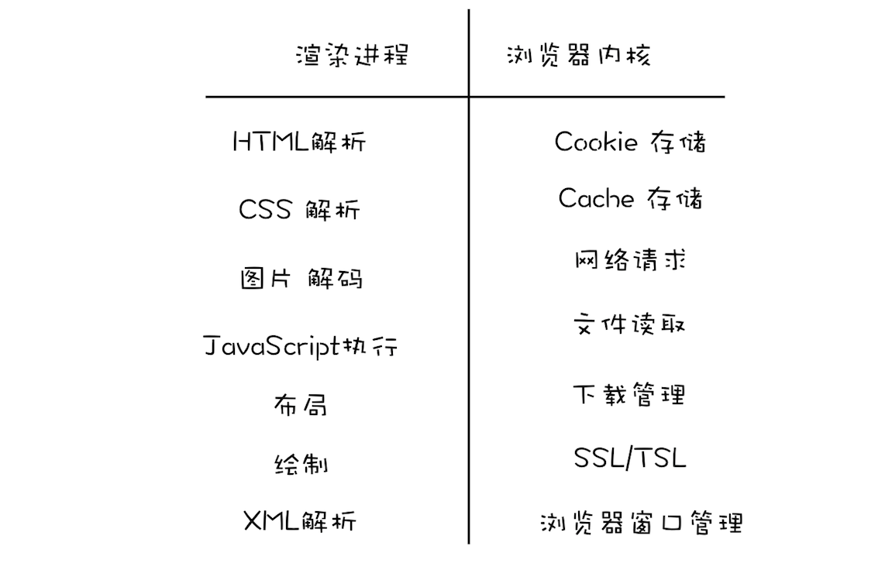

## 浏览器安全
1. 安全沙箱：页面和系统之间的隔离墙
   1. 序言
      1. 在《01 | Chrome 架构：仅仅打开了 1 个页面，为什么有 4 个进程？》那篇文章中，我们分析了浏览器架构的发展史
      2. 在最开始的阶段，浏览器是单进程的，这意味着渲染过程、JavaScript 执行过程、网络加载过程、UI 绘制过程和页面显示过程等都是在同一个进程中执行的，这种结构虽然简单，但是也带来了很多问题
      3. 从稳定性视角来看，单进程架构的浏览器是不稳定的
         1. 因为只要浏览器进程中的任意一个功能出现异常都有可能影响到整个浏览器，如页面卡死、浏览器崩溃等
         2. 不过浏览器的稳定性并不是本文讨论的重点，我们今天主要聊的是浏览器架构是如何影响到操作系统安全的
      4. 浏览器本身的漏洞是单进程浏览器的一个主要问题
         1. 如果浏览器被曝出存在漏洞，那么在这些漏洞没有被及时修复的情况下，黑客就有可能通过恶意的页面向浏览器中注入恶意程序
         2. 其中最常见的攻击方式是利用缓冲区溢出，不过需要注意这种类型的攻击和 XSS 注入的脚本是不一样的
            1. XSS 攻击只是将恶意的 JavaScript 脚本注入到页面中，虽然能窃取一些 Cookie 相关的数据，但是 XSS 无法对操作系统进行攻击。
            2. 而通过浏览器漏洞进行的攻击是可以入侵到浏览器进程内部的，可以读取和修改浏览器进程内部的任意内容，还可以穿透浏览器，在用户的操作系统上悄悄地安装恶意软件、监听用户键盘输入信息以及读取用户硬盘上的文件内容
         3. 和 XSS 攻击页面相比，这类攻击无疑是枚“核弹”，它会将整个操作系统的内容都暴露给黑客，这样我们操作系统上所有的资料都是不安全的了
   2. 安全视角下的多进程架构
      1. 现代浏览器的设计目标是安全、快速和稳定，而这种核弹级杀伤力的安全问题就是一个很大的潜在威胁
      2. 因此在设计现代浏览器的体系架构时，需要解决这个问题
      3. 我们知道现代浏览器采用了多进程架构，将渲染进程和浏览器主进程做了分离，下面我们重点从操作系统安全的视角来看看浏览器的多进程架构，如下图：
         1. 
         2. 观察上图，我们知道浏览器被划分为浏览器内核和渲染内核两个核心模块
            1. 其中浏览器内核是由网络进程、浏览器主进程和 GPU 进程组成的
            2. 渲染内核就是渲染进程
            3. 那如果我们在浏览器中打开一个页面，这两个模块是怎么配合的呢？
         3. 所有的网络资源都是通过浏览器内核来下载的
            1. 下载后的资源会通过 IPC 将其提交给渲染进程（浏览器内核和渲染进程之间都是通过 IPC 来通信的）
            2. 然后渲染进程会对这些资源进行解析、绘制等操作，最终生成一幅图片
            3. 但是渲染进程并不负责将图片显示到界面上，而是将最终生成的图片提交给浏览器内核模块，由浏览器内核模块负责显示这张图片
         4. 设计现代浏览器体系架构时，将浏览器划分为不同的进程是为了增加其稳定性
            1. 虽然设计成了多进程架构，不过这些模块之间的沟通方式却有些复杂
            2. 也许你还有以下问题：
               1. 为什么一定要通过浏览器内核去请求资源，再将数据转发给渲染进程，而不直接从进程内部去请求网络资源？
               2. 为什么渲染进程只负责生成页面图片，生成图片还要经过 IPC 通知浏览器内核模块，然后让浏览器内核去负责展示图片？
            3. 通过以上方式不是增加了工程的复杂度吗？
         5. 要解释现代浏览器为什么要把这个流程弄得这么复杂，我们就得从系统安全的角度来分析。
   3. 安全沙箱
      1. 上面我们分析过了，由于渲染进程需要执行 DOM 解析、CSS 解析、网络图片解码等操作
         1. 如果渲染进程中存在系统级别的漏洞，那么以上操作就有可能让恶意的站点获取到渲染进程的控制权限
         2. 进而又获取操作系统的控制权限，这对于用户来说是非常危险的
      2. 因为网络资源的内容存在着各种可能性，所以浏览器会默认所有的网络资源都是不可信的，都是不安全的
         1. 但谁也不能保证浏览器不存在漏洞，只要出现漏洞，黑客就可以通过网络内容对用户发起攻击。
         2. 我们知道，如果你下载了一个恶意程序，但是没有执行它，那么恶意程序是不会生效的
         3. 同理，浏览器之于网络内容也是如此，浏览器可以安全地下载各种网络资源
         4. 但是如果要执行这些网络资源，比如解析 HTML、解析 CSS、执行 JavaScript、图片编解码等操作，就需要非常谨慎了，因为一不小心，黑客就会利用这些操作对含有漏洞的浏览器发起攻击
      3. 基于以上原因，我们需要在渲染进程和操作系统之间建一道墙
         1. 即便渲染进程由于存在漏洞被黑客攻击，但由于这道墙，黑客就获取不到渲染进程之外的任何操作权限
         2. 将渲染进程和操作系统隔离的这道墙就是我们要聊的安全沙箱。
      4. 浏览器中的安全沙箱是利用操作系统提供的安全技术，让渲染进程在执行过程中无法访问或者修改操作系统中的数据
         1. 在渲染进程需要访问系统资源的时候，需要通过浏览器内核来实现，然后将访问的结果通过 IPC 转发给渲染进程
      5. 安全沙箱最小的保护单位是进程
         1. 因为单进程浏览器需要频繁访问或者修改操作系统的数据，所以单进程浏览器是无法被安全沙箱保护的
         2. 而现代浏览器采用的多进程架构使得安全沙箱可以发挥作用。
   4. 安全沙箱如何影响各个模块功能
      1. 我们知道安全沙箱最小的保护单位是进程，并且能限制进程对操作系统资源的访问和修改
         1. 这就意味着如果要让安全沙箱应用在某个进程上，那么这个进程必须没有读写操作系统的功能，比如读写本地文件、发起网络请求、调用 GPU 接口等
         2. 了解了被安全沙箱保护的进程会有一系列的受限操作之后，接下来我们就可以分析渲染进程和浏览器内核各自都有哪些职责
         3. 如下图：
         4. 通过该图，我们可以看到由于渲染进程需要安全沙箱的保护，因此需要把在渲染进程内部涉及到和系统交互的功能都转移到浏览器内核中去实现
         5. 那安全沙箱是如何影响到各个模块功能的呢？
      2. 持久存储
         1. 我们先来看看安全沙箱是如何影响到浏览器持久存储的
            1. 由于安全沙箱需要负责确保渲染进程无法直接访问用户的文件系统，但是在渲染进程内部有访问 Cookie 的需求、有上传文件的需求
            2. 为了解决这些文件的访问需求，所以现代浏览器将读写文件的操作全部放在了浏览器内核中实现
            3. 然后通过 IPC 将操作结果转发给渲染进程
         2. 具体地讲，如下文件内容的读写都是在浏览器内核中完成的：
            1. 存储 Cookie 数据的读写。通常浏览器内核会维护一个存放所有 Cookie 的 Cookie 数据库，然后当渲染进程通过 JavaScript 来读取 Cookie 时，渲染进程会通过 IPC 将读取 Cookie 的信息发送给浏览器内核，浏览器内核读取 Cookie 之后再将内容返回给渲染进程。
            2. 一些缓存文件的读写也是由浏览器内核实现的，比如网络文件缓存的读取。
      3. 网络访问
         1. 同样有了安全沙箱的保护，在渲染进程内部也是不能直接访问网络的，如果要访问网络，则需要通过浏览器内核
         2. 不过浏览器内核在处理 URL 请求之前，会检查渲染进程是否有权限请求该 URL
         3. 比如检查 XMLHttpRequest 或者 Fetch 是否是跨站点请求，或者检测 HTTPS 的站点中是否包含了 HTTP 的请求
      4. 用户交互
         1. 渲染进程实现了安全沙箱，还影响到了一个非常重要的用户交互功能。
         2. 通常情况下，如果你要实现一个 UI 程序，操作系统会提供一个界面给你，该界面允许应用程序与用户交互
            1. 允许应用程序在该界面上进行绘制，比如 Windows 提供的是 HWND，Linux 提供的 X Window
            2. 我们就把 HWND 和 X Window 统称为窗口句柄。应用程序可以在窗口句柄上进行绘制和接收键盘鼠标消息
         3. 不过在现代浏览器中，由于每个渲染进程都有安全沙箱的保护，所以在渲染进程内部是无法直接操作窗口句柄的
            1. 这也是为了限制渲染进程监控到用户的输入事件
            2. 由于渲染进程不能直接访问窗口句柄，所以渲染进程需要完成以下两点大的改变
               1. 第一点，渲染进程需要渲染出位图
                  1. 为了向用户显示渲染进程渲染出来的位图，渲染进程需要将生成好的位图发送到浏览器内核，然后浏览器内核将位图复制到屏幕上
               2. 第二点，操作系统没有将用户输入事件直接传递给渲染进程，而是将这些事件传递给浏览器内核
                  1. 后浏览器内核再根据当前浏览器界面的状态来判断如何调度这些事件，如果当前焦点位于浏览器地址栏中，则输入事件会在浏览器内核内部处理
                  2. 如果当前焦点在页面的区域内，则浏览器内核会将输入事件转发给渲染进程。
            3. 之所以这样设计，就是为了限制渲染进程有监控到用户输入事件的能力，所以所有的键盘鼠标事件都是由浏览器内核来接收的
               1. 然后浏览器内核再通过 IPC 将这些事件发送给渲染进程
      5. 上面我们分析了由于渲染进程引入了安全沙箱，所以浏览器的持久存储、网络访问和用户交互等功能都不能在渲染进程内直接使用了，因此我们需要把这些功能迁移到浏览器内核中去实现，这让原本比较简单的流程变得复杂了
   5. 站点隔离（Site Isolation）
      1. 所谓站点隔离是指 Chrome 将同一站点（包含了相同根域名和相同协议的地址）中相互关联的页面放到同一个渲染进程中执行
         1. 最开始 Chrome 划分渲染进程是以标签页为单位，也就是说整个标签页会被划分给某个渲染进程
         2. 但是，按照标签页划分渲染进程存在一些问题，原因就是一个标签页中可能包含了多个 iframe，而这些 iframe 又有可能来自于不同的站点
         3. 这就导致了多个不同站点中的内容通过 iframe 同时运行在同一个渲染进程中。
      2. 目前所有操作系统都面临着两个 A 级漏洞——幽灵（Spectre）和熔毁（Meltdown）
         1. 这两个漏洞是由处理器架构导致的，很难修补，黑客通过这两个漏洞可以直接入侵到进程的内部
         2. 如果入侵的进程没有安全沙箱的保护，那么黑客还可以发起对操作系统的攻击
      3. 所以如果一个银行站点包含了一个恶意 iframe，然后这个恶意的 iframe 利用这两个 A 级漏洞去入侵渲染进程
         1. 那么恶意程序就能读取银行站点渲染进程内的所有内容了，这对于用户来说就存在很大的风险了
         2. 因此 Chrome 几年前就开始重构代码，将标签级的渲染进程重构为 iframe 级的渲染进程
         3. 然后严格按照同一站点的策略来分配渲染进程，这就是 Chrome 中的站点隔离
         4. 实现了站点隔离，就可以将恶意的 iframe 隔离在恶意进程内部，使得它无法继续访问其他 iframe 进程的内容，因此也就无法攻击其他站点了
2. HTTPS：让数据传输更安全
   1. 序言
      1. 浏览器安全主要划分为三大块内容：页面安全、系统安全和网络安全
         1. 面我们用四篇文章介绍了页面安全和系统安全，也聊了浏览器和 Web 开发者是如何应对各种类型的攻击
         2. 本文是我们专栏的最后一篇，我们就接着来聊聊网络安全协议 HTTPS。
      2. 我们先从 HTTP 的明文传输的特性讲起
         1. 在上一个模块的三篇文章中我们分析过，起初设计 HTTP 协议的目的很单纯，就是为了传输超文本文件
         2. 那时候也没有太强的加密传输的数据需求，所以 HTTP 一直保持着明文传输数据的特征
         3. 但这样的话，在传输过程中的每一个环节，数据都有可能被窃取或者篡改
         4. 这也意味着你和服务器之间还可能有个中间人，你们在通信过程中的一切内容都在中间人的掌握中，如下图：
         5. 
      3. 从上图可以看出，我们使用 HTTP 传输的内容很容易被中间人窃取、伪造和篡改，通常我们把这种攻击方式称为中间人攻击
         1. 具体来讲，在将 HTTP 数据提交给 TCP 层之后，数据会经过用户电脑、WiFi 路由器、运营商和目标服务器
         2. 在这中间的每个环节中，数据都有可能被窃取或篡改
         3. 比如用户电脑被黑客安装了恶意软件，那么恶意软件就能抓取和篡改所发出的 HTTP 请求的内容
         4. 或者用户一不小心连接上了 WiFi 钓鱼路由器，那么数据也都能被黑客抓取或篡改。
   2. 在 HTTP 协议栈中引入安全层
      1. 鉴于 HTTP 的明文传输使得传输过程毫无安全性可言，且制约了网上购物、在线转账等一系列场景应用，于是倒逼着我们要引入加密方案
         1. 从 HTTP 协议栈层面来看，我们可以在 TCP 和 HTTP 之间插入一个安全层
         2. 所有经过安全层的数据都会被加密或者解密，你可以参考下图：
         3. 从图中我们可以看出 HTTPS 并非是一个新的协议
            1. 通常 HTTP 直接和 TCP 通信，HTTPS 则先和安全层通信，然后安全层再和 TCP 层通信
            2. 也就是说 HTTPS 所有的安全核心都在安全层
            3. 它不会影响到上面的 HTTP 协议，也不会影响到下面的 TCP/IP
            4. 因此要搞清楚 HTTPS 是如何工作的，就要弄清楚安全层是怎么工作的。
      2. 总的来说，安全层有两个主要的职责：对发起 HTTP 请求的数据进行加密操作和对接收到 HTTP 的内容进行解密操作。
         1. 我们知道了安全层最重要的就是加解密，那么接下来我们就利用这个安全层，一步一步实现一个从简单到复杂的 HTTPS 协议
   3. 第一版：使用对称加密
      1. 提到加密，最简单的方式是使用对称加密
         1. 所谓对称加密是指加密和解密都使用的是相同的密钥。
      2. 了解了对称加密，下面我们就使用对称加密来实现第一版的 HTTPS
         1. 要在两台电脑上加解密同一个文件，我们至少需要知道加解密方式和密钥
         2. 因此，在 HTTPS 发送数据之前，浏览器和服务器之间需要协商加密方式和密钥，过程如下所示
            1. 
         3. 通过上图我们可以看出，HTTPS 首先要协商加解密方式，这个过程就是 HTTPS 建立安全连接的过程
         4. 为了让加密的密钥更加难以破解，我们让服务器和客户端同时决定密钥，具体过程如下：
            1. 浏览器发送它所支持的加密套件列表和一个随机数 client-random，这里的加密套件是指加密的方法，加密套件列表就是指浏览器能支持多少种加密方法列表
            2. 服务器会从加密套件列表中选取一个加密套件，然后还会生成一个随机数 service-random，并将 service-random 和加密套件列表返回给浏览器
            3. 最后浏览器和服务器分别返回确认消息
         5. 这样浏览器端和服务器端都有相同的 client-random 和 service-random 了
            1. 然后它们再使用相同的方法将 client-random 和 service-random 混合起来生成一个密钥 master secret
            2. 有了密钥 master secret 和加密套件之后，双方就可以进行数据的加密传输了
      3. 通过将对称加密应用在安全层上，我们实现了第一个版本的 HTTPS
         1. 虽然这个版本能够很好地工作，但是其中传输 client-random 和 service-random 的过程却是明文的
         2. 这意味着黑客也可以拿到协商的加密套件和双方的随机数
         3. 由于利用随机数合成密钥的算法是公开的，所以黑客拿到随机数之后，也可以合成密钥
         4. 这样数据依然可以被破解，那么黑客也就可以使用密钥来伪造或篡改数据了。
   4. 第二版：使用非对称加密
      1. 不过非对称加密能够解决这个问题，因此接下来我们就利用非对称加密来实现我们第二版的 HTTPS
         1. 和对称加密只有一个密钥不同，非对称加密算法有 A、B 两把密钥
            1. 如果你用 A 密钥来加密，那么只能使用 B 密钥来解密
            2. 反过来，如果你要 B 密钥来加密，那么只能用 A 密钥来解密。
         2. 在 HTTPS 中，服务器会将其中的一个密钥通过明文的形式发送给浏览器，我们把这个密钥称为公钥
            1. 服务器自己留下的那个密钥称为私钥
         3. 顾名思义，公钥是每个人都能获取到的，而私钥只有服务器才能知道，不对任何人公开
      2. 下图是使用非对称加密改造的 HTTPS 协议：
         1. ，根据该图，我们来分析下使用非对称加密的请求流程。
         2. 首先浏览器还是发送加密套件列表给服务器
         3. 然后服务器会选择一个加密套件，不过和对称加密不同的是，使用非对称加密时服务器上需要有用于浏览器加密的公钥和服务器解密 HTTP 数据的私钥，由于公钥是给浏览器加密使用的，因此服务器会将加密套件和公钥一道发送给浏览器。
         4. 最后就是浏览器和服务器返回确认消息。
      3. 这样浏览器端就有了服务器的公钥，在浏览器端向服务器端发送数据时，就可以使用该公钥来加密数据 
         1. 由于公钥加密的数据只有私钥才能解密，所以即便黑客截获了数据和公钥，他也是无法使用公钥来解密数据的
      4. 因此采用非对称加密，就能保证浏览器发送给服务器的数据是安全的了，这看上去似乎很完美，不过这种方式依然存在两个严重的问题
         1. 第一个是非对称加密的效率太低。这会严重影响到加解密数据的速度，进而影响到用户打开页面的速度
         2. 第二个是无法保证服务器发送给浏览器的数据安全。虽然浏览器端可以使用公钥来加密，但是服务器端只能采用私钥来加密，私钥加密只有公钥能解密，但黑客也是可以获取得到公钥的，这样就不能保证服务器端数据的安全了
   5. 第三版：对称加密和非对称加密搭配使用
      1. 基于以上两点原因，我们最终选择了一个更加完美的方案，那就是在传输数据阶段依然使用对称加密，但是对称加密的密钥我们采用非对称加密来传输
         1. 下图就是改造后的版本：
         2. 从图中可以看出，改造后的流程是这样的：
            1. 首先浏览器向服务器发送对称加密套件列表、非对称加密套件列表和随机数 client-random
            2. 服务器保存随机数 client-random，选择对称加密和非对称加密的套件，然后生成随机数 service-random，向浏览器发送选择的加密套件、service-random 和公钥
            3. 浏览器保存公钥，并生成随机数 pre-master，然后利用公钥对 pre-master 加密，并向服务器发送加密后的数据
            4. 最后服务器拿出自己的私钥，解密出 pre-master 数据，并返回确认消息
         3. 到此为止，服务器和浏览器就有了共同的 client-random、service-random 和 pre-master，然后服务器和浏览器会使用这三组随机数生成对称密钥，因为服务器和浏览器使用同一套方法来生成密钥，所以最终生成的密钥也是相同的
         4. 有了对称加密的密钥之后，双方就可以使用对称加密的方式来传输数据了。
         5. 需要特别注意的一点，pre-master 是经过公钥加密之后传输的，所以黑客无法获取到 pre-master，这样黑客就无法生成密钥，也就保证了黑客无法破解传输过程中的数据了
   6. 第四版：添加数字证书
      1. 通过对称和非对称混合方式，我们完美地实现了数据的加密传输
         1. 不过这种方式依然存在着问题，比如我要打开极客时间的官网，但是黑客通过 DNS 劫持将极客时间官网的 IP 地址替换成了黑客的 IP 地址
         2. 这样我访问的其实是黑客的服务器了，黑客就可以在自己的服务器上实现公钥和私钥，而对浏览器来说，它完全不知道现在访问的是个黑客的站点
      2. 所以我们还需要服务器向浏览器提供证明“我就是我”，那怎么证明呢？
         1. 这里我们结合实际生活中的一个例子，比如你要买房子，首先你需要给房管局提交你买房的材料
         2. 包括银行流水、银行证明、身份证等，然后房管局工作人员在验证无误后，会发给你一本盖了章的房产证，房产证上包含了你的名字、身份证号、房产地址、实际面积、公摊面积等信息
         3. 在这个例子中，你之所以能证明房子是你自己的，是因为引进了房管局这个权威机构，并通过这个权威机构给你颁发一个证书：房产证
         4. 同理，极客时间要证明这个服务器就是极客时间的，也需要使用权威机构颁发的证书，这个权威机构称为 CA（Certificate Authority），颁发的证书就称为数字证书（Digital Certificate）。
         5. 对于浏览器来说，数字证书有两个作用：一个是通过数字证书向浏览器证明服务器的身份，另一个是数字证书里面包含了服务器公钥
      3. 接下来我们看看含有数字证书的 HTTPS 的请求流程，你可以参考下图：
         1. 
         2. 相较于第三版的 HTTPS 协议，这里主要有两点改变：
            1. 服务器没有直接返回公钥给浏览器，而是返回了数字证书，而公钥正是包含在数字证书中的
            2. 在浏览器端多了一个证书验证的操作，验证了证书之后，才继续后续流程
         3. 通过引入数字证书，我们就实现了服务器的身份认证功能，这样即便黑客伪造了服务器，但是由于证书是没有办法伪造的，所以依然无法欺骗用户
   7. 数字证书的申请和验证
      1. 通过上面四个版本的迭代，我们实现了目前的 HTTPS 架构。
      2. 在第四版的 HTTPS 中，我们提到过，有了数字证书，黑客就无法欺骗用户了，不过我们并没有解释清楚如何通过数字证书来证明用户身份，所以接下来我们再来把这个问题解释清楚。
   8. 如何申请数字证书
      1. 我们先来看看如何向 CA 申请证书。比如极客时间需要向某个 CA 去申请数字证书，通常的申请流程分以下几步
         1. 首先极客时间需要准备一套私钥和公钥，私钥留着自己使用
         2. 然后极客时间向 CA 机构提交公钥、公司、站点等信息并等待认证，这个认证过程可能是收费的
         3. CA 通过线上、线下等多种渠道来验证极客时间所提供信息的真实性，如公司是否存在、企业是否合法、域名是否归属该企业等；
         4. 如信息审核通过，CA 会向极客时间签发认证的数字证书，包含了极客时间的公钥、组织信息、CA 的信息、有效时间、证书序列号等，这些信息都是明文的，同时包含一个 CA 生成的签名
      2. 这样我们就完成了极客时间数字证书的申请过程。前面几步都很好理解，不过最后一步数字签名的过程还需要解释下
         1. 首先 CA 使用 Hash 函数来计算极客时间提交的明文信息，并得出信息摘要
         2. 然后 CA 再使用它的私钥对信息摘要进行加密，加密后的密文就是 CA 颁给极客时间的数字签名
         3. 这就相当于房管局在房产证上盖的章，这个章是可以去验证的，同样我们也可以通过数字签名来验证是否是该 CA 颁发的
   9. 浏览器如何验证数字证书
      1. 有了 CA 签名过的数字证书，当浏览器向极客时间服务器发出请求时，服务器会返回数字证书给浏览器
      2. 浏览器接收到数字证书之后，会对数字证书进行验证。
         1. 首先浏览器读取证书中相关的明文信息，采用 CA 签名时相同的 Hash 函数来计算并得到信息摘要 A
         2. 然后再利用对应 CA 的公钥解密签名数据，得到信息摘要 B
         3. 对比信息摘要 A 和信息摘要 B，如果一致，则可以确认证书是合法的，即证明了这个服务器是极客时间的；同时浏览器还会验证证书相关的域名信息、有效时间等信息。
      3. 这时候相当于验证了 CA 是谁，但是这个 CA 可能比较小众，浏览器不知道该不该信任它，然后浏览器会继续查找给这个 CA 颁发证书的 CA
         1. 再以同样的方式验证它上级 CA 的可靠性
         2. 通常情况下，操作系统中会内置信任的顶级 CA 的证书信息（包含公钥），如果这个 CA 链中没有找到浏览器内置的顶级的 CA，证书也会被判定非法
      4. 另外，在申请和使用证书的过程中，还需要注意以下三点：
         1. 申请数字证书是不需要提供私钥的，要确保私钥永远只能由服务器掌握
         2. 数字证书最核心的是 CA 使用它的私钥生成的数字签名
         3. 内置 CA 对应的证书称为根证书，根证书是最权威的机构，它们自己为自己签名，我们把这称为自签名证书
         4. 