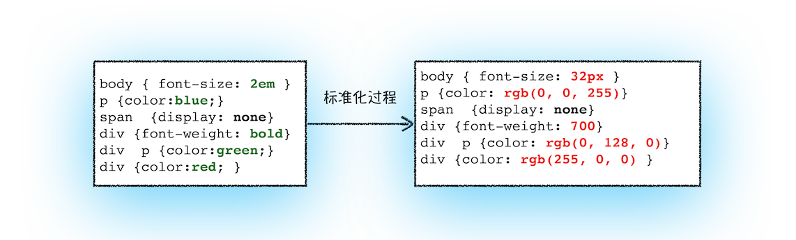

4. 从输入URL到页面展示，这中间发生了什么？
   1. 图 
   2. 整个过程需要各个进程之间的配合，所以在开始正式流程之前，我们还是先来快速回顾下浏览器进程、渲染进程和网络进程的主要职责。
      1. 浏览器进程主要负责用户交互、子进程管理和文件储存等功能。
      2. 网络进程是面向渲染进程和浏览器进程等提供网络下载功能。
      3. 渲染进程的主要职责是把从网络下载的 HTML、JavaScript、CSS、图片等资源解析为可以显示和交互的页面。因为渲染进程所有的内容都是通过网络获取的，会存在一些恶意代码利用浏览器漏洞对系统进行攻击，所以运行在渲染进程里面的代码是不被信任的。这也是为什么 Chrome 会让渲染进程运行在安全沙箱里，就是为了保证系统的安全。
   3. 这个过程可以大致描述为如下。
      1. 首先，浏览器进程接收到用户输入的 URL 请求，浏览器进程便将该 URL 转发给网络进程。
      2. 然后，在网络进程中发起真正的 URL 请求。
      3. 接着网络进程接收到了响应头数据，便解析响应头数据，并将数据转发给浏览器进程。
      4. 浏览器进程接收到网络进程的响应头数据之后，发送“提交导航 (CommitNavigation)”消息到渲染进程
      5. 渲染进程接收到“提交导航”的消息之后，便开始准备接收 HTML 数据，接收数据的方式是直接和网络进程建立数据管道
      6. 最后渲染进程会向浏览器进程“确认提交”，这是告诉浏览器进程：“已经准备好接受和解析页面数据了
      7. 浏览器进程接收到渲染进程“提交文档”的消息之后，便开始移除之前旧的文档，然后更新浏览器进程中的页面状态
         1. 这其中，用户发出 URL 请求到页面开始解析的这个过程，就叫做导航。
   4. 从输入 URL 到页面展示
      1. 详细分析下这些阶段，同时也就解答了开头所说的那道经典的面试题。
      2. 用户输入
         1. 当用户在地址栏中输入一个查询关键字时，地址栏会判断输入的关键字是搜索内容，还是请求的 URL。
            1. 如果是搜索内容，地址栏会使用浏览器默认的搜索引擎，来合成新的带搜索关键字的 URL。
            2. 如果判断输入内容符合 URL 规则，比如输入的是 time.geekbang.org，那么地址栏会根据规则，把这段内容加上协议，合成为完整的 URL，如https://time.geekbang.org。
         2. 当用户输入关键字并键入回车之后，这意味着当前页面即将要被替换成新的页面，不过在这个流程继续之前，浏览器还给了当前页面一次执行 beforeunload 事件的机会，beforeunload 事件允许页面在退出之前执行一些数据清理操作，还可以询问用户是否要离开当前页面，比如当前页面可能有未提交完成的表单等情况，因此用户可以通过 beforeunload 事件来取消导航，让浏览器不再执行任何后续工作。
            1. 当前页面没有监听 beforeunload 事件或者同意了继续后续流程，那么浏览器便进入下图的状态：
            2. 
            3. 从图中可以看出，当浏览器刚开始加载一个地址之后，标签页上的图标便进入了加载状态。但此时图中页面显示的依然是之前打开的页面内容，并没立即替换为极客时间的页面。因为需要等待提交文档阶段，页面内容才会被替换。
      3. URL 请求过程
         1. 这时，浏览器进程会通过进程间通信（IPC）把 URL 请求发送至网络进程，网络进程接收到 URL 请求后，会在这里发起真正的 URL 请求流程。
            1. 首先，网络进程会查找本地缓存是否缓存了该资源。如果有缓存资源，那么直接返回资源给浏览器进程；如果在缓存中没有查找到资源，那么直接进入网络请求流程。
            2. 这请求前的第一步是要进行 DNS 解析，以获取请求域名的服务器 IP 地址。如果请求协议是 HTTPS，那么还需要建立 TLS 连接。
            3. 接下来就是利用 IP 地址和服务器建立 TCP 连接。连接建立之后，浏览器端会构建请求行、请求头等信息，并把和该域名相关的 Cookie 等数据附加到请求头中，然后向服务器发送构建的请求信息。
            4. 服务器接收到请求信息后，会根据请求信息生成响应数据（包括响应行、响应头和响应体等信息），并发给网络进程。等网络进程接收了响应行和响应头之后，就开始解析响应头的内容了。（为了方便讲述，下面我将服务器返回的响应头和响应行统称为响应头。）
               1. 重定向
                  1. 在接收到服务器返回的响应头后，网络进程开始解析响应头，如果发现返回的状态码是 301 或者 302，那么说明服务器需要浏览器重定向到其他 URL。这时网络进程会从响应头的 Location 字段里面读取重定向的地址，然后再发起新的 HTTP 或者 HTTPS 请求，一切又重头开始了。
                  2. 在导航过程中，如果服务器响应行的状态码包含了 301、302 一类的跳转信息，浏览器会跳转到新的地址继续导航；如果响应行是 200，那么表示浏览器可以继续处理该请求。
               2. 响应数据类型处理
                  1. 在处理了跳转信息之后，我们继续导航流程的分析。URL 请求的数据类型，有时候是一个下载类型，有时候是正常的 HTML 页面，那么浏览器是如何区分它们呢？
                  2. 答案是 Content-Type。Content-Type 是 HTTP 头中一个非常重要的字段， 它告诉浏览器服务器返回的响应体数据是什么类型，然后浏览器会根据 Content-Type 的值来决定如何显示响应体的内容。
                     1. 响应头中的 Content-type 字段的值是 text/html，这就是告诉浏览器，服务器返回的数据是 HTML 格式。
                     2. Content-Type 的值是 application/octet-stream，显示数据是字节流类型的，通常情况下，浏览器会按照下载类型来处理该请求。
                     3. 如果服务器配置 Content-Type 不正确，比如将 text/html 类型配置成 application/octet-stream 类型，那么浏览器可能会曲解文件内容，比如会将一个本来是用来展示的页面，变成了一个下载文件。
                  3. 所以，不同 Content-Type 的后续处理流程也截然不同。如果 Content-Type 字段的值被浏览器判断为下载类型，那么该请求会被提交给浏览器的下载管理器，同时该 URL 请求的导航流程就此结束。但如果是 HTML，那么浏览器则会继续进行导航流程。由于 Chrome 的页面渲染是运行在渲染进程中的，所以接下来就需要准备渲染进程了。
               3. 准备渲染进程
                  1. 默认情况下，Chrome 会为每个页面分配一个渲染进程，也就是说，每打开一个新页面就会配套创建一个新的渲染进程。但是，也有一些例外，在某些情况下，浏览器会让多个页面直接运行在同一个渲染进程中。
                  2. 比如我从极客时间的首页里面打开了另外一个页面——算法训练营，我们看下图的 Chrome 的任务管理器截图：
                     1. 
                     2. 从图中可以看出，打开的这三个页面都是运行在同一个渲染进程中，进程 ID 是 23601。
                  3. 那什么情况下多个页面会同时运行在一个渲染进程中呢？
                     1. 同一站点（same-site）
                        1. 我们将“同一站点”定义为根域名（例如，geekbang.org）加上协议（例如，https:// 或者 http://），还包含了该根域名下的所有子域名和不同的端口，比如下面这三个：
                           1. https://time.geekbang.org
                           2. https://www.geekbang.org
                           3. https://www.geekbang.org:8080
                        2. 它们都是属于同一站点，因为它们的协议都是 HTTPS，而且根域名也都是 geekbang.org。
                     2. Chrome 的默认策略是，每个标签对应一个渲染进程。但如果从一个页面打开了另一个新页面，而新页面和当前页面属于同一站点的话，那么新页面会复用父页面的渲染进程。官方把这个默认策略叫 process-per-site-instance。
                     3. 总结来说，打开一个新页面采用的渲染进程策略就是：
                        1. 通常情况下，打开新的页面都会使用单独的渲染进程
                        2. 如果从 A 页面打开 B 页面，且 A 和 B 都属于同一站点的话，那么 B 页面复用 A 页面的渲染进程；如果是其他情况，浏览器进程则会为 B 创建一个新的渲染进程。
                     4. 渲染进程准备好之后，还不能立即进入文档解析状态，因为此时的文档数据还在网络进程中，并没有提交给渲染进程，所以下一步就进入了提交文档阶段。
               4. 提交文档
                  1. 所谓提交文档，就是指浏览器进程将网络进程接收到的 HTML 数据提交给渲染进程，具体流程是这样的：
                     1. 首先当浏览器进程接收到网络进程的响应头数据之后，便向渲染进程发起“提交文档”的消息；
                     2. 渲染进程接收到“提交文档”的消息后，会和网络进程建立传输数据的“管道”；
                     3. 等文档数据传输完成之后，渲染进程会返回“确认提交”的消息给浏览器进程；
                     4. 浏览器进程在收到“确认提交”的消息后，会更新浏览器界面状态，包括了安全状态、地址栏的 URL、前进后退的历史状态，并更新 Web 页面。
                  2. 其中，当渲染进程确认提交之后，更新内容如下图所示：
                  3. 这也就解释了为什么在浏览器的地址栏里面输入了一个地址后，之前的页面没有立马消失，而是要加载一会儿才会更新页面。
                  4. 这里，一个完整的导航流程就“走”完了，这之后就要进入渲染阶段了。
               5. 渲染阶段
                  1. 一旦文档被提交，渲染进程便开始页面解析和子资源加载了，关于这个阶段的完整过程，我会在下一篇文章中来专门介绍。
                  2. 这里你只需要先了解一旦页面生成完成，渲染进程会发送一个消息给浏览器进程，浏览器接收到消息后，会停止标签图标上的加载动画。如下所示：
                  3. 至此，一个完整的页面就生成了。那文章开头的“从输入 URL 到页面展示，这中间发生了什么？”这个过程及其“串联”的问题也就解决了。
      4. 总结
         1. 用户输入URL，浏览器会根据用户输入的信息判断是搜索还是网址，如果是搜索内容，就将搜索内容+默认搜索引擎合成新的URL；如果用户输入的内容符合URL规则，浏览器就会根据URL协议，在这段内容上加上协议合成合法的URL
         2. 用户输入完内容，按下回车键，浏览器导航栏显示loading状态，但是页面还是呈现前一个页面，这是因为新页面的响应数据还没有获得
         3. 浏览器进程浏览器构建请求行信息，会通过进程间通信（IPC）将URL请求发送给网络进程
         GET /index.html HTTP1.1
         1. 网络进程获取到URL，先去本地缓存中查找是否有缓存文件，如果有，拦截请求，直接200返回；否则，进入网络请求过程
         2. 网络进程请求DNS返回域名对应的IP和端口号，如果之前DNS数据缓存服务缓存过当前域名信息，就会直接返回缓存信息；否则，发起请求获取根据域名解析出来的IP和端口号，如果没有端口号，http默认80，https默认443。如果是https请求，还需要建立TLS连接。
         3. Chrome 有个机制，同一个域名同时最多只能建立 6 个TCP 连接，如果在同一个域名下同时有 10 个请求发生，那么其中 4 个请求会进入排队等待状态，直至进行中的请求完成。如果当前请求数量少于6个，会直接建立TCP连接。
         4. TCP三次握手建立连接，http请求加上TCP头部——包括源端口号、目的程序端口号和用于校验数据完整性的序号，向下传输
         5. 网络层在数据包上加上IP头部——包括源IP地址和目的IP地址，继续向下传输到底层
         6. 底层通过物理网络传输给目的服务器主机
         7.  目的服务器主机网络层接收到数据包，解析出IP头部，识别出数据部分，将解开的数据包向上传输到传输层
         8.  目的服务器主机传输层获取到数据包，解析出TCP头部，识别端口，将解开的数据包向上传输到应用层
         9.  应用层HTTP解析请求头和请求体，如果需要重定向，HTTP直接返回HTTP响应数据的状态code301或者302，同时在请求头的Location字段中附上重定向地址，浏览器会根据code和Location进行重定向操作；如果不是重定向，首先服务器会根据 请求头中的If-None-Match 的值来判断请求的资源是否被更新，如果没有更新，就返回304状态码，相当于告诉浏览器之前的缓存还可以使用，就不返回新数据了；否则，返回新数据，200的状态码，并且如果想要浏览器缓存数据的话，就在相应头中加入字段：
         Cache-Control:Max-age=2000
         响应数据又顺着应用层——传输层——网络层——网络层——传输层——应用层的顺序返回到网络进程
         1.  数据传输完成，TCP四次挥手断开连接。如果，浏览器或者服务器在HTTP头部加上如下信息，TCP就一直保持连接。保持TCP连接可以省下下次需要建立连接的时间，提示资源加载速度
         Connection:Keep-Alive 
         1.  网络进程将获取到的数据包进行解析，根据响应头中的Content-type来判断响应数据的类型，如果是字节流类型，就将该请求交给下载管理器，该导航流程结束，不再进行；如果是text/html类型，就通知浏览器进程获取到文档准备渲染
         2.  浏览器进程获取到通知，根据当前页面B是否是从页面A打开的并且和页面A是否是同一个站点（根域名和协议一样就被认为是同一个站点），如果满足上述条件，就复用之前网页的进程，否则，新创建一个单独的渲染进程
         3.  浏览器会发出“提交文档”的消息给渲染进程，渲染进程收到消息后，会和网络进程建立传输数据的“管道”，文档数据传输完成后，渲染进程会返回“确认提交”的消息给浏览器进程
         4.  浏览器收到“确认提交”的消息后，会更新浏览器的页面状态，包括了安全状态、地址栏的 URL、前进后退的历史状态，并更新web页面，此时的web页面是空白页
         5.  渲染进程对文档进行页面解析和子资源加载，HTML 通过HTM 解析器转成DOM Tree（二叉树类似结构的东西），CSS按照CSS 规则和CSS解释器转成CSSOM TREE，两个tree结合，形成render tree（不包含HTML的具体元素和元素要画的具体位置），通过Layout可以计算出每个元素具体的宽高颜色位置，结合起来，开始绘制，最后显示在屏幕中新页面显示出来
5. HTML、CSS和JavaScript，是如何变成页面的？
   1. 序言
      1. 导航被提交后就进入了渲染阶段。这个阶段很重要，了解其相关流程能让你“看透”页面是如何工作的，有了这些知识，你可以解决一系列相关的问题，比如能熟练使用开发者工具，因为能够理解开发者工具里面大部分项目的含义，能优化页面卡顿问题，使用 JavaScript 优化动画流程，通过优化样式表来防止强制同步布局，等等。
      2. 通常，我们编写好 HTML、CSS、JavaScript 等文件，经过浏览器就会显示出漂亮的页面
         1. 输入的是 HTML、CSS、JavaScript 数据，这些数据经过中间渲染模块的处理，最终输出为屏幕上的像素。
         2. 这中间的渲染模块就是我们今天要讨论的主题。为了能更好地理解下文，你可以先结合下图快速抓住 HTML、CSS 和 JavaScript 的含义：
            1. 
            2. 从上图可以看出，HTML 的内容是由标记和文本组成。
               1. 标记也称为标签，每个标签都有它自己的语义，浏览器会根据标签的语义来正确展示 HTML 内容。
               2. 比如上面的标签是告诉浏览器在这里的内容需要创建一个新段落，中间的文本就是段落中需要显示的内容。
            3. 如果需要改变 HTML 的字体颜色、大小等信息，就需要用到 CSS，CSS 又称为层叠样式表，是由选择器和属性组成
               1. 比如图中的 p 选择器，它会把 HTML 里面标签的内容选择出来，然后再把选择器的属性值应用到标签内容上。
               2. 选择器里面有个 color 属性，它的值是 red，这是告诉渲染引擎把标签的内容显示为红色。
            4. JavaScript（简称为 JS），使用它可以使网页的内容“动”起来，比如上图中，可以通过 JavaScript 来修改 CSS 样式值，从而达到修改文本颜色的目的。
         3. 由于渲染机制过于复杂，所以渲染模块在执行过程中会被划分为很多子阶段，输入的 HTML 经过这些子阶段，最后输出像素。
            1. 我们把这样的一个处理流程叫做渲染流水线，其大致流程如下图所示：
            2. 按照渲染的时间顺序，流水线可分为如下几个子阶段：构建 DOM 树、样式计算、布局阶段、分层、绘制、分块、光栅化和合成。
            3. 在介绍每个阶段的过程中，你应该重点关注以下三点内容：
               1. 开始每个子阶段都有其输入的内容；
               2. 然后每个子阶段有其处理过程；
               3. 最终每个子阶段会生成输出内容。
            4. 理解了这三部分内容，能让你更加清晰地理解每个子阶段。
      3. 具体过程
         1. 构建 DOM 树
            1. 为什么要构建 DOM 树呢？这是因为浏览器无法直接理解和使用 HTML，所以需要将 HTML 转换为浏览器能够理解的结构——DOM 树。
               1. 
               2. 从图中可以看出，构建 DOM 树的输入内容是一个非常简单的 HTML 文件，然后经由 HTML 解析器解析，最终输出树状结构的 DOM。
               3. 为了更加直观地理解 DOM 树，你可以打开 Chrome 的“开发者工具”，选择“Console”标签来打开控制台，然后在控制台里面输入“document”后回车，这样你就能看到一个完整的 DOM 树结构，如下图所示：
               4. 图中的 document 就是 DOM 结构，你可以看到，DOM 和 HTML 内容几乎是一样的，但是和 HTML 不同的是，DOM 是保存在内存中树状结构，可以通过 JavaScript 来查询或修改其内容。
            2. 现在我们已经生成 DOM 树了，但是 DOM 节点的样式我们依然不知道，要让 DOM 节点拥有正确的样式，这就需要样式计算了。
         2. 样式计算（Recalculate Style）
            1. 样式计算的目的是为了计算出 DOM 节点中每个元素的具体样式，这个阶段大体可分为三步来完成。
               1. 把 CSS 转换为浏览器能够理解的结构
                  1. 那 CSS 样式的来源主要有哪些呢？你可以先参考下图：
                     1. 通过 link 引用的外部 CSS 文件
                     2. 通过 link 引用的外部 CSS 文件
                     3. 元素的 style 属性内嵌的 CSS
                  2. 和 HTML 文件一样，浏览器也是无法直接理解这些纯文本的 CSS 样式，所以当渲染引擎接收到 CSS 文本时，会执行一个转换操作，将 CSS 文本转换为浏览器可以理解的结构——styleSheets。
                     1. 为了加深理解，你可以在 Chrome 控制台中查看其结构，只需要在控制台中输入 document.styleSheets，然后就看到如下图所示的结构：
                     2. 
                  3. 从图中可以看出，这个样式表包含了很多种样式，已经把那三种来源的样式都包含进去了。只需要知道渲染引擎会把获取到的 CSS 文本全部转换为 styleSheets 结构中的数据，并且该结构同时具备了查询和修改功能，这会为后面的样式操作提供基础。
               2. 转换样式表中的属性值，使其标准化
                  1. 现在我们已经把现有的 CSS 文本转化为浏览器可以理解的结构了，那么接下来就要对其进行属性值的标准化操作。
                  2. 属性值标准化，你可以看下面这样一段 CSS 文本：
                    ```
                    body { font-size: 20px }
                    p {color:blue;}
                    span  {display: none}
                    div {font-weight: bold;color:red}
                    div  p {color:green;}
                    ```
                  3. 可以看到上面的 CSS 文本中有很多属性值，如 2em、blue、bold，这些类型数值不容易被渲染引擎理解，所以需要将所有值转换为渲染引擎容易理解的、标准化的计算值，这个过程就是属性值标准化。
                  4. 那标准化后的属性值是什么样子的？
                  5. 从图中可以看到，2em 被解析成了 32px，red 被解析成了 rgb(255,0,0)，bold 被解析成了 700
               3. 计算出 DOM 树中每个节点的具体样式
                  1. 现在样式的属性已被标准化了，接下来就需要计算 DOM 树中每个节点的样式属性了，如何计算呢？
                  2. 这就涉及到 CSS 的继承规则和层叠规则了。
                     1. CSS 继承
                        1. CSS 继承就是每个 DOM 节点都包含有父节点的样式。
                        2. 上面代码中的样式表最终应用到 DOM 节点的效果如下图所示：
                        3. 从图中可以看出，所有子节点都继承了父节点样式。比如 body 节点的 font-size 属性是 20，那 body 节点下面的所有节点的 font-size 都等于 20。
                        4.  这个界面展示的信息很丰富，大致可描述为如下。
                           1. 首先，可以选择要查看的元素的样式（位于图中的区域 2 中），在图中的第 1 个区域中点击对应的元素，就可以在下面的区域查看该元素的样式了。比如这里我们选择的元素是标签，位于 html.body.div. 这个路径下面。
                           2. 其次，可以从样式来源（位于图中的区域 3 中）中查看样式的具体来源信息，看看是来源于样式文件，还是来源于 UserAgent 样式表。这里需要特别提下 UserAgent 样式，它是浏览器提供的一组默认样式，如果你不提供任何样式，默认使用的就是 UserAgent 样式。
                           3. 最后，可以通过区域 2 和区域 3 来查看样式继承的具体过程。
                        5. 以上就是 CSS 继承的一些特性，样式计算过程中，会根据 DOM 节点的继承关系来合理计算节点样式。
                     2. 样式层叠
                        1. 层叠是 CSS 的一个基本特征，它是一个定义了如何合并来自多个源的属性值的算法。它在 CSS 处于核心地位，CSS 的全称“层叠样式表”正是强调了这一点。
            2. 总之，样式计算阶段的目的是为了计算出 DOM 节点中每个元素的具体样式，在计算过程中需要遵守 CSS 的继承和层叠两个规则。这个阶段最终输出的内容是每个 DOM 节点的样式，并被保存在 ComputedStyle 的结构内。
               1. 如果你想了解每个 DOM 元素最终的计算样式，可以打开 Chrome 的“开发者工具”，选择第一个“element”标签，然后再选择“Computed”子标签，如下图所示：
         3. 布局阶段
            1. 现在，我们有 DOM 树和 DOM 树中元素的样式，但这还不足以显示页面，因为我们还不知道 DOM 元素的几何位置信息。那么接下来就需要计算出 DOM 树中可见元素的几何位置，我们把这个计算过程叫做布局。
            2. Chrome 在布局阶段需要完成两个任务：创建布局树和布局计算。
               1. 创建布局树
                  1. 你可能注意到了 DOM 树还含有很多不可见的元素，比如 head 标签，还有使用了 display:none 属性的元素。所以在显示之前，我们还要额外地构建一棵只包含可见元素布局树。
                  2. 我们结合下图来看看布局树的构造过程：
                     1. 从上图可以看出，DOM 树中所有不可见的节点都没有包含到布局树中。
                     2. 为了构建布局树，浏览器大体上完成了下面这些工作：
                        1. 遍历 DOM 树中的所有可见节点，并把这些节点加到布局树中；
                        2. 而不可见的节点会被布局树忽略掉，如 head 标签下面的全部内容，再比如 body.p.span 这个元素，因为它的属性包含 dispaly:none，所以这个元素也没有被包进布局树。
               2. 布局计算
                  1. 现在我们有了一棵完整的布局树。那么接下来，就要计算布局树节点的坐标位置了。布局的计算过程非常复杂，我们这里先跳过不讲，等到后面章节中我再做详细的介绍。
                  2. 在执行布局操作的时候，会把布局运算的结果重新写回布局树中，所以布局树既是输入内容也是输出内容，这是布局阶段一个不合理的地方，因为在布局阶段并没有清晰地将输入内容和输出内容区分开来。针对这个问题，Chrome 团队正在重构布局代码，下一代布局系统叫 LayoutNG，试图更清晰地分离输入和输出，从而让新设计的布局算法更加简单。
         4. 分层
            1. 页面中有很多复杂的效果，如一些复杂的 3D 变换、页面滚动，或者使用 z-indexing 做 z 轴排序等，为了更加方便地实现这些效果，渲染引擎还需要为特定的节点生成专用的图层，并生成一棵对应的图层树（LayerTree）。
               1. 要想直观地理解什么是图层，你可以打开 Chrome 的“开发者工具”，选择“Layers”标签，就可以可视化页面的分层情况
               2. 如下图所示：
               3. 从上图可以看出，渲染引擎给页面分了很多图层，这些图层按照一定顺序叠加在一起，就形成了最终的页面
               4. 参考下图：