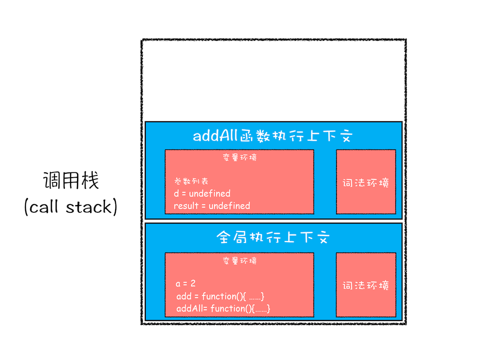
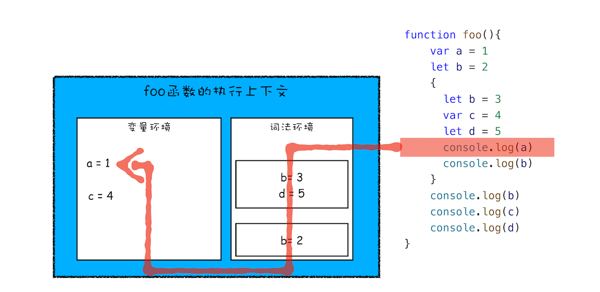
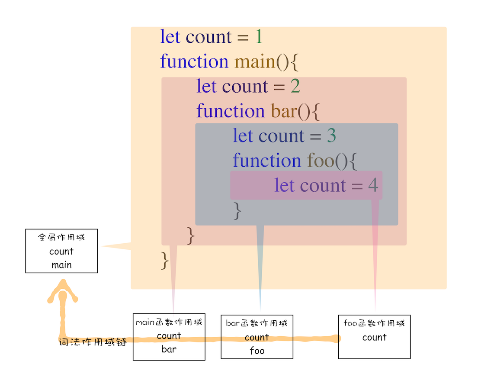

## 浏览器中的JavaScript执行机制
1. 变量提升：JavaScript代码是按顺序执行的吗？
   1. 序言
      1. 第一篇文章，我们主要讲解执行上下文相关的内容。
      2. 只有理解了 JavaScrip 的执行上下文，你才能更好地理解 JavaScript 语言本身，比如变量提升、作用域和闭包等。不仅如此，理解执行上下文和调用栈的概念还能助你成为一名更合格的前端开发者。
      3. 本文主要是从 JavaScript 的顺序执行讲起，然后一步步带你了解 JavaScript 是怎么运行的。
   2. 变量提升（Hoisting）
      1. 输入一段代码，经过编译后，会生成两部分内容：执行上下文（Execution context）和可执行代码。
      2. 
      3. 执行上下文是 JavaScript 执行一段代码时的运行环境，比如调用一个函数，就会进入这个函数的执行上下文，确定该函数在执行期间用到的诸如 this、变量、对象以及函数等。在执行上下文中存在一个变量环境的对象（Viriable Environment），该对象中保存了变量提升的内容
      4. JavaScript 引擎发现了一个通过 function 定义的函数，所以它将函数定义存储到堆 (HEAP）中，并在环境对象中创建一个 showName 的属性，然后将该属性值指向堆中函数的位置（不了解堆也没关系，JavaScript 的执行堆和执行栈我会在后续文章中介绍）。这样就生成了变量环境对象。
      5. 接下来 JavaScript 引擎会把声明以外的代码编译为字节码，例：
          ```
          showName()
          console.log(myname)
          myname = '极客时间'
          ```
      6. 现在有了执行上下文和可执行代码了，那么接下来就到了执行阶段了。
   3. 执行阶段
      1. JavaScript 引擎开始执行“可执行代码(就是上面的字节码)”，按照顺序一行一行地执行。下面我们就来一行一行分析下这个执行过程：
2. 调用栈：为什么JavaScript代码会出现栈溢出？
   1. 序言 
      1. 那么接下来我们就来明确下，哪些情况下代码才算是“一段”代码，才会在执行之前就进行编译并创建执行上下文。一般说来，有这么三种情况：
         1. 当 JavaScript 执行全局代码的时候，会编译全局代码并创建全局执行上下文，而且在整个页面的生存周期内，全局执行上下文只有一份。
         2. 当调用一个函数的时候，函数体内的代码会被编译，并创建函数执行上下文，一般情况下，函数执行结束之后，创建的函数执行上下文会被销毁。
         3. 当使用 eval 函数的时候，eval 的代码也会被编译，并创建执行上下文。
      2. 好了，又进一步理解了执行上下文，那本节我们就在这基础之上继续深入，一起聊聊调用栈。
         1. 比如你在写 JavaScript 代码的时候，有时候可能会遇到栈溢出的错误，如下图所示：
   2. 你应该知道 JavaScript 中有很多函数，经常会出现在一个函数中调用另外一个函数的情况，调用栈就是用来管理函数调用关系的一种数据结构。因此要讲清楚调用栈，你还要先弄明白函数调用和栈结构。
      1. 函数调用
         1. 函数调用就是运行一个函数，具体使用方式是使用函数名称跟着一对小括号。
            ```
            var a = 2
            function add(){
            var b = 10
            return  a+b
            }
            add()
            ```
         2. 利用这段简单的代码来解释下函数调用的过程。
            1. 在执行到函数 add() 之前，JavaScript 引擎会为上面这段代码创建全局执行上下文，包含了声明的函数和变量 
               1. 
            2. 从图中可以看出，代码中全局变量和函数都保存在全局上下文的变量环境中
            3. 执行上下文准备好之后，便开始执行全局代码，当执行到 add 这儿时，JavaScript 判断这是一个函数调用，那么将执行以下操作：
               1. 首先，从全局执行上下文中，取出 add 函数代码。
               2. 其次，对 add 函数的这段代码进行编译，并创建该函数的执行上下文和可执行代码
               3. 最后，执行代码，输出结果。
               4. 完整流程你可以参考下图：
            4. 就这样，当执行到 add 函数的时候，我们就有了两个执行上下文了——全局执行上下文和 add 函数的执行上下文。
            5. 也就是说在执行 JavaScript 时，可能会存在多个执行上下文，那么 JavaScript 引擎是如何管理这些执行上下文的呢？
            6. 答案是通过一种叫栈的数据结构来管理的。
      2. 栈结构
         1. 栈中的元素满足后进先出的特点。你可以参看下图：
         2. 什么是 JavaScript 的调用栈
            1. JavaScript 引擎正是利用栈的这种结构来管理执行上下文的。在执行上下文创建好后，JavaScript 引擎会将执行上下文压入栈中，通常把这种用来管理执行上下文的栈称为执行上下文栈，又称调用栈。
         3. 那在整个代码的执行过程中，调用栈是怎么变化的呢？示例代码：
            ```
            var a = 2
            function add(b,c){
              return b+c
            }
            function addAll(b,c){
            var d = 10
            result = add(b,c)
            return  a+result+d
            }
            addAll(3,6)
            ```
            1. 第一步，创建全局上下文，并将其压入栈底。如下图所示：
               1. 从图中你也可以看出，变量 a、函数 add 和 addAll 都保存到了全局上下文的变量环境对象中。
               2. 全局执行上下文压入到调用栈后，JavaScript 引擎便开始执行全局代码了。
               3. 首先会执行 a=2 的赋值操作，执行该语句会将全局上下文变量环境中 a 的值设置为 2。
               4. 设置后的全局上下文的状态如下图所示：
            2. 第二步是调用 addAll 函数。
               1. 当调用该函数时，JavaScript 引擎会编译该函数，并为其创建一个执行上下文，最后还将该函数的执行上下文压入栈中
                  1. 如下图所示：
                  2. addAll 函数的执行上下文创建好之后，便进入了函数代码的执行阶段了
                  3. 这里先执行的是 d=10 的赋值操作，执行语句会将 addAll 函数执行上下文中的 d 由 undefined 变成了 10。
            3. 第三步，当执行到 add 函数调用语句时，同样会为其创建执行上下文，并将其压入调用栈
               1. 如下图所示：
               2. 当 add 函数返回时，该函数的执行上下文就会从栈顶弹出，并将 result 的值设置为 add 函数的返回值，也就是 9。
               3. 如下图所示：
               4. 紧接着 addAll 执行最后一个相加操作后并返回，addAll 的执行上下文也会从栈顶部弹出，此时调用栈中就只剩下全局上下文了。
               5. 最终如下图所示：
            4. 至此，整个 JavaScript 流程执行结束了。
               1. 调用栈是 JavaScript 引擎追踪函数执行的一个机制，当一次有多个函数被调用时，通过调用栈就能够追踪到哪个函数正在被执行以及各函数之间的调用关系。
   3. 在开发中，如何利用好调用栈
      1. 如何利用浏览器查看调用栈的信息
         1. 当你执行一段复杂的代码时，你可能很难从代码文件中分析其调用关系，这时候你可以在你想要查看的函数中加入断点，然后当执行到该函数时，就可以查看该函数的调用栈了。
            1. 
            2. 从图中可以看出，右边的“call stack”下面显示出来了函数的调用关系：
               1. 栈的最底部是 anonymous，也就是全局的函数入口；
               2. 中间是 addAll 函数；
               3. 顶部是 add 函数。
               4. 这就清晰地反映了函数的调用关系，所以在分析复杂结构代码，或者检查 Bug 时，调用栈都是非常有用的。
         2. 除了通过断点来查看调用栈，你还可以使用 console.trace() 来输出当前的函数调用关系，比如在示例代码中的 add 函数里面加上了 console.trace()，你就可以看到控制台输出的结果，如下图：
      2. 栈溢出（Stack Overflow）
         1. 调用栈是有大小的，当入栈的执行上下文超过一定数目，JavaScript 引擎就会报错，我们把这种错误叫做栈溢出。
         2. 特别是在你写递归代码的时候，就很容易出现栈溢出的情况。
            1. 抛出的错误信息为：超过了最大栈调用大小（Maximum call stack size exceeded）。
            2. 因为当 JavaScript 引擎开始执行这段代码时，它首先调用函数 division，并创建执行上下文，压入栈中；然而，这个函数是递归的，并且没有任何终止条件，所以它会一直创建新的函数执行上下文，并反复将其压入栈中，但栈是有容量限制的，超过最大数量后就会出现栈溢出的错误。
         3. 理解了栈溢出原因后，你就可以使用一些方法来避免或者解决栈溢出的问题
            1. 比如把递归调用的形式改造成其他形式，
            2. 或者使用加入定时器的方法来把当前任务拆分为其他很多小任务。
3. 块级作用域：var缺陷以及为什么要引入let和const？
   1. 序言
      1. 正是由于 JavaScript 存在变量提升这种特性，从而导致了很多与直觉不符的代码，这也是 JavaScript 的一个重要设计缺陷。
      2. 虽然 ECMAScript6（以下简称 ES6）已经通过引入块级作用域并配合 let、const 关键字，来避开了这种设计缺陷，但是由于 JavaScript 需要保持向下兼容，所以变量提升在相当长一段时间内还会继续存在。
      3. 分析为什么在 JavaScript 中会存在变量提升，以及变量提升所带来的问题；然后再来“开药方”——介绍如何通过块级作用域并配合 let 和 const 关键字来修复这种缺陷。
   2. 作用域（scope）
      1. 作用域是指在程序中定义变量的区域，该位置决定了变量的生命周期。通俗地理解，作用域就是变量与函数的可访问范围，即作用域控制着变量和函数的可见性和生命周期。
      2. 在 ES6 之前，ES 的作用域只有两种：全局作用域和函数作用域。
         1. 全局作用域中的对象在代码中的任何地方都能访问，其生命周期伴随着页面的生命周期。
         2. 函数作用域就是在函数内部定义的变量或者函数，并且定义的变量或者函数只能在函数内部被访问。函数执行结束之后，函数内部定义的变量会被销毁。
      3. 在 ES6 之前，JavaScript 只支持这两种作用域，相较而言，其他语言则都普遍支持块级作用域。
         1. 块级作用域就是使用一对大括号包裹的一段代码，比如函数、判断语句、循环语句，甚至单独的一个{}都可以被看作是一个块级作用域。
         2. ES6 之前是不支持块级作用域的，因为当初设计这门语言的时候，并没有想到 JavaScript 会火起来，所以只是按照最简单的方式来设计。
         3. 没有了块级作用域，再把作用域内部的变量统一提升无疑是最快速、最简单的设计
         4. 不过这也直接导致了函数中的变量无论是在哪里声明的，在编译阶段都会被提取到执行上下文的变量环境中，所以这些变量在整个函数体内部的任何地方都是能被访问的，这也就是 JavaScript 中的变量提升。
      4. 变量提升所带来的问题
         1. 变量容易在不被察觉的情况下被覆盖掉
            1. 因为会发生变量提升
         2. 本应销毁的变量没有被销毁
            ```
            function foo(){
              for (var i = 0; i < 7; i++) {
              }
              console.log(i); 
            }
            foo()
            如果你使用 C 语言或者其他的大部分语言实现类似代码，在 for 循环结束之后，i 就已经被销毁了，但是在 JavaScript 代码中，i 的值并未被销毁，所以最后打印出来的是 7。
            ```
   3. ES6 是如何解决变量提升带来的缺陷
      1. ES6 引入了 let 和 const 关键字，从而使 JavaScript 也能像其他语言一样拥有了块级作用域。
      2. JavaScript 是如何支持块级作用域的
         1. 在同一段代码中，ES6 是如何做到既要支持变量提升的特性，又要支持块级作用域的呢？
         2. 那么接下来，我们就要站在执行上下文的角度来揭开答案。
            1. 你已经知道 JavaScript 引擎是通过变量环境实现函数级作用域的，那么 ES6 又是如何在函数级作用域的基础之上，实现对块级作用域的支持呢？
               ```
               function foo(){
                   var a = 1
                   let b = 2
                   {
                     let b = 3
                     var c = 4
                     let d = 5
                     console.log(a)
                     console.log(b)
                   }
                   console.log(b) 
                   console.log(c)
                   console.log(d)
               }   
               foo()
               ```
            2. 当执行上面这段代码的时候，JavaScript 引擎会先对其进行编译并创建执行上下文，然后再按照顺序执行代码
            3. 但是现在的情况有点不一样，我们引入了 let 关键字，let 关键字会创建块级作用域，那么 let 关键字是如何影响执行上下文的呢？接下来我们就来一步步分析上面这段代码的执行流程。
               1. 编译并创建执行上下文
                  1. 通过图，我们可以得出以下结论：
                  2. 函数内部通过 var 声明的变量，在编译阶段全都被存放到变量环境里面了。
                  3. 通过 let 声明的变量，在编译阶段会被存放到词法环境（Lexical Environment）中
                  4. 在函数的作用域块内部，通过 let 声明的变量并没有被存放到词法环境中。也就是let d
               2. 继续执行代码
                  1. 当执行到代码块里面时，变量环境中 a 的值已经被设置成了 1，词法环境中 b 的值已经被设置成了 2，这时候函数的执行上下文就如下图所示：
                  2. 当进入函数的作用域块时，作用域块中通过 let 声明的变量，会被存放在词法环境的一个单独的区域中，这个区域中的变量并不影响作用域块外面的变量
                  3. 比如在作用域外面声明了变量 b，在该作用域块内部也声明了变量 b，当执行到作用域内部时，它们都是独立的存在。
                  4. 其实，在词法环境内部，维护了一个小型栈结构，栈底是函数最外层的变量，进入一个作用域块后，就会把该作用域块内部的变量压到栈顶；当作用域执行完成之后，该作用域的信息就会从栈顶弹出，这就是词法环境的结构。需要注意下，我这里所讲的变量是指通过 let 或者 const 声明的变量。
               3. 再接下来，当执行到作用域块中的console.log(a)这行代码时，就需要在词法环境和变量环境中查找变量 a 的值了，具体查找方式是：沿着词法环境的栈顶向下查询，如果在词法环境中的某个块中查找到了，就直接返回给 JavaScript 引擎，如果没有查找到，那么继续在变量环境中查找。
                  1. 这样一个变量查找过程就完成了，你可以参考下图：
               4. 当作用域块执行结束之后，其内部定义的变量就会从词法环境的栈顶弹出，最终执行上下文如下图所示：
                  1. 
      3. 块级作用域就是通过词法环境的栈结构来实现的，而变量提升是通过变量环境来实现，通过这两者的结合，JavaScript 引擎也就同时支持了变量提升和块级作用域了。
4. 作用域链和闭包 ：代码中出现相同的变量，JavaScript引擎是如何选择的？
   1. 序言
      1. 那今天我们就来聊聊什么是作用域链，并通过作用域链再来讲讲什么是闭包。
   2. 作用域链
      1. 其实在每个执行上下文的变量环境中，都包含了一个外部引用，用来指向外部的执行上下文，我们把这个外部引用称为 outer。
      2. 当一段代码使用了一个变量时，JavaScript 引擎首先会在“当前的执行上下文”中查找该变量，
      3. 例：
          ```
          function bar() {
              console.log(myName)
          }
          function foo() {
              var myName = "极客邦"
              bar()
          }
          var myName = "极客时间"
          foo()
          ```
         1. 比如上面那段代码在查找 myName 变量时，如果在当前的变量环境中没有查找到，那么 JavaScript 引擎会继续在 outer 所指向的执行上下文中查找。为了直观理解，你可以看下面这张图：
         2. 从图中可以看出，bar 函数和 foo 函数的 outer 都是指向全局上下文的，这也就意味着如果在 bar 函数或者 foo 函数中使用了外部变量，那么 JavaScript 引擎会去全局执行上下文中查找。我们把这个查找的链条就称为作用域链。
         3. 现在你知道变量是通过作用域链来查找的了，不过还有一个疑问没有解开，foo 函数调用的 bar 函数，那为什么 bar 函数的外部引用是全局执行上下文，而不是 foo 函数的执行上下文？
            1. 要回答这个问题，你还需要知道什么是词法作用域。这是因为在 JavaScript 执行过程中，其作用域链是由词法作用域决定的。
            2. 词法作用域
               1. 词法作用域就是指作用域是由代码中函数声明的位置来决定的，所以词法作用域是静态的作用域，通过它就能够预测代码在执行过程中如何查找标识符。
               2. 如下图：
               3. 从图中可以看出，词法作用域就是根据代码的位置来决定的，其中 main 函数包含了 bar 函数，bar 函数中包含了 foo 函数，因为 JavaScript 作用域链是由词法作用域决定的，所以整个词法作用域链的顺序是：foo 函数作用域—>bar 函数作用域—>main 函数作用域—> 全局作用域。
               4. 词法作用域是代码编译阶段就决定好的，和函数是怎么调用的没有关系。
            3. 块级作用域中的变量查找
               1. 前面我们通过全局作用域和函数级作用域来分析了作用域链，那接下来我们再来看看块级作用域中变量是如何查找的？
               2. 如果你使用了一个在当前作用域中不存在的变量，这时 JavaScript 引擎就需要按照作用域链在其他作用域中查找该变量，如果你不了解该过程，那就会有很大概率写出不稳定的代码。
                  ```
                  function bar() {
                      var myName = "极客世界"
                      let test1 = 100
                      if (1) {
                          let myName = "Chrome浏览器"
                          console.log(test)
                      }
                  }
                  function foo() {
                      var myName = "极客邦"
                      let test = 2
                      {
                          let test = 3
                          bar()
                      }
                  }
                  var myName = "极客时间"
                  let myAge = 10
                  let test = 1
                  foo()
                  ```
                  1. 在上篇文章中我们已经介绍过了，ES6 是支持块级作用域的，当执行到代码块时，如果代码块中有 let 或者 const 声明的变量，那么变量就会存放到该函数的词法环境中。
                  2. 对于上面这段代码，当执行到 bar 函数内部的 if 语句块时，其调用栈的情况如下图所示：
                     1. 
                     2. 现在是执行到 bar 函数的 if 语块之内，需要打印出来变量 test，那么就需要查找到 test 变量的值，其查找过程我已经在上图中使用序号 1、2、3、4、5 标记出来了。
                  3. 首先是在 bar 函数的执行上下文中查找，但因为 bar 函数的执行上下文中没有定义 test 变量，所以根据词法作用域的规则，下一步就在 bar 函数的外部作用域中查找，也就是全局作用域。
   3. 闭包
      1. 结合下面这段代码来理解什么是闭包：
          ```
          function foo() {
              var myName = "极客时间"
              let test1 = 1
              const test2 = 2
              var innerBar = {
                  getName:function(){
                      console.log(test1)
                      return myName
                  },
                  setName:function(newName){
                      myName = newName
                  }
              }
              return innerBar
          }
          var bar = foo()
          bar.setName("极客邦")
          bar.getName()
          console.log(bar.getName())
          ```
      1. 首先我们看看当执行到 foo 函数内部的return innerBar这行代码时调用栈的情况，你可以参考下图：
         1. 
      2. 从上面的代码可以看出，innerBar 是一个对象，包含了 getName 和 setName 的两个方法（通常我们把对象内部的函数称为方法）。你可以看到，这两个方法都是在 foo 函数内部定义的，并且这两个方法内部都使用了 myName 和 test1 两个变量。
      3. 根据词法作用域的规则，内部函数 getName 和 setName 总是可以访问它们的外部函数 foo 中的变量
         1. 所以当 innerBar 对象返回给全局变量 bar 时，虽然 foo 函数已经执行结束，但是 getName 和 setName 函数依然可以使用 foo 函数中的变量 myName 和 test1。
         2. 所以当 foo 函数执行完成之后，其整个调用栈的状态如下图所示 
            1. 从上图可以看出，foo 函数执行完成之后，其执行上下文从栈顶弹出了，但是由于返回的 setName 和 getName 方法中使用了 foo 函数内部的变量 myName 和 test1，所以这两个变量依然保存在内存中。
            2. 这像极了 setName 和 getName 方法背的一个专属背包，无论在哪里调用了 setName 和 getName 方法，它们都会背着这个 foo 函数的专属背包。
            3. 之所以是专属背包，是因为除了 setName 和 getName 函数之外，其他任何地方都是无法访问该背包的，我们就可以把这个背包称为 foo 函数的闭包。
      4. 现在我们终于可以给闭包一个正式的定义了
         1. 在 JavaScript 中，根据词法作用域的规则，内部函数总是可以访问其外部函数中声明的变量，当通过调用一个外部函数返回一个内部函数后，即使该外部函数已经执行结束了，但是内部函数引用外部函数的变量依然保存在内存中，我们就把这些变量的集合称为闭包。比如外部函数是 foo，那么这些变量的集合就称为 foo 函数的闭包。
      5. 那这些闭包是如何使用的呢？
         1. 当执行到 bar.setName 方法中的myName = "极客邦"这句代码时，JavaScript 引擎会沿着“当前执行上下文–>foo 函数闭包–> 全局执行上下文”的顺序来查找 myName 变量
            1. 你可以参考下面的调用栈状态图：
            2. 从图中可以看出，setName 的执行上下文中没有 myName 变量，foo 函数的闭包中包含了变量 myName，所以调用 setName 时，会修改 foo 闭包中的 myName 变量的值。
            3. 同样的流程，当调用 bar.getName 的时候，所访问的变量 myName 也是位于 foo 函数闭包中的。
         2. 你也可以通过“开发者工具”来看看闭包的情况，打开 Chrome 的“开发者工具”，在 bar 函数任意地方打上断点，然后刷新页面，
            1. 可以看到如下内容：
            2. 从图中可以看出来，当调用 bar.getName 的时候，右边 Scope 项就体现出了作用域链的情况：
            3. Local 就是当前的 getName 函数的作用域
            4. Closure(foo) 是指 foo 函数的闭包
            5. 最下面的 Global 就是指全局作用域
            6. 从“Local–>Closure(foo)–>Global”就是一个完整的作用域链。
      6. 闭包是怎么回收的
         1. 理解什么是闭包之后，接下来我们再来简单聊聊闭包是什么时候销毁的。因为如果闭包使用不正确，会很容易造成内存泄漏的，关注闭包是如何回收的能让你正确地使用闭包。
         2. 通常，如果引用闭包的函数是一个全局变量，那么闭包会一直存在直到页面关闭；但如果这个闭包以后不再使用的话，就会造成内存泄漏。
         3. 如果引用闭包的函数是个局部变量，等函数销毁后，在下次 JavaScript 引擎执行垃圾回收时，判断闭包这块内容如果已经不再被使用了，那么 JavaScript 引擎的垃圾回收器就会回收这块内存。
         4. 所以在使用闭包的时候，你要尽量注意一个原则：如果该闭包会一直使用，那么它可以作为全局变量而存在；但如果使用频率不高，而且占用内存又比较大的话，那就尽量让它成为一个局部变量。
         5. 关于闭包回收的问题本文只是做了个简单的介绍，其实闭包是如何回收的还牵涉到了 JavaScript 的垃圾回收机制，而关于垃圾回收，后续章节我会再为你做详细介绍的。
5. this：从JavaScript执行上下文的视角讲清楚this
   1. 作用域链和 this 是两套不同的系统，它们之间基本没太多联系
   2. JavaScript 中的 this 是什么
      1. 关于 this，我们还是得先从执行上下文说起。执行上下文中包含了变量环境、词法环境、外部环境
         1. 但其实还有一个 this 具体你可以参考下图：
         2. 从图中可以看出，this 是和执行上下文绑定的，也就是说每个执行上下文中都有一个 this。
         3. 执行上下文主要分为三种——全局执行上下文、函数执行上下文和 eval 执行上下文，所以对应的 this 也只有这三种——全局执行上下文中的 this、函数中的 this 和 eval 中的 this。
         4. 由于 eval 我们使用的不多，所以本文我们对此就不做介绍了
   3. 全局执行上下文中的 this
      1. 全局执行上下文中的 this 是指向 window 对象的。
      2. 这也是 this 和作用域链的唯一交点，作用域链的最底端包含了 window 对象，全局执行上下文中的 this 也是指向 window 对象。
   4. 函数执行上下文中的 this
      1. 先看下面这段代码：
          ```
          function foo(){
            console.log(this)
          }
          foo()
          ```
         1. 执行这段代码，打印出来的也是 window 对象，这说明在默认情况下调用一个函数，其执行上下文中的 this 也是指向 window 对象的。
      2. 通常情况下，有下面三种方式来设置函数执行上下文中的 this 值。
         1. 通过函数的 call 方法设置
         2. 通过对象调用方法设置
            1. 在全局环境中调用一个函数，函数内部的 this 指向的是全局变量 window。
            2. 通过一个对象来调用其内部的一个方法，该方法的执行上下文中的 this 指向对象本身。
      3. 通过构造函数中设置
         1. 当执行 new CreateObj() 的时候，JavaScript 引擎做了如下四件事：
            1. 首先创建了一个空对象 
            2. 执行prototype链接
            3. 新对象绑定到函数调用的this
            4. 如果函数没有返回其他对象，那么new表达式中的函数调用会自动返回这个新对象
      4. this 的设计缺陷以及应对方案 
         1. this 并不是一个很好的设计，因为它的很多使用方法都冲击人的直觉，在使用过程中存在着非常多的坑。
         2. 嵌套函数中的 this 不会从外层函数中继承
            1. 示例bar 函数中的 this 是什么？
                ```
                var myObj = {
                  name : "极客时间", 
                  showThis: function(){
                    console.log(this)
                    function bar(){console.log(this)}
                    bar()
                  }
                }
                myObj.showThis()
                ```
               1. 函数 bar 中的 this 指向的是全局 window 对象，而函数 showThis 中的 this 指向的是 myObj 对象。
            2. 你以通过一个小技巧来解决这个问题，比如在 showThis 函数中声明一个变量 self 用来保存 this，然后在 bar 函数中使用 self，代码如下所示：
                ```
                var myObj = {
                  name : "极客时间", 
                  showThis: function(){
                    console.log(this)
                    var self = this
                    function bar(){
                      self.name = "极客邦"
                    }
                    bar()
                  }
                }
                myObj.showThis()
                console.log(myObj.name)
                console.log(window.name)
                ```
               1. 最终 myObj 中的 name 属性值变成了“极客邦”。其实，这个方法的的本质是把 this 体系转换为了作用域的体系。
            3. 你也可以使用 ES6 中的箭头函数来解决这个问题，结合下面代码：
                ```
                var myObj = {
                  name : "极客时间", 
                  showThis: function(){
                    console.log(this)
                    var bar = ()=>{
                      this.name = "极客邦"
                      console.log(this)
                    }
                    bar()
                  }
                }
                myObj.showThis()
                console.log(myObj.name)
                console.log(window.name)
                ```
               1. 箭头函数 bar 里面的 this 是指向 myObj 对象的。
               2. 这是因为 ES6 中的箭头函数并不会创建其自身的执行上下文，所以箭头函数中的 this 取决于它的外部函数。
            4. this 没有作用域的限制，这点和变量不一样，所以嵌套函数不会从调用它的函数中继承 this，这样会造成很多不符合直觉的代码。
               1. 第一种解决办法是把 this 保存为一个 self 变量，再利用变量的作用域机制传递给嵌套函数
               2. 第二种解决办法是继续使用 this，但是要把嵌套函数改为箭头函数，因为箭头函数没有自己的执行上下文，所以它会继承调用函数中的 this。
         3. 普通函数中的 this 默认指向全局对象 window
            1. 默认情况下调用一个函数，其执行上下文中的 this 是默认指向全局对象 window 的。
            2. 不过这个设计也是一种缺陷，因为在实际工作中，我们并不希望函数执行上下文中的 this 默认指向全局对象，因为这样会打破数据的边界，造成一些误操作。
            3. 如果要让函数执行上下文中的 this 指向某个对象，最好的方式是通过 call 方法来显示调用。
            4. 这个问题可以通过设置 JavaScript 的“严格模式”来解决。在严格模式下，默认执行一个函数，其函数的执行上下文中的 this 值是 undefined，这就解决上面的问题了。