##  浏览器中的页面循环系统
1. 消息队列和事件循环：页面是怎么“活”起来的？
   1. 序言
      1. 前面我们讲到了每个渲染进程都有一个主线程，并且主线程非常繁忙，既要处理 DOM，又要计算样式，还要处理布局，同时还需要处理 JavaScript 任务以及各种输入事件。
      2. 要让这么多不同类型的任务在主线程中有条不紊地执行，这就需要一个系统来统筹调度这些任务，这个统筹调度系统就是我们今天要讲的消息队列和事件循环系统。
   2. 使用单线程处理安排好的任务
      1. 我们先从最简单的场景讲起，比如有如下一系列的任务：
          ```
          void MainThread(){
              int num1 = 1+2; //任务1
              int num2 = 20/5; //任务2
              int num3 = 7*8; //任务3
              print("最终计算的值为:%d,%d,%d",num1,num2,num3)； //任务4
            }
          ```
         1. 在上面的执行代码中，我们把所有任务代码按照顺序写进主线程里，等线程执行时，这些任务会按照顺序在线程中依次被执行；等所有任务执行完成之后，线程会自动退出。
         2. 可以参考下图来直观地理解下其执行过程：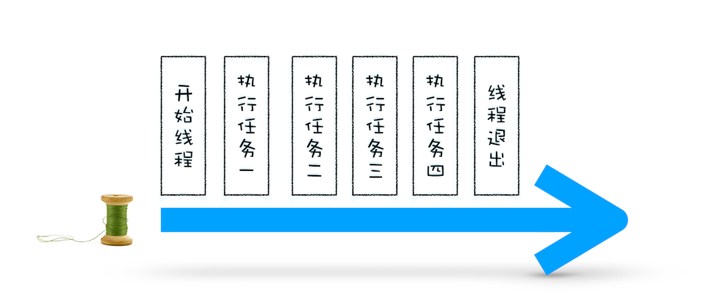 
   3. 在线程运行过程中处理新任务
      1. 但并不是所有的任务都是在执行之前统一安排好的，大部分情况下，新的任务是在线程运行过程中产生的。
      2. 比如在线程执行过程中，又接收到了一个新的任务要求计算“10+2”，那上面那种方式就无法处理这种情况了。
      3. 要想在线程运行过程中，能接收并执行新的任务，就需要采用事件循环机制。
         1. 我们可以通过一个 for 循环语句来监听是否有新的任务，如下面的示例代码：
            ```
            //GetInput
            //等待用户从键盘输入一个数字，并返回该输入的数字
            int GetInput(){
                int input_number = 0;
                cout<<"请输入一个数:";
                cin>>input_number;
                return input_number;
            }

            //主线程(Main Thread)
            void MainThread(){
                for(;;){
                      int first_num = GetInput()；
                      int second_num = GetInput()；
                      result_num = first_num + second_num;
                      print("最终计算的值为:%d",result_num)；
                  }
            }
            ```
         2. 相较于第一版的线程，这一版的线程做了两点改进。
            1. 第一点引入了循环机制，具体实现方式是在线程语句最后添加了一个 for 循环语句，线程会一直循环执行
            2. 第二点是引入了事件，可以在线程运行过程中，等待用户输入的数字，等待过程中线程处于暂停状态，一旦接收到用户输入的信息，那么线程会被激活，然后执行相加运算，最后输出结果。
         3. 通过引入事件循环机制，就可以让该线程“活”起来了，我们每次输入两个数字，都会打印出两数字相加的结果，
            1. 你可以结合下图来参考下这个改进版的线程：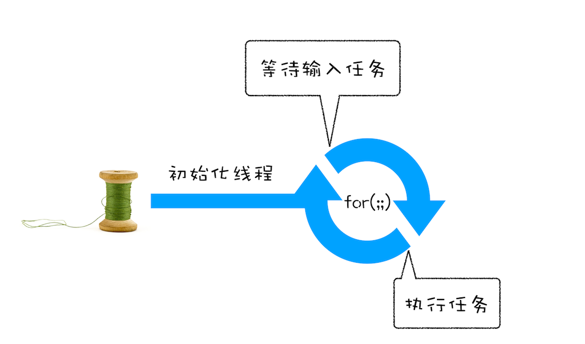 
   4. 处理其他线程发送过来的任务
      1. 上面我们改进了线程的执行方式，引入了事件循环机制，可以让其在执行过程中接受新的任务。
      2. 不过在第二版的线程模型中，所有的任务都是来自于线程内部的，如果另外一个线程想让主线程执行一个任务，利用第二版的线程模型是无法做到的。
      3. 那下面我们就来看看其他线程是如何发送消息给渲染主线程的，具体形式你可以参考下图：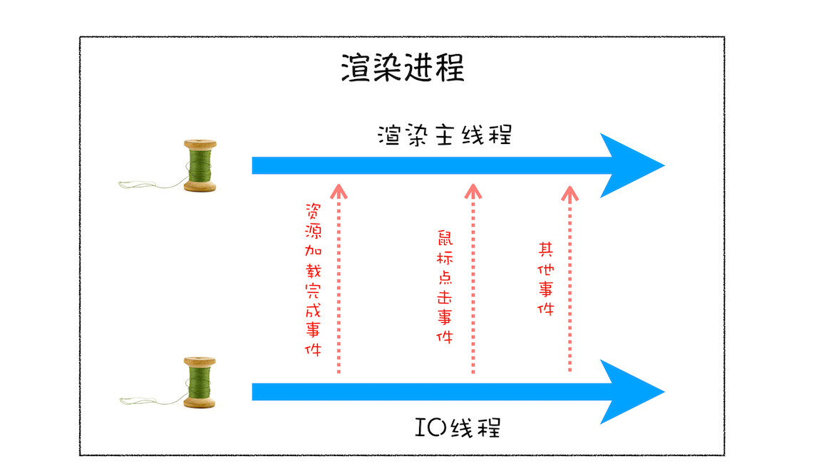 
         1. 从上图可以看出，渲染主线程会频繁接收到来自于 IO 线程的一些任务
         2. 接收到这些任务之后，渲染进程就需要着手处理，比如接收到资源加载完成的消息后，渲染进程就要着手进行 DOM 解析了；接收到鼠标点击的消息后，渲染主线程就要开始执行相应的 JavaScript 脚本来处理该点击事件。
      4. 那么如何设计好一个线程模型，能让其能够接收其他线程发送的消息呢？
         1. 一个通用模式是使用消息队列。可以参考下图：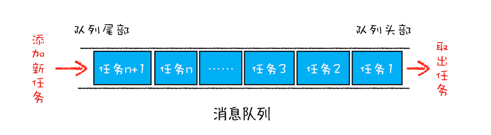 
         2. 从图中可以看出，消息队列是一种数据结构，可以存放要执行的任务。
         3. 它符合队列“先进先出”的特点，也就是说要添加任务的话，添加到队列的尾部；要取出任务的话，从队列头部去取。
      5. 有了队列之后，我们就可以继续改造线程模型了，改造方案如下图所示：
         1. 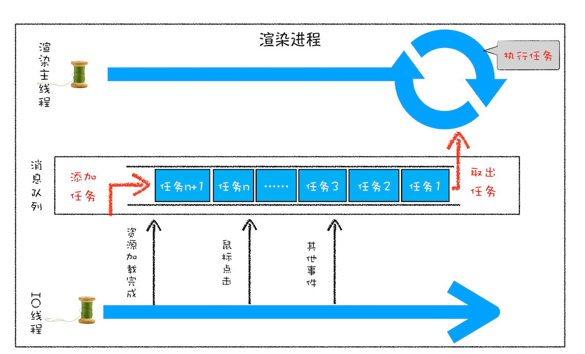 
         2. 从上图可以看出，我们的改造可以分为下面三个步骤：
            1. 添加一个消息队列；
            2. IO 线程中产生的新任务添加进消息队列尾部；
            3. 渲染主线程会循环地从消息队列头部中读取任务，执行任务。
      6. 有了这些步骤之后，那么接下来我们就可以按步骤使用代码来实现第三版的线程模型。
         1. 首先，构造一个队列。当然，在本篇文章中我们不需要考虑队列实现的细节，只是构造队列的接口：
            ```
            class TaskQueue{
              public:
              Task takeTask(); //取出队列头部的一个任务
              void pushTask(Task task); //添加一个任务到队列尾部
            };
            ```
         2. 接下来，改造主线程，让主线程从队列中读取任务：
            ```
            TaskQueue task_queue；
            void ProcessTask();
            void MainThread(){
              for(;;){
                Task task = task_queue.takeTask();
                ProcessTask(task);
              }
            }
            ```
         3. 在上面的代码中，我们添加了一个消息队列的对象，然后在主线程的 for 循环代码块中，从消息队列中读取一个任务，然后执行该任务，主线程就这样一直循环往下执行，因此只要消息队列中有任务，主线程就会去执行。
         4. 主线程的代码就这样改造完成了。这样改造后，主线程执行的任务都全部从消息队列中获取。所以如果有其他线程想要发送任务让主线程去执行，只需要将任务添加到该消息队列中就可以了，添加任务的代码如下：
            ```
            Task clickTask;
            task_queue.pushTask(clickTask)
            ```
         5. 由于是多个线程操作同一个消息队列，所以在添加任务和取出任务时还会加上一个同步锁，这块内容你也要注意下。
   5. 处理其他进程发送过来的任务
      1. 通过使用消息队列，我们实现了线程之间的消息通信。
         1. 在 Chrome 中，跨进程之间的任务也是频繁发生的，那么如何处理其他进程发送过来的任务？
         2. 参考下图：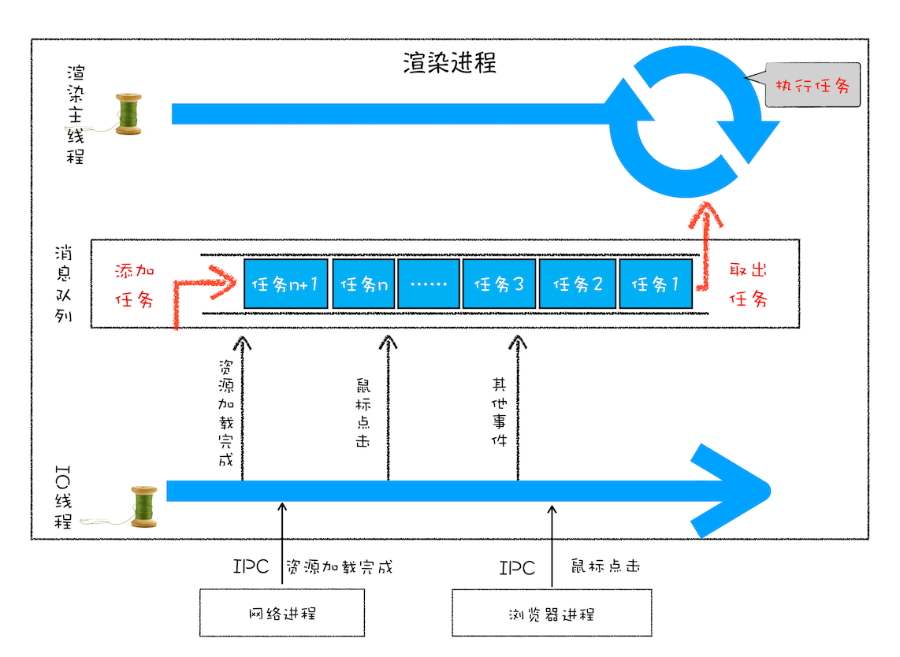 
            1. 从图中可以看出，渲染进程专门有一个 IO 线程用来接收其他进程传进来的消息
            2. 接收到消息之后，会将这些消息组装成任务发送给渲染主线程，后续的步骤就和前面讲解的“处理其他线程发送的任务”一样了，这里就不再重复了。
   6. 消息队列中的任务类型
      1. 你可以参考下Chromium 的官方源码，这里面包含了很多内部消息类型，如输入事件（鼠标滚动、点击、移动）、微任务、文件读写、WebSocket、JavaScript 定时器等等。
      2. 除此之外，消息队列中还包含了很多与页面相关的事件，如 JavaScript 执行、解析 DOM、样式计算、布局计算、CSS 动画等。
      3. 以上这些事件都是在主线程中执行的，所以在编写 Web 应用时，你还需要衡量这些事件所占用的时长，并想办法解决单个任务占用主线程过久的问题。
   7. 如何安全退出
      1. Chrome 是这样解决的，确定要退出当前页面时，页面主线程会设置一个退出标志的变量，在每次执行完一个任务时，判断是否有设置退出标志。
      2. 如果设置了，那么就直接中断当前的所有任务，退出线程，你可以参考下面代码：
          ```
          TaskQueue task_queue；
          void ProcessTask();
          bool keep_running = true;
          void MainThread(){
            for(;;){
              Task task = task_queue.takeTask();
              ProcessTask(task);
              if(!keep_running) //如果设置了退出标志，那么直接退出线程循环
                  break; 
            }
          }
          ```
   8. 页面使用单线程的缺点
      1. 上面讲述的就是页面线程的循环系统是如何工作的，那接下来，我们继续探讨页面线程的一些特征。
      2. 通过上面的介绍，你应该清楚了，页面线程所有执行的任务都来自于消息队列。
      3. 消息队列是“先进先出”的属性，也就是说放入队列中的任务，需要等待前面的任务被执行完，才会被执行。鉴于这个属性，就有如下两个问题需要解决。
         1. 如何处理高优先级的任务。
            1. 比如一个典型的场景是监控 DOM 节点的变化情况（节点的插入、修改、删除等动态变化），然后根据这些变化来处理相应的业务逻辑。
               1. 一个通用的设计的是，利用 JavaScript 设计一套监听接口，当变化发生时，渲染引擎同步调用这些接口，这是一个典型的观察者模式。
               2. 不过这个模式有个问题，因为 DOM 变化非常频繁，如果每次发生变化的时候，都直接调用相应的 JavaScript 接口，那么这个当前的任务执行时间会被拉长，从而导致执行效率的下降。
               3. 如果将这些 DOM 变化做成异步的消息事件，添加到消息队列的尾部，那么又会影响到监控的实时性，因为在添加到消息队列的过程中，可能前面就有很多任务在排队了。
            2. 这也就是说，如果 DOM 发生变化，采用同步通知的方式，会影响当前任务的执行效率；如果采用异步方式，又会影响到监控的实时性。
            3. 针对这种情况，微任务就应用而生了，下面我们来看看微任务是如何权衡效率和实时性的。
               1. 通常我们把消息队列中的任务称为宏任务，每个宏任务中都包含了一个微任务队列
               2. 在执行宏任务的过程中，如果 DOM 有变化，那么就会将该变化添加到微任务列表中，这样就不会影响到宏任务的继续执行，因此也就解决了执行效率的问题。
               3. 等宏任务中的主要功能都直接完成之后，这时候，渲染引擎并不着急去执行下一个宏任务，而是执行当前宏任务中的微任务
               4. 因为 DOM 变化的事件都保存在这些微任务队列中，这样也就解决了实时性问题。
         2. 第二个是如何解决单个任务执行时长过久的问题。
            1. 因为所有的任务都是在单线程中执行的，所以每次只能执行一个任务，而其他任务就都处于等待状态。
               1. 如果其中一个任务执行时间过久，那么下一个任务就要等待很长时间。
               2. 可以参考下图：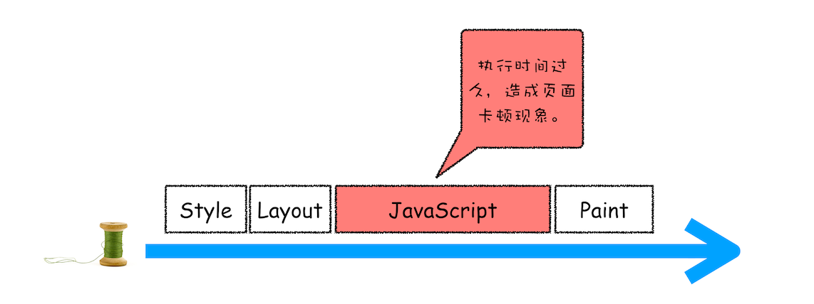 
                  1. 从图中你可以看到，如果在执行动画过程中，其中有个 JavaScript 任务因执行时间过久，占用了动画单帧的时间，这样会给用户制造了卡顿的感觉，这当然是极不好的用户体验。
            2. 针对这种情况，JavaScript 可以通过回调功能来规避这种问题，也就是让要执行的 JavaScript 任务滞后执行。至于浏览器是如何实现回调功能的，我们在后面的章节中再详细介绍。
   9. 实践：浏览器页面是如何运行的
      1. 你可以打开开发者工具，点击“Performance”标签，选择左上角的“start porfiling and load page”来记录整个页面加载过程中的事件执行情况，
         1. 如下图所示：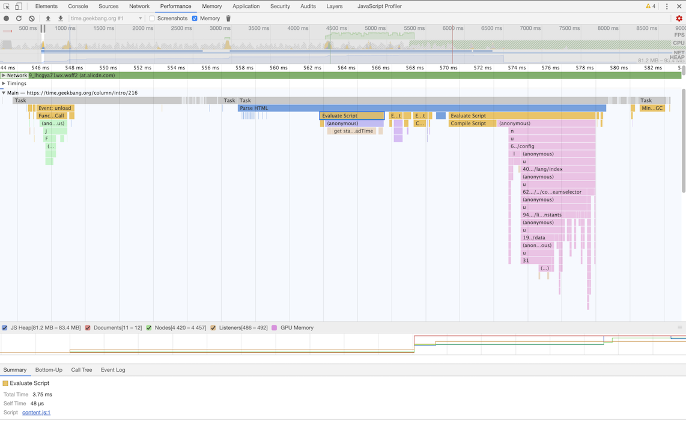 
         2. 从图中可以看出，我们点击展开了 Main 这个项目，其记录了主线程执行过程中的所有任务。
         3. 图中灰色的就是一个个任务，每个任务下面还有子任务，其中的 Parse HTML 任务，是把 HTML 解析为 DOM 的任务。
         4. 值得注意的是，在执行 Parse HTML 的时候，如果遇到 JavaScript 脚本，那么会暂停当前的 HTML 解析而去执行 JavaScript 脚本。
         5. 至于 Performance 工具，在后面的章节中我们还会详细介绍，在这里你只需要建立一个直观的印象就可以了。
2. setTimeout是如何实现的？
   1. 序言
      1. 其实说起 setTimeout 方法，从事开发的同学想必都不会陌生，它就是一个定时器，用来指定某个函数在多少毫秒之后执行。
      2. 它会返回一个整数，表示定时器的编号，同时你还可以通过该编号来取消这个定时器。下面的示例代码就演示了定时器最基础的使用方式：
          ```
          function showName(){
            console.log("极客时间")
          }
          var timerID = setTimeout(showName,200);
          ```
   2. 浏览器怎么实现 setTimeout
      1. 先来回顾下之前讲的事件循环系统，我们知道渲染进程中所有运行在主线程上的任务都需要先添加到消息队列，然后事件循环系统再按照顺序执行消息队列中的任务。下面我们来看看那些典型的事件：
         1. 当接收到 HTML 文档数据，渲染引擎就会将“解析 DOM”事件添加到消息队列中，
         2. 当用户改变了 Web 页面的窗口大小，渲染引擎就会将“重新布局”的事件添加到消息队列中。
         3. 当触发了 JavaScript 引擎垃圾回收机制，渲染引擎会将“垃圾回收”任务添加到消息队列中。
         4. 同样，如果要执行一段异步 JavaScript 代码，也是需要将执行任务添加到消息队列中。
         5. 以上列举的只是一小部分事件，这些事件被添加到消息队列之后，事件循环系统就会按照消息队列中的顺序来执行事件
      2. 所以说要执行一段异步任务，需要先将任务添加到消息队列中。
         1. 不过通过定时器设置回调函数有点特别，它们需要在指定的时间间隔内被调用，但消息队列中的任务是按照顺序执行的，所以为了保证回调函数能在指定时间内执行，你不能将定时器的回调函数直接添加到消息队列中。
         2. 在 Chrome 中除了正常使用的消息队列之外，还有另外一个消息队列，这个队列中维护了需要延迟执行的任务列表，包括了定时器和 Chromium 内部一些需要延迟执行的任务。
         3. 所以当通过 JavaScript 创建一个定时器时，渲染进程会将该定时器的回调任务添加到延迟队列中。
            1. 源码中延迟执行队列的定义如下所示：
              ```
              DelayedIncomingQueue delayed_incoming_queue;
              ```
            2. 当通过 JavaScript 调用 setTimeout 设置回调函数的时候，渲染进程将会创建一个回调任务，包含了回调函数 showName、当前发起时间、延迟执行时间，其模拟代码如下所示：
              ```
              struct DelayTask{
                int64 id；
                CallBackFunction cbf;
                int start_time;
                int delay_time;
              };
              DelayTask timerTask;
              timerTask.cbf = showName;
              timerTask.start_time = getCurrentTime(); //获取当前时间
              timerTask.delay_time = 200;//设置延迟执行时间
              ```
            3. 创建好回调任务之后，再将该任务添加到延迟执行队列中，代码如下所示：
              ```
              delayed_incoming_queue.push(timerTask)；    
              ```
      3. 现在通过定时器发起的任务就被保存到延迟队列中了，那接下来我们再来看看消息循环系统是怎么触发延迟队列的。
         1. 我们可以来完善上一篇文章中消息循环的代码，在其中加入执行延迟队列的代码，如下所示：
            ```
            void ProcessTimerTask(){
              //从delayed_incoming_queue中取出已经到期的定时器任务
              //依次执行这些任务
            }

            TaskQueue task_queue；
            void ProcessTask();
            bool keep_running = true;
            void MainTherad(){
              for(;;){
                //执行消息队列中的任务
                Task task = task_queue.takeTask();
                ProcessTask(task);
                
                //执行延迟队列中的任务
                ProcessDelayTask()

                if(!keep_running) //如果设置了退出标志，那么直接退出线程循环
                    break; 
              }
            }
            ```
            1. 从上面代码可以看出来，我们添加了一个 ProcessDelayTask 函数，该函数是专门用来处理延迟执行任务的
            2. 这里我们要重点关注它的执行时机，在上段代码中，处理完消息队列中的一个任务之后，就开始执行 ProcessDelayTask 函数。
            3. ProcessDelayTask 函数会根据发起时间和延迟时间计算出到期的任务，然后依次执行这些到期的任务。
            4. 等到期的任务执行完成之后，再继续下一个循环过程。通过这样的方式，一个完整的定时器就实现了。
         2. 设置一个定时器，JavaScript 引擎会返回一个定时器的 ID。
            1. 那通常情况下，当一个定时器的任务还没有被执行的时候，也是可以取消的，具体方法是调用 clearTimeout 函数，并传入需要取消的定时器的 ID。如下面代码所示：
            2. clearTimeout(timer_id)
            3. 其实浏览器内部实现取消定时器的操作也是非常简单的，就是直接从 delayed_incoming_queue 延迟队列中，通过 ID 查找到对应的任务，然后再将其从队列中删除掉就可以了。
   3. 使用 setTimeout 的一些注意事项
      1. 现在你应该知道在浏览器内部定时器是如何工作的了。不过在使用定时器的过程中，如果你不了解定时器的一些细节，那么很有可能掉进定时器的一些陷阱里。所以接下来，我们就来讲解一下在使用定时器过程中存在的那些陷阱。
      2. 如果当前任务执行时间过久，会影响定时器任务的执行
         1. 在使用 setTimeout 的时候，有很多因素会导致回调函数执行比设定的预期值要久，其中一个就是当前任务执行时间过久从而导致定时器设置的任务被延后执行。
            ```
            function bar() {
                console.log('bar')
            }
            function foo() {
                setTimeout(bar, 0);
                for (let i = 0; i < 5000; i++) {
                    let i = 5+8+8+8
                    console.log(i)
                }
            }
            foo()
            ```
            1. 这段代码中，在执行 foo 函数的时候使用 setTimeout 设置了一个 0 延时的回调任务，设置好回调任务后，foo 函数会继续执行 5000 次 for 循环。
            2. 通过 setTimeout 设置的回调任务被放入了消息队列中并且等待下一次执行，这里并不是立即执行的；
            3. 要执行消息队列中的下个任务，需要等待当前的任务执行完成，由于当前这段代码要执行 5000 次的 for 循环，所以当前这个任务的执行时间会比较久一点。这势必会影响到下个任务的执行时间。
            4. 你也可以打开 Performance 来看看其执行过程，如下图所示：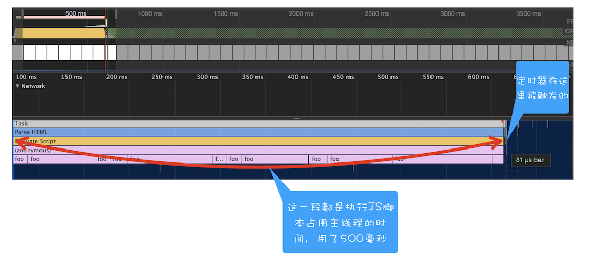 
            5. 从图中可以看到，执行 foo 函数所消耗的时长是 500 毫秒，这也就意味着通过 setTimeout 设置的任务会被推迟到 500 毫秒以后再去执行，而设置 setTimeout 的回调延迟时间是 0。
         2. 如果 setTimeout 存在嵌套调用，那么系统会设置最短时间间隔为 4 毫秒
            1. 在定时器函数里面嵌套调用定时器，也会延长定时器的执行时间，可以先看下面的这段代码：
                ```
                function cb() { setTimeout(cb, 0); }
                setTimeout(cb, 0);
                ```
               1. 你还是可以通过 Performance 来记录下这段代码的执行过程，如下图所示：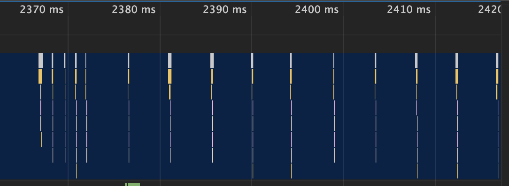 
               2. 上图中的竖线就是定时器的函数回调过程，从图中可以看出，前面五次调用的时间间隔比较小，嵌套调用超过五次以上，后面每次的调用最小时间间隔是 4 毫秒。
               3. 之所以出现这样的情况，是因为在 Chrome 中，定时器被嵌套调用 5 次以上，系统会判断该函数方法被阻塞了
               4. 如果定时器的调用时间间隔小于 4 毫秒，那么浏览器会将每次调用的时间间隔设置为 4 毫秒。
            2. 所以，一些实时性较高的需求就不太适合使用 setTimeout 了，比如你用 setTimeout 来实现 JavaScript 动画就不是一个很好的主意。
         3. 未激活的页面，setTimeout 执行最小间隔是 1000 毫秒
            1. 除了前面的 4 毫秒延迟，还有一个很容易被忽略的地方，那就是未被激活的页面中定时器最小值大于 1000 毫秒
            2. 也就是说，如果标签不是当前的激活标签，那么定时器最小的时间间隔是 1000 毫秒，目的是为了优化后台页面的加载损耗以及降低耗电量。
         4. 延时执行时间有最大值
            1. Chrome、Safari、Firefox 都是以 32 个 bit 来存储延时值的，32bit 最大只能存放的数字是 2147483647 毫秒
            2. 这就意味着，如果 setTimeout 设置的延迟值大于 2147483647 毫秒（大约 24.8 天）时就会溢出，那么相当于延时值被设置为 0 了，这导致定时器会被立即执行。
         5. 使用 setTimeout 设置的回调函数中的 this 不符合直觉
            1. 如果被 setTimeout 推迟执行的回调函数是某个对象的方法，那么该方法中的 this 关键字将指向全局环境，而不是定义时所在的那个对象。
            2. 可以看下面这段代码的执行结果：
                ```
                var name= 1;
                var MyObj = {
                  name: 2,
                  showName: function(){
                    console.log(this.name);
                  }
                }
                setTimeout(MyObj.showName,1000)
                ```
            3. 这里输出的是 1，因为这段代码在编译的时候，执行上下文中的 this 会被设置为全局 window，如果是严格模式，会被设置为 undefined。
            4. 解决
               1. 将MyObj.showName放在匿名函数中执行，如下所示：
                  ```
                  //箭头函数
                  setTimeout(() => {
                      MyObj.showName()
                  }, 1000);
                  //或者function函数
                  setTimeout(function() {
                    MyObj.showName();
                  }, 1000)
                  ```
               2. 第二种是使用 bind 方法，将 showName 绑定在 MyObj 上面，代码如下所示：
                  ```
                  setTimeout(MyObj.showName.bind(MyObj), 1000)
                  ```
3. XMLHttpRequest是怎么实现的？
   1. 序言
      1. 自从网页中引入了 JavaScript，我们就可以操作 DOM 树中任意一个节点，例如隐藏 / 显示节点、改变颜色、获得或改变文本内容、为元素添加事件响应函数等等， 几乎可以“为所欲为”了。
      2. 不过在 XMLHttpRequest 出现之前，如果服务器数据有更新，依然需要重新刷新整个页面。
         1. 而 XMLHttpRequest 提供了从 Web 服务器获取数据的能力
         2. 如果你想要更新某条数据，只需要通过 XMLHttpRequest 请求服务器提供的接口，就可以获取到服务器的数据
         3. 然后再操作 DOM 来更新页面内容，整个过程只需要更新网页的一部分就可以了，而不用像之前那样还得刷新整个页面，这样既有效率又不会打扰到用户。
   2. 回调函数 VS 系统调用栈
      1. 回调函数
         1. 将一个函数作为参数传递给另外一个函数，那作为参数的这个函数就是回调函数。
         2. 回调函数 callback 是在主函数 doWork 返回之前执行的，我们把这个回调过程称为同步回调。
         3. 回调函数在主函数外部执行的过程称为异步回调。
      2. 站在消息循环的视角来看看同步回调和异步回调的区别
         1. 浏览器页面是通过事件循环机制来驱动的，每个渲染进程都有一个消息队列，页面主线程按照顺序来执行消息队列中的事件，如执行 JavaScript 事件、解析 DOM 事件、计算布局事件、用户输入事件等等，如果页面有新的事件产生，那新的事件将会追加到事件队列的尾部。
            1. 所以可以说是消息队列和主线程循环机制保证了页面有条不紊地运行。
            2. 这里还需要补充一点，那就是当循环系统在执行一个任务的时候，都要为这个任务维护一个系统调用栈。
               1. 这个系统调用栈类似于 JavaScript 的调用栈，只不过系统调用栈是 Chromium 的开发语言 C++ 来维护的
               2. 可以通过 Performance 来抓取它核心的调用信息，如下图所示：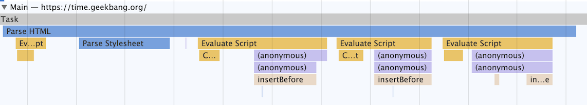 
               3. 这幅图记录了一个 Parse HTML 的任务执行过程，其中黄色的条目表示执行 JavaScript 的过程，其他颜色的条目表示浏览器内部系统的执行过程。
               4. Parse HTML 任务在执行过程中会遇到一系列的子过程，比如在解析页面的过程中遇到了 JavaScript 脚本，那么就暂停解析过程去执行该脚本，等执行完成之后，再恢复解析过程。然后又遇到了样式表，这时候又开始解析样式表……直到整个任务执行完成。
               5. 需要说明的是，整个 Parse HTML 是一个完整的任务，在执行过程中的脚本解析、样式表解析都是该任务的子过程，其下拉的长条就是执行过程中调用栈的信息。
            3. 每个任务在执行过程中都有自己的调用栈，那么同步回调就是在当前主函数的上下文中执行回调函数，这个没有太多可讲的。
            4. 异步回调是指回调函数在主函数之外执行，一般有两种方式：
               1. 第一种是把异步函数做成一个任务，添加到信息队列尾部；
               2. 第二种是把异步函数添加到微任务队列中，这样就可以在当前任务的末尾处执行微任务了。
   3. XMLHttpRequest 运作机制
      1. 理解了什么是同步回调和异步回调，接下来我们就来分析 XMLHttpRequest 背后的实现机制
         1. 具体工作过程你可以参考下图：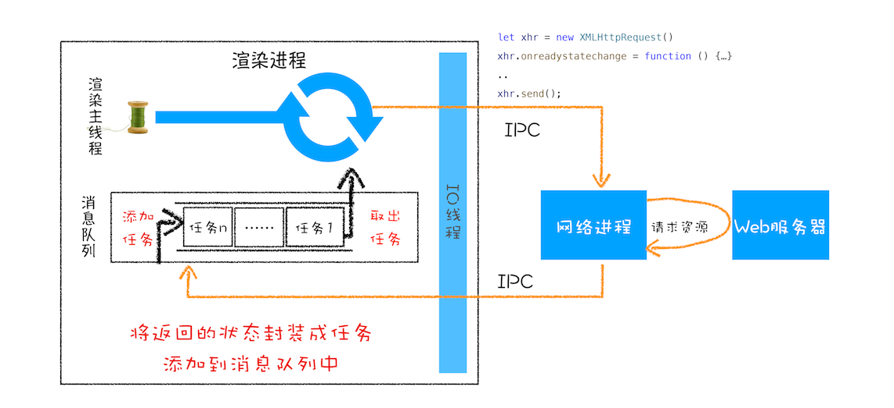
         2. 这是 XMLHttpRequest 的总执行流程图，下面我们就来分析从发起请求到接收数据的完整流程。
      2. 先看下面这样一段请求代码：
          ```
          function GetWebData(URL){
              1:新建XMLHttpRequest请求对象
              let xhr = new XMLHttpRequest()

              2:注册相关事件回调处理函数 
              xhr.onreadystatechange = function () {
                  switch(xhr.readyState){
                    case 0: //请求未初始化
                      console.log("请求未初始化")
                      break;
                    case 1://OPENED
                      console.log("OPENED")
                      break;
                    case 2://HEADERS_RECEIVED
                      console.log("HEADERS_RECEIVED")
                      break;
                    case 3://LOADING  
                      console.log("LOADING")
                      break;
                    case 4://DONE
                      if(this.status == 200||this.status == 304){
                          console.log(this.responseText);
                          }
                      console.log("DONE")
                      break;
                  }
              }
              xhr.ontimeout = function(e) { console.log('ontimeout') }
              xhr.onerror = function(e) { console.log('onerror') }

              3:打开请求
              xhr.open('Get', URL, true);//创建一个Get请求,采用异步

              4:配置参数
              xhr.timeout = 3000 //设置xhr请求的超时时间
              xhr.responseType = "text" //设置响应返回的数据格式
              xhr.setRequestHeader("X_TEST","time.geekbang")

              5:发送请求
              xhr.send();
          }
          ```
         1. 第一步：创建 XMLHttpRequest 对象
            1. 当执行到let xhr = new XMLHttpRequest()后，JavaScript 会创建一个 XMLHttpRequest 对象 xhr，用来执行实际的网络请求操作。
         2. 第二步：为 xhr 对象注册回调函数。
            1. 因为网络请求比较耗时，所以要注册回调函数，这样后台任务执行完成之后就会通过调用回调函数来告诉其执行结果。
            2. XMLHttpRequest 的回调函数主要有下面几种：
               1. ontimeout，用来监控超时请求，如果后台请求超时了，该函数会被调用；
               2. onerror，用来监控出错信息，如果后台请求出错了，该函数会被调用；
               3. onreadystatechange，用来监控后台请求过程中的状态，比如可以监控到 HTTP 头加载完成的消息、HTTP 响应体消息以及数据加载完成的消息等。
         3. 第三步：配置基础的请求信息。
            1. 注册好回调事件之后，接下来就需要配置基础的请求信息了
               1. 首先要通过 open 接口配置一些基础的请求信息，包括请求的地址、请求方法（是 get 还是 post）和请求方式（同步还是异步请求）。
            2. 然后通过 xhr 内部属性类配置一些其他可选的请求信息，你可以参考文中示例代码
               1. 我们通过xhr.timeout = 3000来配置超时时间，也就是说如果请求超过 3000 毫秒还没有响应，那么这次请求就被判断为失败了。
               2. 我们还可以通过xhr.responseType = "text"来配置服务器返回的格式，将服务器返回的数据自动转换为自己想要的格式
                  1. 如果将 responseType 的值设置为 json，那么系统会自动将服务器返回的数据转换为 JavaScript 对象格式。
                  2. 下面的图表是我列出的一些返回类型的描述：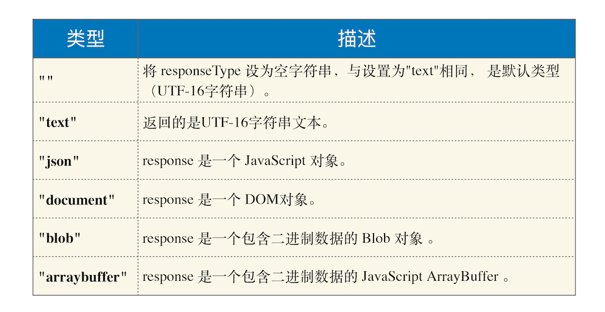
            3. 假如你还需要添加自己专用的请求头属性，可以通过 xhr.setRequestHeader 来添加。
         4. 第四步：发起请求。
            1. 一切准备就绪之后，就可以调用xhr.send来发起网络请求了。
               1. 对照上面那张请求流程图，可以看到：
               2. 渲染进程会将请求发送给网络进程，然后网络进程负责资源的下载
               3. 等网络进程接收到数据之后，就会利用 IPC 来通知渲染进程
               4. 渲染进程接收到消息之后，会将 xhr 的回调函数封装成任务并添加到消息队列中
               5. 等主线程循环系统执行到该任务的时候，就会根据相关的状态来调用对应的回调函数。
                  1. 如果网络请求出错了，就会执行 xhr.onerror；
                  2. 如果超时了，就会执行 xhr.ontimeout；
                  3. 如果是正常的数据接收，就会执行 onreadystatechange 来反馈相应的状态。
            2. 这就是一个完整的 XMLHttpRequest 请求流程
   4. XMLHttpRequest 使用过程中的“坑”
      1. 上述过程看似简单，但由于浏览器很多安全策略的限制，所以会导致你在使用过程中踩到非常多的“坑”。
      2. 浏览器安全问题是前端工程师避不开的一道坎，通常在使用过程中遇到的“坑”，很大一部分都是由安全策略引起的，本来很完美的一个方案，正是由于加了安全限制，导致使用起来非常麻烦。
      3. 下面我们就来看看在使用 XMLHttpRequest 的过程中所遇到的跨域问题和混合内容问题。
         1. 跨域问题
            1. 比如在极客邦的官网使用 XMLHttpRequest 请求极客时间的页面内容，由于极客邦的官网是www.geekbang.org，极客时间的官网是time.geekbang.org，它们不是同一个源，所以就涉及到了跨域（在 A 站点中去访问不同源的 B 站点的内容）
            2. 默认情况下，跨域请求是不被允许的，控制台的提示信息如下：
               1. Access to XMLHttpRequest at 'https://time.geekbang.org/' from origin 'https://www.geekbang.org' has been blocked by CORS policy: No 'Access-Control-Allow-Origin' header is present on the requested resource.
         2. HTTPS 混合内容的问题
            1. HTTPS 混合内容是 HTTPS 页面中包含了不符合 HTTPS 安全要求的内容
               1. 比如包含了 HTTP 资源，通过 HTTP 加载的图像、视频、样式表、脚本等，都属于混合内容。
               2. 通常，如果 HTTPS 请求页面中使用混合内容，浏览器会针对 HTTPS 混合内容显示警告，用来向用户表明此 HTTPS 页面包含不安全的资源。
               3. 比如打开站点 https://www.iteye.com/groups ，可以通过控制台看到混合内容的警告，参考下图
                  1. 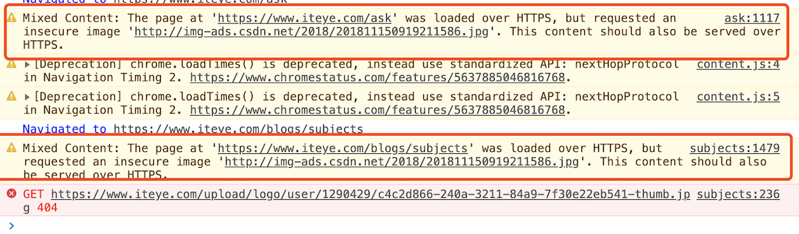
                  2. 从上图可以看出，通过 HTML 文件加载的混合资源，虽然给出警告，但大部分类型还是能加载的。
            2. 而使用 XMLHttpRequest 请求时，浏览器认为这种请求可能是攻击者发起的，会阻止此类危险的请求。
               1. 比如我通过浏览器打开地址 https://www.iteye.com/groups ，然后通过控制台，使用 XMLHttpRequest 来请求 http://img-ads.csdn.net/2018/201811150919211586.jpg ，这时候请求就会报错，出错信息如下图所示：
               2. 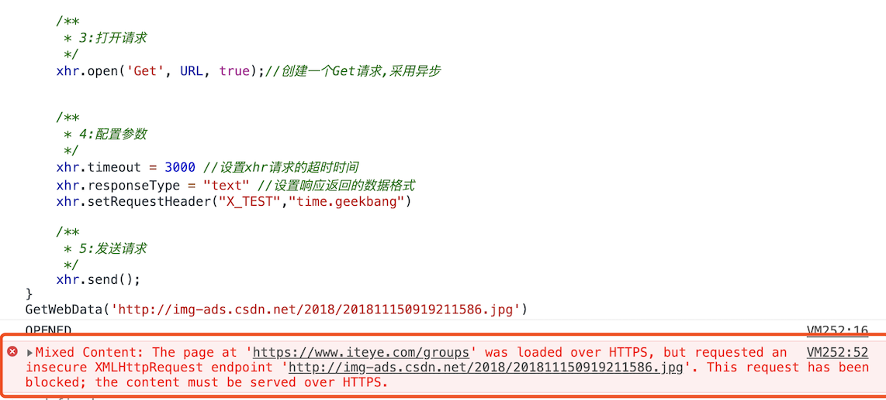
   5. 对比上一篇文章，setTimeout 是直接将延迟任务添加到延迟队列中，而 XMLHttpRequest 发起请求，是由浏览器的其他进程或者线程去执行，然后再将执行结果利用 IPC 的方式通知渲染进程，之后渲染进程再将对应的消息添加到消息队列中。