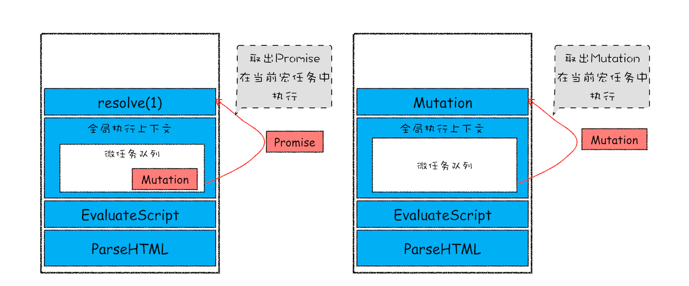

## 浏览器中的页面循环系统 
1. 宏任务和微任务：不是所有任务都是一个待遇
   1. 序言
      1. 随着浏览器的应用领域越来越广泛，消息队列中这种粗时间颗粒度的任务已经不能胜任部分领域的需求，所以又出现了一种新的技术——微任务。
         1. 微任务可以在实时性和效率之间做一个有效的权衡。
      2. 从目前的情况来看，微任务已经被广泛地应用，基于微任务的技术有 MutationObserver、Promise 以及以 Promise 为基础开发出来的很多其他的技术。
   2. 宏任务
      1. 页面中的大部分任务都是在主线程上执行的，这些任务包括了：
         1. 渲染事件（如解析 DOM、计算布局、绘制）
         2. 用户交互事件（如鼠标点击、滚动页面、放大缩小等）
         3. JavaScript 脚本执行事件
         4. 网络请求完成、文件读写完成事件
      2. 为了协调这些任务有条不紊地在主线程上执行，页面进程引入了消息队列和事件循环机制
         1. 渲染进程内部会维护多个消息队列，比如延迟执行队列和普通的消息队列。
         2. 然后主线程采用一个 for 循环，不断地从这些任务队列中取出任务并执行任务。我们把这些消息队列中的任务称为宏任务。
         3. 消息队列中的任务是通过事件循环系统来执行的,这里我们可以看看在WHATWG 规范中是怎么定义事件循环机制的。
            1. 先从多个消息队列中选出一个最老的任务，这个任务称为 oldestTask
            2. 然后循环系统记录任务开始执行的时间，并把这个 oldestTask 设置为当前正在执行的任务
            3. 当任务执行完成之后，删除当前正在执行的任务，并从对应的消息队列中删除掉这个 oldestTask
            4. 最后统计执行完成的时长等信息
      3. 以上就是消息队列中宏任务的执行过程，通过前面的学习，相信你也很熟悉这套执行流程了。
      4. 宏任务可以满足我们大部分的日常需求，不过如果有对时间精度要求较高的需求，宏任务就难以胜任了
         1. 页面的渲染事件、各种 IO 的完成事件、执行 JavaScript 脚本的事件、用户交互的事件等都随时有可能被添加到消息队列中，而且添加事件是由系统操作的
         2. JavaScript 代码不能准确掌控任务要添加到队列中的位置，控制不了任务在消息队列中的位置，所以很难控制开始执行任务的时间。
         3. 看下面这段代码：
            ```
            <!DOCTYPE html>
            <html>
                <body>
                    <div id='demo'>
                        <ol>
                            <li>test</li>
                        </ol>
                    </div>
                </body>
                <script type="text/javascript">
                    function timerCallback2(){
                      console.log(2)
                    }
                    function timerCallback(){
                        console.log(1)
                        setTimeout(timerCallback2,0)
                    }
                    setTimeout(timerCallback,0)
                </script>
            </html>
            ```
         4. 在这段代码中，我的目的是想通过 setTimeout 来设置两个回调任务，并让它们按照前后顺序来执行，中间也不要再插入其他的任务
            1. 因为如果这两个任务的中间插入了其他的任务，就很有可能会影响到第二个定时器的执行时间了。
         5. 但实际情况是我们不能控制的，比如在你调用 setTimeout 来设置回调任务的间隙，消息队列中就有可能被插入很多系统级的任务。
            1. 打开 Performance 工具，来记录下这段任务的执行过程，可参考图片：
            2. setTimeout 函数触发的回调函数都是宏任务，如图中，左右两个黄色块就是 setTimeout 触发的两个定时器任务。
            3. 重点观察上图中间浅红色区域，这里有很多一段一段的任务，这些是被渲染引擎插在两个定时器任务中间的任务。
            4. 试想一下，如果中间被插入的任务执行时间过久的话，那么就会影响到后面任务的执行了。
         6. 所以说宏任务的时间粒度比较大，执行的时间间隔是不能精确控制的，对一些高实时性的需求就不太符合了，比如后面要介绍的监听 DOM 变化的需求。
   3. 微任务
      1. 在上一篇文章中，我们介绍过异步回调的概念，其主要有两种方式。
         1. 第一种是把异步回调函数封装成一个宏任务，添加到消息队列尾部，当循环系统执行到该任务的时候执行回调函数。
            1. 这种比较好理解，我们前面介绍的 setTimeout 和 XMLHttpRequest 的回调函数都是通过这种方式来实现的。
         2. 第二种方式的执行时机是在主函数执行结束之后、当前宏任务结束之前执行回调函数，这通常都是以微任务形式体现的。
            1. 微任务就是一个需要异步执行的函数，执行时机是在主函数执行结束之后、当前宏任务结束之前。
      2. 不过要搞清楚微任务系统是怎么运转起来的，就得站在 V8 引擎的层面来分析下。
         1. 我们知道当 JavaScript 执行一段脚本的时候，V8 会为其创建一个全局执行上下文，在创建全局执行上下文的同时，V8 引擎也会在内部创建一个微任务队列。
         2. 这个微任务队列就是用来存放微任务的，因为在当前宏任务执行的过程中，有时候会产生多个微任务，这时候就需要使用这个微任务队列来保存这些微任务了。
         3. 不过这个微任务队列是给 V8 引擎内部使用的，所以你是无法通过 JavaScript 直接访问的。
         4. 也就是说每个宏任务都关联了一个微任务队列。
      3. 我们就需要分析两个重要的时间点——微任务产生的时机和执行微任务队列的时机。
         1. 微任务是如何产生?有两种方式
            1. 第一种方式是使用 MutationObserver 监控某个 DOM 节点，然后再通过 JavaScript 来修改这个节点，或者为这个节点添加、删除部分子节点，当 DOM 节点发生变化时，就会产生 DOM 变化记录的微任务。
            2. 第二种方式是使用 Promise，当调用 Promise.resolve() 或者 Promise.reject() 的时候，也会产生微任务。
            3. 通过 DOM 节点变化产生的微任务或者使用 Promise 产生的微任务都会被 JavaScript 引擎按照顺序保存到微任务队列中。
         2. 微任务队列是何时被执行的
            1. 通常情况下，在当前宏任务中的 JavaScript 快执行完成时，也就在 JavaScript 引擎准备退出全局执行上下文并清空调用栈的时候，JavaScript 引擎会检查全局执行上下文中的微任务队列，然后按照顺序执行队列中的微任务
            2. WHATWG 把执行微任务的时间点称为检查点。当然除了在退出全局执行上下文式这个检查点之外，还有其他的检查点，不过不是太重要，这里就不做介绍了。
            3. 如果在执行微任务的过程中，产生了新的微任务，同样会将该微任务添加到微任务队列中，V8 引擎一直循环执行微任务队列中的任务，直到队列为空才算执行结束。
            4. 也就是说在执行微任务过程中产生的新的微任务并不会推迟到下个宏任务中执行，而是在当前的宏任务中继续执行。
         3. 为了直观地理解什么是微任务，你可以参考下面我画的示意图（由于内容比较多，我将其分为了两张）：
            1. 
            2. 该示意图是在执行一个 ParseHTML 的宏任务，在执行过程中，遇到了 JavaScript 脚本，那么就暂停解析流程，进入到 JavaScript 的执行环境。
            3. 从图中可以看到，全局上下文中包含了微任务列表。
            4. 在 JavaScript 脚本的后续执行过程中，分别通过 Promise 和 removeChild 创建了两个微任务，并被添加到微任务列表中。
            5. 接着 JavaScript 执行结束，准备退出全局执行上下文，这时候就到了检查点了
            6. JavaScript 引擎会检查微任务列表，发现微任务列表中有微任务，那么接下来，依次执行这两个微任务。等微任务队列清空之后，就退出全局执行上下文。
      4. 以上就是微任务的工作流程，从上面分析我们可以得出如下几个结论：
         1. 微任务和宏任务是绑定的，每个宏任务在执行时，会创建自己的微任务队列。
         2. 微任务的执行时长会影响到当前宏任务的时长。比如一个宏任务在执行过程中，产生了 100 个微任务，执行每个微任务的时间是 10 毫秒，那么执行这 100 个微任务的时间就是 1000 毫秒，也可以说这 100 个微任务让宏任务的执行时间延长了 1000 毫秒。所以你在写代码的时候一定要注意控制微任务的执行时长。
         3. 在一个宏任务中，分别创建一个用于回调的宏任务和微任务，无论什么情况下，微任务都早于宏任务执行。
   4. 监听 DOM 变化方法演变
      1. 再来看看微任务是如何应用在 MutationObserver 中的
         1. 比如许多 Web 应用都利用 HTML 与 JavaScript 构建其自定义控件，与一些内置控件不同，这些控件不是固有的。
         2. 为了与内置控件一起良好地工作，这些控件必须能够适应内容更改、响应事件和用户交互。因此，Web 应用需要监视 DOM 变化并及时地做出响应。
         3. 虽然监听 DOM 的需求是如此重要，不过早期页面并没有提供对监听的支持
            1. 所以那时要观察 DOM 是否变化，唯一能做的就是轮询检测，比如使用 setTimeout 或者 setInterval 来定时检测 DOM 是否有改变。
            2. 这种方式简单粗暴，但是会遇到两个问题：
               1. 如果时间间隔设置过长，DOM 变化响应不够及时
               2. 反过来如果时间间隔设置过短，又会浪费很多无用的工作量去检查 DOM，会让页面变得低效
         4. 直到 2000 年的时候引入了 Mutation Event
            1. Mutation Event 采用了观察者的设计模式，当 DOM 有变动时就会立刻触发相应的事件，这种方式属于同步回调。
      2. 采用 Mutation Event 解决了实时性的问题，因为 DOM 一旦发生变化，就会立即调用 JavaScript 接口
         1. 但也正是这种实时性造成了严重的性能问题，因为每次 DOM 变动，渲染引擎都会去调用 JavaScript，这样会产生较大的性能开销。
         2. 比如利用 JavaScript 动态创建或动态修改 50 个节点内容，就会触发 50 次回调
            1. 而且每个回调函数都需要一定的执行时间，这里我们假设每次回调的执行时间是 4 毫秒，那么 50 次回调的执行时间就是 200 毫秒
            2. 若此时浏览器正在执行一个动画效果，由于 Mutation Event 触发回调事件，就会导致动画的卡顿。
         3. 也正是因为使用 Mutation Event 会导致页面性能问题，所以 Mutation Event 被反对使用，并逐步从 Web 标准事件中删除了。
      3. 为了解决了 Mutation Event 由于同步调用 JavaScript 而造成的性能问题，从 DOM4 开始，推荐使用 MutationObserver 来代替 Mutation Event。
         1. MutationObserver API 可以用来监视 DOM 的变化，包括属性的变化、节点的增减、内容的变化等。
         2. 相比较 Mutation Event，MutationObserver 到底做了哪些改进呢？
            1. MutationObserver 将响应函数改成异步调用，可以不用在每次 DOM 变化都触发异步调用，而是等多次 DOM 变化后，一次触发异步调用
            2. 并且还会使用一个数据结构来记录这期间所有的 DOM 变化。这样即使频繁地操纵 DOM，也不会对性能造成太大的影响。
         3. 我们通过异步调用和减少触发次数来缓解了性能问题，那么如何保持消息通知的及时性呢？
            1. 如果采用 setTimeout 创建宏任务来触发回调的话，那么实时性就会大打折扣，因为上面我们分析过，在两个任务之间，可能会被渲染进程插入其他的事件，从而影响到响应的实时性。
            2. 这时候，微任务就可以上场了，在每次 DOM 节点发生变化的时候，渲染引擎将变化记录封装成微任务，并将微任务添加进当前的微任务队列中。这样当执行到检查点的时候，V8 引擎就会按照顺序执行微任务了。
      4. 综上所述， MutationObserver 采用了“异步 + 微任务”的策略。
         1. 通过异步操作解决了同步操作的性能问题
         2. 通过微任务解决了实时性的问题
2. 使用Promise，告别回调函数
   1. DOM/BOM API 中新加入的 API 大多数都是建立在 Promise 上的，而且新的前端框架也使用了大量的 Promise。
      1. 如果你想要学习一门新技术，最好的方式是先了解这门技术是如何诞生的，以及它所解决的问题是什么。
      2. 所以本文我们就来重点聊聊 JavaScript 引入 Promise 的动机，以及解决问题的几个核心关键点。
      3. Promise 解决的是异步编码风格的问题，而不是一些其他的问题，所以接下来我们聊的话题都是围绕编码风格展开的。
   2. 异步编程的问题：代码逻辑不连续
      1. 首先我们来回顾下 JavaScript 的异步编程模型
         1. 你应该已经非常熟悉页面的事件循环系统了，也知道页面中任务都是执行在主线程之上的
         2. 相对于页面来说，主线程就是它整个的世界，所以在执行一项耗时的任务时，比如下载网络文件任务、获取摄像头等设备信息任务，这些任务都会放到页面主线程之外的进程或者线程中去执行，这样就避免了耗时任务“霸占”页面主线程的情况。
            1. 你可以结合下图来看看这个处理过程：
            2. 上图展示的是一个标准的异步编程模型，页面主线程发起了一个耗时的任务，并将任务交给另外一个进程去处理，这时页面主线程会继续执行消息队列中的任务
            3. 等该进程处理完这个任务后，会将该任务添加到渲染进程的消息队列中，并排队等待循环系统的处理
            4. 排队结束之后，循环系统会取出消息队列中的任务进行处理，并触发相关的回调操作。
         3. 这就是页面编程的一大特点：异步回调。
      2. Web 页面的单线程架构决定了异步回调，而异步回调影响到了我们的编码方式，到底是如何影响的呢？
         1. 假设有一个下载的需求，使用 XMLHttpRequest 来实现，具体的实现方式你可以参考下面这段代码：
            ```
            //执行状态
            function onResolve(response){console.log(response) }
            function onReject(error){console.log(error) }

            let xhr = new XMLHttpRequest()
            xhr.ontimeout = function(e) { onReject(e)}
            xhr.onerror = function(e) { onReject(e) }
            xhr.onreadystatechange = function () { onResolve(xhr.response) }

            //设置请求类型，请求URL，是否同步信息
            let URL = 'https://time.geekbang.com'
            xhr.open('Get', URL, true);

            //设置参数
            xhr.timeout = 3000 //设置xhr请求的超时时间
            xhr.responseType = "text" //设置响应返回的数据格式
            xhr.setRequestHeader("X_TEST","time.geekbang")

            //发出请求
            xhr.send();
            ```
            1. 我们执行上面这段代码，可以正常输出结果的
            2. 但是，这短短的一段代码里面竟然出现了五次回调，这么多的回调会导致代码的逻辑不连贯、不线性，非常不符合人的直觉，这就是异步回调影响到我们的编码方式。
            3. 那有什么方法可以解决这个问题吗？当然有，我们可以封装这堆凌乱的代码，降低处理异步回调的次数。
   3. 封装异步代码，让处理流程变得线性
      1. 我们重点关注的是输入内容（请求信息）和输出内容（回复信息），至于中间的异步请求过程，我们不想在代码里面体现太多，因为这会干扰核心的代码逻辑。
         1. 整体思路如下图所示：
         2. 从图中你可以看到，我们将 XMLHttpRequest 请求过程的代码封装起来了，重点关注输入数据和输出结果。
         3. 那我们就按照这个思路来改造代码。
            1. 首先，我们把输入的 HTTP 请求信息全部保存到一个 request 的结构中，包括请求地址、请求头、请求方式、引用地址、同步请求还是异步请求、安全设置等信息。request 结构如下所示：
              ```
              //makeRequest用来构造request对象
              function makeRequest(request_url) {
                  let request = {
                      method: 'Get',
                      url: request_url,
                      headers: '',
                      body: '',
                      credentials: false,
                      sync: true,
                      responseType: 'text',
                      referrer: ''
                  }
                  return request
              }
              ```
            2. 然后就可以封装请求过程了，这里我们将所有的请求细节封装进 XFetch 函数，XFetch 代码如下所示：
              ```
              //[in] request，请求信息，请求头，延时值，返回类型等
              //[out] resolve, 执行成功，回调该函数
              //[out] reject  执行失败，回调该函数
              function XFetch(request, resolve, reject) {
                  let xhr = new XMLHttpRequest()
                  xhr.ontimeout = function (e) { reject(e) }
                  xhr.onerror = function (e) { reject(e) }
                  xhr.onreadystatechange = function () {
                      if (xhr.status = 200)
                          resolve(xhr.response)
                  }
                  xhr.open(request.method, URL, request.sync);
                  xhr.timeout = request.timeout;
                  xhr.responseType = request.responseType;
                  //补充其他请求信息
                  //...
                  xhr.send();
              }
              ```
               1. 这个 XFetch 函数需要一个 request 作为输入，然后还需要两个回调函数 resolve 和 reject，当请求成功时回调 resolve 函数，当请求出现问题时回调 reject 函数
            3. 有了这些后，我们就可以来实现业务代码了，具体的实现方式如下所示：
              ```
              XFetch(makeRequest('https://time.geekbang.org'),
                  function resolve(data) {
                      console.log(data)
                  }, function reject(e) {
                      console.log(e)
                  })
              ```
   4. 新的问题：回调地狱
      1. 上面的示例代码已经比较符合人的线性思维了，在一些简单的场景下运行效果也是非常好的，不过一旦接触到稍微复杂点的项目时，你就会发现，如果嵌套了太多的回调函数就很容易使得自己陷入了回调地狱，不能自拔。
        ```
        XFetch(makeRequest('https://time.geekbang.org/?category'),
              function resolve(response) {
                  console.log(response)
                  XFetch(makeRequest('https://time.geekbang.org/column'),
                      function resolve(response) {
                          console.log(response)
                          XFetch(makeRequest('https://time.geekbang.org')
                              function resolve(response) {
                                  console.log(response)
                              }, function reject(e) {
                                  console.log(e)
                              })
                      }, function reject(e) {
                          console.log(e)
                      })
              }, function reject(e) {
                  console.log(e)
              })
        ```
         1. 这段代码是先请求time.geekbang.org/?category，如果请求成功的话，那么再请求time.geekbang.org/column，如果再次请求成功的话，就继续请求time.geekbang.org。
         2. 也就是说这段代码用了三层嵌套请求，就已经让代码变得混乱不堪，所以，我们还需要解决这种嵌套调用后混乱的代码结构。
      2. 这段代码之所以看上去很乱，归结其原因有两点：
         1. 第一是嵌套调用，下面的任务依赖上个任务的请求结果，并在上个任务的回调函数内部执行新的业务逻辑，这样当嵌套层次多了之后，代码的可读性就变得非常差了。
         2. 第二是任务的不确定性，执行每个任务都有两种可能的结果（成功或者失败），所以体现在代码中就需要对每个任务的执行结果做两次判断，这种对每个任务都要进行一次额外的错误处理的方式，明显增加了代码的混乱程度。
      3. 原因分析出来后，那么问题的解决思路就很清晰了：
         1. 第一是消灭嵌套调用
         2. 第二是合并多个任务的错误处理
   5. Promise：消灭嵌套调用和多次错误处理
      1. 首先，我们使用 Promise 来重构 XFetch 的代码，示例代码如下所示：
        ```
        function XFetch(request) {
          function executor(resolve, reject) {
              let xhr = new XMLHttpRequest()
              xhr.open('GET', request.url, true)
              xhr.ontimeout = function (e) { reject(e) }
              xhr.onerror = function (e) { reject(e) }
              xhr.onreadystatechange = function () {
                  if (this.readyState === 4) {
                      if (this.status === 200) {
                          resolve(this.responseText, this)
                      } else {
                          let error = {
                              code: this.status,
                              response: this.response
                          }
                          reject(error, this)
                      }
                  }
              }
              xhr.send()
          }
          return new Promise(executor)
        }
        ```
      2. 接下来，我们再利用 XFetch 来构造请求流程，代码如下：
        ```
        var x1 = XFetch(makeRequest('https://time.geekbang.org/?category'))
        var x2 = x1.then(value => {
            console.log(value)
            return XFetch(makeRequest('https://www.geekbang.org/column'))
        })
        var x3 = x2.then(value => {
            console.log(value)
            return XFetch(makeRequest('https://time.geekbang.org'))
        })
        x3.catch(error => {
            console.log(error)
        })
        ```
      3. 你可以观察上面这两段代码，重点关注下 Promise 的使用方式。
         1. 首先我们引入了 Promise，在调用 XFetch 时，会返回一个 Promise 对象。
         2. 构建 Promise 对象时，需要传入一个 executor 函数，XFetch 的主要业务流程都在 executor 函数中执行。
         3. 如果运行在 excutor 函数中的业务执行成功了，会调用 resolve 函数；如果执行失败了，则调用 reject 函数。
         4. 在 excutor 函数中调用 resolve 函数时，会触发 promise.then 设置的回调函数；而调用 reject 函数时，会触发 promise.catch 设置的回调函数。
   6. 基于这段代码，我们就可以来分析 Promise 是如何消灭嵌套回调和合并多个错误处理了。
      1. 我们先来看看 Promise 是怎么消灭嵌套回调的
         1. 产生嵌套函数的一个主要原因是在发起任务请求时会带上回调函数，这样当任务处理结束之后，下个任务就只能在回调函数中来处理了。
         2. Promise 主要通过下面两步解决嵌套回调问题的。
            1. 首先，Promise 实现了回调函数的延时绑定
               1. 回调函数的延时绑定在代码上体现就是先创建 Promise 对象 x1，通过 Promise 的构造函数 executor 来执行业务逻辑
               2. 创建好 Promise 对象 x1 之后，再使用 x1.then 来设置回调函数。示范代码如下：
                  ```
                  //创建Promise对象x1，并在executor函数中执行业务逻辑
                  function executor(resolve, reject){
                      resolve(100)
                  }
                  let x1 = new Promise(executor)


                  //x1延迟绑定回调函数onResolve
                  function onResolve(value){
                      console.log(value)
                  }
                  x1.then(onResolve)
                  ```
            2. 其次，需要将回调函数 onResolve 的返回值穿透到最外层
               1. 因为我们会根据 onResolve 函数的传入值来决定创建什么类型的 Promise 任务,创建好的 Promise 对象需要返回到最外层，这样就可以摆脱嵌套循环了。你可以先看下面的代码：
         3. 现在我们知道了 Promise 通过回调函数延迟绑定和回调函数返回值穿透的技术，解决了循环嵌套。
      2. 那接下来我们再来看看 Promise 是怎么处理异常的
         1. 将所有 Promise 对象的错误合并到一个函数来处理，这样就解决了每个任务都需要单独处理异常的问题。
         2. 之所以可以使用最后一个对象来捕获所有异常，是因为 Promise 对象的错误具有“冒泡”性质，会一直向后传递，直到被 onReject 函数处理或 catch 语句捕获为止。具备了这样“冒泡”的特性后，就不需要在每个 Promise 对象中单独捕获异常了。
      3. 通过这种方式，我们就消灭了嵌套调用和频繁的错误处理，这样使得我们写出来的代码更加优雅，更加符合人的线性思维。
   7. Promise 与微任务
      1. Promise 和微任务的关系到底体现哪里呢？结合下面这个简单的 Promise 代码来回答这个问题：
        ```
        function executor(resolve, reject) {
            resolve(100)
        }
        let demo = new Promise(executor)

        function onResolve(value){
            console.log(value)
        }
        demo.then(onResolve)
        ```
      2. 对于上面这段代码，我们需要重点关注下它的执行顺序。
         1. 首先执行 new Promise 时，Promise 的构造函数会被执行，不过由于 Promise 是 V8 引擎提供的，所以暂时看不到 Promise 构造函数的细节。
         2. 接下来，Promise 的构造函数会调用 Promise 的参数 executor 函数。
            1. 然后在 executor 中执行了 resolve，resolve 函数也是在 V8 内部实现的
            2. 执行 resolve 函数，会触发 demo.then 设置的回调函数 onResolve，所以可以推测，resolve 函数内部调用了通过 demo.then 设置的 onResolve 函数。
            3. 不过这里需要注意一下，由于 Promise 采用了回调函数延迟绑定技术，所以在执行 resolve 函数的时候，回调函数还没有绑定，那么只能推迟回调函数的执行。
      3. 这样按顺序陈述可能把你绕晕了，下面来模拟实现一个 Promise，我们会实现它的构造函数、resolve 方法以及 then 方法，以方便你能看清楚 Promise 的背后都发生了什么。这里我们就把这个对象称为 Bromise，下面就是 Bromise 的实现代码：
          ```
          function Bromise(executor) {
              var onResolve_ = null
              var onReject_ = null
              //模拟实现resolve和then，暂不支持rejcet
              this.then = function (onResolve, onReject) {
                  onResolve_ = onResolve
              };
              function resolve(value) {
                    //setTimeout(()=>{
                      onResolve_(value)
                    // },0)
              }
              executor(resolve, null);
          }
          ```
         1. 观察上面这段代码，我们实现了自己的构造函数、resolve、then 方法。
         2. 接下来我们使用 Bromise 来实现我们的业务代码，实现后的代码如下所示：
          ```
          function executor(resolve, reject) {
              resolve(100)
          }
          //将Promise改成我们自己的Bromsie
          let demo = new Bromise(executor)

          function onResolve(value){
              console.log(value)
          }
          demo.then(onResolve)
          ```
         3. 执行这段代码，我们发现执行出错，输出的内容是：
          ```
          Uncaught TypeError: onResolve_ is not a function
              at resolve (<anonymous>:10:13)
              at executor (<anonymous>:17:5)
              at new Bromise (<anonymous>:13:5)
              at <anonymous>:19:12
          ```
         4. 之所以出现这个错误，是由于 Bromise 的延迟绑定导致的
            1. 在调用到 onResolve_ 函数的时候，Bromise.then 还没有执行，所以执行上述代码的时候，当然会报“onResolve_ is not a function“的错误了。
            2. 也正是因为此，我们要改造 Bromise 中的 resolve 方法，让 resolve 延迟调用 onResolve_。
         5. 要让 resolve 中的 onResolve_ 函数延后执行，可以在 resolve 函数里面加上一个定时器，让其延时执行 onResolve_ 函数
         6. 上面采用了定时器来推迟 onResolve 的执行，不过使用定时器的效率并不是太高，好在我们有微任务，所以 Promise 又把这个定时器改造成了微任务了，这样既可以让 onResolve_ 延时被调用，又提升了代码的执行效率。这就是 Promise 中使用微任务的原由了。
3. async/await：使用同步的方式去写异步代码
   1. 序言
      1. 使用 Promise 能很好地解决回调地狱的问题，但是这种方式充满了 Promise 的 then() 方法，如果处理流程比较复杂的话，那么整段代码将充斥着 then，语义化不明显，代码不能很好地表示执行流程
      2. 使用 promise.then 虽然整个请求流程已经线性化了，但是代码里面包含了大量的 then 函数，使得代码依然不是太容易阅读。
      3. 基于这个原因，ES7 引入了 async/await，这是 JavaScript 异步编程的一个重大改进，提供了在不阻塞主线程的情况下使用同步代码实现异步访问资源的能力，并且使得代码逻辑更加清晰。
      4. async/await异步处理的逻辑都是使用同步代码的方式来实现的，而且还支持 try catch 来捕获异常
   2. 生成器 VS 协程
      1. 生成器函数
         1. 生成器函数是一个带星号函数，而且是可以暂停执行和恢复执行的。
         2. 生成器函数可以暂停执行，也可以恢复执行。下面我们就来看看生成器函数的具体使用方式：
            1. 在生成器函数内部执行一段代码，如果遇到 yield 关键字，那么 JavaScript 引擎将返回关键字后面的内容给外部，并暂停该函数的执行。
            2. 外部函数可以通过 next 方法恢复函数的执行。
      2. 关于函数的暂停和恢复，相信你一定很好奇这其中的原理，那么接下来我们就来简单介绍下 JavaScript 引擎 V8 是如何实现一个函数的暂停和恢复的，这也会有助于你理解后面要介绍的 async/await。
      3. 协程
         1. 协程是一种比线程更加轻量级的存在
            1. 你可以把协程看成是跑在线程上的任务，一个线程上可以存在多个协程，但是在线程上同时只能执行一个协程
               1. 比如当前执行的是 A 协程，要启动 B 协程，那么 A 协程就需要将主线程的控制权交给 B 协程，这就体现在 A 协程暂停执行，B 协程恢复执行；同样，也可以从 B 协程中启动 A 协程
            2. 通常，如果从 A 协程启动 B 协程，我们就把 A 协程称为 B 协程的父协程。
         2. 正如一个进程可以拥有多个线程一样，一个线程也可以拥有多个协程
            1. 最重要的是，协程不是被操作系统内核所管理，而完全是由程序所控制（也就是在用户态执行）
            2. 这样带来的好处就是性能得到了很大的提升，不会像线程切换那样消耗资源。
         3. 为了让你更好地理解协程是怎么执行的，我结合上面那段代码的执行过程，画出了下面的“协程执行流程图”，你可以对照着代码来分析：
            ```
            function* genDemo() {
                console.log("开始执行第一段")
                yield 'generator 2'

                console.log("开始执行第二段")
                yield 'generator 2'

                console.log("开始执行第三段")
                yield 'generator 2'

                console.log("执行结束")
                return 'generator 2'
            }

            console.log('main 0')
            let gen = genDemo()
            console.log(gen.next().value)
            console.log('main 1')
            console.log(gen.next().value)
            console.log('main 2')
            console.log(gen.next().value)
            console.log('main 3')
            console.log(gen.next().value)
            console.log('main 4')
            ```
            1. 
            2. 从图中可以看出来协程的四点规则：
               1. 通过调用生成器函数 genDemo 来创建一个协程 gen，创建之后，gen 协程并没有立即执行。
               2. 要让 gen 协程执行，需要通过调用 gen.next。
               3. 当协程正在执行的时候，可以通过 yield 关键字来暂停 gen 协程的执行，并返回主要信息给父协程。
               4. 如果协程在执行期间，遇到了 return 关键字，那么 JavaScript 引擎会结束当前协程，并将 return 后面的内容返回给父协程。
         4. 不过，对于上面这段代码，你可能又有这样疑问：父协程有自己的调用栈，gen 协程时也有自己的调用栈，当 gen 协程通过 yield 把控制权交给父协程时，V8 是如何切换到父协程的调用栈？当父协程通过 gen.next 恢复 gen 协程时，又是如何切换 gen 协程的调用栈？
            1. 第一点：gen 协程和父协程是在主线程上交互执行的，并不是并发执行的，它们之前的切换是通过 yield 和 gen.next 来配合完成的。
            2. 第二点：当在 gen 协程中调用了 yield 方法时，JavaScript 引擎会保存 gen 协程当前的调用栈信息，并恢复父协程的调用栈信息。
               1. 同样，当在父协程中执行 gen.next 时，JavaScript 引擎会保存父协程的调用栈信息，并恢复 gen 协程的调用栈信息。
               2. 为了直观理解父协程和 gen 协程是如何切换调用栈的，你可以参考下图：
         5. 到这里相信你已经弄清楚了协程是怎么工作的，其实在 JavaScript 中，生成器就是协程的一种实现方式，这样相信你也就理解什么是生成器了。
      4. 使用生成器和 Promise 来改造上面的那段 Promise 代码。改造后的代码如下所示：
          ```
          //foo函数
          function* foo() {
              let response1 = yield fetch('https://www.geekbang.org')
              console.log('response1')
              console.log(response1)
              let response2 = yield fetch('https://www.geekbang.org/test')
              console.log('response2')
              console.log(response2)
          }

          //执行foo函数的代码
          let gen = foo()
          function getGenPromise(gen) {
              return gen.next().value
          }
          getGenPromise(gen).then((response) => {
              console.log('response1')
              console.log(response)
              return getGenPromise(gen)
          }).then((response) => {
              console.log('response2')
              console.log(response)
          })
          ```
         1. 从图中可以看到，foo 函数是一个生成器函数，在 foo 函数里面实现了用同步代码形式来实现异步操作
         2. 但是在 foo 函数外部，我们还需要写一段执行 foo 函数的代码，如上述代码的后半部分所示，那下面我们就来分析下这段代码是如何工作的。
            1. 首先执行的是let gen = foo()，创建了 gen 协程。
            2. 然后在父协程中通过执行 gen.next 把主线程的控制权交给 gen 协程。
            3. gen 协程获取到主线程的控制权后，就调用 fetch 函数创建了一个 Promise 对象 response1，然后通过 yield 暂停 gen 协程的执行，并将 response1 返回给父协程。
            4. 父协程恢复执行后，调用 response1.then 方法等待请求结果。
            5. 等通过 fetch 发起的请求完成之后，会调用 then 中的回调函数，then 中的回调函数拿到结果之后，通过调用 gen.next 放弃主线程的控制权，将控制权交 gen 协程继续执行下个请求。
      5. 以上就是协程和 Promise 相互配合执行的一个大致流程
         1. 不过通常，我们把执行生成器的代码封装成一个函数，并把这个执行生成器代码的函数称为执行器（可参考著名的 co 框架），如下面这种方式
            ```
            function* foo() {
                let response1 = yield fetch('https://www.geekbang.org')
                console.log('response1')
                console.log(response1)
                let response2 = yield fetch('https://www.geekbang.org/test')
                console.log('response2')
                console.log(response2)
            }
            co(foo());
            ```
         2. 通过使用生成器配合执行器，就能实现使用同步的方式写出异步代码了，这样也大大加强了代码的可读性。
   3. async/await
      1. 虽然生成器已经能很好地满足我们的需求了，但是程序员的追求是无止境的，这不又在 ES7 中引入了 async/await
         1. 这种方式能够彻底告别执行器和生成器，实现更加直观简洁的代码
         2. 其实 async/await 技术背后的秘密就是 Promise 和生成器应用，往低层说就是微任务和协程应用
         3. 要搞清楚 async 和 await 的工作原理，我们就得对 async 和 await 分开分析。
      2. async
         1. async 是一个通过异步执行并隐式返回 Promise 作为结果的函数。
         2. 对 async 函数的理解，这里需要重点关注两个词：异步执行和隐式返回 Promise。
         3. 关于异步执行的原因，我们一会儿再分析。这里我们先来看看是如何隐式返回 Promise 的，你可以参考下面的代码：
            ```
            async function foo() {
                return 2
            }
            console.log(foo())  // Promise {<resolved>: 2}
            ```
         4. 执行这段代码，我们可以看到调用 async 声明的 foo 函数返回了一个 Promise 对象，状态是 resolved，返回结果如下所示：
            1. Promise {<resolved>: 2}
      3. await
         1. 我们知道了 async 函数返回的是一个 Promise 对象，那下面我们再结合文中这段代码来看看 await 到底是什么
            ```
            async function foo() {
                console.log(1)
                let a = await 100
                console.log(a)
                console.log(2)
            }
            console.log(0)
            foo()
            console.log(3)
            ```
         2. 观察上面这段代码，你能判断出打印出来的内容是什么吗？这得先来分析 async 结合 await 到底会发生什么。
            1. 在详细介绍之前，我们先站在协程的视角来看看这段代码的整体执行流程图：
            2. 首先，执行console.log(0)这个语句，打印出来 0。
            3. 紧接着就是执行 foo 函数，由于 foo 函数是被 async 标记过的，所以当进入该函数的时候，JavaScript 引擎会保存当前的调用栈等信息，然后执行 foo 函数中的console.log(1)语句，并打印出 1。
            4. 接下来就执行到 foo 函数中的await 100这个语句了，这里是我们分析的重点，因为在执行await 100这个语句时，JavaScript 引擎在背后为我们默默做了太多的事情，那么下面我们就把这个语句拆开，来看看 JavaScript 到底都做了哪些事情。
               1. 当执行到await 100时，会默认创建一个 Promise 对象，代码如下所示：
                  ```
                  let promise_ = new Promise((resolve,reject){
                    resolve(100)
                  })
                  ```
               2. 在这个 promise_ 对象创建的过程中，我们可以看到在 executor 函数中调用了 resolve 函数，JavaScript 引擎会将该任务提交给微任务队列（上一篇文章中我们讲解过）。
               3. 然后 JavaScript 引擎会暂停当前协程的执行，将主线程的控制权转交给父协程执行，同时会将 promise_ 对象返回给父协程。
            5. 主线程的控制权已经交给父协程了，这时候父协程要做的一件事是调用 promise_.then 来监控 promise 状态的改变。
               1. 接下来继续执行父协程的流程，这里我们执行console.log(3)，并打印出来 3。随后父协程将执行结束，在结束之前，会进入微任务的检查点，然后执行微任务队列，微任务队列中有resolve(100)的任务等待执行，执行到这里的时候，会触发 promise_.then 中的回调函数，如下所示：
                ```
                promise_.then((value)=>{
                  //回调函数被激活后
                  //将主线程控制权交给foo协程，并将vaule值传给协程
                })
                ```
            6. 该回调函数被激活以后，会将主线程的控制权交给 foo 函数的协程，并同时将 value 值传给该协程。
               1. foo 协程激活之后，会把刚才的 value 值赋给了变量 a，然后 foo 协程继续执行后续语句，执行完成之后，将控制权归还给父协程。
            7. 以上就是 await/async 的执行流程。正是因为 async 和 await 在背后为我们做了大量的工作，所以我们才能用同步的方式写出异步代码来。