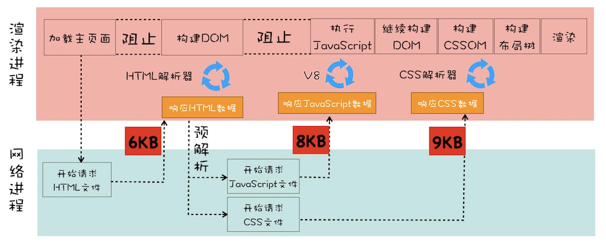
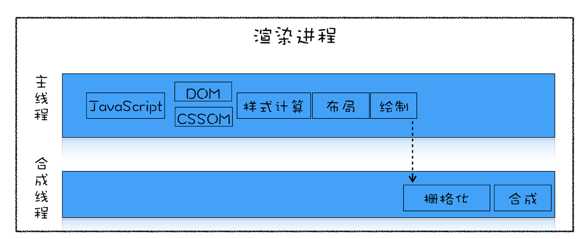
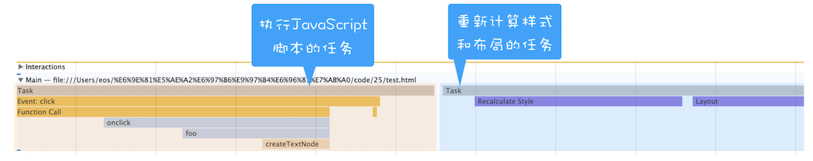
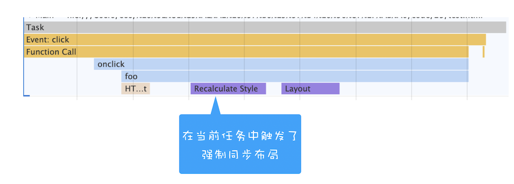
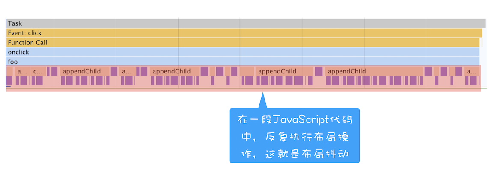

## 浏览器中的页面
1. 分层和合成机制：为什么CSS动画比JavaScript高效？
   1. 序言
      1. 在前面《05 | 渲染流程（上）：HTML、CSS 和 JavaScript 文件，是如何变成页面的？》文章中，我们介绍过 DOM 树生成之后，还要经历布局、分层、绘制、合成、显示等阶段后才能显示出漂亮的页面。
      2. 本文我们主要讲解渲染引擎的分层和合成机制，因为分层和合成机制代表了浏览器最为先进的合成技术，Chrome 团队为了做到这一点，做了大量的优化工作。
   2. 显示器是怎么显示图像的
      1. 每个显示器都有固定的刷新频率，通常是 60HZ，也就是每秒更新 60 张图片
         1. 更新的图片都来自于显卡中一个叫前缓冲区的地方，显示器所做的任务很简单，就是每秒固定读取 60 次前缓冲区中的图像，并将读取的图像显示到显示器上。
      2. 那么这里显卡做什么呢？
         1. 显卡的职责就是合成新的图像，并将图像保存到后缓冲区中
         2. 一旦显卡把合成的图像写到后缓冲区，系统就会让后缓冲区和前缓冲区互换，这样就能保证显示器能读取到最新显卡合成的图像。
         3. 通常情况下，显卡的更新频率和显示器的刷新频率是一致的。
         4. 但有时候，在一些复杂的场景中，显卡处理一张图片的速度会变慢，这样就会造成视觉上的卡顿。
      3. 帧 VS 帧率
         1. 了解了显示器是怎么显示图像的之后，下面我们再来明确下帧和帧率的概念，因为这是后续一切分析的基础。
         2. 当你通过滚动条滚动页面，或者通过手势缩放页面时，屏幕上就会产生动画的效果。
            1. 之所以你能感觉到有动画的效果，是因为在滚动或者缩放操作时，渲染引擎会通过渲染流水线生成新的图片，并发送到显卡的后缓冲区。
         3. 大多数设备屏幕的更新频率是 60 次 / 秒，这也就意味着正常情况下要实现流畅的动画效果，渲染引擎需要每秒更新 60 张图片到显卡的后缓冲区。
         4. 我们把渲染流水线生成的每一副图片称为一帧，把渲染流水线每秒更新了多少帧称为帧率，比如滚动过程中 1 秒更新了 60 帧，那么帧率就是 60Hz（或者 60FPS）。
         5. 由于用户很容易观察到那些丢失的帧，如果在一次动画过程中，渲染引擎生成某些帧的时间过久，那么用户就会感受到卡顿，这会给用户造成非常不好的印象。
         6. 要解决卡顿问题，就要解决每帧生成时间过久的问题，为此 Chrome 对浏览器渲染方式做了大量的工作，其中最卓有成效的策略就是引入了分层和合成机制。
            1. 分层和合成机制代表了当今最先进的渲染技术，所以接下来我们就来分析下什么是合成和渲染技术。
      4. 如何生成一帧图像
         1. 在开始之前，我们还需要聊一聊渲染引擎是如何生成一帧图像的。
            1. 这需要回顾下我们前面《06 | 渲染流程（下）：HTML、CSS 和 JavaScript 文件，是如何变成页面的？》介绍的渲染流水线。关于其中任意一帧的生成方式，有重排、重绘和合成三种方式。
         2. 这三种方式的渲染路径是不同的，通常渲染路径越长，生成图像花费的时间就越多。
            1. 比如重排，它需要重新根据 CSSOM 和 DOM 来计算布局树，这样生成一幅图片时，会让整个渲染流水线的每个阶段都执行一遍，如果布局复杂的话，就很难保证渲染的效率了
            2. 而重绘因为没有了重新布局的阶段，操作效率稍微高点，但是依然需要重新计算绘制信息，并触发绘制操作之后的一系列操作。
            3. 相较于重排和重绘，合成操作的路径就显得非常短了，并不需要触发布局和绘制两个阶段，如果采用了 GPU，那么合成的效率会非常高。
            4. 所以，关于渲染引擎生成一帧图像的几种方式，按照效率我们推荐合成方式优先，若实在不能满足需求，那么就再退后一步使用重绘或者重排的方式。
         3. 本文我们的焦点在合成上，所以接下来我们就来深入分析下 Chrome 浏览器是怎么实现合成操作的。Chrome 中的合成技术，可以用三个词来概括总结：分层、分块和合成。
      5. 分层和合成
         1. 通常页面的组成是非常复杂的，有的页面里要实现一些复杂的动画效果，比如点击菜单时弹出菜单的动画特效，滚动鼠标滚轮时页面滚动的动画效果，当然还有一些炫酷的 3D 动画特效
            1. 如果没有采用分层机制，从布局树直接生成目标图片的话，那么每次页面有很小的变化时，都会触发重排或者重绘机制
            2. 这种“牵一发而动全身”的绘制策略会严重影响页面的渲染效率。
         2. 为了提升每帧的渲染效率，Chrome 引入了分层和合成的机制。那该怎么来理解分层和合成机制呢？
            1. 你可以把一张网页想象成是由很多个图片叠加在一起的，每个图片就对应一个图层，Chrome 合成器最终将这些图层合成了用于显示页面的图片
            2. 如果你熟悉 PhotoShop 的话，就能很好地理解这个过程了
               1. PhotoShop 中一个项目是由很多图层构成的，每个图层都可以是一张单独图片
               2. 可以设置透明度、边框阴影，可以旋转或者设置图层的上下位置，将这些图层叠加在一起后，就能呈现出最终的图片了。
         3. 在这个过程中，将素材分解为多个图层的操作就称为分层，最后将这些图层合并到一起的操作就称为合成。所以，分层和合成通常是一起使用的。
            1. 考虑到一个页面被划分为两个层，当进行到下一帧的渲染时，上面的一帧可能需要实现某些变换
            2. 如平移、旋转、缩放、阴影或者 Alpha 渐变，这时候合成器只需要将两个层进行相应的变化操作就可以了
            3. 显卡处理这些操作驾轻就熟，所以这个合成过程时间非常短。
         4. 理解了为什么要引入合成和分层机制，下面我们再来看看 Chrome 是怎么实现分层和合成机制的。
            1. 在 Chrome 的渲染流水线中，分层体现在生成布局树之后
               1. 渲染引擎会根据布局树的特点将其转换为层树（Layer Tree），层树是渲染流水线后续流程的基础结构
            2. 层树中的每个节点都对应着一个图层，下一步的绘制阶段就依赖于层树中的节点。
               1. 在《06 | 渲染流程（下）：HTML、CSS 和 JavaScript 文件，是如何变成页面的？》中我们介绍过，绘制阶段其实并不是真正地绘出图片，而是将绘制指令组合成一个列表
               2. 比如一个图层要设置的背景为黑色，并且还要在中间画一个圆形，那么绘制过程会生成|Paint BackGroundColor:Black | Paint Circle|这样的绘制指令列表，绘制过程就完成了。
            3. 有了绘制列表之后，就需要进入光栅化阶段了
               1. 光栅化就是按照绘制列表中的指令生成图片。
               2. 每一个图层都对应一张图片，合成线程有了这些图片之后，会将这些图片合成为“一张”图片，并最终将生成的图片发送到后缓冲区。
               3. 这就是一个大致的分层、合成流程。
         5. 需要重点关注的是，合成操作是在合成线程上完成的，这也就意味着在执行合成操作时，是不会影响到主线程执行的
            1. 这就是为什么经常主线程卡住了，但是 CSS 动画依然能执行的原因。
      6. 分块
         1. 如果说分层是从宏观上提升了渲染效率，那么分块则是从微观层面提升了渲染效率
            1. 通常情况下，页面的内容都要比屏幕大得多，显示一个页面时，如果等待所有的图层都生成完毕，再进行合成的话，会产生一些不必要的开销，也会让合成图片的时间变得更久。
            2. 因此，合成线程会将每个图层分割为大小固定的图块，然后优先绘制靠近视口的图块，这样就可以大大加速页面的显示速度。
            3. 不过有时候， 即使只绘制那些优先级最高的图块，也要耗费不少的时间，因为涉及到一个很关键的因素——纹理上传，这是因为从计算机内存上传到 GPU 内存的操作会比较慢。
         2. 为了解决这个问题，Chrome 又采取了一个策略：在首次合成图块的时候使用一个低分辨率的图片。
            1. 比如可以是正常分辨率的一半，分辨率减少一半，纹理就减少了四分之三
            2. 在首次显示页面内容的时候，将这个低分辨率的图片显示出来，然后合成器继续绘制正常比例的网页内容，当正常比例的网页内容绘制完成后，再替换掉当前显示的低分辨率内容
            3. 这种方式尽管会让用户在开始时看到的是低分辨率的内容，但是也比用户在开始时什么都看不到要好。
      7. 如何利用分层技术优化代码
         1. 通过上面的介绍，相信你已经理解了渲染引擎是怎么将布局树转换为漂亮图片的，理解其中原理之后，你就可以利用分层和合成技术来优化代码了。
         2. 在写 Web 应用的时候，你可能经常需要对某个元素做几何形状变换、透明度变换或者一些缩放操作，如果使用 JavaScript 来写这些效果，会牵涉到整个渲染流水线，所以 JavaScript 的绘制效率会非常低下。
         3. 这时你可以使用 will-change 来告诉渲染引擎你会对该元素做一些特效变换，CSS 代码如下：
            ```
            .box {
            will-change: transform, opacity;
            }
            ```
            1. 这段代码就是提前告诉渲染引擎 box 元素将要做几何变换和透明度变换操作
            2. 这时候渲染引擎会将该元素单独实现一帧，等这些变换发生时，渲染引擎会通过合成线程直接去处理变换
            3. 这些变换并没有涉及到主线程，这样就大大提升了渲染的效率
            4. 这也是 CSS 动画比 JavaScript 动画高效的原因。
         4. 所以，如果涉及到一些可以使用合成线程来处理 CSS 特效或者动画的情况，就尽量使用 will-change 来提前告诉渲染引擎,让它为该元素准备独立的层
            1. 但是凡事都有两面性，每当渲染引擎为一个元素准备一个独立层的时候，它占用的内存也会大大增加
            2. 因为从层树开始，后续每个阶段都会多一个层结构，这些都需要额外的内存，所以你需要恰当地使用 will-change。
2. 页面性能：如何系统地优化页面？
   1. 这里我们所谈论的页面优化，其实就是要让页面更快地显示和响应。
      1. 由于一个页面在它不同的阶段，所侧重的关注点是不一样的，所以如果我们要讨论页面优化，就要分析一个页面生存周期的不同阶段。
      2. 通常一个页面有三个阶段：加载阶段、交互阶段和关闭阶段
         1. 加载阶段，是指从发出请求到渲染出完整页面的过程，影响到这个阶段的主要因素有网络和 JavaScript 脚本。
         2. 交互阶段，主要是从页面加载完成到用户交互的整合过程，影响到这个阶段的主要因素是 JavaScript 脚本
         3. 关闭阶段，主要是用户发出关闭指令后页面所做的一些清理操作
      3. 这里我们需要重点关注加载阶段和交互阶段，因为影响到我们体验的因素主要都在这两个阶段，下面我们就来逐个详细分析下。
   2. 加载阶段
      1. 我们先来分析如何系统优化加载阶段中的页面，还是先看一个典型的渲染流水线，如下图所示：
         1. 
         2. 观察上面这个渲染流水线，你能分析出来有哪些因素影响了页面加载速度吗？下面我们就先来分析下这个问题。
            1. 通过前面文章的讲解，你应该已经知道了并非所有的资源都会阻塞页面的首次绘制，比如图片、音频、视频等文件就不会阻塞页面的首次渲染
            2. 而 JavaScript、首次请求的 HTML 资源文件、CSS 文件是会阻塞首次渲染的
            3. 因为在构建 DOM 的过程中需要 HTML 和 JavaScript 文件，在构造渲染树的过程中需要用到 CSS 文件。
         3. 我们把这些能阻塞网页首次渲染的资源称为关键资源
            1. 基于关键资源，我们可以继续细化出来三个影响页面首次渲染的核心因素。
            2. 第一个是关键资源个数
               1. 关键资源个数越多，首次页面的加载时间就会越长。比如上图中的关键资源个数就是 3 个，1 个 HTML 文件、1 个 JavaScript 和 1 个 CSS 文件
            3. 第二个是关键资源大小
               1. 通常情况下，所有关键资源的内容越小，其整个资源的下载时间也就越短，那么阻塞渲染的时间也就越短。
               2. 上图中关键资源的大小分别是 6KB、8KB 和 9KB，那么整个关键资源大小就是 23KB。
            4. 第三个是请求关键资源需要多少个 RTT（Round Trip Time）
               1. 那什么是 RTT 呢？ 在《02 | TCP 协议：如何保证页面文件能被完整送达浏览器？》这篇文章中我们分析过
               2. 当使用 TCP 协议传输一个文件时，比如这个文件大小是 0.1M，由于 TCP 的特性，这个数据并不是一次传输到服务端的，而是需要拆分成一个个数据包来回多次进行传输的
               3. RTT 就是这里的往返时延。
               4. 它是网络中一个重要的性能指标，表示从发送端发送数据开始，到发送端收到来自接收端的确认，总共经历的时延
               5. 通常 1 个 HTTP 的数据包在 14KB 左右，所以 1 个 0.1M 的页面就需要拆分成 8 个包来传输了，也就是说需要 8 个 RTT
            5. 我们可以结合上图来看看它的关键资源请求需要多少个 RTT
               1. 首先是请求 HTML 资源，大小是 6KB，小于 14KB，所以 1 个 RTT 就可以解决了
               2. 至于 JavaScript 和 CSS 文件，这里需要注意一点
                  1. 由于渲染引擎有一个预解析的线程，在接收到 HTML 数据之后，预解析线程会快速扫描 HTML 数据中的关键资源
                  2. 一旦扫描到了，会立马发起请求，你可以认为 JavaScript 和 CSS 是同时发起请求的，所以它们的请求是重叠的
                  3. 那么计算它们的 RTT 时，只需要计算体积最大的那个数据就可以了
               3. 这里最大的是 CSS 文件（9KB），所以我们就按照 9KB 来计算，同样由于 9KB 小于 14KB，所以 JavaScript 和 CSS 资源也就可以算成 1 个 RTT
               4. 也就是说，上图中关键资源请求共花费了 2 个 RTT。
         4. 了解了影响加载过程中的几个核心因素之后，接下来我们就可以系统性地考虑优化方案了。
            1. 总的优化原则就是减少关键资源个数，降低关键资源大小，降低关键资源的 RTT 次数
            2. 如何减少关键资源的个数
               1. 一种方式是可以将 JavaScript 和 CSS 改成内联的形式，比如上图的 JavaScript 和 CSS，若都改成内联模式，那么关键资源的个数就由 3 个减少到了 1 个
               2. 另一种方式，如果 JavaScript 代码没有 DOM 或者 CSSOM 的操作，则可以改成 async 或者 defer 属性
               3. 同样对于 CSS，如果不是在构建页面之前加载的，则可以添加媒体取消阻止显现的标志
               4. 当 JavaScript 标签加上了 async 或者 defer、CSSlink 属性之前加上了取消阻止显现的标志后，它们就变成了非关键资源了。
            3. 如何减少关键资源的大小
               1. 可以压缩 CSS 和 JavaScript 资源，移除 HTML、CSS、JavaScript 文件中一些注释内容，也可以通过前面讲的取消 CSS 或者 JavaScript 中关键资源的方式。
            4. 如何减少关键资源 RTT 的次数
               1. 可以通过减少关键资源的个数和减少关键资源的大小搭配来实现
               2. 除此之外，还可以使用 CDN 来减少每次 RTT 时长
         5. 在优化实际的页面加载速度时，你可以先画出优化之前关键资源的图表，然后按照上面优化关键资源的原则去优化，优化完成之后再画出优化之后的关键资源图表。
   3. 交互阶段
      1. 接下来我们再来聊聊页面加载完成之后的交互阶段以及应该如何去优化
         1. 谈交互阶段的优化，其实就是在谈渲染进程渲染帧的速度
         2. 因为在交互阶段，帧的渲染速度决定了交互的流畅度。
         3. 因此讨论页面优化实际上就是讨论渲染引擎是如何渲染帧的，否则就无法优化帧率。
      2. 我们先来看看交互阶段的渲染流水线（如下图）。
         1. 
         2. 和加载阶段的渲染流水线有一些不同的地方是，在交互阶段没有了加载关键资源和构建 DOM、CSSOM 流程，通常是由 JavaScript 触发交互动画的。
         3. 结合上图，我们来一起回顾下交互阶段是如何生成一个帧的
            1. 大部分情况下，生成一个新的帧都是由 JavaScript 通过修改 DOM 或者 CSSOM 来触发的
            2. 还有另外一部分帧是由 CSS 来触发的。
            3. 如果在计算样式阶段发现有布局信息的修改，那么就会触发重排操作，然后触发后续渲染流水线的一系列操作，这个代价是非常大的。
            4. 同样如果在计算样式阶段没有发现有布局信息的修改，只是修改了颜色一类的信息，那么就不会涉及到布局相关的调整，所以可以跳过布局阶段，直接进入绘制阶段，这个过程叫重绘。不过重绘阶段的代价也是不小的。
            5. 还有另外一种情况，通过 CSS 实现一些变形、渐变、动画等特效，这是由 CSS 触发的，并且是在合成线程上执行的，这个过程称为合成。因为它不会触发重排或者重绘，而且合成操作本身的速度就非常快，所以执行合成是效率最高的方式。
      3. 回顾了在交互过程中的帧是如何生成的，那接下来我们就可以讨论优化方案了。一个大的原则就是让单个帧的生成速度变快。
         1. 所以，下面我们就来分析下在交互阶段渲染流水线中有哪些因素影响了帧的生成速度以及如何去优化。
         2. 减少 JavaScript 脚本执行时间
            1. 有时 JavaScript 函数的一次执行时间可能有几百毫秒，这就严重霸占了主线程执行其他渲染任务的时间。
            2. 针对这种情况我们可以采用以下两种策略：
               1. 一种是将一次执行的函数分解为多个任务，使得每次的执行时间不要过久。
               2. 另一种是采用 Web Workers。
                  1. 可以把 Web Workers 当作主线程之外的一个线程，在 Web Workers 中是可以执行 JavaScript 脚本的
                  2. 不过 Web Workers 中没有 DOM、CSSOM 环境
                  3. 这意味着在 Web Workers 中是无法通过 JavaScript 来访问 DOM 的，所以我们可以把一些和 DOM 操作无关且耗时的任务放到 Web Workers 中去执行。
            3. 总之，在交互阶段，对 JavaScript 脚本总的原则就是不要一次霸占太久主线程
         3. 避免强制同步布局
            1. 在介绍强制同步布局之前，我们先来聊聊正常情况下的布局操作
               1. 通过 DOM 接口执行添加元素或者删除元素等操作后，是需要重新计算样式和布局的，不过正常情况下这些操作都是在另外的任务中异步完成的
               2. 这样做是为了避免当前的任务占用太长的主线程时间
               3. 为了直观理解，你可以参考下面的代码：
                  ```
                  <html>
                  <body>
                      <div id="mian_div">
                          <li id="time_li">time</li>
                          <li>geekbang</li>
                      </div>

                      <p id="demo">强制布局demo</p>
                      <button onclick="foo()">添加新元素</button>

                      <script>
                          function foo() {
                              let main_div = document.getElementById("mian_div")      
                              let new_node = document.createElement("li")
                              let textnode = document.createTextNode("time.geekbang")
                              new_node.appendChild(textnode);
                              document.getElementById("mian_div").appendChild(new_node);
                          }
                      </script>
                  </body>
                  </html>
                  ```
                  1. 对于上面这段代码，我们可以使用 Performance 工具来记录添加元素的过程，如下图所示：
                  2. 
                  3. 从图中可以看出来，执行 JavaScript 添加元素是在一个任务中执行的，重新计算样式布局是在另外一个任务中执行，这就是正常情况下的布局操作。
            2. 理解了正常情况下的布局操作，接下来我们就可以聊什么是强制同步布局了。
               1. 所谓强制同步布局，是指 JavaScript 强制将计算样式和布局操作提前到当前的任务中
               2. 为了直观理解，这里我们对上面的代码做了一点修改，让它变成强制同步布局，修改后的代码如下所示：
                  ```
                  function foo() {
                      let main_div = document.getElementById("mian_div")
                      let new_node = document.createElement("li")
                      let textnode = document.createTextNode("time.geekbang")
                      new_node.appendChild(textnode);
                      document.getElementById("mian_div").appendChild(new_node);
                      //由于要获取到offsetHeight，
                      //但是此时的offsetHeight还是老的数据，
                      //所以需要立即执行布局操作
                      console.log(main_div.offsetHeight)
                  }
                  ```
                  1. 将新的元素添加到 DOM 之后，我们又调用了main_div.offsetHeight来获取新 main_div 的高度信息
                  2. 如果要获取到 main_div 的高度，就需要重新布局，所以这里在获取到 main_div 的高度之前，JavaScript 还需要强制让渲染引擎默认执行一次布局操作
                  3. 我们把这个操作称为强制同步布局。
                  4. 同样，你可以看下面通过 Performance 记录的任务状态：
                     1. 从上图可以看出来，计算样式和布局都是在当前脚本执行过程中触发的，这就是强制同步布局。
               3. 为了避免强制同步布局，我们可以调整策略，在修改 DOM 之前查询相关值。代码如下所示：
                  ```
                  function foo() {
                      let main_div = document.getElementById("mian_div")
                      //为了避免强制同步布局，在修改DOM之前查询相关值
                      console.log(main_div.offsetHeight)
                      let new_node = document.createElement("li")
                      let textnode = document.createTextNode("time.geekbang")
                      new_node.appendChild(textnode);
                      document.getElementById("mian_div").appendChild(new_node);
                      
                  }
                  ```
         4. 避免布局抖动
            1. 还有一种比强制同步布局更坏的情况，那就是布局抖动
               1. 所谓布局抖动，是指在一次 JavaScript 执行过程中，多次执行强制布局和抖动操作
               2. 为了直观理解，你可以看下面的代码：
                  ```
                  function foo() {
                      let time_li = document.getElementById("time_li")
                      for (let i = 0; i < 100; i++) {
                          let main_div = document.getElementById("mian_div")
                          let new_node = document.createElement("li")
                          let textnode = document.createTextNode("time.geekbang")
                          new_node.appendChild(textnode);
                          new_node.offsetHeight = time_li.offsetHeight;
                          document.getElementById("mian_div").appendChild(new_node);
                      }
                  }
                  ```
               3. 我们在一个 for 循环语句里面不断读取属性值，每次读取属性值之前都要进行计算样式和布局
               4. 执行代码之后，使用 Performance 记录的状态如下所示：
            2. 从上图可以看出，在 foo 函数内部重复执行计算样式和布局，这会大大影响当前函数的执行效率。这种情况的避免方式和强制同步布局一样，都是尽量不要在修改 DOM 结构时再去查询一些相关值。
         5. 合理利用 CSS 合成动画
            1. 合成动画是直接在合成线程上执行的，这和在主线程上执行的布局、绘制等操作不同
            2. 如果主线程被 JavaScript 或者一些布局任务占用，CSS 动画依然能继续执行
            3. 所以要尽量利用好 CSS 合成动画，如果能让 CSS 处理动画，就尽量交给 CSS 来操作。
            4. 另外，如果能提前知道对某个元素执行动画操作，那就最好将其标记为 will-change，这是告诉渲染引擎需要将该元素单独生成一个图层。
         6. 避免频繁的垃圾回收
            1. 我们知道 JavaScript 使用了自动垃圾回收机制，如果在一些函数中频繁创建临时对象，那么垃圾回收器也会频繁地去执行垃圾回收策略
            2. 这样当垃圾回收操作发生时，就会占用主线程，从而影响到其他任务的执行，严重的话还会让用户产生掉帧、不流畅的感觉。
            3. 所以要尽量避免产生那些临时垃圾数据。那该怎么做呢？可以尽可能优化储存结构，尽可能避免小颗粒对象的产生。
         7. 