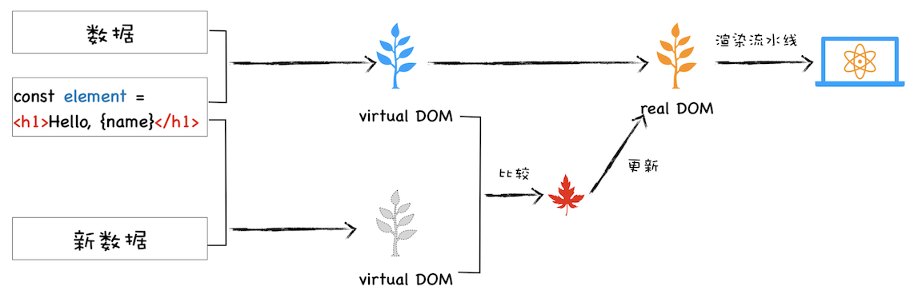
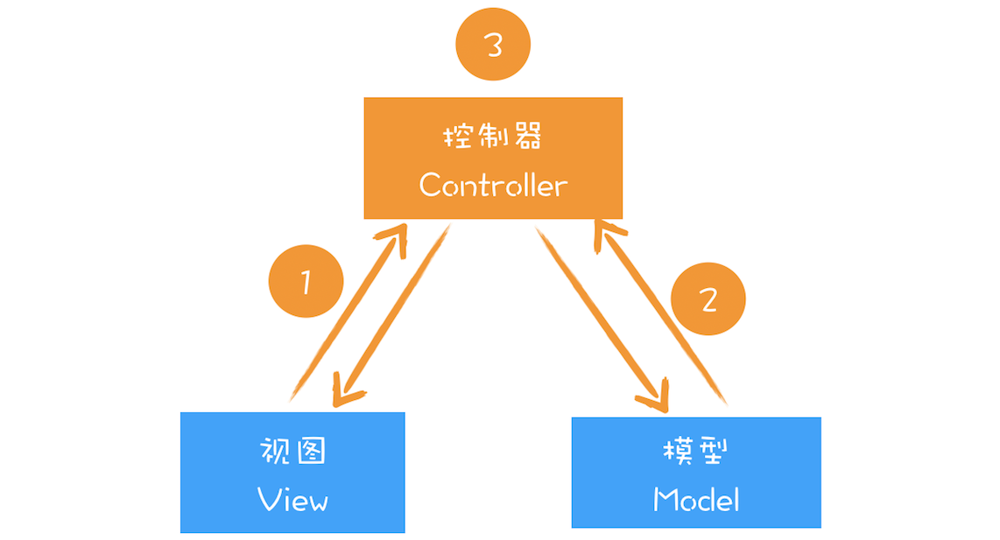
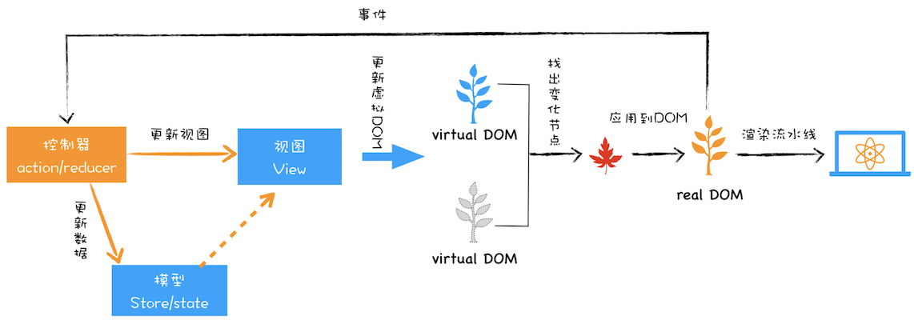
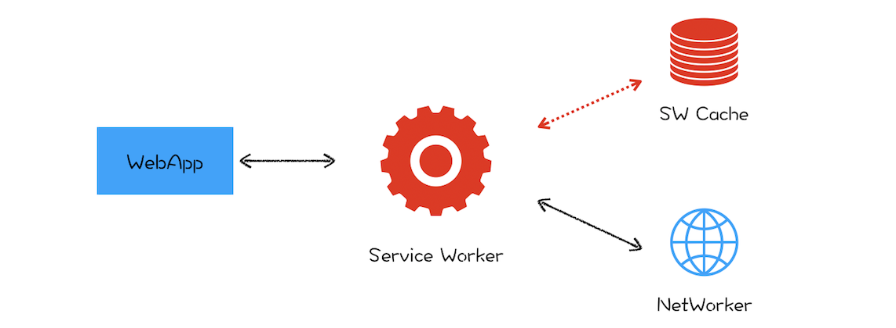
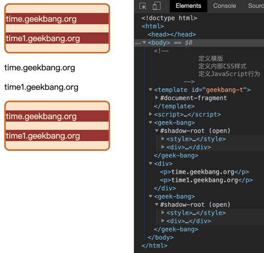
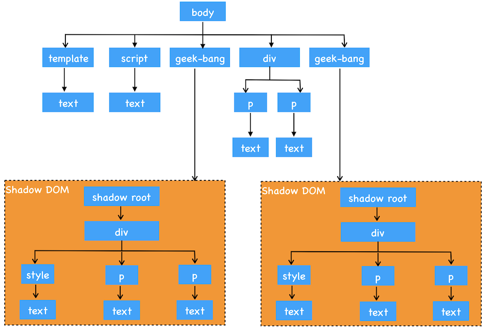

## 浏览器中的页面
1. 虚拟DOM：虚拟DOM和实际的DOM有何不同？ 
   1. 序言
      1. 在本文我们会先聊聊 DOM 的一些缺陷，然后在此基础上介绍虚拟 DOM 是如何解决这些缺陷的
      2. 最后再站在双缓存和 MVC 的视角来聊聊虚拟 DOM
      3. 理解了这些会让你对目前的前端框架有一个更加底层的认识，这也有助于你更好地理解这些前端框架。
   2. DOM 的缺陷
      1. 通过前面一系列文章的学习，你对 DOM 的生成过程应该已经有了比较深刻的理解，并且也知道了通过 JavaScript 操纵 DOM 是会影响到整个渲染流水线的。
      2. 另外，DOM 还提供了一组 JavaScript 接口用来遍历或者修改节点，这套接口包含了 getElementById、removeChild、appendChild 等方法。
         1. 比如，我们可以调用document.body.appendChild(node)往 body 节点上添加一个元素，调用该 API 之后会引发一系列的连锁反应。
         2. 首先渲染引擎会将 node 节点添加到 body 节点之上，然后触发样式计算、布局、绘制、栅格化、合成等任务，我们把这一过程称为重排。
         3. 除了重排之外，还有可能引起重绘或者合成操作，形象地理解就是“牵一发而动全身”。
         4. 另外，对于 DOM 的不当操作还有可能引发强制同步布局和布局抖动的问题，这些操作都会大大降低渲染效率。
         5. 因此，对于 DOM 的操作我们时刻都需要非常小心谨慎。
      3. 当然，对于简单的页面来说，其 DOM 结构还是比较简单的，所以以上这些操作 DOM 的问题并不会对用户体验产生太多影响。
         1. 但是对于一些复杂的页面或者目前使用非常多的单页应用来说，其 DOM 结构是非常复杂的
         2. 而且还需要不断地去修改 DOM 树，每次操作 DOM 渲染引擎都需要进行重排、重绘或者合成等操作
         3. 因为 DOM 结构复杂，所生成的页面结构也会很复杂，对于这些复杂的页面，执行一次重排或者重绘操作都是非常耗时的，这就给我们带来了真正的性能问题。
         4. 所以我们需要有一种方式来减少 JavaScript 对 DOM 的操作，这时候虚拟 DOM 就上场了。
   3. 什么是虚拟 DOM
      1. 在谈论什么是虚拟 DOM 之前，我们先来看看虚拟 DOM 到底要解决哪些事情。
         1. 将页面改变的内容应用到虚拟 DOM 上，而不是直接应用到 DOM 上。
         2. 变化被应用到虚拟 DOM 上时，虚拟 DOM 并不急着去渲染页面，而仅仅是调整虚拟 DOM 的内部状态，这样操作虚拟 DOM 的代价就变得非常轻了。
         3. 在虚拟 DOM 收集到足够的改变时，再把这些变化一次性应用到真实的 DOM 上
      2. 基于以上三点，我们再来看看什么是虚拟 DOM。为了直观理解，你可以参考下图 
         1. 
         2. 该图是我结合 React 流程画的一张虚拟 DOM 执行流程图，下面我们就结合这张图来分析下虚拟 DOM 到底怎么运行的。
            1. 创建阶段
               1. 首先依据 JSX 和基础数据创建出来虚拟 DOM，它反映了真实的 DOM 树的结构。
               2. 然后由虚拟 DOM 树创建出真实 DOM 树，真实的 DOM 树生成完后，再触发渲染流水线往屏幕输出页面。
            2. 更新阶段
               1. 如果数据发生了改变，那么就需要根据新的数据创建一个新的虚拟 DOM 树
               2. 然后 React 比较两个树，找出变化的地方，并把变化的地方一次性更新到真实的 DOM 树上
               3. 最后渲染引擎更新渲染流水线，并生成新的页面。
         3. 既然聊到虚拟 DOM 的更新，那我们就不得不聊聊最新的 React Fiber 更新机制
            1. 通过上图我们知道，当有数据更新时，React 会生成一个新的虚拟 DOM
               1. 然后拿新的虚拟 DOM 和之前的虚拟 DOM 进行比较，这个过程会找出变化的节点，然后再将变化的节点应用到 DOM 上。
            2. 这里我们重点关注下比较过程，最开始的时候，比较两个虚拟 DOM 的过程是在一个递归函数里执行的，其核心算法是 reconciliation
               1. 通常情况下，这个比较过程执行得很快，不过当虚拟 DOM 比较复杂的时候，执行比较函数就有可能占据主线程比较久的时间
               2. 这样就会导致其他任务的等待，造成页面卡顿。
               3. 为了解决这个问题，React 团队重写了 reconciliation 算法，新的算法称为 Fiber reconciler，之前老的算法称为 Stack reconciler。
            3. 在前面《20 | async/await：使用同步的方式去写异步代码》那篇文章中我们介绍了协程，其实协程的另外一个称呼就是 Fiber
               1. 所以在这里我们可以把 Fiber 和协程关联起来，那么所谓的 Fiber reconciler 相信你也很清楚了
               2. 就是在执行算法的过程中出让主线程，这样就解决了 Stack reconciler 函数占用时间过久的问题
               3. 至于具体的实现过程在这里我就不详细分析了，如果感兴趣的话，你可以自行查阅相关资料进行学习。
   4. 了解完虚拟 DOM 的大致执行流程，你应该也就知道为何需要虚拟 DOM 了
      1. 不过以上都从单纯的技术视角来分析虚拟 DOM 的，那接下来我们再从双缓存和 MVC 模型这两个视角来聊聊虚拟 DOM。
      2. 双缓存
         1. 在开发游戏或者处理其他图像的过程中，屏幕从前缓冲区读取数据然后显示
            1. 但是很多图形操作都很复杂且需要大量的运算，比如一幅完整的画面，可能需要计算多次才能完成
            2. 如果每次计算完一部分图像，就将其写入缓冲区，那么就会造成一个后果
            3. 那就是在显示一个稍微复杂点的图像的过程中，你看到的页面效果可能是一部分一部分地显示出来，因此在刷新页面的过程中，会让用户感受到界面的闪烁。
         2. 而使用双缓存，可以让你先将计算的中间结果存放在另一个缓冲区中，等全部的计算结束，该缓冲区已经存储了完整的图形之后，再将该缓冲区的图形数据一次性复制到显示缓冲区，这样就使得整个图像的输出非常稳定。
         3. 在这里，你可以把虚拟 DOM 看成是 DOM 的一个 buffer
            1. 和图形显示一样，它会在完成一次完整的操作之后，再把结果应用到 DOM 上，这样就能减少一些不必要的更新，同时还能保证 DOM 的稳定输出。
      3. MVC 模式
         1. 到这里我们了解了虚拟 DOM 是一种类似双缓存的实现
            1. 不过如果站在技术角度来理解虚拟缓存，依然不能全面理解其含义
            2. 那么接下来我们再来看看虚拟 DOM 在 MVC 模式中所扮演的角色。
         2. 在各大设计模式当中，MVC 是一个非常重要且应用广泛的模式
            1. 因为它能将数据和视图进行分离，在涉及到一些复杂的项目时，能够大大减轻项目的耦合度，使得程序易于维护
            2. 关于 MVC 的基础结构，你可以先参考下图：
               1. 
               2. 通过上图你可以发现，MVC 的整体结构比较简单，由模型、视图和控制器组成，其核心思想就是将数据和视图分离
               3. 也就是说视图和模型之间是不允许直接通信的，它们之间的通信都是通过控制器来完成的
               4. 通常情况下的通信路径是视图发生了改变，然后通知控制器，控制器再根据情况判断是否需要更新模型数据
            3. 当然还可以根据不同的通信路径和控制器不同的实现方式，基于 MVC 又能衍生出很多其他的模式，如 MVP、MVVM 等，不过万变不离其宗，它们的基础骨架都是基于 MVC 而来。
         3. 所以在分析基于 React 或者 Vue 这些前端框架时，我们需要先重点把握大的 MVC 骨架结构
            1. 然后再重点查看通信方式和控制器的具体实现方式，这样我们就能从架构的视角来理解这些前端框架了
            2. 比如在分析 React 项目时，我们可以把 React 的部分看成是一个 MVC 中的视图
            3. 在项目中结合 Redux 就可以构建一个 MVC 的模型结构，如下图所示：
               1. 
            4. 在该图中，我们可以把虚拟 DOM 看成是 MVC 的视图部分，其控制器和模型都是由 Redux 提供的。其具体实现过程如下：
               1. 图中的控制器是用来监控 DOM 的变化，一旦 DOM 发生变化，控制器便会通知模型，让其更新数据；
               2. 模型数据更新好之后，控制器会通知视图，告诉它模型的数据发生了变化
               3. 视图接收到更新消息之后，会根据模型所提供的数据来生成新的虚拟 DOM
               4. 新的虚拟 DOM 生成好之后，就需要与之前的虚拟 DOM 进行比较，找出变化的节点
               5. 比较出变化的节点之后，React 将变化的虚拟节点应用到 DOM 上，这样就会触发 DOM 节点的更新
               6. DOM 节点的变化又会触发后续一系列渲染流水线的变化，从而实现页面的更新
            5. 在实际工程项目中，你需要学会分析出这各个模块，并梳理出它们之间的通信关系，这样对于任何框架你都能轻松上手了。
2. 渐进式网页应用（PWA）：它究竟解决了Web应用的哪些问题？
   1. 序言
      1. 在专栏开篇词中，我们提到过浏览器的三大进化路线：
         1. 第一个是应用程序 Web 化；
         2. 第二个是 Web 应用移动化；
         3. 第三个是 Web 操作系统化；
      2. 其中，第二个 Web 应用移动化是 Google 梦寐以求而又一直在发力的一件事
         1. 不过对于移动设备来说，前有本地 App，后有移动小程序，想要浏览器切入到移动端是相当困难的一件事
         2. 因为浏览器的运行性能是低于本地 App 的，并且 Google 也没有类似微信或者 Facebook 这种体量的用户群体。
      3. 但是要让浏览器切入到移动端，让其取得和原生应用同等待遇可是 Google 的梦想，那该怎么做呢？
         1. 这就是我们本节要聊的 PWA。那什么是 PWA？PWA 又是以什么方式切入到移动端的呢？
      4. PWA
         1. 全称是 Progressive Web App，翻译过来就是渐进式网页应用
            1. 根据字面意思，它就是“渐进式 +Web 应用”
            2. 对于 Web 应用很好理解了，就是目前我们普通的 Web 页面，所以 PWA 所支持的首先是一个 Web 页面
            3. 至于“渐进式”，就需要从下面两个方面来理解。
               1. 站在 Web 应用开发者来说，PWA 提供了一个渐进式的过渡方案，让 Web 应用能逐步具有本地应用的能力。采取渐进式可以降低站点改造的代价，使得站点逐步支持各项新技术，而不是一步到位。
               2. 站在技术角度来说，PWA 技术也是一个渐进式的演化过程，在技术层面会一点点演进，比如逐渐提供更好的设备特性支持，不断优化更加流畅的动画效果，不断让页面的加载速度变得更快，不断实现本地应用的特性。
         2. 从这两点可以看出来，PWA 采取的是非常一个缓和的渐进式策略，不再像以前那样激进，动不动就是取代本地 App、取代小程序。
            1. 与之相反，而是要充分发挥 Web 的优势，渐进式地缩短和本地应用或者小程序的距离。
         3. 那么 Web 最大的优势是什么呢？我认为是自由开放
            1. 也正是因为自由和开放，所以大家就很容易对同一件事情达成共识，达成共识之后，一套代码就可以运行在各种设备之上了
            2. 这就是跨平台，这也恰恰是本地应用所不具备的。
            3. 而对于小程序，倒是可以实现跨平台，但要让各家达成共识，目前来看，似乎还是非常不切实际的。
         4. 所以我给 PWA 的定义就是：它是一套理念，渐进式增强 Web 的优势，并通过技术手段渐进式缩短和本地应用或者小程序的距离
            1. 基于这套理念之下的技术都可以归类到 PWA
            2. 那今天我们就主要来聊聊 PWA 主要采用了哪些技术手段来缩短它和本地应用或者小程序的距离。
   2. Web 应用 VS 本地应用
      1. 那相对于本地应用，Web 页面到底缺少了什么
         1. 首先，Web 应用缺少离线使用能力，在离线或者在弱网环境下基本上是无法使用的。而用户需要的是沉浸式的体验，在离线或者弱网环境下能够流畅地使用是用户对一个应用的基本要求。
         2. 其次，Web 应用还缺少了消息推送的能力，因为作为一个 App 厂商，需要有将消息送达到应用的能力。
         3. 最后，Web 应用缺少一级入口，也就是将 Web 应用安装到桌面，在需要的时候直接从桌面打开 Web 应用，而不是每次都需要通过浏览器来打开
      2. 针对以上 Web 缺陷，PWA 提出了两种解决方案：通过引入 Service Worker 来试着解决离线存储和消息推送的问题，通过引入 manifest.json 来解决一级入口的问题
         1. 什么是 Service Worker
            1. 我们先来看看 Service Worker 是怎么解决离线存储和消息推送的问题。
               1. 其实在 Service Worker 之前，WHATWG 小组就推出过用 App Cache 标准来缓存页面
               2. 不过在使用过程中 App Cache 所暴露的问题比较多，遭到多方吐槽，所以这个标准最终也只能被废弃了，可见一个成功的标准是需要经历实践考量的。
            2. 所以在 2014 年的时候，标准委员会就提出了 Service Worker 的概念，它的主要思想是在页面和网络之间增加一个拦截器，用来缓存和拦截请求。
               1. 整体结构如下图所示： 
               2. 在没有安装 Service Worker 之前，WebApp 都是直接通过网络模块来请求资源的
               3. 安装了 Service Worker 模块之后，WebApp 请求资源时，会先通过 Service Worker
               4. 让它判断是返回 Service Worker 缓存的资源还是重新去网络请求资源。一切的控制权都交由 Service Worker 来处理。
         2. Service Worker 的设计思路
            1. 现在我们知道 Service Worker 的主要功能就是拦截请求和缓存资源
               1. 接下来我们就从 Web 应用的需求角度来看看 Service Worker 的设计思路。
            2. 架构
               1. 通过前面页面循环系统的分析，我们已经知道了 JavaScript 和页面渲染流水线的任务都是在页面主线程上执行的
                  1. 如果一段 JavaScript 执行时间过久，那么就会阻塞主线程，使得渲染一帧的时间变长
                  2. 从而让用户产生卡顿的感觉，这对用户来说体验是非常不好的
               2. 为了避免 JavaScript 过多占用页面主线程时长的情况，浏览器实现了 Web Worker 的功能。
                  1. Web Worker 的目的是让 JavaScript 能够运行在页面主线程之外
                  2. 不过由于 Web Worker 中是没有当前页面的 DOM 环境的，所以在 Web Worker 中只能执行一些和 DOM 无关的 JavaScript 脚本
                  3. 并通过 postMessage 方法将执行的结果返回给主线程。
                  4. 所以说在 Chrome 中， Web Worker 其实就是在渲染进程中开启的一个新线程，它的生命周期是和页面关联的。
               3. “让其运行在主线程之外”就是 Service Worker 来自 Web Worker 的一个核心思想。
                  1. 不过 Web Worker 是临时的，每次 JavaScript 脚本执行完成之后都会退出，执行结果也不能保存下来
                  2. 如果下次还有同样的操作，就还得重新来一遍。所以 Service Worker 需要在 Web Worker 的基础之上加上储存功能。
               4. 另外，由于 Service Worker 还需要会为多个页面提供服务，所以还不能把 Service Worker 和单个页面绑定起来。
                  1. 在目前的 Chrome 架构中，Service Worker 是运行在浏览器进程中的，因为浏览器进程生命周期是最长的
                  2. 所以在浏览器的生命周期内，能够为所有的页面提供服务。
            3. 消息推送
               1. 消息推送也是基于 Service Worker 来实现的。
               2. 因为消息推送时，浏览器页面也许并没有启动，这时就需要 Service Worker 来接收服务器推送的消息，并将消息通过一定方式展示给用户。
               3. 关于消息推送的细节这里我们就不详述了，如果你感兴趣的话可以自行搜索相关资料去学习。
            4. 安全
               1. 基于 Web 应用的业务越来越多了，其安全问题是不可忽视的，所以在设计 Service Worker 之初，安全问题就被提上了日程。
               2. 关于安全，其中最为核心的一条就是 HTTP。
                  1. 我们知道，HTTP 采用的是明文传输信息，存在被窃听、被篡改和被劫持的风险，在项目中使用 HTTP 来传输数据无疑是“裸奔”
                  2. 所以在设计之初，就考虑对 Service Worker 采用 HTTPS 协议，因为采用 HTTPS 的通信数据都是经过加密的
                  3. 即便拦截了数据，也无法破解数据内容，而且 HTTPS 还有校验机制，通信双方很容易知道数据是否被篡改
                  4. 关于 HTTPS 协议，我们会在最后的安全模块详细介绍。
               3. 所以要使站点支持 Service Worker，首先必要的一步就是要将站点升级到 HTTPS。
               4. 除了必须要使用 HTTPS，Service Worker 还需要同时支持 Web 页面默认的安全策略，诸如同源策略、内容安全策略（CSP）等，关于这些，后续我们也会详细介绍。
3. WebComponent：像搭积木一样构建Web应用
   1. 序言
      1. 今天我们要站在开发者和项目角度来聊聊 WebComponent，同样它也是一套技术的组合，能提供给开发者组件化开发的能力。
      2. 那什么是组件化呢？
         1. 其实组件化并没有一个明确的定义，不过这里我们可以使用 10 个字来形容什么是组件化，那就是：对内高内聚，对外低耦合。
         2. 对内各个元素彼此紧密结合、相互依赖，对外和其他组件的联系最少且接口简单。
      3. 可以说，程序员对组件化开发有着天生的需求，因为一个稍微复杂点的项目，就涉及到多人协作开发的问题
         1. 每个人负责的组件需要尽可能独立完成自己的功能，其组件的内部状态不能影响到别人的组件，在需要和其他组件交互的地方得提前协商好接口
         2. 通过组件化可以降低整个系统的耦合度，同时也降低程序员之间沟通复杂度，让系统变得更加易于维护。
      4. 使用组件化能带来很多优势，所以很多语言天生就对组件化提供了很好的支持
         1. 比如 C/C++ 就可以很好地将功能封装成模块
         2. 无论是业务逻辑，还是基础功能，抑或是 UI，都能很好地将其组合在一起，实现组件内部的高度内聚、组件之间的低耦合
      5. 大部分语言都能实现组件化，归根结底在于编程语言特性
         1. 大多数语言都有自己的函数级作用域、块级作用域和类
         2. 可以将内部的状态数据隐藏在作用域之下或者对象的内部，这样外部就无法访问了，然后通过约定好的接口和外部进行通信。
      6. JavaScript 虽然有不少缺点，但是作为一门编程语言，它也能很好地实现组件化
         1. 毕竟有自己的函数级作用域和块级作用域，所以封装内部状态数据并提供接口给外部都是没有问题的。
      7. 既然 JavaScript 可以很好地实现组件化，那么我们所谈论的 WebComponent 到底又是什么呢？
   2. 阻碍前端组件化的因素
      1. 在前端虽然 HTML、CSS 和 JavaScript 是强大的开发语言，但是在大型项目中维护起来会比较困难
         1. 如果在页面中嵌入第三方内容时，还需要确保第三方的内容样式不会影响到当前内容，同样也要确保当前的 DOM 不会影响到第三方的内容。
         2. 所以要聊 WebComponent，得先看看 HTML 和 CSS 是如何阻碍前端组件化的
         3. 这里我们就通过下面这样一个简单的例子来分析下：
            ```
            <style>
            p {
                  background-color: brown;
                  color: cornsilk
              }
            </style>
            <p>time.geekbang.org</p>


            <style>
            p {
                  background-color: red;
                  color: blue
              }
            </style>
            <p>time.geekbang</p>
            ```
            1. 上面这两段代码分别实现了自己 p 标签的属性，如果两个人分别负责开发这两段代码的话，那么在测试阶段可能没有什么问题
               1. 不过当最终项目整合的时候，其中内部的 CSS 属性会影响到其他外部的 p 标签的，之所以会这样，是因为 CSS 是影响全局的。
            2. 我们在《23 | 渲染流水线：CSS 如何影响首次加载时的白屏时间？》这篇文章中分析过，渲染引擎会将所有的 CSS 内容解析为 CSSOM
               1. 在生成布局树的时候，会在 CSSOM 中为布局树中的元素查找样式
               2. 所以有两个相同标签最终所显示出来的效果是一样的，渲染引擎是不能为它们分别单独设置样式的。
         4. 除了 CSS 的全局属性会阻碍组件化，DOM 也是阻碍组件化的一个因素
            1. 因为在页面中只有一个 DOM，任何地方都可以直接读取和修改 DOM
            2. 所以使用 JavaScript 来实现组件化是没有问题的，但是 JavaScript 一旦遇上 CSS 和 DOM，那么就相当难办了
   3. WebComponent 组件化开发
      1. 现在我们了解了 CSS 和 DOM 是阻碍组件化的两个因素，那要怎么解决呢？
         1. WebComponent 给出了解决思路，它提供了对局部视图封装能力
            1. 可以让 DOM、CSSOM 和 JavaScript 运行在局部环境中
            2. 这样就使得局部的 CSS 和 DOM 不会影响到全局。
      2. 了解了这些，下面我们就结合具体代码来看看 WebComponent 是怎么实现组件化的。
         1. 前面我们说了，WebComponent 是一套技术的组合
            1. 具体涉及到了 Custom elements（自定义元素）、Shadow DOM（影子 DOM）和HTML templates（HTML 模板）
         2. 下面我们就来演示下这 3 个技术是怎么实现数据封装的，如下面代码所示：
            ```
            <!DOCTYPE html>
            <html>
            <body>
                <!--
                        一：定义模板
                        二：定义内部CSS样式
                        三：定义JavaScript行为
                -->
                <template id="geekbang-t">
                    <style>
                        p {
                            background-color: brown;
                            color: cornsilk
                        }


                        div {
                            width: 200px;
                            background-color: bisque;
                            border: 3px solid chocolate;
                            border-radius: 10px;
                        }
                    </style>
                    <div>
                        <p>time.geekbang.org</p>
                        <p>time1.geekbang.org</p>
                    </div>
                    <script>
                        function foo() {
                            console.log('inner log')
                        }
                    </script>
                </template>
                <script>
                    class GeekBang extends HTMLElement {
                        constructor() {
                            super()
                            //获取组件模板
                            const content = document.querySelector('#geekbang-t').content
                            //创建影子DOM节点
                            const shadowDOM = this.attachShadow({ mode: 'open' })
                            //将模板添加到影子DOM上
                            shadowDOM.appendChild(content.cloneNode(true))
                        }
                    }
                    customElements.define('geek-bang', GeekBang)
                </script>


                <geek-bang></geek-bang>
                <div>
                    <p>time.geekbang.org</p>
                    <p>time1.geekbang.org</p>
                </div>
                <geek-bang></geek-bang>
            </body>
            </html>
            ```
      3. 详细观察上面这段代码，我们可以得出：要使用 WebComponent，通常要实现下面三个步骤。
         1. 首先，使用 template 属性来创建模板
            1. 利用 DOM 可以查找到模板的内容，但是模板元素是不会被渲染到页面上的，也就是说 DOM 树中的 template 节点不会出现在布局树中
            2. 所以我们可以使用 template 来自定义一些基础的元素结构，这些基础的元素结构是可以被重复使用的。
            3. 一般模板定义好之后，我们还需要在模板的内部定义样式信息。
         2. 其次，我们需要创建一个 GeekBang 的类
            1. 在该类的构造函数中要完成三件事：
               1. 查找模板内容；
               2. 创建影子 DOM；
               3. 再将模板添加到影子 DOM 上。
            2. 上面最难理解的是影子 DOM
               1. 其实影子 DOM 的作用是将模板中的内容与全局 DOM 和 CSS 进行隔离，这样我们就可以实现元素和样式的私有化了
               2. 你可以把影子 DOM 看成是一个作用域，其内部的样式和元素是不会影响到全局的样式和元素的
               3. 而在全局环境下，要访问影子 DOM 内部的样式或者元素也是需要通过约定好的接口的。
            3. 总之，通过影子 DOM，我们就实现了 CSS 和元素的封装
               1. 在创建好封装影子 DOM 的类之后，我们就可以使用 customElements.define 来自定义元素了（可参考上述代码定义元素的方式）。
         3. 最后，就很简单了，可以像正常使用 HTML 元素一样使用该元素
            1. 如上述代码中的<geek-bang></geek-bang>
      4. 上述代码最终渲染出来的页面，如下图所示：
         1.  
         2. 从图中我们可以看出，影子 DOM 内部的样式是不会影响到全局 CSSOM 的
            1. 另外，使用 DOM 接口也是无法直接查询到影子 DOM 内部元素的
            2. 比如你可以使用document.getElementsByTagName('div')来查找所有 div 元素，这时候你会发现影子 DOM 内部的元素都是无法查找的
            3. 因为要想查找影子 DOM 内部的元素需要专门的接口，所以通过这种方式又将影子内部的 DOM 和外部的 DOM 进行了隔离。
         3. 通过影子 DOM 可以隔离 CSS 和 DOM
            1. 不过需要注意一点，影子 DOM 的 JavaScript 脚本是不会被隔离的
            2. 比如在影子 DOM 定义的 JavaScript 函数依然可以被外部访问，这是因为 JavaScript 语言本身已经可以很好地实现组件化了
   4. 浏览器如何实现影子 DOM
      1. 关于 WebComponent 的使用方式我们就介绍到这里。WebComponent 整体知识点不多，内容也不复杂，我认为核心就是影子 DOM
      2. 上面我们介绍影子 DOM 的作用主要有以下两点：
         1. 影子 DOM 中的元素对于整个网页是不可见的
         2. 影子 DOM 的 CSS 不会影响到整个网页的 CSSOM，影子 DOM 内部的 CSS 只对内部的元素起作用。
      3. 那么浏览器是如何实现影子 DOM 的呢？下面我们就来分析下，如下图：
         1.  
         2. 该图是上面那段示例代码对应的 DOM 结构图
            1. 从图中可以看出，我们使用了两次 geek-bang 属性，那么就会生成两个影子 DOM，并且每个影子 DOM 都有一个 shadow root 的根节点
            2. 我们可以将要展示的样式或者元素添加到影子 DOM 的根节点上
            3. 每个影子 DOM 你都可以看成是一个独立的 DOM，它有自己的样式、自己的属性，内部样式不会影响到外部样式，外部样式也不会影响到内部样式。
         3. 浏览器为了实现影子 DOM 的特性，在代码内部做了大量的条件判断
            1. 比如当通过 DOM 接口去查找元素时，渲染引擎会去判断 geek-bang 属性下面的 shadow-root 元素是否是影子 DOM
            2. 如果是影子 DOM，那么就直接跳过 shadow-root 元素的查询操作
            3. 所以这样通过 DOM API 就无法直接查询到影子 DOM 的内部元素了
         4. 另外，当生成布局树的时候，渲染引擎也会判断 geek-bang 属性下面的 shadow-root 元素是否是影子 DOM
            1. 如果是，那么在影子 DOM 内部元素的节点选择 CSS 样式的时候，会直接使用影子 DOM 内部的 CSS 属性
            2. 所以这样最终渲染出来的效果就是影子 DOM 内部定义的样式。